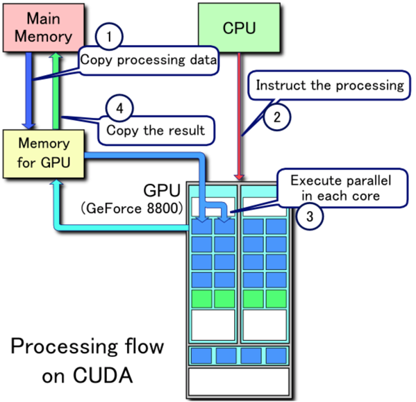

# 移动端渲染管线的瓶颈 性能优化

https://juejin.cn/post/7082168044088197150

这篇可以配合D:\PGPostgraduate\githubNotePrepareForWork\PrepareForWorkNotes\八股文\附录\GPU相关知识.md 来看

可以看rtr4 GPU那个章节 以及后面的渲染优化章节:

D:\PGPostgraduate\githubNotePrepareForWork\PrepareForWorkNotes\计算机图形学\GPU渲染优化等相关\Chapter 3 The Graphics Processing Unit 图形处理单元.md

------

### 移动端渲染瓶颈

https://juejin.cn/post/7082168044088197150

1. **带宽限制**：高分辨率屏幕和复杂 Shader 导致内存带宽压力。
2. **填充率（Overdraw）**：多层透明/半透明物体导致像素重复绘制。
3. **Draw Call 数量**：驱动层开销在移动端更显著（如 OpenGL ES 比 Vulkan 高）。
4. **Shader 复杂度**：复杂光照计算（如 PBR）或高精度运算拖累 GPU。
5. **发热降频**：持续高负载引发 GPU 降频，帧率不稳定。

一、渲染管线瓶颈（移动端TBDR架构）

#### 1. 顶点处理瓶颈

- **移动端GPU顶点吞吐量**通常为0.5-2M vertices/s（旗舰机可达5M）
- 典型瓶颈场景：高模角色（>5万三角面）同时渲染超过20个
- 硬件限制：多数移动GPU采用**统一着色器**架构，顶点/片元着色器共享计算单元

##### 几何阶段

几何阶段主要做的是顶点的投影变换，还有一部分其他计算，如顶点光照、或者像素光照需要的位置、TBN等。所以我们需要判断读取顶点和索引的带宽，以及Vertex Shader的执行是否存在瓶颈。

###### 顶点和索引带宽的瓶颈定位

读取顶点和索引的GPU渲染管线的第一步，而它的带宽除了跟顶点和索引buffer的大小有关外，还与顶点和索引buffer存放的位置有关。

如果存放在**系统内存**中，它们**传输到GPU**是通过AGP接口或PCI Express接口进行的，**传输速度有限**。

另外一种方式是存储在GPU的独立内存中（显存吧），对GPU来说，这种访问方式比较快。所以后续优化点里会有一项合理指定buffer的存储位置。

想要验证是否是这个阶段的瓶颈，可以增加或减少顶点buffer的长度。**使用更高或更低精度的顶点信息**，如64位或16位的int值，能比较符合控制变量测试这一要点。而如果使用其他的方式，可能会引起其他变量发生变化。增加或减少顶点数会影响到物体的形状，进而影响到光栅化的Pixel Shading阶段。需要注意，增加无用的顶点信息，GPU可能会在传输过程中忽略这个多余的顶点信息，造成测试失效。

##### Vertex Shader的瓶颈定位

Vertex Shader里执行了顶点的**投影变换**，以及可能会有的**TBN**和**光照计算**。这个过程还会包含顶点信息如纹理坐标、法线、颜色的插值。可以从改变vertex shader的执行次数，或改变每次vertex shader的执行消耗入手。

改变顶点的数量就能改变Vertex Shader的执行次数，但是这种方法可能会引起其他变量的变化。

改变shader的执行消耗也就是控制Vertex Shader的的指令，通过使计算复杂化或者简化，测量帧率的变化，就可以判断是否是shader执行的瓶颈。其中需要注意的一点，不要使用不会被用到的计算，以防被GPU优化掉干扰测试。

#### 2. 光栅化阶段瓶颈

- 分辨率制约：4K屏需要处理超过800万像素/帧
- Overdraw问题：常见手游场景**overdraw**值可达3-5倍
- 带宽压力：ARM Mali-G78理论带宽25.6GB/s，但实际可用约15GB/s

##### Blending阶段的瓶颈定位

Blending的操作是将Pixel Shadering阶段的输出，如颜色、深度、模板值，经过alpha混合、比较测试等操作后保存到当前使用的FrameBuffer中。这个阶段需要读取FrameBuffer，所以它的瓶颈主要是**FrameBuffer的带宽**。通过减少FrameBuffer（颜色、深度模板缓存）的位占用，如32位改为16位，可以快速测试是否是此阶段的瓶颈。

##### Pixel Shading的瓶颈定位

Pixel Shading阶段是将光栅化三角形区域内的每个像素完成着色的计算，所以光栅化三角形的总面积决定了shader的执行次数。

shader里需要采样多个贴图，并进行复杂的光照计算，它与贴图的带宽以及shader指令的复杂度有关系。

可以通过**降低分辨率**来减少shader的执行次数，快速判断是否是PixelShading阶段的瓶颈。

执行一次shader的消耗与shader复杂度，采样纹理的大小，以及shader执行次数有关。通过减小shader分辨率，以减少shader执行次数，这时帧率如果有明显上升，说明瓶颈在Pixel Shading。之后通过控制变量法，进一步细化瓶颈的位置。**减少shader的复杂度**，判断是否是shader指令的瓶颈；通过**减少纹理的带宽**，判断是否是纹理带宽的瓶颈，而硬件API是支持指定采样某一级mipmap的，通过这种方法可以在不改变贴图原尺寸的情况下，快速验证纹理带宽的瓶颈。

#### 3. 片元着色瓶颈

- **复杂光照**计算：每像素超过10次纹理采样时性能骤降
- **半透明排序**：alpha混合需要**严格**back-to-front排序消耗CPU时间
- **后处理**代价：Bloom+**AA**+ToneMapping组合可能占用30%帧时间  (反走样)

#### 4、应用程序阶段的瓶颈

如果在GPU管线流程中没有找到性能瓶颈，那说明瓶颈在**CPU**上，也就是应用程序阶段。

除了用排除GPU瓶颈作为判断应用程序阶段的瓶颈外，可以利用增加或减少一些对GPU没有影响的计算量看帧率是否发生变化；也可以把将GPU的消耗降到最低，比如发送空的GPU命令，看帧率是否发生明显变化。

## 渲染管线的优化策略

对不同阶段的瓶颈，优化策略不同，下面对从管线自上而下的顺序介绍优化策略。

### 应用程序阶段

应用程序优化的重点在于减少CPU的时间消耗。可以从以下多个方面入手：

- 优化算法，降低时间复杂度

- 提高并发，将**高消耗的运算放到异步线程，比如相交检测，动画更新**等

- 减少CPU提交命令的等待时间。CPU提交命令有一定的时间消耗，可以从多角度优化
  - 通过**空间加速**结构（四叉树等）、**视锥体裁剪**等提不需要显示的物体
  - 通过**静态或动态合批技术，减少DrawCall的次数**
  - 把提交渲染命令的操作交由异步线程处理，UE4的RHI线程专门负责与GPU的交互
  - 对**渲染状态做排序**，比如依据材质、采样方式等，可以有效减少GPU切换状态的消耗，有利于减少CPU的等待时间
  
- 减少资源锁定，由于CPU与GPU是并行的，CPU读取某个资源的时候可能GPU正在处理这个资源，这样CPU就只能等待，造成CPU周期的浪费
  - 尽量避免在渲染期间读写资源
  
  - 在创建资源时指定**合适的存储位置**，存储在系统内存还是GPU内存，以免因为存储位置不合适造成CPU/GPU使用资源的消耗过高
  
    

- 让GPU承担部分CPU的运算
  - 将CPU蒙皮改为GPU蒙皮
  - 利用GPU求物体的可见性，如Hierarchical Z-Buffer Occlusion
- 合理组织数据的存储结构，保证连续访问的内容也要保持连续存储，提高cache命中率。
- 使用SIMD，矩阵运算，视锥裁剪都可以用SIMD完成。
- 尝试不同的编译器，选择性能最优的编译选项。

## 关于DrawCall

- - 
    - （复习）整个流程可以简化为以下几个步骤：

      1. **数据准备**：将主存中的处理数据（如模型、纹理等）复制到显存中，以便 GPU 可以快速访问。
      2. **发出绘制指令**：CPU 通过 draw call 指令驱动 GPU，告知其需要渲染哪些对象。
      3. **并行处理**：GPU 中的多个运算单元并行处理数据，从显存中读取必要的信息，执行渲染操作。
      4. **结果返回**：GPU 将渲染结果（如帧缓冲）传回主存，供后续处理或显示

以上四个步骤哪个最耗时？？

>在移动端渲染流程中，最耗时的步骤通常是 **步骤2：发出绘制指令（Draw Call）**。以下是具体原因分析：
>
>---
>
>### **1. 耗时根源：CPU-GPU 通信瓶颈**
>
>#### （1）驱动层开销
>
>- **驱动验证成本**：每个 Draw Call 需要经过 OpenGL ES/Vulkan 驱动层的 5-10 次安全检查（资源绑定状态、内存对齐、格式匹配等）。实测数据表明，单个 Draw Call 在 Mali GPU 上的驱动处理时间约为 **80-150μs**。
>- **状态切换代价**：切换 Shader Program（平均 300μs）、切换纹理集（平均 500μs）、切换混合模式（200μs）。假设每 Draw Call 有 3 次状态切换，总耗时可达 **1ms/DC**。
>
>#### （2）多核利用率低下
>
>- **单线程串行提交**：大多数引擎的渲染线程只能利用 1-2 个 CPU 核心处理 Draw Call，而移动端 SoC 的 **Big.LITTLE 架构**（如骁龙 8 Gen3 的 1+5+2 核心）难以有效利用多核并行化。
>- **缓存抖动问题**：频繁的 Draw Call 提交会导致 L3 缓存命中率下降至 **40% 以下**（正常应 >75%），显著增加内存访问延迟。
>
>---
>
>### **2. 性能数据对比（以骁龙 8 Gen2 为例）**
>
>| 步骤            | 耗时占比   | 典型耗时（每帧） | 瓶颈类型       |
>| --------------- | ---------- | ---------------- | -------------- |
>| 1. 数据准备     | 10-15%     | 1.2-2ms          | 内存带宽受限   |
>| 2. 发出绘制指令 | **45-60%** | 4-8ms (300 DCs)  | CPU 单线程性能 |
>| 3. GPU 并行处理 | 25-40%     | 3-5ms            | GPU ALU 受限   |
>| 4. 结果返回     | <5%        | 0.1-0.3ms        | 通常可忽略     |
>
>---
>
>### **3. 为何其他步骤相对更快？**
>
>#### （1）数据准备（步骤1）
>
>- **优化手段成熟**：现代引擎普遍使用：
> - 纹理流式加载（按需加载 Mipmap）
> - 顶点缓冲区预分配（避免每帧上传）
> - 内存对齐优化（ARM 架构要求 64B 对齐）
>- **硬件加速**：DMA 引擎可异步完成数据传输，实测 Mali-G710 的 DMA 带宽可达 **12.8GB/s**。
>
>#### （2）GPU 并行处理（步骤3）
>
>- **架构优势**：移动 GPU（如 Adreno 740）的 TBDR 架构通过：
> - 延迟渲染（减少 Overdraw）
> - 分块光栅化（Tile-Based Rendering）
> - 统一着色器架构（灵活分配 ALU）
>- **实测性能**：旗舰级 GPU 的顶点吞吐可达 **7.5M verts/s**，像素填充率 **6.8G pixels/s**。
>
>#### （3）结果返回（步骤4）
>
>- **显示链路优化**：移动端通常采用：
> - 直接送显（Frame Buffer → Display Controller）
> - 内存共享（避免显存-内存拷贝）
> - SwapChain 零拷贝（Android SurfaceFlinger）
>
>---
>
>### **4. 极端案例验证**
>
>假设渲染 300 个物体（每个 1 Draw Call）：
>
>- **未优化**：300 DCs × 120μs/DC = **36ms**（远超 16.6ms 帧预算）
>- **优化后**（Batch 合并为 30 DCs）：
> - 30 DCs × 120μs = **3.6ms**
> - 数据准备时间从 2ms 增至 3ms（合并后资源更大）
> - **总耗时下降 87%**（从 38ms → 6.6ms）
>
>---
>
>### **5. 优化建议**
>
>#### （1) 减少 Draw Call 数量
>
>- **静态合批**：对静态物体使用合并网格（Mesh Combining）
>- **GPU Instancing**：支持最多 1023 个实例/批次（需 Adreno 600+）
>- **纹理图集**：将小纹理合并为 2048×2048 图集
>
>#### （2) 降低单 Draw Call 开销
>
>- **Vulkan 多线程提交**：使用 Command Buffer 并行录制
>- **状态排序**：按 Shader→Texture→Blend Mode 排序提交
>- **预编译 Pipeline**：避免运行时 Shader 编译卡顿
>
>#### （3) 硬件特性利用
>
>- **ARM Mali：AFBC 压缩**（节省 30% 带宽）
>- **Qualcomm Adreno：FlexRender**（动态切换 TBDR/I MR）
>- **联发科 HyperEngine：智能调度 DC 提交**
>
>---
>
>### **结论**
>
>Draw Call 提交（步骤2）的 CPU 单线程瓶颈是移动端渲染的最大性能杀手，尤其在未合批的中高复杂度场景中可能占用超过 50% 的帧时间。相比之下，GPU 并行处理（步骤3）通过架构优化和硬件加速，反而更容易达到性能目标。

## 为什么应该尽量减少draw call？

https://www.zhihu.com/question/27933010

[Drawcall](https://zhida.zhihu.com/search?content_id=124207745&content_type=Answer&match_order=1&q=Drawcall&zhida_source=entity)和[Set Pass Call](https://zhida.zhihu.com/search?content_id=124207745&content_type=Answer&match_order=1&q=Set+Pass+Call&zhida_source=entity)准确的来说并不是同一个东西，毕竟GL，VK，DX的标准不一样，我们就说的抽象一点。**Set Pass Call是消耗的重点，它的作用是传递并改变 Render State**，具体作用就是，**把当前需要用到的材质信息，贴图信息，Shader Pass信息等传递到GPU**，而Drawcall则是下命令让GPU绘制一堆三角形，至于绘制命令本身实际上并不昂贵。在现代PC上，1ms时间可以处理1000-2000个dc也并不是什么新鲜事，因此多个Drawcall**有可能不比合批来的慢**。

显然Set Pass的消耗要远高于Drawcall本身，因为它涉及到各种信息的传递，而不仅仅是一个命令，实验表明Set Pass的消耗可能是Drawcall的数倍（4-7倍不止），因此本人在进行一些渲染需求时，有时候常将多个使用同种Shader的模型进行材质合并并进行依次Drawcall。

至于题主提到的“大幅度提高效率”的Drawcall方法，倒也不是没有，那就是省略掉中间许多繁杂的消息传递过程的**[Indirect Draw](https://zhida.zhihu.com/search?content_id=124207745&content_type=Answer&match_order=1&q=Indirect+Draw&zhida_source=entity)**, 顾名思义，Indirect Draw也就是间接绘制，不是由CPU指定绘制目标，而是由GPU自行支配，这种时候我们就可以把模型数据长存在显存中，比如使用贴图或者[StructuredBuffer](https://zhida.zhihu.com/search?content_id=124207745&content_type=Answer&match_order=1&q=StructuredBuffer&zhida_source=entity)储存顶点数据，然后Indirect Draw则会提供给[Vertex Shader](https://zhida.zhihu.com/search?content_id=124207745&content_type=Answer&match_order=1&q=Vertex+Shader&zhida_source=entity)一个索引整数值，开发者则需要在Shader中手动读取显存，获取模型数据。事实证明，使用这样的方法在绘制大量的静态物体（因为非静态物体仍然需要CPU传递Model Matrix，Indirect就失去了意义）时有比较不错的性能提升，也算曲线救国一样的实现了高性能的合批叭。

-- 可不可以这么理解。一个批次(batch)就是一次CPU到GPU的数据提交。一个DC(draw call)就是一个绘制命令。批次之所以消耗大，一是因为要提交的数据大，二是因为每次提交都有一些前置工作(这也是为什么要合批，减少前置工作)。而dc之所以消耗小，是因为他只是一个命令，命令本身所占的数据就小，传输就快，而且命令本身到了GPU，因为绘制所需要的数据之前已经传输完毕，绘制起来就快很多。

为什么应该尽量减少draw call？ - 麒麟子MrKylin的回答 - 知乎
https://www.zhihu.com/question/27933010/answer/2960758676