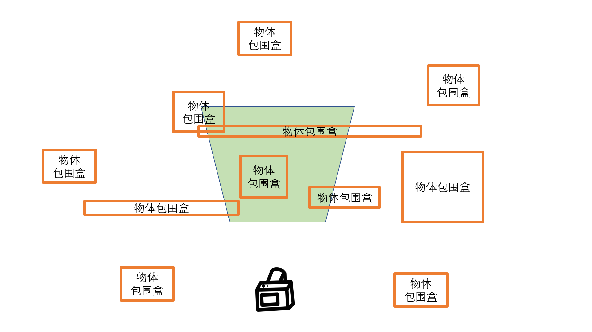

# 剔除（可见性判断）

这章节可以放在渲染管线前/后


应用阶段

### 7.2.1 剔除不可见物体

#### 7.2.1.1 视锥体剔除

​	在前面的空间变换中，我们知道在透视投影中，观察体是棱台。下图中的绿色部分就是视锥体，（也有教材称为棱台观察体，平截头体，Frustum），只有位于其中的物体会被观察到。


​	那么在这个视锥体之外的物体可以被剔除掉，而不需要送入后续的渲染，优化性能。如下图视锥体俯视图所示。



​	一个简单的视锥体剔除方法例如：将物体用AABB（轴对齐包围盒，简单理解就是用一个最小的立方体完整包围住整个物体的包围盒，后面的教程会展开介绍）包住，若物体包围盒的所有顶点都在观察体的某个面所在的平面外，说明这个物体一定在观察体之外，将其剔除。这个方法其实并不能严谨地剔除所有在观察体之外的物体，但是被剔除的物体一定不会有部分出现在观察体内(下图被剔除的物体显示为褐色)。**也就是说，可能会有观察体外的漏网之鱼没被剔除，但不会出现错判在观察体内的物体而造成剔除，因此从视觉表现上是正确的。**


#### 7.2.1.2 遮挡剔除

​	就算物体在视锥体之外，也可能被别的物体所遮挡，因此我们还需要遮挡剔除。

​	我们在之前的教程中举过一个例子，一个相机面向着一座人山人海的城市，但是一堵墙挡住了相机的视线，使其看不见墙后面的城市。我们可以在应用阶段就将墙后的城市进行剔除，来优化性能。

​	如下图，假设相机渲染众多物体时，有如下场景：


我们发现，A遮挡了其后面的B,C,D，使这三个物体不可见，那么我们可以将这三个物体剔除，优化性能。


https://zhuanlan.zhihu.com/p/363277669

https://zhuanlan.zhihu.com/p/66407205

预计算可见性


如上图，当相机位于E区域的时候，是不可能看得到M的，而这个事情，是可以预先知道的，因此，我们可以进行遮挡剔除的**预计算**，预先进行离线计算存储场景中在某个区域，我们能看到的所有物体，将这些可见物品的集合存储下来。在运行的时候我们可以根据摄像机的位置根据之前与计算的可见性数据，快速剔除被遮挡的物体。运行的时候开销为0.

https://zhuanlan.zhihu.com/p/363277669


实际上，我们可以预计算遮挡剔除，即通过预计算**潜在可见集（potentially visible set,PVS）**来进行。我们通过预计算潜在可见集，运行的时候查询这个集合，我们可以快速剔除绝对不可能看见的物体或者区域。

##### 门（portal）剔除


如上图所示，美术和策划可能会针对上面的房间手动标记出每个房间和其他房间的接连关系如右图。

假设我们现在位于E，然后我们去寻找与E相连接的所有的房间节点。

1、没有和E相连接的所有节点都是不可见的可以直接剔除（如M）

2、遍历与E相连的，如F，然后视锥体穿越门到F之后，会缩小(例如上图的F中绿色视锥体)，我们可以进一步对F中物体进行视锥体剔除。然后我们就会发现星星物体被这个绿色视锥体剔除了。

3、然后查找与F相连的，是H和G

​	G不会被缩小的视锥体看到，省略。

​	穿过H的门，视锥体继续缩小。

其他步骤也类似，就不赘述了。


如上图，如果蓝色条状物会透过一个房间的两个门被看到，但是它不应该被渲染两次。所以每个物体被渲染后要被标记，防止重复渲染。


https://zhuanlan.zhihu.com/p/66407205

https://zhuanlan.zhihu.com/p/403774140


####  7.2.1.3 空间加速 快速剔除

​	假设我们的三维场景是一个巨大的拥有20个国家的开放世界，有几万个物体，那么，我们放置的相机大概率只能看见其中的一小部分物体，如果我们使用观察体剔除一个一个判断并剔除这些物体，会带来不可估计的性能消耗。如下示意图，大部分区域都是相机不可见的（褐色方块标出）。


如果我们的相机正在国家1的路上拍照，它大概率并不需要渲染剩下19个国家的所有物体，进一步想，我们可以将三维空间划分为各个区域，不与我们的观察体棱台相交的整个区域可以尽快抛弃，而无需一个个物体进行剔除，从而进行**空间加速**，如下图。将三维空间划分为各个区域的方法有四叉树、八叉树、BSP树等等，我们在后续”空间加速“章节有展开讲解。


​																四叉树【https://en.wikipedia.org/wiki/Quadtree】

> 在计算机图形学中，空间加速是一种技术，旨在提高渲染三维场景时的性能和效率。空间加速结构是一种数据结构，用于快速执行空间查询操作，如射线与物体相交测试、碰撞检测等。常见的空间加速结构包括包围体层次结构（BVH, Bounding Volume Hierarchy）、八叉树结构和K-D树等，通过这些结构可以更有效地管理和组织场景中的对象，从而减少冗余的计算，提升图形渲染的效率。如果读者不理解这些具体的加速结构的算法，不必担心，在**光线追踪**的章节会有更详细的解释。


## PVS

**实时**

距离剔除

硬件查询

SOC

GPU-Driven

**离线**

PVS


#### 实时

距离剔除

硬件查询

SOC

GPU-Driven

##### 距离剔除

距离太远/太近 直接剔除


##### 硬件查询


CPU拿到所有要渲染的物体，提交查询给GPU

GPU进行深度测试，写回内存

CPU要等待 很耗费时间

CPU看哪些片元通过测试，对于通过测试的物体，才会交给GPU进行渲染

这里的

**优化：**

不参与等待

一次性提交多个查询

直接拿上一帧的数据

只提交包围盒


##### SOC,Software Occlusion culling （软件遮挡剔除 ，软光栅化隐面剔除）

不需要GPU参与


人为标记哪些是遮挡体，哪些是被遮挡体

CPU上对这些**遮挡体**进行一次**光栅化**

光栅化之后才会对于**被遮挡体**进行**深度测试**

如果通过了，说明这个物体是可见的

**·问题**

其实这东西适合GPU做而不是CPU

1.速度慢
	每帧光栅化遮挡体，运行时消耗较高
	每帧的计算时间不稳定 （东西多 就慢 ，东西少 就快）
2.内存占用大
	对被遮挡物进行深度测试


###### 优化 MSOC(masked software-occlusion-culling)


编码深度缓冲区，并行处理数据， 优化性能

**优化**
1.速度慢

* 优化数据处理
  * SIMD(单指令流多数据流)
  
    * 并行处理（本来处理一条指令只能处理一个数据，现在可以并行处理4组数据）
  
      
  
* 优化更新速度:bitshift
  

2.内存占用大:编码缓冲区

​	


Figure 2: An example triangle being rasterized on an AVX2- capable processor. We traverse all 32 × 8 pixel tiles overlapped by the triangle's bounding box and compute a 256-bit coverage mask using simple bit operations and shifts. Note that we must consider all three triangle edges in the marked (red) tiles, which overlap the middle vertex (in y), and two edges elsewhere.

### **图2：基于AVX2的三角形光栅化示例**

**场景**：在支持AVX2指令集的CPU上光栅化一个三角形。
**关键步骤**：

1. 遍历像素块

   ：

   - 三角形边界框覆盖的所有 **32×8像素块** 被逐个处理。
   - 每个块大小设计为匹配AVX2的256位寄存器（32像素宽 × 8像素高）。

2. 生成覆盖掩码

   ：

   - 对每个像素块，通过**位操作（AND/OR）和位移（Bitshift）**，生成一个256位的二进制掩码（Coverage Mask）。
   - 掩码中每个位表示对应像素是否被三角形覆盖（1覆盖，0未覆盖）。

3. 边界处理

   ：

   - **红色标记块**：需要检测三角形所有三条边（因与中间顶点在Y轴上重叠）。
   - **其他块**：仅需检测两条边（上下边缘）。

**技术意义**：

- 利用AVX2的256位并行能力，一次处理32×8像素块，加速光栅化。
- 位操作直接生成掩码，避免逐像素计算的开销。


对缓冲区进行更新：快速找到它覆盖的区域


Figure 3: Illustration of how bitshifting is used to create a coverage mask for an 8 x 8 pixel tile (we use 32 x 8 in practice). From left to right 1) For each edge, we start with a bitmask with all bits set to one. 2)The leftmost edge is processed first and zeroes are shifted right until the edge is met. 3) The second edge is processed and zeroes are shifted in from the right side until the edge is met In practice we accomplish this by shifting in zeroes from the left and inverting the final mask 4) The tile is fully inside the last edge and no shifting is required. 5)All bitmasks are and:ed together to form the final coverage mask.

### **图3：位移操作生成8x8像素覆盖掩码（修正版）**

**实际应用**：MSOC中使用 **32×8像素块**，此处以简化版8×8为例。

**流程分步**：

1. 初始化掩码：
   - 每个三角形边对应一个初始全1的位掩码（例如，8位 `0b11111111`）。
2. 处理第一条边（左边缘）：
   - 从左侧向右位移零（`<<`），直到达到边的位置。
   - 例如：边在左侧第3像素 → 掩码变为 `0b11100000`。
3. 处理第二条边（右边缘）：
   - 从右侧向左位移零（实际通过**左侧位移+取反**实现），直到达到边的位置。
   - 例如：边在右侧第2像素 → 掩码变为 `0b00111111`（实际操作为：左移6位后取反）。
4. 处理第三条边（无操作）：
   - 当前块完全位于第三条边内部，掩码保持全1（`0b11111111`）。
5. 合并掩码：
   - 对所有边的掩码进行逻辑与（AND）操作，得到最终覆盖掩码。
   - 示例：`0b11100000 & 0b00111111 & 0b11111111 = 0b00100000`。

**技术意义**：

- 位移操作快速裁剪出三角形覆盖区域，无需复杂数学计算。
- 掩码合并直接生成最终结果，适合SIMD并行处理。


可以快速对当前深度值进行更新


Figure 5: An example, from Figure 4, of when the ZMar value (ref- erence layer) is updated since the working layer (Z) is covered fully by the yellow and the black triangle.

### **图5：ZMax值更新示例（修正版）**

**背景**：

- **Z缓冲区（深度缓冲区）**：存储每个像素的最近深度值（Z值）。
- **ZMax（参考层）**：记录当前深度缓冲区的最大可能深度（用于快速剔除被完全遮挡的物体）。

**示例场景**：

1. 初始状态：
   - 工作层（Z缓冲区）已被黄色三角形和黑色三角形完全覆盖。
2. 更新条件：
   - 当新物体（如图4中的红色三角形）的**最小深度大于ZMax**时，直接剔除（无需渲染）。
   - 若新物体的深度范围与ZMax重叠，则需更新ZMax并进一步测试。
3. 图中情况：
   - 黄色和黑色三角形已完全覆盖当前区块 → 更新ZMax为它们的最大深度值。
   - 后续物体若深度大于ZMax，则被判定为不可见。

**技术意义**：

- 通过动态更新ZMax，跳过深度测试，减少渲染负载。
- 仅在必要时更新深度缓冲区，平衡精度与性能。


>- 覆盖掩码的用途：
>
>  覆盖掩码（1表示像素被遮挡体覆盖）的最终目的
>
>  不是直接渲染，而是快速生成一个“潜在可见区域”的二进制地图。
>
>  - 为何不用深度？
>
>    MSOC 的核心是粗粒度剔除（先处理可见性，再处理深度细节）：
>
>    1. **第一步**：用覆盖掩码标记哪些像素区域**可能被遮挡**（1表示遮挡体存在，可能挡住后续物体）。
>    2. **第二步**：被遮挡体的深度测试**仅需在这些标记为1的区域进行**，其他区域直接跳过。
>
>  - **优势**：
>    避免对全屏所有像素逐一遍历深度测试，节省计算量（尤其是大范围遮挡场景）。


参考：

游戏引擎架构

【引擎渲染之遮挡剔除PVS应用与优化】 https://www.bilibili.com/video/BV12u411172V/?share_source=copy_web&vd_source=067de257d5f13e60e5b36da1a0ec151e


Intel的MSOC（Masked Software Occlusion Culling）是一种基于软件的高效遮挡剔除技术，其核心目标是通过并行化和内存优化，快速剔除被遮挡的物体。以下是对您困惑部分的逐层解析：

---

### **核心问题：如何快速确定被遮挡区域？**
#### 1. **覆盖区域检测（Occlusion Mask Generation）**
   - **目标**：在深度缓冲区中快速找到被遮挡的区域（即已存在更近的深度值）。
   - **关键操作**：
     - **并行扫描**：利用SIMD指令（如AVX2/SSE）一次处理4/8个像素的深度值，对比当前物体与深度缓冲区的值。
     - **位掩码（Bitmask）**：将每个像素的遮挡状态（0=未遮挡，1=遮挡）压缩为二进制位，生成一个紧凑的掩码（例如32位掩码表示32个像素的状态）。

   **示例**：
   ```cpp
   // 使用AVX2一次处理8个float32深度值
   __m256 current_depth = _mm256_load_ps(&depth_buffer[i]);
   __m256 new_depth = _mm256_set1_ps(new_object_depth);
   __m256 cmp = _mm256_cmp_ps(new_depth, current_depth, _CMP_LE_OQ); // 比较新深度是否更近
   int mask = _mm256_movemask_ps(cmp); // 生成8位掩码（1=未遮挡，0=遮挡）
   ```

#### 2. **边界检测（Edge Detection）**
   - **问题**：遮挡区域的边界通常不连续，需要快速找到边界以生成紧凑的几何表示（如矩形或轮廓）。
   - **算法**：
     - **位操作（Bitshift）**：通过位移和逻辑运算（AND/OR/XOR）快速检测掩码中的边界变化。
     - **扫描线跳跃**：跳过连续遮挡/未遮挡区域，仅在边界处停止处理。

   **示例**：
   ```cpp
   // 找到未遮挡区域的左边界（从左到右扫描）
   uint32_t mask = ...; // 当前掩码
   int first_unoccluded = __builtin_ctz(~mask); // 使用CTZ指令找到第一个未遮挡位
   ```

#### 3. **向左偏移（Left Shift Optimization）**
   - **目的**：将位掩码对齐到当前处理窗口的起始位置，减少冗余计算。
   - **操作**：
     - 将掩码左移，使得当前窗口的起始位对齐到掩码的最高位或最低位。
     - 结合循环展开和预取，避免分支预测失败。

---

### **关键技术：编码深度缓冲区与并行化**
#### 1. **深度编码（Depth Compression）**
   - **方法**：
     - **量化编码**：将32位浮点深度值压缩为16位整数（例如通过非线性量化）。
     - **分层Z-Buffer**：将深度缓冲区分为多分辨率层级，粗粒度层级用于快速剔除。
   - **优势**：减少内存带宽占用，提升SIMD并行效率。

#### 2. **SIMD并行化**
   - **场景**：深度比较、位掩码生成、边界检测等步骤均可用SIMD加速。
   - **优化技巧**：
     - **数据对齐**：确保内存访问对齐到SIMD指令要求（如32字节对齐AVX2）。
     - **掩码预计算**：提前生成多组掩码模板（如矩形、圆形），减少运行时计算。

#### 3. **位操作优化（Bitshift）**
   - **应用**：
     - **掩码更新**：通过位移快速合并多个掩码块。
     - **快速迭代**：使用`CTZ`（Count Trailing Zeros）指令直接跳转到下一个未遮挡像素。

---

### **性能优化总结**
| **问题**     | **优化手段**                               | **效果**                    |
| ------------ | ------------------------------------------ | --------------------------- |
| 处理速度慢   | SIMD并行处理、位操作加速掩码生成和边界检测 | 吞吐量提升4-8倍（AVX2为例） |
| 内存占用高   | 深度值量化、位掩码替代完整深度缓冲区       | 内存占用减少50%-75%         |
| 分支预测失败 | 无分支位操作（如掩码跳跃）                 | 减少流水线停顿              |

---

### **总结**
MSOC通过**SIMD并行化深度比较**生成位掩码，利用**位操作快速定位边界**，再通过**编码和压缩技术**减少内存占用。其本质是将传统光栅化中的逐像素操作，转换为基于位掩码的批量处理，从而在软件层面实现接近硬件的效率。


