# B样条曲线&NURBS

> 本节难度比较大，作为补充材料。不感兴趣的读者可以跳过本节，不会影响后续的知识学习。

在前面的教程中，我们有介绍贝塞尔曲线，并给出了对应的绘制demo。贝塞尔曲线非常清晰、容易上手，但却有两个主要的缺点：

- 贝塞尔曲线/曲面**不支持局部的修改和编辑**。可以从数值解析的角度来理解，由于每个系数由伯恩斯坦多项式求解得到$P(t) = \sum_{i=0}^n P_i B_i^n(t)$，因此改变了某个控制点就会改变整条曲线的形状，所以无法局部进行编辑；
- 高阶贝塞尔曲线/曲面在做拼接时，满足几何连续性是比较困难的。一般在实际应用中也是用低阶的进行拼接（比如3次贝塞尔曲线），但控制连续（比如$C^1$连续）还是比较困难的。

样条的概念：

- Schoenberg发明了样条曲线。样条曲线的动机是为了解决插值中的Runge-Kutta现象（https://en.wikipedia.org/wiki/Runge%E2%80%93Kutta_methods），用高阶多项式拟合曲线容易出现不稳定的上下抖动。
- 而**样条**的思想就是用分段低阶的多项式通过连续的连接，并且保证连接处的连续性，从而代替高阶多项式。

在Schoenberg的工作之后，Gordan和Riesenfeld提出了B样条及一系列几何算法，在保持贝塞尔曲线的优点同时，克服了其缺点，从而使得B样条在工业界得到了广泛的应用。

# 一、如何理解B样条？

- 样条函数的插值，可以通过求解一个三对角方程来进行。
- 对于一个给定的区间划分，可以类似地计算样条曲线的插值。
- 给定区间上的所有样条函数组成一个线性空间。这个线性空间的基函数就叫做B样条基函数。

正如贝塞尔曲线使用伯恩斯坦多项式作为基函数，B样条曲线使用B样条基函数。B样条满足$n$次连续性，其中$n$比曲线的次数少1，也就是比B样条的阶数少2。上述知识点需要一些数值分析的理论基础，如果看不懂也没关系，继续往下阅读即可。

## 1.B样条曲线的定义

首先再来复习一下贝塞尔曲线+伯恩斯坦多项式：
$$
P(t) = \sum_{i=0}^n P_i B_i^n(t)
$$
其中$B_i^n(t)$是伯恩斯坦多项式的值。B样条曲线的数值求解与贝塞尔有类似之处，如下：
$$
P(t) = \sum_{i=0}^n P_i N_{i,k}(t)
$$
其中$P_i$依然是指每个控制点，而$N_{i,k}(t)$则是B样条基函数（i=0，1，...，n）。更具体地，指的是第$i$个$k$阶B样条基函数。B样条基函数是分段$k$阶（对应$k-1$次）多项式，他们由节点向量（knot vector）唯一决定。节点向量则是一串非减（non-decreasing）的实数序列。

> 实际上，节点向量是可以有重复值的，所以叫做非减序列，比如$[0,0.1,0.1,0.2,0.3,0.3,0.3]$这种也是合理的。

先来看一个B样条曲线的demo：

https://demonstrations.wolfram.com/BSplineCurveWithKnots/。

B样条的一大优点就在于可以局部控制，避免”牵一发而动全身“。B样条基函数的定义如下（de Boor-Cox递推公式）：
$$
\begin{gathered}N_{i, 1}(t)= \begin{cases}1 & t_i<x<t_{i+1} \\ 0 & \text { Otherwise }\end{cases} \\ N_{i, k}(t)=\frac{t-t_i}{t_{i+k-1}-t_i} N_{i, k-1}(t)+\frac{t_{i+k}-t}{t_{i+k}-t_{i+1}} N_{i+1, k-1}(t)\end{gathered}
$$

再次回顾，节点向量是非减的实数序列：
$$
t_0,t_1,t_2,...t_n,t_{n+1}, ... ,t_{n+k-1}, t_{n+k}
$$
不妨先来看看$k=1,i=0$的情况（用desmos绘图，其中x轴的0和1指的是$t_0,t_1$，依次类推）：

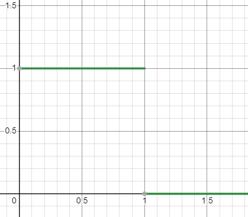

那么，$k=2,i=0$的图像是什么呢？

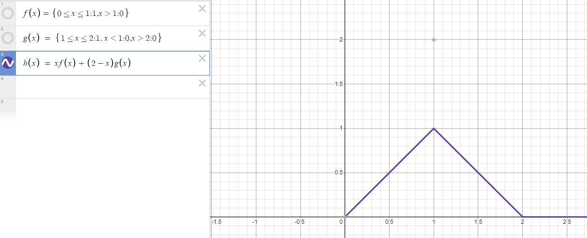

可以自己带入推导一下，如上图所示，$f(x)$指的是$N_{0,1}(t)$，而$g(x)$则指的是$N_{1,1}(t)$。同样，这里横坐标的0，1，2其实指的是$t_0,t_1,t_2$。容易得到当i=1时，上图这个函数的山峰应该在[1，3]之间。可以观察到当k=2时是一次多项式，此时是线性的。那么当k=3时应该时二次曲线，也就是抛物线型的。绘制一下$k=3,i=0$的图像（同样，可以自行推导一下）：

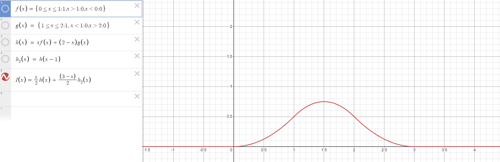

## 2.思考

### （1）B样条基函数$ N_{i, k}(t)$的非零区间是什么？

通过上图的规律可以看出，$ N_{i, k}(t)$的非零区间应该是$t_i$到$t_{i+k}$之间。而类比贝塞尔曲线中的伯恩斯坦多项式，伯恩斯坦多项式只有两个端点为0，中间都不是0。而B样条基函数只有一小段为非0，大部分区间都是0。而就是这个性质使得B样条具备局部性；

### （2）一共需要多少个节点？

$t_0$到$t_{n+k}$，一共是$n+k+1$个。这是因为回顾B样条基函数的公式：
$$
\begin{gathered}N_{i, 1}(t)= \begin{cases}1 & t_i<x<t_{i+1} \\ 0 & \text { Otherwise }\end{cases} \\ N_{i, k}(t)=\frac{t-t_i}{t_{i+k-1}-t_i} N_{i, k-1}(t)+\frac{t_{i+k}-t}{t_{i+k}-t_{i+1}} N_{i+1, k-1}(t)\end{gathered}
$$
比如我是四阶的，则有$k=4$，有$P(t) = \sum_{i=0}^4 P_i N_{i,k}(t)= \sum_{i=0}^4 P_i N_{i,4}(t)$，初始有五个控制点$P_0, P_1, ... , P_4$，而在$i=0$的时候计算$N_{0,4}$，结合第一问得知需要$t_0, ...,t_4$这五个值。同理可知当$i=1,i=2$等情况，所以总计需要$t_0$到$t_{n+k}$这么多的节点向量。

### （3）B样条插值出的曲线的定义区间是什么？

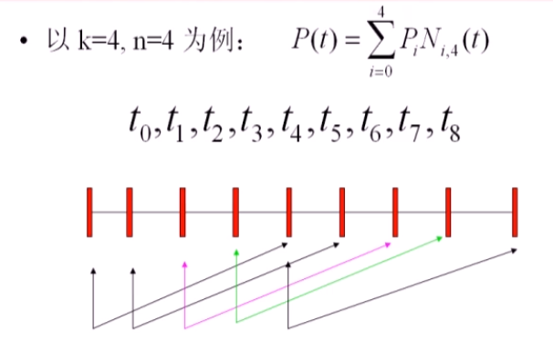

我们认为当区间由$k$个基函数共同作用的时候，曲线才有定义（否则认为基函数是不完备的）。根据上图，$i=0$定义在区间$t_0$到$t_4$，$i=1$定义在区间$t_1$到$t_5$，$i=2$定义在区间$t_2$到$t_6$，$i=3$定义在区间$t_3$到$t_7$，$i=4$定义在区间$t_4$到$t_8$。也就是说，只有$t_{k-1}$到$t_{n+1}$的区间上具有B样条基函数的完整定义（也就是说只有这个区间内才由4个基函数共同作用）。

## 3.B样条基函数的基本性质

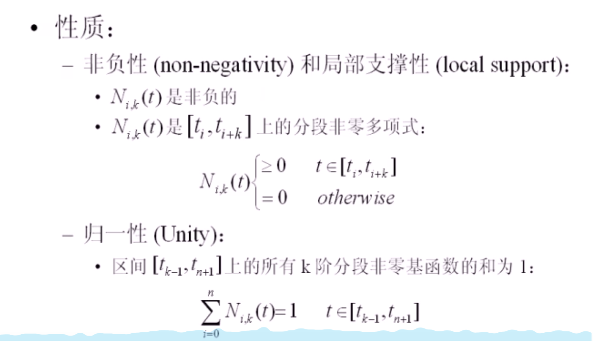

注意，归一性和伯恩斯坦多项式比较类似，但B样条基函数的该性质不太好证明，能够理解即可。

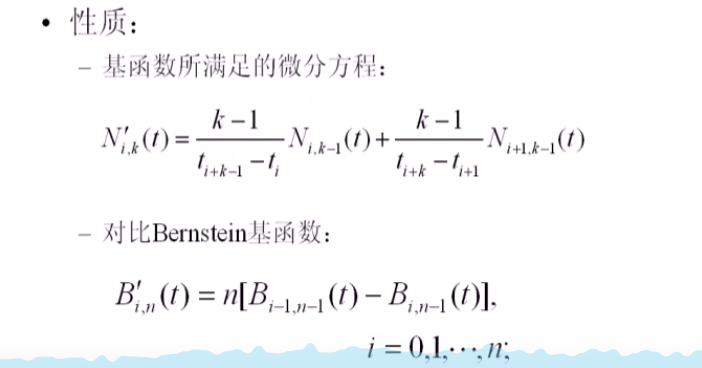

## 4.B样条曲线的分类

一般的曲线可以根据其起始点和终止点是否重叠来进行分类：

- 如果不重合，是开曲线；
- 否则如果重合，是闭曲线；

根据节点向量中节点的分布，B样条可以分别如下四类：

- （1）均匀B样条：节点呈等差数列分布，例如：1，2，3，4，5，6，7。这样的节点分布对应的是均匀B样条基函数。均匀B样条比较容易理解编辑的过程，这里可以看https://www.bilibili.com/video/BV13441127CH?vd_source=f0e5ebbc6d14fe7f10f6a52debc41c99&spm_id_from=333.788.videopod.episodes&p=13这个视频的41分钟左右，对应的中间的点都是中点+1/3点的位置。

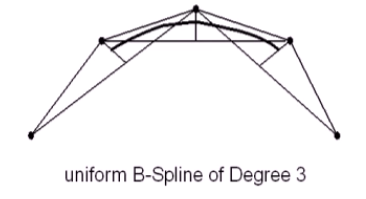

- （2）准均匀B样条：

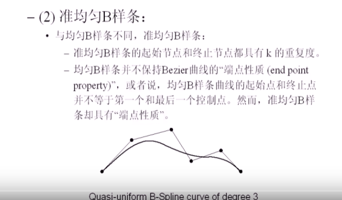

在准均匀B样条下，节点向量可能是这样的：[0，0，0，0，1，2，3，4，5，5，5，5]

- （3）分段Bezier曲线：

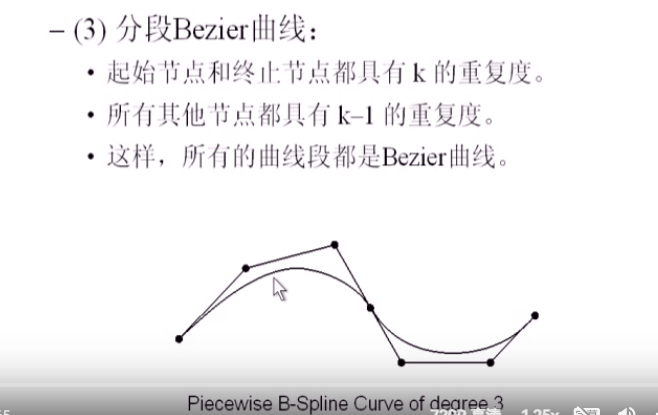

节点向量可能是这样的：[0，0，0，0，1，1，1，2，2，2，3，3，3，4，4，4，5，5，5，5]。对于分段Bezier曲线，不同的曲线段相对独立。移动控制点只会影响其所在的Bezier曲线段，而其他的Bezier曲线段都不会改变。甚至所有关于Bezier曲线的算法可以同样地适用于分段Bezier曲线。但是分段Bezier曲线需要使用更多的参数和变量来进行控制：需要更多的控制点和更多的节点。

- （4）非均匀B样条（这个是最为一般的情况）：

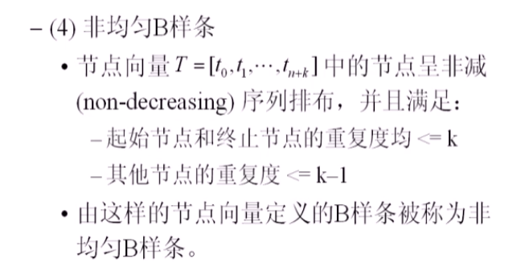

非均匀B样条曲线有如下的性质：

- （a）**局部支持性**：区间$t \in[t_i,t_{i+1}]$上的曲线仅由至多$k$个控制点$P_j(j=i-k+1,...,i)$所决定。这是因为B样条的数值表示是$P(t) = \sum_{i=0}^n P_i N_{i,k}(t)$。在对应的区间上只有$k$个基函数有定义，所以只涉及到$k$个控制点（可以绘制一下每个控制点和其控制的范围，方便理解）
- （b）修改控制点$P_i$只会影响到区间$(t_i,t_{i+k})$上的曲线；
- （c）$P(t)$在每一个重复度为$r$的节点上具有$C^{k-1-r}$的连续性；
- （d）凸包性：这一点和贝塞尔曲线是保持一致的，生成的B样条曲线一定在控制点所形成的凸包内；
- （e）分段多项式性质：在任何一个由相邻节点确定的区间（knot span）上，$P(t)$是一个关于$t$的次数不超过$k-1$的多项式；
- （f）同样类似于贝塞尔曲线，B样条曲线也具备仿射不变性；
- （g）灵活性：

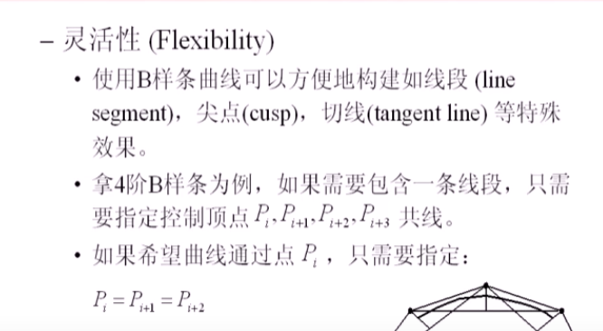

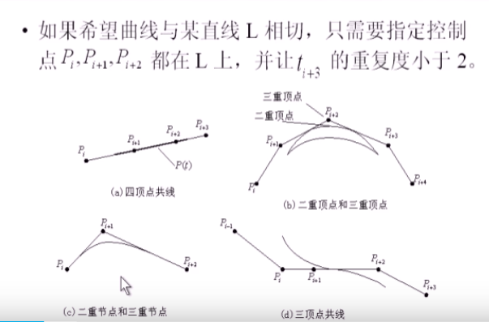

## 5.de Boor算法

假定现在要计算$t$时刻的值，其中$t$位于$t_j$和$t_{j+1}$之间，那么根据上一部分所述的非均匀B样条曲线的**局部支持性**（区间$t \in[t_i,t_{i+1}]$上的曲线仅由至多$k$个控制点$P_j(j=i-k+1,...,i)$所决定），其实我们可以简化运算：
$$
P(t) = \sum_{i=0}^n P_i N_{i,k}(t) = \sum_{i=j-k+1}^j P_{i} N_{i,k}(t) = \\
\sum_{i=j-k+1}^jP_i [\frac{t-t_i}{t_{i+k-1}-t_i} N_{i, k-1}(t)+\frac{t_{i+k}-t}{t_{i+k}-t_{i+1}} N_{i+1, k-1}(t)] = \\
\sum_{i=j-k+1}^j[\frac{t-t_i}{t_{i+k-1}-t_i}P_i + \frac{t_{i+k-1}-t}{t_{i+k-1}-t_{i}}P_{i-1}]N_{i, k-1}(t)
$$
其中$t \in[t_j,t_{j+1}]$。这样就变成了一个迭代式，只和$N_{i, k-1}(t)$项有关。通过这个简化一些的算法，我们就可以更快求解出B样条曲线上某一点的值。

# 二、NURBS曲线/曲面

对于B样条曲线来说，其还有一个问题，那就是不能精确地表现出圆锥曲线（除了抛物线）。因此，后来又发展出了NURBS曲线（Non-Uniform Rational B-Spline，非均匀有理B样条），其目的是在于**找到一种精确描述圆锥曲线以及二次曲面的数学方法。**

NURBS提供了一个更一般更精确的方法，来表达并对自由曲线/曲面进行设计。它提供了一个通用的数学形式，可以同时表示标准的解析曲线/曲面(如圆锥曲线)和自由曲线/曲面(如参数曲线/曲面)。并且存在稳定快速的数值计算算法。NURBS的一大优势就在于数值稳定，且计算较快。

由于NURBS的控制点和权重都可以任意修改（NURBS引入了一组额外的权因子的概念），用NURBS来进行曲线/曲面的设计可以获得更大的灵活性。**B样条，贝塞尔曲线**都可以看成是NURBS的一种特殊形式。

不过，NURBS也有一些缺点：

- 如果权重设计不合理，NURBS曲线可能会产生畸变；
- 某些情况，比如曲线的重叠，使用NURBS非常难以处理。这种曲线重叠如果是类似两个圆形的重叠判断，用普通的方程来做会比较简单，但对于NURBS而言涉及到控制点和对应的权重因子，因此比较难以计算；

## 1.NURBS曲线的定义

NURBS曲线是由分段有理B样条多项式基函数定义的，可以对比看一下NURBS和B样条的区别：
$$
P(t) = \frac{\sum_{i=0}^n \omega_iP_i N_{i,k}(t)}{\sum_{i=0}^n \omega_iN_{i,k}(t)} = \sum_{i=0}^n P_i R_{i,k}(t)
$$
容易看出在上式当中，分母是一个实数，而分子则是一个向量（因为$P$是控制点）。其中：
$$
R_{i,k}(t) = \frac{\omega_iN_{i,k}(t)}{{\sum_{j=0}^n \omega_jN_{j,k}(t)}}
$$
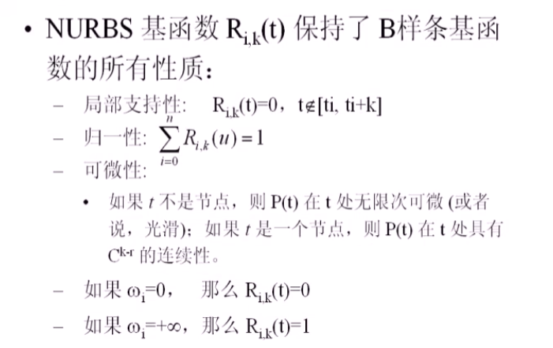

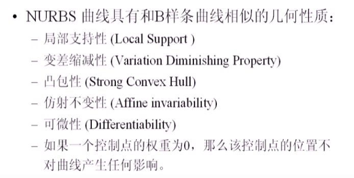

如果$\omega_i \to \infin$，并且$t \in [t_i, t_{i+k}]$，那么$P(t) = P_i$，即曲线经过控制点。$\omega$是权因子，权因子越大，曲线离控制点越接近。

https://www.bilibili.com/video/BV13441127CH/?vd_source=f0e5ebbc6d14fe7f10f6a52debc41c99&spm_id_from=333.788.videopod.episodes&p=14 这个视频28分钟以后的不总结了，太难了。

