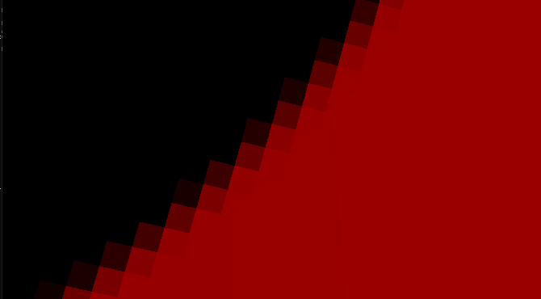
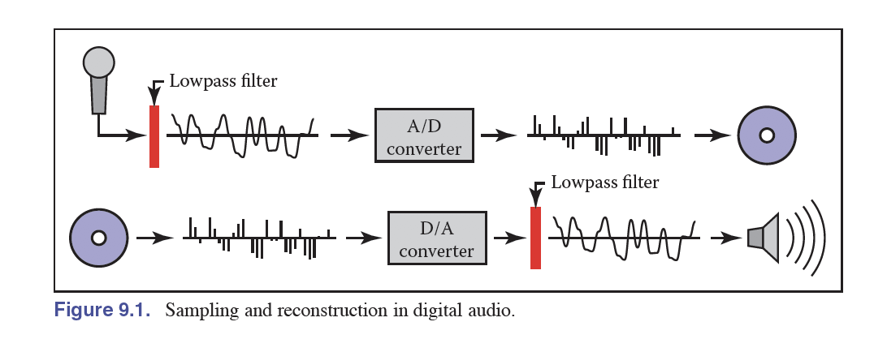
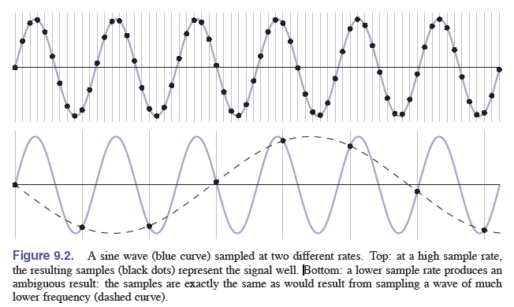
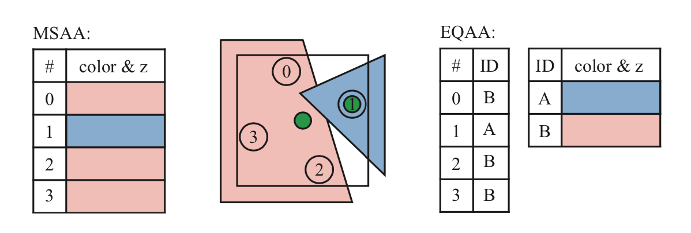

# Lesson 6——反走样技术

​	在之前的课程中，我们介绍了如何将一个物体渲染到2D的屏幕上。如果读者直接使用当前版本的渲染器进行渲染的话，可能会发现一个问题，那就是最终呈现在屏幕上的图形出现了”锯齿“现象，类似于下图的情况：

​	不难发现这种锯齿产生的原因是因为一个像素块被着色为一个单独的颜色，那么是否有什么办法可以让这种锯齿不那么明显，或者是消除锯齿呢？这就是本节要介绍的核心内容，即图形学中传统的抗锯齿技术，以及工业界对此的应用和扩展出的技术。

> 抗锯齿（也叫做反走样）是一种处理技术，通过对图像中的颜色和亮度进行平滑处理，从而使得边缘看起来更加平滑、自然，减少视觉上的锯齿效果。它通过对像素颜色进行插值或混合，以达到更高的视觉质量。

​	在本节中，我们会**先用容易理解的方式更深层地介绍一下抗锯齿的基本思路，然后依次介绍主流的抗锯齿技术。**由于抗锯齿涉及到很多的工业界实现细节，因此本节在渲染器中将只包含SSAA和简易MSAA的基本实现，更多的抗锯齿技术将不会在这个MiniRenderer中被应用，感兴趣的读者可以自行尝试实现。

# 一、探究锯齿产生的原因

​	在生活中，”采样“现象是经常发生的。例如我们使用录音设备录制声音的时候，就是在对连续的声音进行采样。由于计算机的逻辑限制，这种采样只能是**离散的**。一个常用的方法是采样(sampling)再重建(Reconstruction)，例如下图采样声音的时候，设备会将连续的声波转换成磁带内的电压值，播放器则会把采样到的离散数据转换回来。

​	对于录音设备来说，其质量的好坏，有时和一个指标具有很大的关系——采样率。音频采样率是指**录音设备在一秒钟内对声音信号的采样次数**，采样频率越高声音的还原就越真实越自然。不妨对其进行分析，注意下图，上一半的图像代表了原始的波形函数，而下一半的图则表示用不同的采样率采样得到的波形图像。实线是使用较高的采样率进行采样，而虚线则是使用较低的采样率。从图中结果可以很好地观察到，低采样率还原出来的波形函数与”标准答案“是存在较大差异的，此时就会出现”走样“的现象。

> 低采样率会造成很多视觉上的问题，例如：
>
> - 锯齿
> - 摩尔纹
> - 车轮效应
>
> 这里不过多展开，感兴趣的读者可以查找额外的资料进行学习。

​	为了解决这种采样带来的走样问题，我们就可以提高采样率，对某个像素进行多次采样，在对结果取平均，以实现抗锯齿/反走样的效果。

> **更深入一点的探讨**
>
> 我们可以把图像看作是由不同频率的“波”组合而成的。高频部分通常代表图像中的细节和快速变化的区域（如边缘），而低频部分则代表较为平滑的区域（如天空或墙壁）。当我们看到锯齿状边缘时，其实就是在说高频信号过于强烈，而低频信号不足。也就是说，图像中有很多细小的颜色变化，但这些变化没有被良好地处理，导致了视觉上的不连贯感。
>
> 之前所说的抗锯齿本质上是”图像滤波“操作（**如果没有学过图像处理，对频域等内容不了解的读者可以选择性阅读这段，不会影响整体理解**），先对图像进行一个模糊（滤波）操作，然后再进行采样。
>
> - **注意不能先采样再做模糊，可以用频域来解释。**模糊（卷积）操作本质上是低通滤波，将图像中的高频信号过滤掉，这样剩下的就是低频信号了。空域中的采样本质上可以理解为重复频域上的频谱内容，而空域上的乘积等于频域上的卷积（反过来也是同理）。
>
> ==todo：这里补充一下Games101笔记中记录的频谱相关内容。==

# 二、实现抗锯齿的基本思路

​	依据前面的知识讲解，抗锯齿目前有两种比较主流的思路，各有搭配的较为成熟的方案，在这部分中我们先大致介绍一下，具体的细节见下一部分：

- （1）对于每个像素进行多次采样，并根据对此采样的结果来综合决定该像素的颜色。
  - 如果是直接暴力地将图像按照×N倍的分辨率进行渲染，然后将图像整体缩小，例如将A×B的图像放大四倍进行渲染，然后每4个像素的颜色取平均，最终得到A×B的图像，这种方式就是SSAA（**Super Sampling Anti-Aliasing**），将图形首先渲染到一张比较大的贴图上，再将其缩小。**SSAA算法的思想非常直观，但是带来的性能开销往往是不可忍受的，因此现在几乎不使用这种算法了。**
  - MSAA（**Multisampling Antialiasing**）：MSAA与SSAA的相同之处在于，他们都会设置”次像素点“，与SSAA的不同之处在于，MSAA记录了次像素的”覆盖情况“，从而在性能上做到了优化。具体的细节我们将在第三部分进行叙述。
  - 我们可以在空间上对某个像素多次采样，那么能否在时间上对某个像素连续多帧的颜色进行采样呢？答案也是可以的，这就是TAA反走样算法的基本思路。
- （2）使用”图像后处理“的方式，相当于拿到了渲染到屏幕的初始图像，然后对这张图进行额外的处理。这里有几种常见的抗锯齿算法：
  - 很多时候，锯齿产生的地方往往来自边缘（比如前景和背景交界的地方），因此可以通过算法检测图像中的那些”边缘“，并对这些边缘进行抗锯齿处理，这种思路就是FXAA以及SMAA两种算法的思路。

注：玩游戏的读者可能会经常听到**DLSS**这种算法，这里需要说明一下，DLSS是使用人工智能的方法做的**深度学习超级采样**（Deep Learning Super Sampling），其想要实现的效果与抗锯齿有共同之处，但本质是有较大差别的，DLSS这种技术利用深度学习将较低分辨率的图像缩放为更高分辨率的图像，以便在更高分辨率的计算机上显示，而反走样算法更多依赖于对现有像素的颜色处理和插值，而不是从低分辨率图像生成新图像。因此在本节中我们不会提到DLSS的技术细节，而是继续把目光聚焦于主流的”反走样“技术。

# 三、主流抗锯齿方法

## 1.基于多次采样的方法

### （1）SSAA

后面有需要再补充吧，可以参考https://zhuanlan.zhihu.com/p/415087003

### （2）MSAA

> 后面优化一下其中的内容，基本上讲解这篇中包含的内容就够了：https://zhuanlan.zhihu.com/p/415087003

​	MSAA（多重采样抗锯齿）是最早被应用的抗锯齿技术，主要依靠硬件来实现，曾经是一种非常流行的抗锯齿方法。在过去，当游戏画面的质量较低时，其额外的性能消耗并不显著。然而，随着游戏画面质量的提升，以及每帧需要渲染的物体数量增加，MSAA所需的额外性能开销也变得越来越高。

> 对于每个次像素点(上图中黑色点位置)，会先进行 **coverage test/覆盖测试**，覆盖测试即测试该次像素点是否在三角形内部，如果在三角形内部，说明需要采样(计算 pixel shader)。出于性能考虑，同一个像素上的多个次像素点，不会每个都进行一次像素着色计算，而是共享像素中心点的像素计算结果。对于每个像素点，如果上面对应的次像素点至少有一个次像素点通过了覆盖测试(上图中圆圈位置)，就会进行**一次**采样，计算的[插值采样](https://zhida.zhihu.com/search?content_id=180371941&content_type=Article&match_order=1&q=插值采样&zhida_source=entity)位置是像素的中心位置(上面图中的菱形块)。一次采样的结果，会用于多个次像素采样点中。
>
> 计算完成后，每个通过[覆盖测试](https://zhida.zhihu.com/search?content_id=180371941&content_type=Article&match_order=4&q=覆盖测试&zhida_source=entity)的次像素点还需要进行 **depth-stencil test/[深度-模板测试](https://zhida.zhihu.com/search?content_id=180371941&content_type=Article&match_order=1&q=深度-模板测试&zhida_source=entity)**，这个测试和普通的单个像素的深度-模板测试是一样的，只是现在发生在次像素点而已。当深度-模板测试通过后，在像素中心位置采样的结果值就会写入到对应的次像素点。
>
> 在这里，我们实际采样的位置，全都是像素的中心点位置。有的时候，三角形可能没有覆盖到像素的中心位置，这时候如果再使用像素中心点采样，就可能得到错误的渲染效果。GPU 硬件会使用 **centroid sampling** 来调整采样点的位置，当像素中心点被覆盖时，是正常的像素中心点的采样，而当像素中心点未被三角形覆盖时，GPU就会挑选最近的通过覆盖测试的次像素点，作为采样点。
>
> 
>
> 上图中，中间一个图表示有一个像素，会被两个物件覆盖。其中红色的物件会覆盖3个采样位置，蓝色的会覆盖一个。PS的求值位置显示为绿色。由于红色三角形覆盖像素的中心，因此该位置用于着色器求值。蓝色对象的PS在采样位置1的地方进行PS求值。对于MSAA，所有四个位置存储单独的颜色和深度。右侧显示EQAA的2f4x模式。其中4个采样点有4个ID数，对应了包含2个颜色和深度信息的表格。**针对2f4x的EQAA，会有一个2倍大小的buffer和一个两位的标记位对照表，当绘制蓝色三角形的时候，会把采样点1位置的PS计算后的结果，保存在表格中A位置，然后给采样点1的标记位设置为A。然后绘制红色三角形的时候，会把像素中心点位置的PS计算后的结果，保存在表格B位置，然后给采样点0、2、3的标记位设置为B。 如果该像素只被2个或者2个以内的可见不透明物件覆盖，就像本例中一样，则两者的结果完全一样。且EQAA更省内存。否则，MSAA的效果会更好。**
>
> 还有一些额外的细节，可以参考这篇文章：http://geekfaner.com/shineengine/Translation5_RealTime_Rendering_4th_Edition1.html的后半部分。或者是这篇文章：https://zhuanlan.zhihu.com/p/415087003

​	可以参考DirectX的官方文档：https://learn.microsoft.com/zh-tw/windows/uwp/graphics-concepts/rasterization-rules

### （3）TAA

基本上参考这一篇：https://zhuanlan.zhihu.com/p/425233743

## 2.基于图像后处理的方法

### （1）FXAA

https://zhuanlan.zhihu.com/p/431384101

### （2）SMAA

https://zhuanlan.zhihu.com/p/342211163