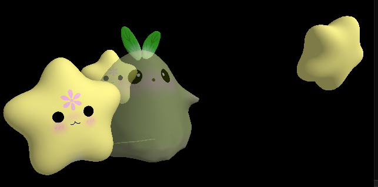
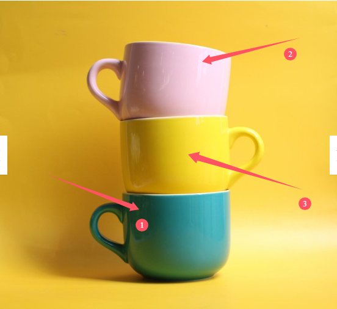

# Lesson7——基础光照（上）

​	回顾一下，在之前的章节，我们使用渲染器得到了这样的渲染结果：



​	可以看到，我们的”小星星“在光照射的地方更亮一些，在背光侧则会偏暗。实际上这非常符合我们的常识，那就是在渲染的时候一定要加入光照的相关信息。不妨看一下当没有光照系统的时候渲染同样一个场景的效果：


​	不难发现，当没有光照的时候，这个场景是缺乏”立体感“的，因此，光照必不可少。在本节中，我们会介绍最为经典的Blinn-Phong光照系统的细节，并将其实现在渲染器中，以进一步提升渲染的质量。


# 一、光照系统的拆解

## 1.光线的传播

​	在很小的时候我们就学习过，光线是按照直线传播的。暂时来看我们也认为他是正确的，这也是光栅化（包括后面的光线追踪）的理论基础。在真实场景中，我们之所以能够看见某个物体，是因为这个物体反射了光线，这些光线进入我们的眼睛，然后我们的大脑解析这些光线，最终我们看到了这个物体。一根光线打在物体上，可能会发生弹射，吸收等过程，最终抵达我们的眼睛。这里我们先不深入展开，在光线追踪部分我们会有更加深入的讲解，读者理解到这里就足够理解本节的内容了。


## 2.光照系统的拆解

观察下面这张图：



​	真实世界的光照是十分复杂的，甚至于直到今天，我们可能觉得电影和游戏中的渲染已经非常真实了，但计算机图形学依旧没有”参透“大自然的全部渲染奥秘。读者可能听说过大名鼎鼎的光线追踪技术，可以大大提升渲染的质量，而这也是在后面的课时中我们会提及的话题。但现在，不妨让我们还是用光栅化的思想来看看上面这张图（毕竟光线追踪是性能炸弹，假设你正在开发一款手游，用光线追踪技术的话很多机型是顶不住的）。我们会发现这几件事：

- （1）针对①部分，这部分并没有被光直接照到，但并不是全黑色的，这里就有环境光（ambient light）的作用。在实际光照中，环境光是十分复杂的，物体可能接收到周围物体反射的光线，例如①区域之所以不完全是黑色，有一部分原因可能是其接收到了墙面反射过来的光。同时，上图的杯子又有着光滑的表面，它也能反射出来光线给周围的物体，这些非光源直射到的部分都可以构成”环境光“。读者不妨回忆一下，其实我们很难在现实中见到一个纯黑的场景，这是因为只要附近有光源，就会有环境光，最终抵达我们眼睛的时候就不会是纯黑色的。**在本节我们讲到的经典光照模型中，我们直接暴力地将环境光设定为一个常数，用于避免全黑的场景。**
- （2）针对②部分，这部分可以被光直接照到。并且我们可以发现②的部分有一个高光，这是因为光源直射到了这个部分，同时这个表面又比较光滑，因此会形成一个局部的高光。在本节讲述的Blinn-Phong模型中，我们将这部分光称之为”镜面反射光“（specular light）；
- （3）针对③部分，这部分也可以被光直接照到，但是这个部分并没有高光，这是因为这部分相对粗糙一些，光线会被四处散射，因此不会形成高光。在本节讲述的Blinn-Phong模型中，我们将这部分光称之为”漫反射光“（diffuse light）。

​	在Blinn-Phong光照模型中，我们将这三项叠加在一起，就得到了最终的光照结果。接下来的部分我们会讨论这三部分的具体细节，以及如何在渲染器中实现。假设我们计算得到的环境光项是$L_a$，漫反射光项为$L_d$，镜面反射项为$L_s$，那么在Blinn-Phong模型中，最终光照的结果为：
$$
L = 
L_a + L_d + L_s
$$
​	这样也比较符合常理，有一个默认的环境光保证了场景不会是全黑的，漫反射光保证了物体的基础反射光的情况，而镜面反射光则保证了物体的表面会有高光。接下来我们就来逐一拆解光照系统的每一项，并将他们整合进我们的渲染器当中。

> 注意，在Blinn-Phong模型中，我们无法处理物体间相互的间接光照。这一部分要交给后面的光线追踪部分去进行讲解。


# 二、环境光&自发光

## 1.环境光

​	这一部分最为简单，因为在前面的讲解中我们已经提到，环境光是一个常数，用于避免全黑的场景。在Blinn-Phong模型中，我们将环境光设定为一个常数，这里我们就设定其为RGB三个通道的值。因此环境光照项可以表示为：
$$
L_a = k_aI_a
$$
​	其中$k_a$被称之为环境光系数（ambient coefficient），$I_a$则可以理解为光源抵达表面的强度，直观理解光在传播过程中会有所衰减，因此到达表面的光可能是衰减之后的。假设我们是一个红色的物体，那么我们就可以设定$k_a$是红色，而这也符合认知，因为如果一个物体表现为红色，那么是因为其反射出来的红色光比较多，进入人眼就会呈现红色。而针对漫反射项，可以不考虑光到达表面的衰减，直接设置$I_a$为一个强度系数即可（float值）。如果读者想在渲染器中加入光源的颜色等信息，那么$I_a$也可以指的是一个含有RGB项的光源颜色。


## 2.自发光

​	有时我们要渲染的物体自身还会发光，我们想要有一个自发光项（Emission）。自发光项其实和前面的环境光可以放在一起，实际上自发光项可以简单地表示为：
$$
L_e = k_e
$$
​	其中$k_e$是我们自己设定的表面自发光的颜色。在我们的渲染器中，我们把自发光项和前面计算的环境光项叠加到一起，作为最终的$L_a$项，即：
$$
L_a = L_a + L_e
$$


## 3.核心代码

​	主要的改动应该集中在光栅化阶段当中。

> 实际上也可以将光照做在顶点处理阶段中，然后在光栅化的时候对光照的着色结果做插值。具体的细节涉及到**着色频率**的概念，我们会在下一节《基础光照（下）》中进行更为详细的描述。

​	将自发光项和环境光项引入到渲染器当中，核心代码如下：
```c++
vec3_t color = material.emission; //ke
if (uniforms->ambient_intensity > 0)
{
    vec3_t ambient = material.diffuse;  //kd,以及ka
    float intensity = uniforms->ambient_intensity; //Ia
    color = vec3_add(color, vec3_mul(ambient, intensity));
}
```


# 三、漫反射项


# 四、镜面反射项/高光项


我们首先来写一个光源不停转动的代码，方便测试我们的光照系统。
