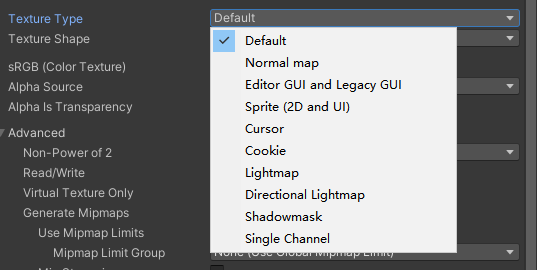

# Lesson_6 纹理映射基础

## 1.纹理坐标/UV坐标

​	在之前的文章中，我们渲染出了一些物体，这些物体具有不同的颜色，但总感觉会缺乏一些细节。在这一节中，我们会介绍”纹理“的相关知识，并将其应用在我们的模型上。读者之前可能听说过”贴图“这个概念，实际上贴图一般就是指纹理，是二维空间的一张图。为我们的模型添加纹理本质上就是把这张二维的贴图“贴”在三维的物体上，**而这个过程就被称之为“纹理映射”。**

> 在计算机图形学中，纹理是用来为三维模型表面添加细节和视觉效果的重要元素。为了将这种二维图像（纹理）正确地映射到三维物体上，我们需要使用一种称为纹理坐标的系统。这些坐标通常被称为UV坐标，其中“U”和“V”代表纹理图像中的水平和垂直轴。通过将每个顶点与相应的UV坐标关联起来，计算机能够准确地确定如何将纹理铺展到物体表面，从而实现生动且现实的视觉效果。

​	下图体现了一张纹理贴图在纹理空间（UV空间）下的UV坐标：


​	可以看到，U和V的范围都是[0，1]，接下来要做的事就是把这张UV图贴在物体上。以后我们统称上述图所在的空间为UV空间。值得一提的是现在常见的着色器语言（如OpenGL， DirectX，Vulkan）对于纹理坐标的起点和U轴、V轴的方向并不是统一规定的，比如说OpenGL就如上图所示，以左下角作为UV空间的起点，U轴向右，V轴向上。而在DirectX、Metal和Vulkan中则是以左上角作为UV空间的起点，U轴向右，V轴向下。在实际的开发中，我们或许需要根据不同的API来调整纹理坐标的方向，以保证纹理的正确映射。

> 一个参考：https://jdelezenne.github.io/Codex/Game/Texture.html

------


## 2.纹理映射

​	容易想到的是，我们可以为模型上的每一个点定义一个在UV空间的坐标，然后采样对应纹理的位置作为模型上这个点的颜色。事实上在类似于obj格式的文件中确实存储着每个顶点的UV坐标，例如下面是一个obj文件的一部分：

```c
vt 0.052860 0.740138  //这里的vt就记录着每个顶点的UV坐标
vt 0.073368 0.751300
vt 0.073806 0.818326
vt 0.067983 0.799840
vt 0.061847 0.779863
vt 0.167926 0.947280  
vt 0.186658 0.941543
//...
f 22255/7017/6478 22258/7020/6481 22256/7018/6479  //这里f表示一个三角形面，一共三项表示三个顶点，每个顶点的a/b/c中的b则表示纹理坐标的索引，例如7017就表示索引到id=7017的顶点的vt坐标，即为纹理采样坐标
f 22259/7021/6482 22258/7020/6481 22255/7017/6478
f 22259/7021/6482 22260/7022/6483 22258/7020/6481
f 22255/7017/6478 22257/7019/6480 22261/7023/6484
f 22259/7021/6482 22255/7017/6478 22261/7023/6484
f 22245/7007/6468 22262/7024/6485 22244/7006/6467
f 22257/7019/6480 22263/7025/6486 22261/7023/6484
```

​	在obj文件中记录了三角形顶点的UV值，而三角形中间像素的UV值可以像之前插值颜色一样，利用三角形的重心坐标进行插值。在Github的仓库中，我们提供了一个可交互式Demo，读者可以拖动UV坐标，屏幕上会呈现出对应该点的UV坐标，并且高亮显示对应的点，读者可以很方便地跟上面的UV空间的UV图做对比，例如下面的动图：

<video src="./assets/demo_01.mp4"></video>

------


## 3.UV展开及类型

​	现在我们知道了一个模型会记录各个顶点UV坐标，以及纹理映射的概念和过程，读者可能会产生一个疑问，那就是这个UV坐标是怎么生成的？如果是简单的几何体（例如上面展示的球体），可以利用数学关系将几何映射到UV的坐标（比如球体可以将球面坐标映射到UV坐标上），但对于比较复杂的几何体，如人物、场景的模型，这个UV坐标要如何制作映射关系呢？这其实就是类似Maya，Blender等建模软件中的UV Editor的功能了，这些建模软件的UV编辑器的作用就是方便美术工作人员展开模型的UV，并且依据UV绘制对应的贴图，这样在做渲染的时候就可以把UV和贴图对应起来，达到预期的效果。我们以Maya为例，看一下UV Editor的样子：


​	可以看到右侧是一个稍微复杂一点的桥的模型，左面则是Maya提供的UV编辑器，这里的创建菜单栏可以帮助我们创建UV Layout，即模型顶点和UV的映射关系，如果我们点击上图的创建->自动，会得到下面的结果：


​	Maya会自动展开到对应的UV。左图里面的UV Editor里面的边可以对应到右图模型上的边。以上只是一个例子，真正的美术工作人员需要对展开UV进行规范化处理，例如控制每个UV壳之间的间隙，对UV占用率进行分析等，这里不再过多介绍。注意到创建菜单栏有一些不同的创建UV映射的算法，可以方便人们的编辑。

> 注：Maya等建模软件中提供对已有的UV进行切割、移动、旋转、缩放、重排、展开等操作，以方便进行自由度更高的控制。

在接下来的章节中，我们会介绍纹理的基本属性、纹理的缩放和一些特殊的纹理。

------


## 4.纹理属性

​	在前面的部分，我们介绍了纹理在图形学中的作用，以及纹理是怎样由艺术家绘制出来的。纹理有很多属性，它们会决定在不同情景下纹理的不同状态。想要学习纹理有哪些属性，最直观的方式是直接看在常见的渲染器，或者比如游戏引擎中纹理有哪些可以属性。这里以Unity为例，我们来看一下一张纹理有哪些特征：

​	在Unity中导入一张纹理，然后点击纹理，可以看到如下的界面：


​	可以看到，纹理的属性特别多，这里我们会介绍一些常见的纹理属性，并且对他们进行更具体的解释。读者可以对此有个大概的印象，哪个部分不了解的话可以快速跳转到对应的章节。具体介绍的内容有：

- Tiling&Offset : 指的是纹理的重复次数和偏移量；
- Texture Type：纹理的类型，例如Normal Map，Cookie，Lightmap等；
- sRGB：是否使用sRGB色彩空间，也即是否进行Gamma校正；
- Wrap Mode：纹理的重复方式，例如Repeat，Clamp等；
- Filter Mode：纹理的过滤方式，例如Point，Bilinear，Trilinear等；
- Mipmap：纹理的Mipmap，用于提高纹理的渲染效率；
- Aniso Level：各向异性过滤，用于提高纹理的渲染效果；
- Virtual Texture：虚拟纹理，用于提高纹理的渲染效率；
- Compression：纹理的压缩方式，用于减少纹理的内存占用；

------


### （1）Tiling & Offset

​	虽然在上图中没有显示这个属性，但实际上在纹理采样中tiling&offset是十分重要的参数，这里我们先介绍一下这两个属性。

​	很多时候我们要把一张纹理贴在一个模型上，但是这张纹理的大小和模型的大小并不一定是一样的，这时候我们就需要对纹理进行缩放和偏移。在纹理映射的过程中，我们可以通过Tiling & Offset来控制纹理的重复次数和偏移量。Tiling可以理解为纹理“重复”的次数，Offset表示纹理的偏移量。纹理采样结合tiling和offset之后，UV坐标会变为：

```c
vec2 uv = vUV * _MainTex_ST.xy + _MainTex_ST.zw;
```

​	其中`_MainTex_ST.xy`表示Tiling，`_MainTex_ST.zw`表示Offset，vUV则表示原来的UV值。例如在Unity中，我们可以通过在材质Material的Inspector面板来调整Tiling和Offset的值。在后面的demo演示中，我们也可以更直观地看到Tiling和Offset对纹理采样的影响。以下一组对比图分别是：

（a）默认tiling=1，offset=0（这里为了简化，tiling=tilingX=tilingY=1，offset也是同理，下同）；

（b）tiling=2，offset=0；

（c）tiling=1，offset=0.2；

> 注意，为了让结果比较直观，这里我们固定Wrap Mode为Repeat，读者暂时只需要关系不同Tiling和Offset对纹理采样的影响即可。


​	通过以上的对比图，相信读者已经对Tiling和Offset有了一定的了解，接下来我们会介绍另外一些纹理的属性。

------


### （2）Texture Type



​	可以看到，类似Unity的引擎支持非常多的Texture类型，并且也支持不同的Texture Shape，例如Cube，2D Array，3D等，这些在后面会进行更详细的介绍。在前面讲解的基础纹理都算是Default类型，也就是默认的纹理（一般用于做普通贴图，附着在模型上），比如前面展示的贴图类型一般是base map。后续会重点介绍的Texture类型如下，读者可以先对他们有一个基本的理解：

- Normal Map：法线贴图，用于模拟表面的凹凸感，使得模型看起来更加真实。

- Cookie：用于实现光照效果，例如在Unity中，我们可以通过Cookie来实现Spot Light的效果。

- Lightmap：用于实现光照效果，例如在Unity中，我们可以通过Lightmap来实现全局光照的效果。

- Shadowmask：用于实现阴影效果，例如在Unity中，我们可以通过Shadowmask来实现阴影的效果。

- Sprite：用于实现2D游戏中的精灵（Sprite）效果，这种效果一般用于2D游戏中，后面会介绍其原理。

------


### （3）关于sRGB

​	在前面的章节中，我们提到了纹理的颜色，但是在实际的渲染过程中，我们会遇到一个问题，就是颜色在屏幕上的显示。在计算机中，颜色的显示是通过RGB来表示的，但是在显示器上，颜色的显示是通过sRGB的颜色空间来表示的。这里深入探讨的话其实涉及到一个叫做**伽马（gamma）校正**的问题，Unity 中的 sRGB 属性主要用于指示纹理是否以 sRGB 色彩空间存储。如果纹理已被标记为 sRGB，Unity 会在渲染时自动对其进行 gamma 校正，以确保其显示效果符合人眼的感知。

> 简单来说，Gamma 校正是一种非线性操作，它调整图像的亮度信息，以便更好地匹配人类视觉系统的感知。由于人眼对亮度的感知并不是线性的，因此需要通过 gamma 曲线来校正图像。Gamma校正的目的是使图像在显示器上的亮度更符合人眼的感知，从而使图像看起来更加自然。在后面的章节中，我们会详细介绍Gamma校正的原理。

​	例如我们前面那张用于贴在物体表面的纹理，如果它的颜色在制作的时候是在线性色彩空间的（linear，意味着在制作的时候没有考虑gamma校正），那么在显示到屏幕上的时候为了让视觉效果更好，就可以勾选上sRGB属性。

------


### （4）Wrap Mode

​	在前面的章节中，我们提到了Tiling & Offset，这里我们再介绍一下Wrap Mode。Wrap Mode主要用于控制纹理的重复方式，例如Repeat表示纹理会重复显示，Clamp表示纹理会被截断，Mirror表示纹理会被镜像显示。从底层来看，Wrap Mode主要是针对于UV坐标不在[0,1]范围内的情况。我们将上面的Repeat，Clamp以及Mirror的Wrap Mode翻译成逻辑：

> 例如我们有一个UV坐标为(1.2, 0.5)，这时候Wrap Mode就会发挥作用，Repeat会把这个坐标映射到(0.2, 0.5)，Clamp会把这个坐标映射到(1, 0.5)，Mirror会把这个坐标映射到(0.8, 0.5)。算法如下：
> ```c
> //Repeat，假设uv坐标没有负数（简化逻辑判断）
> o.uv = frac(i.uv);  
> //clamp
> o.uv = clamp(i.uv, 0, 1);
> //mirror
> o.uv = mod(i.uv, 2.0); // 将 UV 坐标模 2.0，得到的结果是 [0, 2.0]
> if (o.uv.x > 1.0) o.uv.x = 2.0 - o.uv.x; // 处理 X 轴反射
> if (o.uv.y > 1.0) o.uv.y = 2.0 - o.uv.y; // 处理 Y 轴反射
> ```

​	在纹理应用的时候经常会出现纹理重复的情况，这时候Wrap Mode就会发挥作用。例如我们有一张砖块的贴图，我们希望这张贴图重复显示在一个平面上，这时候我们就可以使用Repeat的Wrap Mode。下面是一个对比图，显示同样是砖块图贴在平面上，使用不同的Wrap Mode的效果（这个被贴图贴上的平面的UV坐标从左到右是[0，2]，左，中，右分别为Clamp，Repeat和Mirror）：


> Wrap Mode与前面讲解的Tiling&Offset之间的联系：
>
> 复习一下Tiling和Offset对UV坐标的影响：`vec2 uv = vUV * _MainTex_ST.xy + _MainTex_ST.zw;`,其中.xy记录tiling，.zw记录offset，不难看出，例如当tiling>1，offset=0的时候，就会出现UV坐标超出[0，1]的情况，这时候Wrap Mode就会发挥作用，将超出的UV坐标映射到[0，1]范围内。所以说，二者对于纹理采样的结果共同具有重要的影响。

​	常见的Wrap Mode基本就是Clamp和Repeat，Clamp主要用于一些防止计算的采样点由于浮点数精度影响超出纹理UV范围的情况（比如说后面会讲的通过光照的信息采样贴图），而Repeat则是在UV超出[0，1]范围的时候，将纹理重复显示。对于视觉上直接显示在渲染结果上的贴图（比如基础纹理贴图），一般将Wrap Mode设置为Repeat会比较稳妥一些。从上图也可以看到，Repeat的效果比较自然。

------


### （5）Filter Mode

​	这里先用最简单的语言描述一下纹理的Filter Mode指的是什么，以及应用的场合是什么，接下来就会详细介绍。

> Filter Mode主要是用于解决纹理采样的问题，例如在纹理缩放的时候（读者可以想象一下，如果我们要把一张小纹理贴在一面巨大的墙上，那么这面墙就会显得很“糊”，这就是因为我们强行放大了纹理，在给墙壁着色的时候可能会采样到纹理贴图非像素中心的位置，此时就需要进行纹理的缩放），我们需要对纹理进行过滤，这时候Filter Mode就会发挥作用。
>
> Filter Mode主要用于控制纹理的过滤方式，例如Point表示此时纹理会使用最近的像素点，Bilinear则表示纹理会使用最近的四个像素点，Trilinear表示纹理会使用最近的八个像素点。

​	算法的细节会在第5部分着重介绍。

------


## 5.纹理相关算法1——纹理的缩放

>这一节的内容比较关键，涉及到的一些概念在整个图形学中都是十分重要的，读者可以反复阅读以加深印象。

### （1）纹理的插值

​	在光栅化的部分我们有提及过，在光栅化的时候由于着色是离散的，因此在采样的时候是用每个像素的中心点来采样的。而对于纹理来说，一张图也是由这一个个像素点构成的。这就意味着如果我们要把一张小纹理贴在一面巨大的墙上，就需要强行放大纹理，在给墙壁着色的时候很可能会采样到纹理贴图非像素中心的位置，比如说UV坐标为（0.618，0.625）的点如果不在纹理图某个像素的中心，就要对其进行处理。不妨将这个问题具象化，即解决下图的问题：


​	其中P点是我们要求解的颜色，而A1~A4则是纹理图中像素点的中心，每个像素点的颜色是离散的，符合我们之前描述的情况。计算P点的颜色跟我们之前学的重心插值很像，只不过这里是在二维的纹理空间进行插值。在这里我们可以用最近邻插值，双线性插值，三线性插值等方法来解决这个问题。这里我们先介绍最近邻插值和双线性插值。


#### （a）最近邻插值

- **工作原理**：这种方法非常简单。当你需要在纹理上采样一个像素时，它会找到离这个位置最近的纹素（Texel），然后直接使用那个像素的颜色。
- **优点**：速度快，因为只需要查找一个像素。
- **缺点**：图像可能看起来非常颗粒（blocky）或锯齿状，尤其是在放大纹理时，因为它没有考虑周围像素的信息。

这种插值方式很符合我们直观的想法，比如P点看起来离A1点最近，那用A1直接作为P点的颜色就可以了。利用这种方法着色得到的结果实际上就如上图所示。最近邻插值的算法如下：

```python
def nearest_neighbor_sample(texture, uv, texture_width, texture_height):
    # 将 UV 坐标转换为实际的纹理坐标
    x = uv[0] * texture_width  # uv[0] 对应于 U 坐标
    y = uv[1] * texture_height  # uv[1] 对应于 V 坐标
    
    # 使用 int() 函数获取最近邻的像素坐标
    nearest_x = int(x)
    nearest_y = int(y)
    
    # 确保坐标在纹理范围内
    nearest_x = max(0, min(nearest_x, texture_width - 1))
    nearest_y = max(0, min(nearest_y, texture_height - 1))
    
    # 从纹理中获取颜色
    output_color = texture[nearest_y][nearest_x]
    
    return output_color
```

​	对本节最开始的纹理做最近邻插值，在放大10倍之后的效果如下：


​	可以看到，这个效果是比较“硬”的。最近邻插值可以用在一些风格化的场景，最好理解比如像素风格的游戏，或者是一些风格化的动画中。

------


#### （b）双线性插值

- **工作原理**：双线性插值是最近邻插值的一种改进。它会考虑到周围四个像素的颜色，并根据距离加权平均这些颜色。
- **优点**：图像看起来更加平滑，因为它考虑了周围像素的信息。
- **缺点**：速度比最近邻插值慢，因为需要计算周围像素的加权平均。

我们把上述的问题抽象为下面的问题，其中Q11，Q12，Q21, Q22分别表示周围四个像素点的颜色，也即上面的A1~A4点的颜色。


​	之所以叫做双线性插值，是因为我们需要进行两次插值。先在水平方向上进行插值，首先可以计算出R2和R1的颜色，然后在垂直方向上做第二次插值，求出P的颜色。求出P点的颜色可以通过下面的公式计算：
$$
\begin{aligned}
& f\left(x, y_1\right)=\frac{x_2-x}{x_2-x_1} f\left(Q_{11}\right)+\frac{x-x_1}{x_2-x_1} f\left(Q_{21}\right) \\
& f\left(x, y_2\right)=\frac{x_2-x}{x_2-x_1} f\left(Q_{12}\right)+\frac{x-x_1}{x_2-x_1} f\left(Q_{22}\right)
\end{aligned}
$$
其中$f\left(x, y_1\right)=f(R_1)$,$f\left(x, y_2\right)=f(R_2)$。接下来我们要进行第二次插值，即沿着竖直方向：
$$
\begin{aligned}
& f(x, y)=\frac{y_2-y}{y_2-y_1} f\left(x, y_1\right)+\frac{y-y_1}{y_2-y_1} f\left(x, y_2\right) \\
& =\frac{y_2-y}{y_2-y_1}\left(\frac{x_2-x}{x_2-x_1} f\left(Q_{11}\right)+\frac{x-x_1}{x_2-x_1} f\left(Q_{21}\right)\right)+\frac{y-y_1}{y_2-y_1}\left(\frac{x_2-x}{x_2-x_1} f\left(Q_{12}\right)+\frac{x-x_1}{x_2-x_1} f\left(Q_{22}\right)\right) \\
& =\frac{1}{\left(x_2-x_1\right)\left(y_2-y_1\right)}\left(f\left(Q_{11}\right)\left(x_2-x\right)\left(y_2-y\right)+f\left(Q_{21}\right)\left(x-x_1\right)\left(y_2-y\right)+f\left(Q_{12}\right)\left(x_2-x\right)\left(y-y_1\right)+f\left(Q_{22}\right)\left(x-x_1\right)\left(y-y_1\right)\right) \\
& =\frac{1}{\left(x_2-x_1\right)\left(y_2-y_1\right)}\left[x_2-x \quad x-x_1\right]\left[\begin{array}{ll}
f\left(Q_{11}\right) & f\left(Q_{12}\right) \\
f\left(Q_{21}\right) & f\left(Q_{22}\right)
\end{array}\right]\left[\begin{array}{l}
y_2-y \\
y-y_1
\end{array}\right] .
\end{aligned}
$$
在上式推导的最后，将其转化为了矩阵乘法的形式，这样GPU在计算的时候会比较快一些。有了以上的推导之后，我们就可以来写双线性插值的代码了（为了方便理解，这里还是用正常插值的方式）：

```python
# 双线性插值的代码
def bilinear_interpolate(texture, uv):
    texture_height, texture_width, _ = texture.shape
    
    # 将 UV 坐标转换为实际的纹理坐标
    x = uv[0] * (texture_width - 1)  # u坐标，范围 [0, texture_width - 1]
    y = uv[1] * (texture_height - 1)  # v坐标，范围 [0, texture_height - 1]

    # 获取四个邻近像素的坐标
    x0 = int(x)      # 左上角像素的 x 坐标
    x1 = min(x0 + 1, texture_width - 1)  # 右上角像素的 x 坐标
    y0 = int(y)      # 左上角像素的 y 坐标
    y1 = min(y0 + 1, texture_height - 1)  # 左下角像素的 y 坐标

    # 计算四个角点的权重
    wx = x - x0  # 横向偏移量
    wy = y - y0  # 纵向偏移量

    # 获取四个角点的颜色
    c00 = texture[y0, x0]  # 左上角
    c01 = texture[y0, x1]  # 右上角
    c10 = texture[y1, x0]  # 左下角
    c11 = texture[y1, x1]  # 右下角

    # 进行双线性插值
    top = (1 - wx) * c00 + wx * c01  # 上边插值
    bottom = (1 - wx) * c10 + wx * c11  # 下边插值
    output_color = (1 - wy) * top + wy * bottom  # 最终插值

    return output_color
```

​	依旧使用本节最开始的纹理，做双线性插值，在放大10倍之后的效果如下：


​	可以看到，双线性插值相当于一个“滤波”操作，让贴图变得糊一些，但同时也会更加平滑，从视觉角度更容易接受。双线性插值在很多的图形学应用中都会用到，比如在纹理的缩放，图像的缩放等方面。


#### （c）三线性插值

​	顾名思义，三线性插值需要做三次插值。显然，从性能消耗上应当是三线性插值>双线性插值>最近邻插值。从三线性插值诞生之初来看，其指的是一种在三维空间中进行插值的方法。它是双线性插值的推广，主要用于处理体数据（如三维纹理、医学图像、气象数据等）。

​	与双线性插值一样，三线性插值通过在三个维度上进行线性插值来估算一个点的值。在三维空间中，我们可以将数据视为立方体形式，也就是一个包含多个小立方体（称为体素）的网格。每个体素的角点都有一个已知的值。对于给定的某一点 ( (x, y, z) )，该点通常位于某个体素内，我们需要使用包围该点的八个顶点的值来进行插值。

​	不过其实推广来看，我们其实可以认为**三线性插值就是在双线性插值上增加了一个插值的维度**。当理解了这里面本质的思想后，就可以想到三线性插值其实不只是可以用来处理体数据。比如说我们有在时间上连续的若干帧图像，就可以用三线性插值的思想来做时间维度的插值，这样可以在一些屏幕后处理的效果或者是反走样中对结果进行平滑。

​	在下面的章节（Mipmap），我们会介绍三线性插值在Mipmap中的应用。


------


### （2）Mipmap

​	乍一看这个词语似乎没什么头绪，但实际上Mipmap是一个非常重要的概念。Mipmap是一种纹理优化技术，用于提高纹理的渲染效率。Mipmap是一个包含了多个不同分辨率的纹理的纹理集合，这些纹理是原始纹理的不同分辨率的版本。在实际应用中，我们会在加载纹理的时候生成Mipmap，然后在渲染的时候根据纹理的大小和距离来选择合适的Mipmap级别。不妨先来看一下没有Mipmap技术会产生什么问题（下图纹理滤波采用双线性插值，Wrap Mode是Repeat模式）：

<video src="./assets/Mipmap.mp4"></video>

​	可以看到，没有Mipmap技术的时候，纹理在远处的时候会出现很多的锯齿，而且随着镜头的移动会出现闪烁的现象，很影响视觉上的观感。这是因为在距离较远的时候，很有可能屏幕空间上一个像素对应的纹理空间上的多个像素，更极端的情况，假设我们要渲染的这个平面非常远，很可能一整张纹理附着的平面在视觉上只占据一个像素（甚至不到一个像素），那么究竟要用纹理上什么样的像素值作为屏幕渲染时的着色值呢？这就是Mipmap技术要解决的问题。

> Mipmap技术主要用来解决以下问题：
>
> - **纹理采样伪影**：在渲染远距离物体时，使用高分辨率纹理可能导致模糊和锯齿状边缘等视觉伪影。并且在远离摄像机的情况下，物体表面只占用屏幕上的少量像素，但仍然使用完整的高分辨率纹理进行采样，导致不必要的性能消耗。

​	结合前面讲解的双线性插值，读者可能会想到


- mipmap ：直接在openGL生成一组mipmap图就可以
- 各向异性过滤


## 4.特殊纹理

### （1）Albedo

### （2）Cubemap

### （3）Normalmap

讲一下切线空间。

### （4）三维纹理


## 5.纹理压缩（给自己的福报）
