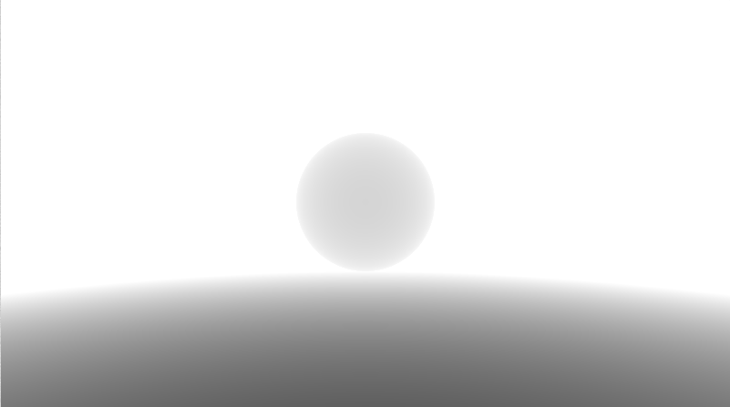
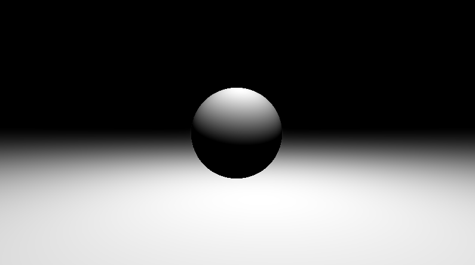
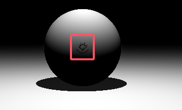

# Raymarching+SDF教程（以shadertoy为例）

# 一、普通的RayMarching

参考视频：https://www.youtube.com/watch?v=PGtv-dBi2wE&list=PLGmrMu-IwbguU_nY2egTFmlg691DN7uE5&index=22

```glsl
#define max_iter 100
#define max_dist 100.0 //最远抵达的距离
#define min_surface_dist 0.001

float dist(vec3 p)
{
    //与场景的最近距离
    //有一个地面和一个球
    //sphere
    vec4 s = vec4(0,1,6,1); //xyz:center w:r
    //地面高度为0
    float sphereDist = length(s.xyz - p) - s.w;
    float planeDist = p.y; //注意这里不要取绝对值，因为这是类似于SDF的概念，是允许有负值的
    return min(sphereDist, planeDist);
}

float RayMarch(vec3 ro, vec3 rd)
{
    float s = 0.0; //总的距离
    //从ro开始做ray march操作
    for(int i=0;i<max_iter;i++)
    {
        vec3 p = ro + rd * s;
        float t = dist(p);
        s += t;
        if(t<min_surface_dist || t>max_dist) break;
    }
    return s; //回传最终计算的距离
}

void mainImage( out vec4 fragColor, in vec2 fragCoord )
{
    //see this:https://stackoverflow.com/questions/58684315/shadertoy-fragcoord-vs-iresolution-vs-fragcolor
    vec2 uv = (fragCoord - 0.5*iResolution.xy) / iResolution.y;  //把UV的原点归一化到中心,但uv.x = 0.5并不在中心，注意
    vec3 col = vec3(0);
    //if(uv.x > 0.5) col = vec3(1.0,0.0,0.0); //可debug看结果
    
    //camera model
    vec3 ro = vec3(0,1,0);
    vec3 rd = normalize(vec3(uv.x, uv.y, 1));
    float d = RayMarch(ro, rd);
    d/=6.0;
    col = vec3(d);
    fragColor = vec4(col, 1.0);
}
```

此时实现的效果如下：




## 1.引入shading model

其实就是一个简单的lambert着色：`light = dot(lightVector, normalVector)`

其中：

- `lightVector=normalize(lightPos - surfacePos)`
- `normalVector:`用类似于求曲线导数的方式来计算，这里不展开，看函数即可。

```glsl
vec3 GetNormal(vec3 p)
{
    vec2 e = vec2(0.01,0);
    float d = dist(p);
    vec3 n = d - vec3(
        dist(p-e.xyy),
        dist(p-e.yxy),
        dist(p-e.yyx));
    return normalize(n);
}
```

此时总的代码修改为如下：

```glsl
#define max_iter 100
#define max_dist 100.0 //最远抵达的距离
#define min_surface_dist 0.001

float dist(vec3 p)
{
    //与场景的最近距离
    //有一个地面和一个球
    //sphere
    vec4 s = vec4(0,1,6,1); //xyz:center w:r
    //地面高度为0
    float sphereDist = length(s.xyz - p) - s.w;
    float planeDist = p.y; //
    return min(sphereDist, planeDist);
}

vec3 GetNormal(vec3 p)
{
    vec2 e = vec2(0.01,0);
    float d = dist(p);
    vec3 n = d - vec3(
        dist(p-e.xyy),
        dist(p-e.yxy),
        dist(p-e.yyx));
    return normalize(n);
}

float GetLight(vec3 p)
{
    vec3 lightPos = vec3(0,5,6);
    lightPos.xz += vec2(sin(iTime),cos(iTime)) * 2.0;
    vec3 l = normalize(lightPos - p);
    vec3 n = GetNormal(p);
    return clamp(dot(n, l),0.0,1.0);
}

float RayMarch(vec3 ro, vec3 rd)
{
    float s = 0.0; //总的距离
    //从ro开始做ray march操作
    for(int i=0;i<max_iter;i++)
    {
        vec3 p = ro + rd * s;
        float t = dist(p);
        s += t;
        if(t<min_surface_dist || t>max_dist) break;
    }
    return s; //回传最终计算的距离
}

void mainImage( out vec4 fragColor, in vec2 fragCoord )
{
    //see this:https://stackoverflow.com/questions/58684315/shadertoy-fragcoord-vs-iresolution-vs-fragcolor
    vec2 uv = (fragCoord - 0.5*iResolution.xy) / iResolution.y;  //把UV的原点归一化到中心,但uv.x = 0.5并不在中心，注意
    vec3 col = vec3(0);
    //if(uv.x > 0.5) col = vec3(1.0,0.0,0.0); //可debug看结果
    
    //camera model
    vec3 ro = vec3(0,1,0);
    vec3 rd = normalize(vec3(uv.x, uv.y, 1));
    float d = RayMarch(ro, rd);
    vec3 p = ro + rd * d;
    float diffuse = GetLight(p);
    col = vec3(diffuse);
    fragColor = vec4(col, 1.0);
}
```

效果为：




## 2.引入Shadow

在Raymarching的框架下做阴影是比较简单的，只需要从相机raymarch打到的点开始，往光源的方向做Ray marching，记录击中东西的距离，如果这个距离小于到光源的距离，则认为所处于阴影中。修改后的GetLight代码如下：

```glsl
float GetLight(vec3 p)
{
    vec3 lightPos = vec3(0,5,6);
    lightPos.xz += vec2(sin(iTime),cos(iTime)) * 2.0;
    vec3 l = normalize(lightPos - p);
    vec3 n = GetNormal(p);
    float diffuse = clamp(dot(n, l),0.0,1.0);
    float d = RayMarch(p + n * min_surface_dist, l); //p + n * min_surface_dist是为了让起点离开表面
    if(d<length(lightPos - p)) diffuse*=0.1; //算是在阴影当中
    return diffuse;
}
```

如果发现了下图这种artifact，可以适当提高离开表面的强度，比如改为`float d = RayMarch(p + n * min_surface_dist * 2.0, l);`即可。



最终的全部代码：
```glsl
#define max_iter 100
#define max_dist 100.0 //最远抵达的距离
#define min_surface_dist 0.001

float dist(vec3 p)
{
    //与场景的最近距离
    //有一个地面和一个球
    //sphere
    vec4 s = vec4(0,1,6,1); //xyz:center w:r
    //地面高度为0
    float sphereDist = length(s.xyz - p) - s.w;
    float planeDist = p.y; //
    return min(sphereDist, planeDist);
}

vec3 GetNormal(vec3 p)
{
    vec2 e = vec2(0.01,0);
    float d = dist(p);
    vec3 n = d - vec3(
        dist(p-e.xyy),
        dist(p-e.yxy),
        dist(p-e.yyx));
    return normalize(n);
}


float RayMarch(vec3 ro, vec3 rd)
{
    float s = 0.0; //总的距离
    //从ro开始做ray march操作
    for(int i=0;i<max_iter;i++)
    {
        vec3 p = ro + rd * s;
        float t = dist(p);
        s += t;
        if(t<min_surface_dist || t>max_dist) break;
    }
    return s; //回传最终计算的距离
}

float GetLight(vec3 p)
{
    vec3 lightPos = vec3(0,5,6);
    lightPos.xz += vec2(sin(iTime),cos(iTime)) * 2.0;
    vec3 l = normalize(lightPos - p);
    vec3 n = GetNormal(p);
    float diffuse = clamp(dot(n, l),0.0,1.0);
    float d = RayMarch(p + n * min_surface_dist * 2.0, l); //p + n * min_surface_dist是为了让起点离开表面
    if(d<length(lightPos - p)) diffuse*=0.1;
    return diffuse;
}

void mainImage( out vec4 fragColor, in vec2 fragCoord )
{
    //see this:https://stackoverflow.com/questions/58684315/shadertoy-fragcoord-vs-iresolution-vs-fragcolor
    vec2 uv = (fragCoord - 0.5*iResolution.xy) / iResolution.y;  //把UV的原点归一化到中心,但uv.x = 0.5并不在中心，注意
    vec3 col = vec3(0);
    //if(uv.x > 0.5) col = vec3(1.0,0.0,0.0); //可debug看结果
    
    //camera model
    vec3 ro = vec3(0,1,0);
    vec3 rd = normalize(vec3(uv.x, uv.y, 1));
    float d = RayMarch(ro, rd);
    vec3 p = ro + rd * d;
    float diffuse = GetLight(p);
    col = vec3(diffuse);
    fragColor = vec4(col, 1.0);
}
```

