# 在渲染器中引入动画系统

在这部分中，我们首先介绍《游戏引擎架构》这本书里关于动画系统的介绍，并聚焦于骨骼动画的部分。然后，尝试在我们的渲染器中引入动画系统，实现一个简单的骨骼动画。

# 一、《游戏引擎架构》动画系统精讲（上）

大纲如下（不做非常细节的摘抄，可以看原书pdf 第469页（对应书p448）开始，以下很多知识点只记录页码，到时候回来争取能根据知识要点答出来，就算掌握了。

11.1.1 Sprite Animation，Animated Texture

11.1.2 Rigid Hierarchical Animation（其实就是只有骨骼在动，关节位置产生裂缝，没有蒙皮）

11.1.3 Per-vertex Animation & Morph Target Animation（这个常用于做Face Animation）

11.1.4 蒙皮动画（Skinned Animation）

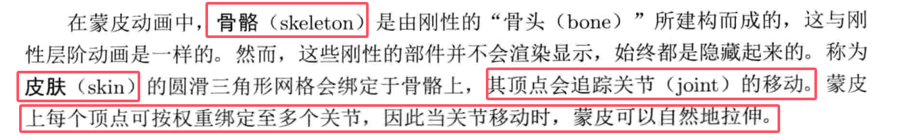


11.1.5 把动画方法视为数据压缩技术

> 简单理解，就是不管是Morph Target还是Skinned Animation，其本质都是在做动画的压缩，而对于动画师而言，Morph Target更多适用于脸部的动画，而Skinned Animation则是骨骼动画（比如四肢的移动）。


## 11.2 骨骼

其实我们说的skeleton很多时候都是指的joint，因为两个相连的joint连在一起就是skeleton。

### 11.2.1 骨骼层阶结构

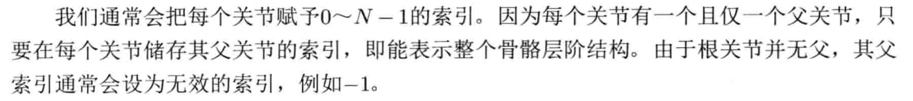


### 11.2.2 在内存中表示骨骼

每个关节的数据结构如下：
```c++
struct Joint
{
    Matrix4x3 m_invBindPose;  //绑定姿势之逆变换，这个在后面会有更加详细的介绍。用于存储模型空间变回到关节空间的矩阵，用于蒙皮，看游戏引擎架构的11.5.2部分，比较清晰
    const char* m_name;  //人类可读的关节名字
    U8 m_iParent; //父索引，或者0xFF表示根骨骼
};
```

关于m_invBindPose这个东西，在骨骼变换的章节还会详细介绍。先放在这里。

此时Skeleton系统的结构如下：
```c++
struct Skeleton
{
    U32 m_jointCount; //关节数目
    Joint* m_aJoint; //关节数组
};
```


## 11.3 姿势

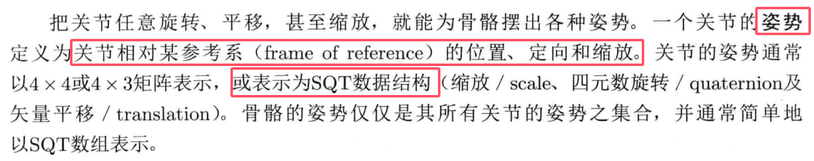

### 11.3.1 绑定姿势

bind-pose/reference pose/rest pose：本质上都是一个东西，一般就是比如T Pose/A pose。


### 11.3.2 局部姿势

这里我们需要看一下《游戏引擎架构》这本书的p455页。以下记录重点：

- local pose：局部姿势，描述相对于父的姿势，局部姿势几乎都存储为SQT格式；
- 关节空间：看下图（Maya中应该可以开启或关闭关节空间的显示）：

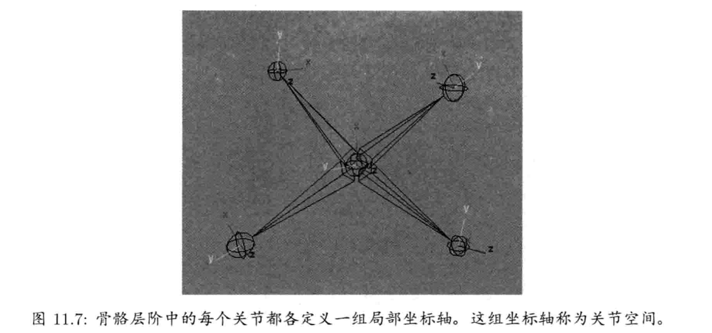

- 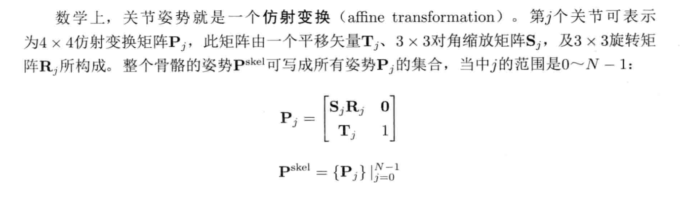

  注意，上图当中的矩阵是一个行优先的矩阵，意味着在本章节动画系统的介绍中，该矩阵的使用方式都是（向量*矩阵）的。

- 关于关节缩放：看p456，大致是在说引擎一般会对缩放进行限制，比如能否缩放、能否支持非统一缩放，这样做的优劣势等。

  - 限制引擎使用统一缩放的一个好处是存储量比较少，另一个好处是确保包围球不会变成椭球体。（==存疑，可能指的是如果用球包围盒，非均等缩放会变成椭球吧。==）


#### 11.3.2.2 在内存中表示关节姿势

前面有说，关节姿势一般被保存为SQT格式，C++中可以考虑把Q放在第一个字段，此时可以保证很好的内存对齐。

> （假设`Quaternion`是16个字节，`Vector3`是3个float，对应12个字节（但作为类的成员时会被填充到16个字节），F32对应的scale值有4个字节，此时如果把Q夹在中间就会占用更多的内存空间）：

```c++
struct JointPose
{
    Quaternion m_rot; //Q
    Vector3 m_trans;
    F32 m_scale;
};
```

当然，也可以选择允许做非统一缩放，此时就变成了：
```c++
struct JointPose
{
    Quaternion m_rot; //Q
    Vector3 m_trans;
    Vector3 m_scale;
    U8 m_padding[8]; //note：这里的m_padding应该只是为了显式内存对齐，不需要过度关心
};
```

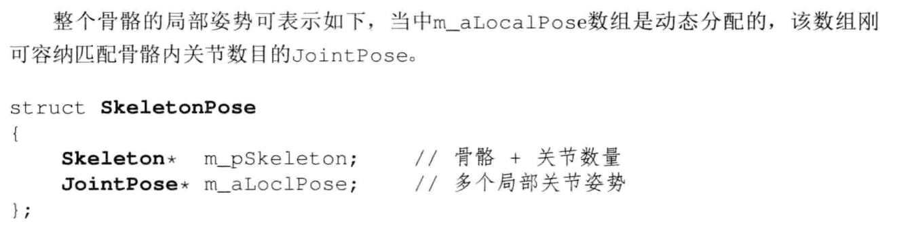


#### 11.3.2.3 把关节姿势当作基的变更

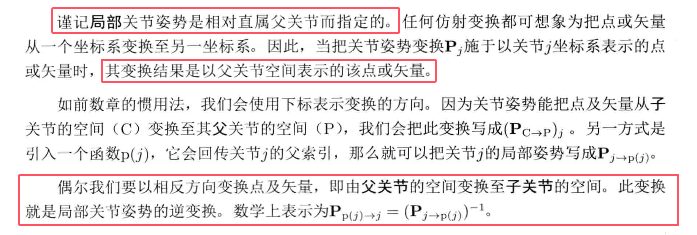

其实就是讲一下，我们上面计算的这个`m_aLocalPose`其实就是$P_(C->P)_j$，也就是这个矩阵记录了在父节点的空间P中子空间的变换，因此通过这个矩阵就可以把子joint转换到其父joint的空间（P），当然也许有时也需要这个逆矩阵，从父joint的空间变换到子joint的空间。


### 11.3.3 全局姿势

在这一节中，我们会介绍如何计算任何一个关节$J$的模型空间姿势。

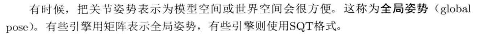

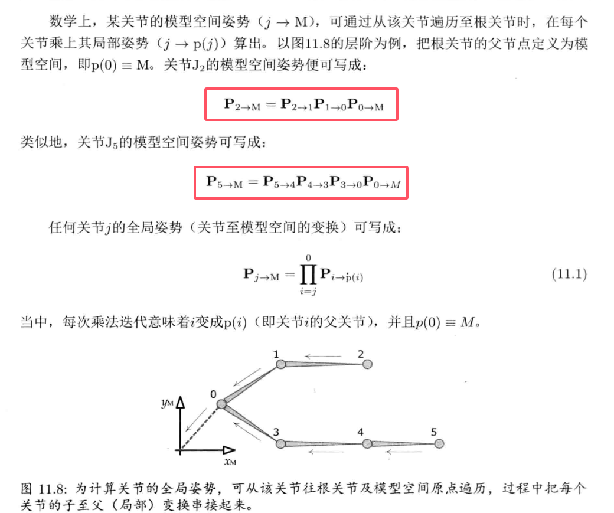


#### 11.3.3.1 在内存中表示全局姿势

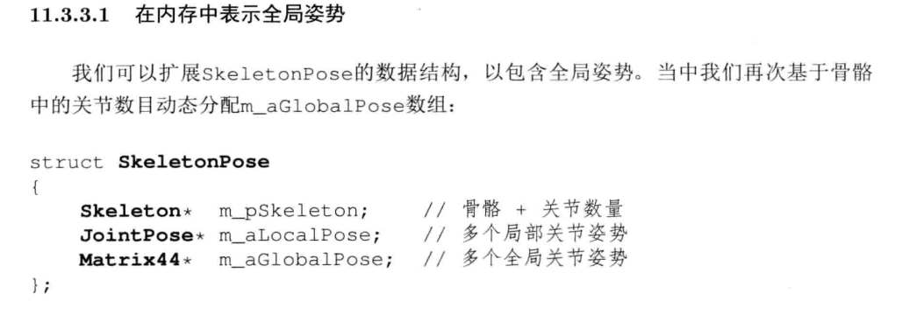

我的理解是提前计算好这个`m_aGlobalPose`，就可以很方便地计算出某个joint空间相对于模型空间的变换（**相当于预计算**），此时就可以在做骨骼动画的时候快速拿到结果。


## ==11.4 动画片段（待复习补充，以及二部分及以后都要补充）==

基础原理看《游戏引擎架构》的p459。

**这一部分的要点是理解以下的概念：**

- 局部时钟和全局时钟（note：关于这两种同步方式**有点没看懂，有需要可以讨论一下**）；
- 简单的动画数据格式
- metachannel的定义：我的理解实际上就是在动画文件中记录一些额外的参数，比如光源参数，摄像机参数等。


## 11.5 蒙皮和Matrix Pallete

在前面的学习中，我们已了解如何用旋转、平移及缩放设置骨骼的姿势，也知道任何骨骼姿势都可以用一组局部$P_{j->p(j)}$或全局$(P_{j→m})$关节姿势变换表示。之后，我们会探讨把三维网格顶点联系至骨骼的过程。此过程称为**蒙皮(skinning)。**

### 11.5.1 每顶点的蒙皮信息

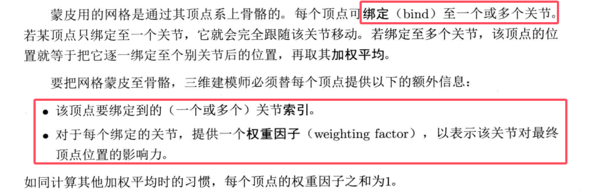

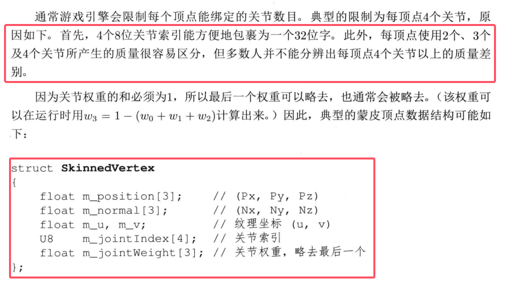


### 11.5.2 蒙皮的数学

这一部分其实就是求解蒙皮矩阵。

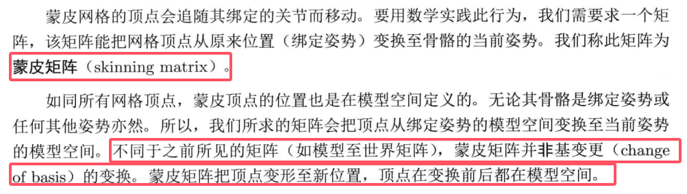

#### 11.5.2.1 单个关节骨骼的例子

这个看《游戏引擎架构》的p472页，讲的确实不错。

以下为公式11.1：

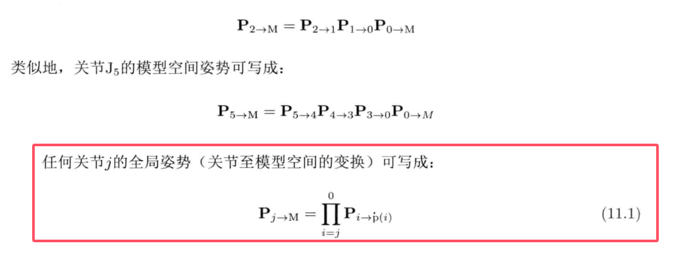


在看完这部分的整理之后，相信我们已然较为了解骨骼系统是怎么运作的了，接下来立刻将骨骼动画应用到我们的渲染器当中！


# 二、将骨骼动画引入渲染器

一些需要确认的事情：
【1】四元数在骨骼旋转中有所应用，四元数要了解的更深入一点，以及和欧拉角之间的关系；

【2】Quaternion的Lerp，比如slerp，nlerp之类的（在我们渲染器的骨骼动画中，使用的slerp）


# 三、《游戏引擎架构》动画系统精讲（下）

## 11.6 动画混合

动画混合其实有很多应用，比如说：

- （1）非动画数据中的采样帧，此时就可以求出不同时间点的两个已知姿势中间的姿势；
- （2）做两个不同动画之间的混合，比如受伤状态的走路和没有受伤状态的走路；或者向左瞄准和向右瞄准的中间瞄准状态；
- （3）把原动画混合至目标动画，感觉类似于两个动画之间的过渡。

### 插值的方法

- 线性插值：LERP，显然直接对变换矩阵做插值很不合适，正确的做法应该是分别对SQT分量进行插值，其中Scale和Translation完全可以直接线性插值，但Rotation一般是用四元数Quaternion做Lerp或SLerp，在我们的渲染器中是是用SLerp来做，具体的细节如下：

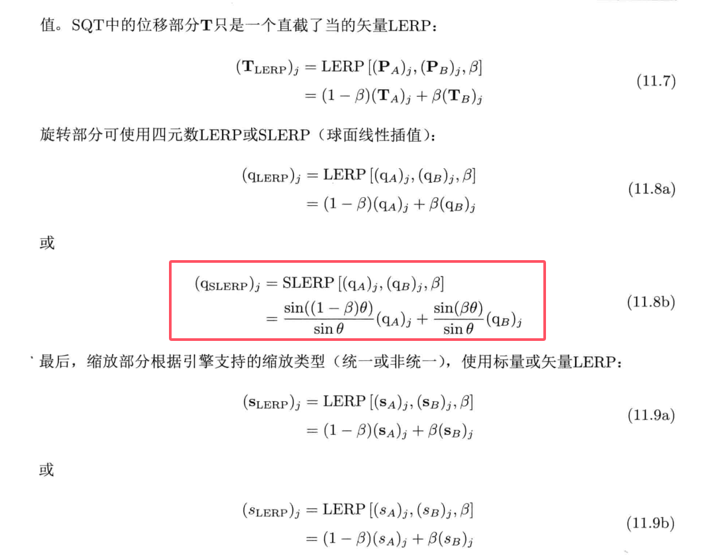

**姿势混合是在局部姿势下进行的。因此可以每个joint分开并行计算。（因为都是相对于父joint的）**。不过实际上，一般一个骨骼实际上只有几百个joint，此时所有的joint做并行插值不一定划算，可能会降低内存读取的连贯性，反而对性能产生影响。如果游戏中有大量角色，可以考虑以角色（骨骼）为最小单位进行并行。


### 线性插值混合的应用

- 时间性混合：其实就是非关键帧的中间帧的姿态，渲染器中目前已经支持这个功能；
- 动作连续性：淡入/淡出
  - 复习一下C0，C1，C2连续，但实际上C1和C2在制作动画资产的时候想轻易达到是不现实的。
  - 圆滑过渡/冻结过渡，过渡的时候混合因子β会逐渐增长，既可以线性增长，也可以用fade曲线来做（如Bezier）。
  - 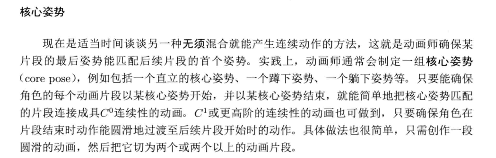
  - 以上截图，我的理解是比如《原神》剧情里每个伸手之类的剧情动作基本都会以Idle结尾，应该是能使衔接更流畅。


#### 11.6.2.3 方向性运动

- 轴转移动与靶向移动：看《游戏引擎架构》的p481页开始，讲的比较清晰。


### 11.6.3 复杂的线性插值混合

我的理解，这里就是游戏引擎的动画Blend的核心思路了，比如1D Blend Tree，2D Blend Tree等。看完之后应该会角色豁然开朗。以下是这部分复习时候的大纲：

- 一维动画混合；
- 二维动画混合，包含普通四边形、三角形以及需要三角剖分的情况；
- 动画混合时候的blend mask；
- additive blending：这个地方原理很简单，但在数学层面上其实是矩阵的乘法，需要熟悉一下。
  -  Additive 动画有很多应用，记得看一下；


## 11.7 后期处理

通过前面的骨骼变换+Blend操作，我们已经能够产生目标动作出来了，但到真正渲染到屏幕上之前，很有可能还要对动画进行进一步的后处理，举例：程序式动画、IK等。

### 11.7.1 程序式动画

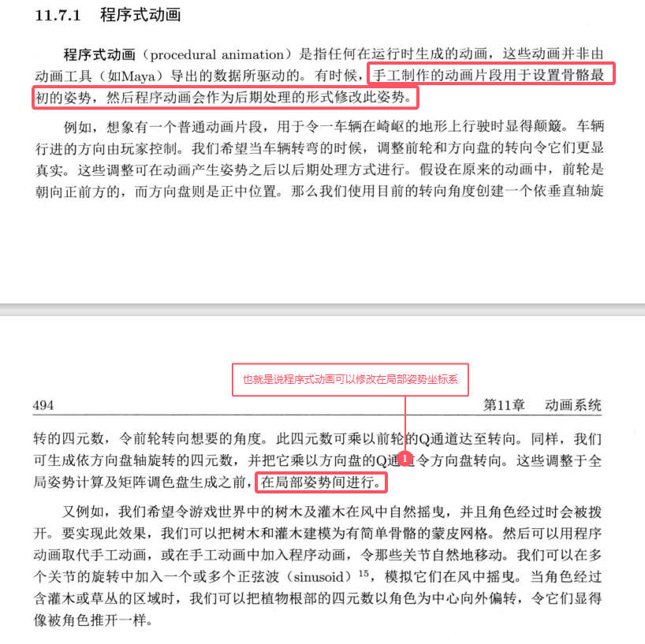


### 11.7.2 逆动力学


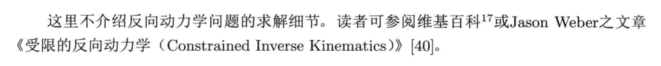

IK的一些常见的方法后面可以再后面复习的时候再粘过来，印象中有比如FABRIK，CCD，以及比如雅各比矩阵求解法等。本质求解IK应该是一个优化的问题，找到”loss“最低的值就是最优解。


### 11.7.3 布娃娃系统

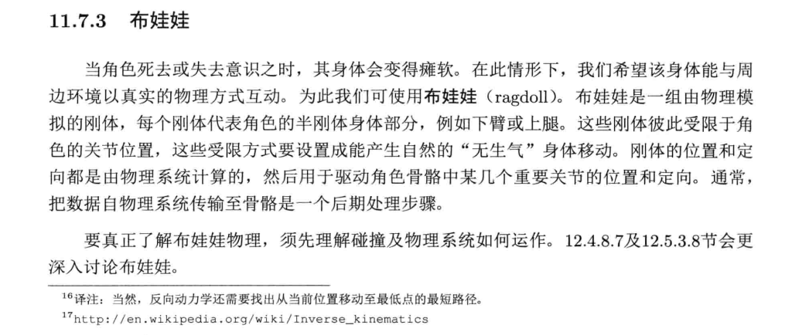


## 11.8 压缩技术

参考《游戏引擎架构》的第496页开始即可。可以学习到一些常见压缩动画资产的思路。