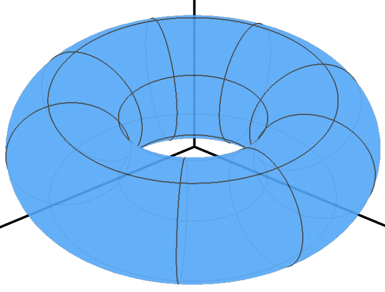
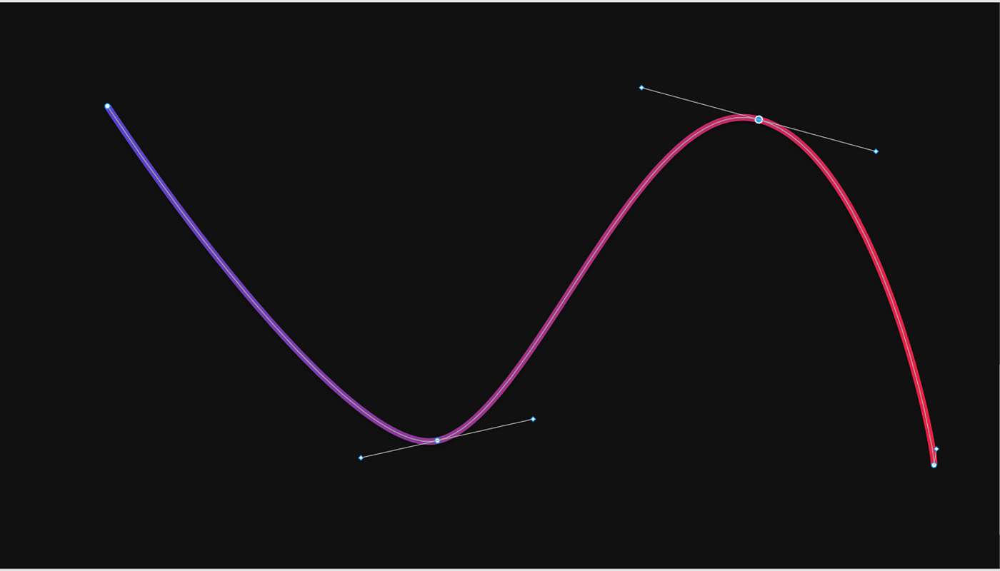
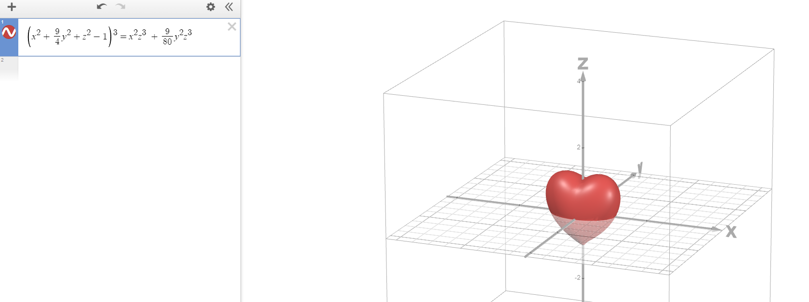
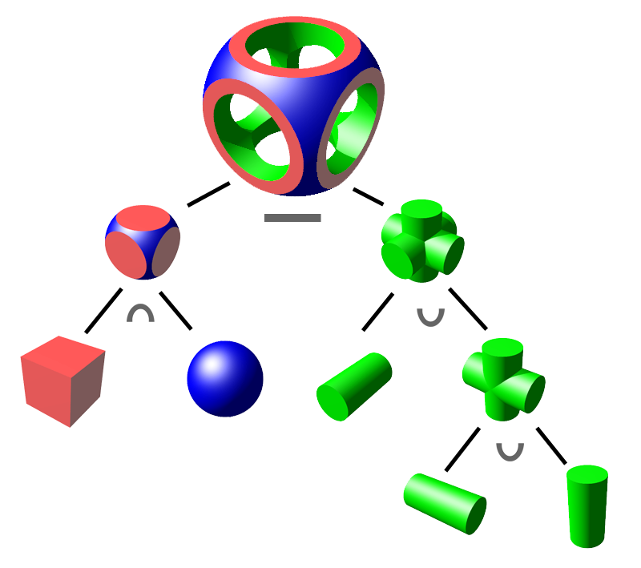
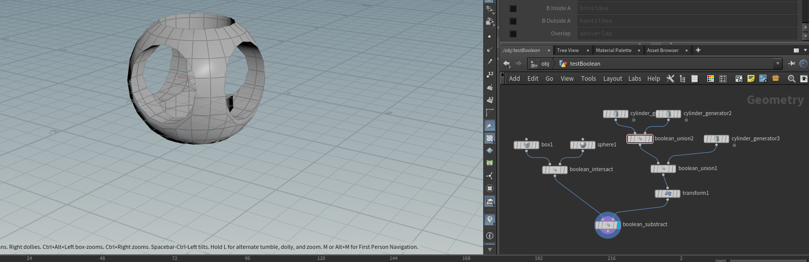

# 教程——几何篇（1）

> 注：几何部分的代码基于taichi框架来做，这样的好处是可以关注于比较复杂的算法本身，而不是C++的语法。因为这部分用C++写的话可能需要调用第三方库，可能存在配环境问题，而taichi很好配环境，具体可以参考官方仓库：https://github.com/taichi-dev/taichi


# 一、前置知识——渲染

​	在前面的光栅化渲染篇中，我们介绍了一些渲染的基本知识，好在taichi其实在渲染上已经给我们提供了足够的便利，很方便我们实现几何这部分的算法。taichi的一些简单的案例、快速上手可以参考这篇：https://docs.taichi-lang.org/docs/hello_world


# 二、几何的基本知识

​	我们在渲染部分使用了很多模型进行过渲染，比如小星星模型。读者们可以在日常使用计算机的时候看到很多模型的表达，比如说游戏里的角色模型、场景模型，电影当中的模型、VR当中周围的景物模型等等。这些模型都是几何（Geometry），但Geometry除了模型的表达方式外，还有很多别的表达方式，最简单比如一条函数图像绘制出来的曲线也可以认为是Geometry。这里我们先了解一下”几何“有哪些常见的表达形式。在本节中，我们也会重点介绍显式表达方式中的曲线表达方式（其中以贝塞尔曲线尤为出名）。

### （1）显式表示法

​	显式表示法通过明确给出几何形状的边界或轮廓来定义形状，通常涉及比如使用参数方程、顶点列表或其它可直接计算的位置关系的方法。显式几何表示是一种 **直接或间接（通过参数映射的方式）定义点、线、面等元素集合** 的方法。在显式几何表示中，各元素的位置通常由坐标值直接给出，各元素之间的关系通常由数据结构来表示。实际上，**我们之前渲染中用到的obj模型都是显式表示，因为文件中显式定义了顶点的信息，包含位置、法线等**。这种也被称之为**多边形网格**，往往由三角面片或四边形面片组成。

以下介绍一些其他的显式表达：

#### （a）参数方程

​	在高中的时候我们就学习过参数方程的表达，比如下面这个例子：
$$
F: \mathbb{R}^2 \to \mathbb{R}^3 \\
(u,v) \to (x,y,z)
$$
​	举个例子并将其绘制出来。假设我们的方程为$f(u,v)=((2+\cos{u})\cos{v},(2+\cos{u})\sin{v},\sin{u})$,读者可以发现这符合上面的参数方程表达形式。这个曲面如下：



​	这种方式比较符合我们的认知，而且采样生成对应的点也很容易。但有一个问题，那就是如果我有一个$(x,y,z)$的输出坐标，我能否快速得知这个坐标是否在曲面内/外？对于这种表达方式来说，是比较困难的。读者可以自己尝试一下，就会发现这种表达方式对于判断点在曲面内外的困难性。


#### （b）点云表达法（point cloud）

​	点云是一种常见的3D形状的表达方式，我们可以通过点云来表示一个物体或者一个场景。通过不同角度的观察点云，我们通过人眼可以分辨出点云所代表的物体的类别、猜测物体可能蕴含的功能以及通过不完整的点集来还原出物体本来的形状。点云通常由三维扫描仪获取。点云中每个点的位置（位置向量)都由一组笛卡尔坐标(X,Y,Z) 描述，有些可能还会包含色彩信息（R,G,B）或物体反射面强度（intensity）等信息。下图是一个点云的示意图：


​	可以看到，点云的表述方法是比较直观且便于理解的。点云的表达和通过点云方式的渲染也在工业界的应用，比如皮克斯的这篇技术报告：https://web.archive.org/web/20131202234149/http://www.cgsociety.org/index.php/CGSFeatures/CGSFeatureSpecial/pixar_points，感兴趣的读者可以进行阅读。显然，点云表示法也是一种显式表示法，因为我们相当于显式地指定了点云中每个点的位置。


#### （c）曲线

​	曲线也是一种几何显式表示的方法。曲线可以被定义为一系列连续的点，这些点在某个参数范围内通过数学函数连接起来。曲线可以是开放的或闭合的，比如说常见的函数图像就可以理解为一条曲线。在计算机图形学中，我们甚至可以认为**直线**也属于曲线的特殊情况。在初高中数学中，我们还有学习过类似于圆锥曲线、抛物线之类的曲线表达。在本节中，我们会介绍一种尤为出名的曲线，叫做**贝塞尔曲线（Bézier curve）**。这是一种参数化的曲线，后文会详细介绍。下图是Bézier曲线的示意图：




### （2）隐式表示法

​	隐式几何表示是一种 **使用数学关系式来描述几何形状** 的方法，并不是直接描述其顶点和边界等元素。在隐式几何表示法中，几何形状被定义为方程的解集，即满足某些条件的一组点的集合。来举一个容易理解的例子，下面的方程就是一个隐式表达的方程：
$$
f(x,y,z) = x^2 + y^2 + z^2 - 1
$$
​	容易看出，$f(x,y,z)=0$的点构成半径为1的球面的表面，而$f(x,y,z)>0$的点位于球面表面的外侧，$f(x,y,z)<0$的点位于球面表面的内侧，这也是这种表达方式的优势，我们很容易能够计算出给定点$A(x',y',z')$是在给定曲面$f(x,y,z)$的内侧还是外侧，对2D情况也是同理。以下我们具体介绍常见的隐式表达方法。

#### （a）代数曲面

​	代数曲面通过一组参数方程来定义曲线/曲面。例如上面这个例子，读者可以去Desmos网站（https://www.desmos.com/3d?lang=zh-CN）上绘制自己感兴趣的代数曲面，比如下面这个方程：
$$
\left(x^{2}+\frac{9}{4}y^{2}+z^{2}-1\right)^{3}=x^{2}z^{3\ }+\frac{9}{80}y^{2}z^{3}
$$
​	对于代数曲面来说，一个弊端就在于我们不太容易观察得到这个曲面的形状，不像显式曲面（例如前面的例子$f(u,v)=((2+\cos{u})\cos{v},(2+\cos{u})\sin{v},\sin{u})$），可以轻松得到映射关系。但代数曲面的优势就在于如果给定一个点$A(x',y',z')$，可以快速判断其在曲面的内侧/外侧。接下来揭晓谜底，上面这个代数曲面如下：




#### （b）构造实体几何（Constructive solid geometry）

​	构造实体几何允许建模人员通过使用布尔运算符组合简单的对象来创建复杂的表面或物体。看起来有点抽象，我们直接看下图：



​	最上面的就是我们要建模的物品，而上面这颗树的所有叶子节点则是最基本的几何体。构造实体几何的方法定义了三种布尔运算，分别是并（$\cup$），交（$\cap$），和差集（$-$）。从上图也可以大致看出来他们的作用，用通俗的语言来讲：

- 并：将两个几何体合并为一个（见上图右）；
- 交：找出两个几何体公共的部分（见上图左）；
- 差集：$A-B$意味着从$A$中减去包含有$B$的部分（见上图最上面）。

​	在美术建模当中，有很多软件可以帮助我们来做上面的布尔运算，而布尔运算也是**程序化建模**的重要部分。例如在Houdini当中，我们可以用布尔运算复刻上图的实现过程：



​	布尔运算的好处在于很容易理解，对于建模师来说也更容易调整。对其中某个基础几何体进行形状、位置的改变，就可以改变最后布尔运算的结果，并且很方便看到结果。


#### （c）符号距离函数（Signed Distance Function，SDF）

​	这种隐式表达的方式在计算机图形学中有着**极为重要**的应用，这里我们先简要介绍一下。在后面的章节中，我们会频繁用到SDF的思想，并逐渐深入介绍，到时候读者也会逐渐理解这种思想的绝妙之处。对于SDF来说，其可以理解为一个函数，输入是空间中的任意一个点，输出则是该点距离几何体表面的最近距离，具体来说：

- 当SDF的值大于0，表示点在几何体外部；
- 当SDF的值等于0，点在几何体的表面上；
- 当SDF的值小于0，表示点在几何体的内部；

​	同时，SDF的绝对值表示点距离几何体表面的最近距离。举个例子，用SDF的方式来表示一个球体，应该如下：

```c++
float sdSphere( in vec3 p, in float r )
{
    return length(p)-r;
}
```

​	输入SDF函数的参数分别为：$p$是一个向量，表示要求解的点相对于球心的方向向量，$r$则是球体的半径。从上面的方程可以看到，如果SDF函数小于0，说明length(p)<r，即该点在球体内；如果SDF函数大于0，说明点在球体外。同时还可以注意到，SDF返回的值的绝对值其实代表了这个点距离表面的最近距离。有了SDF之后，做**表面融合**这样的效果会简单很多。SDF在后面的光线追踪篇会有大量的应用，到时候会有更为详细的介绍。


#### （d）水平集


#### （e）分形


# 三、贝塞尔曲线

​	在前文中，我们已经介绍了几何显式表示法和隐式表示法，并分别举了一些例子。在这部分中，我们会具体介绍一种显式表达几何的方式——贝塞尔曲线。贝塞尔曲线是通过一系列控制点进行定义的曲线。对于绘制的过程而言，用户只需要改变控制点的位置，就可以修改曲线的整体走向和形状，这很方便设计师设计各种曲线出来。这一部分，我们会介绍贝塞尔曲线的定义，并在taichi中用少量的代码实现出贝塞尔曲线的效果。读者可以在Github仓库中的chapter_geometry文件夹中找到对应的Demo来运行（要配置python+taichi环境，非常简单，可以自行查找资料，一般就是`pip install`安装一个包即可）。

## 1.贝塞尔曲线的原理

​	这里我们先以三阶贝塞尔曲线为例，方便读者理解。

