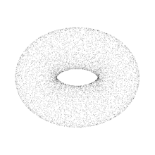

# 教程——几何篇（1）

> 注：几何部分的代码基于taichi框架来做，这样的好处是可以关注于比较复杂的算法本身，而不是C++的语法。因为这部分用C++写的话可能需要调用第三方库，可能存在配环境问题，而taichi很好配环境，具体可以参考官方仓库：https://github.com/taichi-dev/taichi

# 一、前置知识——渲染

​	在前面的光栅化渲染篇中，我们介绍了一些渲染的基本知识，好在taichi其实在渲染上已经给我们提供了足够的便利，很方便我们实现几何这部分的算法。taichi的一些简单的案例、快速上手可以参考这篇：https://docs.taichi-lang.org/docs/hello_world

# 二、几何的基本知识

​	我们在渲染部分使用了很多模型进行过渲染，比如小星星模型。读者们可以在日常使用计算机的时候看到很多模型的表达，比如说游戏里的角色模型、场景模型，电影当中的模型、VR当中周围的景物模型等等。这些模型都是几何（Geometry），但Geometry除了模型的表达方式外，还有很多别的表达方式，最简单比如一条函数图像绘制出来的曲线也可以认为是Geometry。这里我们先了解一下”几何“有哪些常见的表达形式。

### （1）显式表示法

​	显式表示法通过明确给出几何形状的边界或轮廓来定义形状，通常涉及比如使用参数方程、顶点列表或其它可直接计算的位置关系的方法。显式几何表示是一种 **直接或间接（通过参数映射的方式）定义点、线、面等元素集合** 的方法。在显式几何表示中，各元素的位置通常由坐标值直接给出，各元素之间的关系通常由数据结构来表示。实际上，**我们之前渲染中用到的obj模型都是显式表示，因为文件中显式定义了顶点的信息，包含位置、法线等**。这种也被称之为**多边形网格**，往往由三角面片或四边形面片组成。

以下介绍一些其他的显式表达：

#### （a）参数方程

​	在高中的时候我们就学习过参数方程的表达，比如下面这个例子：
$$
F: \mathbb{R}^2 \to \mathbb{R}^3 \\
(u,v) \to (x,y,z)
$$
​	举个例子并将其绘制出来。假设我们的方程为$f(u,v)=((2+\cos{u})\cos{v},(2+\cos{u})\sin{v},\sin{u})$,读者可以发现这符合上面的参数方程表达形式。这个曲面如下：

​	这种方式比较符合我们的认知，而且采样生成对应的点也很容易。但有一个问题，那就是如果我有一个$(x,y,z)$的输出坐标，我能否快速得知这个坐标是否在曲面内/外？对于这种表达方式来说，是比较困难的。读者可以自己尝试一下，就会发现这种表达方式对于判断点在曲面内外的困难性。

#### （b）点云表达法（point cloud）

​	点云是一种常见的3D形状的表达方式，我们可以通过点云来表示一个物体或者一个场景。通过不同角度的观察点云，我们通过人眼可以分辨出点云所代表的物体的类别、猜测物体可能蕴含的功能以及通过不完整的点集来还原出物体本来的形状。点云通常由三维扫描仪获取。点云中每个点的位置（位置向量)都由一组笛卡尔坐标(X,Y,Z) 描述，有些可能还会包含色彩信息（R,G,B）或物体反射面强度（intensity）等信息。下图是一个点云的示意图：

​	可以看到，点云的表述方法是比较直观且便于理解的。点云的表达和通过点云方式的渲染也在工业界的应用，比如皮克斯的这篇技术报告：https://web.archive.org/web/20131202234149/http://www.cgsociety.org/index.php/CGSFeatures/CGSFeatureSpecial/pixar_points，感兴趣的读者可以进行阅读。显然，点云表示法也是一种显式表示法，因为我们相当于显式地指定了点云中每个点的位置。

