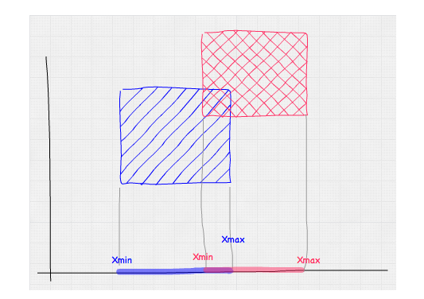

# 路径追踪系列

想正好借助于这篇笔记，详细地总结一下路径追踪的一些重要的链接，自己的理解，以及重要性采样的相关内容。

# 一、前置知识

有一些基础的概念，这里就不再额外整理了，写一些关键词，需要对这些关键词有足够的理解：

- 辐射度量学
  - intensity，radiance，irradiance
  - 蒙特卡洛方法
  - 俄罗斯轮盘赌
  - 蒙特卡洛路径追踪方法


## 1.补充内容

### （1）关于radiance的式子

有一种radiance的写法是这样的：
$$
\frac{d^{2} \Phi }{d A d \omega \cos \theta}
$$
这里为什么$\cos\theta$是在分母上呢？

> 因为式子中的 dΦ 我们认为是投影过后垂直于平面的值，也就是说这个值被乘以过cosθ，参考辐照度的介绍。因此当我们要使其变为投影前的值时（原本方向）就需要除以cosθ。

参考链接：https://zhuanlan.zhihu.com/p/370162390


# 二、重要性采样

主要参考：https://zhuanlan.zhihu.com/p/360420413


# 三、C++版本实现的注意事项

在notes笔记的algos文件夹当中。

## 1.基础知识

- .hpp文件和.h文件的区别：

  - 在 C++ 中，`.hpp` 文件和 `.h` 文件都是用来包含头文件的扩展名，但它们之间并没有严格的技术上的区别。主要的区别在于约定和习惯用法：

    1. 扩展名约定

    - **`.h`**：传统上用于 C 语言和 C++ 的头文件。这个扩展名通常表示该文件可能包含C风格的代码或与C兼容的代码（如函数声明、宏等）。
    - **`.hpp`**：通常用于 C++ 头文件，暗示该文件使用了 C++ 的特性，如类、命名空间和模板等。这个扩展名更加明确地指示这是一个专门为 C++ 设计的头文件。


## 2.Fresnel函数的计算

在光线追踪的章节里面有使用Schlick近似方法的相关处理，如下：

### Schlick近似方法

现实世界中的玻璃, **发生反射的概率会随着入射角而改变**——从一个很狭窄的角度去看玻璃窗（也就是说你的视线方向几乎垂直于玻璃窗的法线方向）, 它会变成一面镜子。如果要完全精确地描述这件事公式是十分痛苦的（参考学习链接：https://zhuanlan.zhihu.com/p/372110183），不过有一个数学上近似的等式, 它是由Christophe Schlick提出的。Schlick 反射率函数如下：
$$
F_{\text {Schlick }}\left(n, v, F_{0}\right)=F_{0}+\left(1-F_{0}\right)(1-(n \cdot v))^{5}
$$
其中的F0与介质的折射率有关，公式计算如下：
$$
F_{0}=\left(\frac{\eta_{1}-\eta_{2}}{\eta_{1}+\eta_{2}}\right)^{2}=\left(\frac{\eta-1}{\eta+1}\right)^{2}
$$


## 代码中的方法

在Material.hpp方法中有一个fresnel函数，其说明在这里：https://blog.csdn.net/qq_41835314/article/details/124969379?spm=1001.2014.3001.5501


## 3.toWorld函数

> 注：存疑，后面有必要再仔细阅读一下，一定要注意坐标系的朝向。

以下函数用于将生成的方向向量`a`转到世界坐标系下（基于法线`N`的方向），这个在别的笔记里有记录，可以用于法线方向的半球采样。

```c++
Vector3f toWorld(const Vector3f &a, const Vector3f &N){
    Vector3f B, C;
    if (std::fabs(N.x) > std::fabs(N.y)){
        float invLen = 1.0f / std::sqrt(N.x * N.x + N.z * N.z);
        C = Vector3f(N.z * invLen, 0.0f, -N.x *invLen);
    }
    else {
        float invLen = 1.0f / std::sqrt(N.y * N.y + N.z * N.z);
        C = Vector3f(0.0f, N.z * invLen, -N.y *invLen);
    }
    B = crossProduct(C, N);
    return a.x * B + a.y * C + a.z * N;
}
```

> 这个 `toWorld` 函数的作用是将一个 **局部坐标系**（通常是切线坐标系或者相对于法线的局部坐标系）中的向量 `a` 转换到 **世界坐标系**中。
>
> ### 函数输入：
>
> - `a`：一个 **局部坐标系** 下的向量（通常是一个局部方向向量，例如来自漫反射采样或反射的方向向量）。
> - `N`：表示表面法线的向量，通常是单位向量。这个法线向量确定了局部坐标系的方向。
>
> ### 函数输出：
>
> - 返回值是一个向量，表示同一个方向向量 `a` 在 **世界坐标系** 中的表示。
>
> ### 背景：
>
> 在渲染中，特别是在使用 **BRDF（双向反射分布函数）** 和 **重要性采样** 时，往往需要根据表面法线 `N` 生成一个 **局部坐标系**，然后在该局部坐标系内进行光照、反射、折射等计算。为了将这些计算的结果与 **世界坐标系** 一致，就需要将这些局部坐标系的向量转换到世界坐标系中。
>
> 通常，局部坐标系的三个基向量是：
>
> 1. **法线方向 `N`**（给定的表面法线）
> 2. **切线方向 `B`**（垂直于法线的方向，用于表示表面细节的变化，通常在纹理坐标中有用）
> 3. **副法线方向 `C`**（另一个垂直于法线和切线的方向）
>
> 这些方向定义了一个 **右手坐标系**，通过这三个方向，你可以将局部坐标系中的任意向量转换到世界坐标系中。
>
> ### 代码解析：
>
> #### 1. 计算副法线 `C`：
>
> 副法线 `C` 是为了使局部坐标系中的三个基向量互相正交。通过 `N` 的方向，选择合适的 `C` 方向。
>
> - 如果 `|N.x| > |N.y|`，说明法线 `N` 的 `x` 分量大于 `y` 和 `z` 分量的绝对值，这时我们使用 `N.x` 和 `N.z` 来构造 `C`。
>
>   ```c++
>   float invLen = 1.0f / std::sqrt(N.x * N.x + N.z * N.z);
>   C = Vector3f(N.z * invLen, 0.0f, -N.x * invLen);
>   ```
>
> - 如果 `|N.x| <= |N.y|`，则说明 `y` 分量较大（通常适用于 `y` 为主方向的情况），使用 `N.y` 和 `N.z` 来构造 `C`。
>
>   ```c++
>   float invLen = 1.0f / std::sqrt(N.y * N.y + N.z * N.z);
>   C = Vector3f(0.0f, N.z * invLen, -N.y * invLen);
>   ```
>
> #### 2. 计算切线 `B`：
>
> 切线 `B` 是通过 `C` 和 `N` 的叉积计算得到的，保证切线和副法线与法线垂直。`crossProduct(C, N)` 计算的是 `C` 和 `N` 的叉积，得到一个向量 `B`，与 `C` 和 `N` 垂直。
>
> ```c++
> B = crossProduct(C, N);
> ```
>
> #### 3. 将局部坐标向量 `a` 转换为世界坐标系：
>
> 最后，利用构成局部坐标系的三个基向量（`B`, `C`, `N`）将局部坐标系中的向量 `a` 转换为世界坐标系中的向量。公式是通过将 `a` 的分量（`a.x`, `a.y`, `a.z`）与基向量相乘并累加来实现的：
>
> ```c++
> return a.x * B + a.y * C + a.z * N;
> ```
>
> - `a.x * B`：表示 `a` 在切线方向的分量。
> - `a.y * C`：表示 `a` 在副法线方向的分量。
> - `a.z * N`：表示 `a` 在法线方向的分量。
>
> ### 总结：
>
> `toWorld` 函数的作用是通过法线 `N`，构造一个局部坐标系（由切线 `B`、副法线 `C` 和法线 `N` 组成），然后将一个局部坐标系中的向量 `a` 转换到世界坐标系中。这个过程在计算路径追踪中的反射、折射或漫反射采样时非常重要，因为我们通常在局部坐标系中进行计算，最后需要转换到世界坐标系来处理光线的传播和交互。


## 4.AABB的其他重要函数介绍

### （1）两个AABB求交相关

判断两个AABB是否overlap：

```c++
bool Overlaps(const Bounds3& b1, const Bounds3& b2)
{
    bool x = (b1.pMax.x >= b2.pMin.x) && (b1.pMin.x <= b2.pMax.x);
    bool y = (b1.pMax.y >= b2.pMin.y) && (b1.pMin.y <= b2.pMax.y);
    bool z = (b1.pMax.z >= b2.pMin.z) && (b1.pMin.z <= b2.pMax.z);
    return (x && y && z);
}
```

参考链接看这里：https://gdbooks.gitbooks.io/3dcollisions/content/Chapter2/static_aabb_aabb.html



类似地，两个AABB求交的公式如下：

```c++
Bounds3 Intersect(const Bounds3& b)  //返回两个bounding box的交集
{
    return Bounds3(Vector3f(fmax(pMin.x, b.pMin.x), fmax(pMin.y, b.pMin.y),
                            fmax(pMin.z, b.pMin.z)),
                   Vector3f(fmin(pMax.x, b.pMax.x), fmin(pMax.y, b.pMax.y),
                            fmin(pMax.z, b.pMax.z)));
}
```

