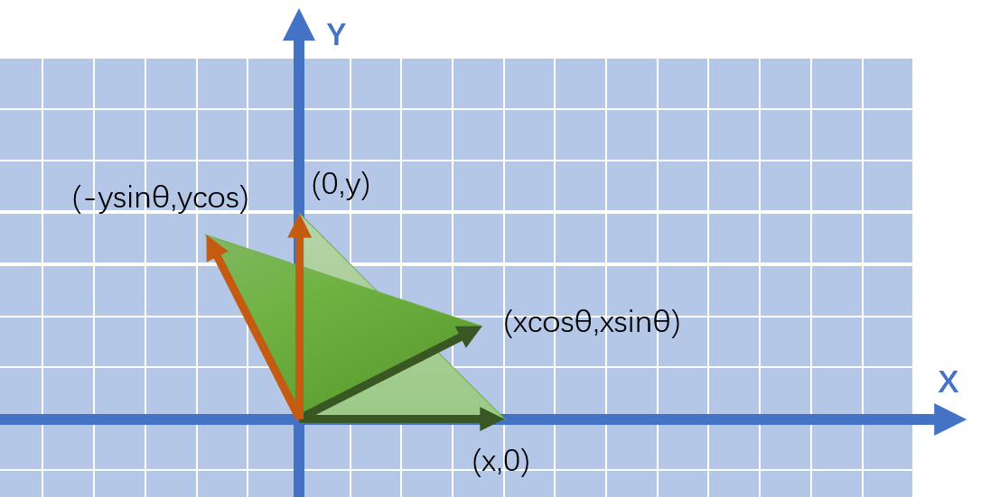

#  计算机图形学篇

> 注：计算机图形学的很多知识点在教程里有，这里针对部分问题只给出重要的答题点，具体答案就不完全整理了。

## 【1】渲染管线介绍，分为哪些阶段？

> - 应用阶段：识别出潜在可视的网格实例，并把它们及其材质呈交至图形硬件以供渲染。该阶段包含三大任务：可见性判断、控制着色器参数和渲染状态、提交图元至GPU硬件以供渲染。
>
>   - 空间加速算法、视锥剔除、碰撞检测、动画物理模拟、调用Drawcall；
>
> - 几何阶段：主要负责大部分多边形操作和顶点操作，将三维空间的数据转换为二维空间的数据，可以分为**顶点着色、投影变换、裁剪和屏幕映射阶段**。
>
> - 光栅化阶段：将图元离散化成片段的过程，其任务是找到需要绘制出的所有片段，包括**三角形设定和三角形遍历**阶段；
>
>   - a. 三角形设置(图元装配)，计算出三角形的一些重要数据(如三条边的方程、深度值等)以供三角形遍历阶段使用，这些数据同样可用于各种着色数据的插值。
>
>     b. 三角形遍历，找到哪些像素被三角形所覆盖，并对这些像素的属性值进行插值。通过判断像素的中心采样点是否被三角形覆盖来决定该像素是否要生成片段。通过三角形三个顶点的属性数据，插值得到每个像素的属性值。**此外透视校正插值也在这个阶段执行。**
>
> - 像素着色阶段：**片元着色器像素着色+合并阶段（透明测试、模板测试、深度测试，blend操作等）**


## 【2】OpenGL中的渲染管线介绍

> （注：这个问题将图形渲染管线具体到了某一个图形[API](https://zhida.zhihu.com/search?content_id=183804732&content_type=Article&match_order=1&q=API&zhida_source=entity)，因此涉及到了一些具体概念，但是大体上跟上面描述的图形渲染管线一致）
>
> 【**Reference**】：[你好，三角形 - LearnOpenGL CN (learnopengl-cn.github.io)](https://link.zhihu.com/?target=https%3A//learnopengl-cn.github.io/01 Getting started/04 Hello Triangle/)、[【OpenGL】OpenGL渲染流程详解*Zok93-CSDN博客*opengl渲染](https://link.zhihu.com/?target=https%3A//blog.csdn.net/sinat_20559947/article/details/78886440)
>
> - （1） VBO将数据存储到缓存中，VAO绑定顶点属性关系，然后VBO将缓存数据传给vertex_shader（注：还可以回顾一下IBO/EBO：存放图元对应的顶点索引）；
> - （2）在顶点着色器中进行坐标变换，由mvp矩阵将其转换到裁剪坐标系，以及顶点着色；
> - （3）然后到裁剪和屏幕映射阶段；裁剪掉视锥体外的图元，将当前坐标映射到屏幕坐标；
> - （4）三角形设置阶段（或是图元装配阶段），将顶点着色器的输出数据装配成指定图元的形状；
> - （5） 然后进入光栅化阶段，找到哪些像素被三角形覆盖，以及进行插值计算；
> - （6）然后进入到了fragment_shader，执行光照计算，进行着色；
> - （7） 最后进入到测试混合阶段，包括Alpha测试、模板测试、深度测试等，然后进行混合。


## 【3】**各种测试(缓冲)的含义，相对顺序？**

> - （1）深度测试：略
> - （2）Alpha测试：像素值一般是由[RGBA](https://zhida.zhihu.com/search?content_id=183804732&content_type=Article&match_order=1&q=RGBA&zhida_source=entity)四个分量来表示的，其中的A是alpha，表示的是物体的不透明度。1代表完全不透明，0代表完全透明。可选的 alpha 测试可在深度测试执行前在传入片段上运行。片段的 alpha 值与参考值作某些特定的测试（如等于，大于等），如果片段未能通过测试，它将不再进行进一步的处理。 alpha 测试经常用于不影响深度缓存的全透明片段的处理。简单来说，就是根据物体的透明度来决定是否渲染。
> - （3）模板测试：模板缓冲是用于记录所呈现图元位置的离屏缓存。如果使用了模板缓冲，就相当于在屏幕上有一块模板盖在上面，只有位于这个模板中的图元片段，才会被渲染出来。模板测试就是用片段指定的参考值与模板缓冲中的模板值进行比较，如果达到预设的比较结果，模板测试就通过了，然后用这个参考值更新模板缓冲中的模板值；如果没有达到预设的比较结果，就是没有通过测试，就不更新模板缓冲。简单来说，就是根据物体的位置范围决定是否渲染。
> - （4）裁剪测试（**没用过，可以不主动提这个**）：在裁剪测试中，允许程序员开设一个裁剪框，只有在裁剪框内的片元才会被显示出来，在裁剪框外的片元皆被剔除。裁切测试可以避免当视口比屏幕窗口小时造成的渲染浪费问题。通常情况下，我们会让视口的大小和屏幕空间一样大，此时可以不需要使用到裁切测试。但当两者大小不一样大时，我们需要用到裁切测试来避免其产生的一些问题。如下图所示：
> - 
>
> 图中的绿色方框表示视口范围，大的黑色方框表示屏幕范围，当视口小于屏幕的时候，如果不用裁剪测试，则会将视口范围外的背景白色也绘制出来，导致渲染浪费，结果也不正确。

**各种测试的相对顺序：裁剪->Alpha->模板->深度**。主要记住**Alpha->模板->深度测试这个顺序**。


## 【4】各种反走样技术的问题

> 具法的细节在图形学教程中有所整理。这里只给出大致算法。包含MSAA，SSAA，FXAA，TAA，SMAA，还可以提一下Nvidia的超分辨率DLSS系列全家桶。

1. **SSAA（超采样抗锯齿）**  
   - **原理**：以高于目标分辨率渲染场景，通过平均相邻像素颜色下采样。  
   - **特点**：效果最优，但计算开销极高（像素数平方级增长）。
2. **MSAA（多重采样抗锯齿）**  
   - **原理**：仅在几何边缘处对单个像素内多个子样本采样，混合结果。  
   - **特点**：降低SSAA计算量，硬件广泛支持（如GPU光栅化阶段优化）。
3. **FXAA（快速近似抗锯齿）**  
   - **原理**：后处理阶段通过图像空间算法检测高频边缘并模糊，不依赖几何信息。  
   - **特点**：速度快，但易导致细节模糊（基于亮度梯度检测）。
4. **SMAA（子像素形态抗锯齿）**  
   - **原理**：结合边缘检测（类似FXAA）+ 形态学分析 + 子像素信息重建边缘。  
   - **特点**：比FXAA更精确保留细节，代价略高（分模式：SMAA 1x/2x/4x）。
5. **TAA（时间抗锯齿）**  
   - **原理**：利用历史帧数据，通过运动向量对齐像素，时域累积减少当前帧锯齿。  
   - **特点**：高效且兼容动态光影，但需处理重投影鬼影（如Clip历史/Neighbor Clamp）。

**核心区别**：SSAA/MSAA基于几何采样，FXAA/SMAA为后处理，TAA利用时间连贯性。


### （1）TAA的其他细节

可以参考文章：[主流抗锯齿方案详解（二）TAA - 知乎](https://zhuanlan.zhihu.com/p/425233743)

- 使用Halton低差异序列，实现jitter抖动；要对采样点进行偏移，只需要将偏移的XY分量分别写入到投影矩阵的[2, 0] 和 [2, 1]即可。
- **TAA在图形管线中的位置**：如果使用 HDR 颜色作为输入，得到的抗锯齿效果不佳。所以需要把 TAA 放到 Tonemapping 之后。但是这样又会影响后续需要 HDR 的 Bloom 等特效的计算。**因此我们需要先进行一次 Tonemapping，进行 TAA 后再将 Tonemapping 还原，然后处理需要 HDR 颜色输入的后处理，最终再进行一次 Tonemapping 计算。**

具体可以看下图：


- 对于静态场景和静态镜头的TAA，直接使用当前帧的结果和上一帧得到的历史结果做混合。混合的方式，就是简单地使用百分比混合，即将历史帧数据，和当前帧数据进行 lerp。代码如下：

```
float3 currColor = currBuffer.Load(pos);
float3 historyColor = historyBuffer.Load(pos);
return lerp(historyColor, currColor, 0.05f);
```


**重投影**

考虑镜头的移动。镜头移动后，原来投射到某个像素上的物体，现在很可能不在原来的位置上了。假设物体是不动的，我们就可以使用当前帧的深度信息，反算出世界坐标，使用上一帧的投影矩阵，在混合计算时做一次重投影 **Reprojection/重投影**。

- 重投影只能适用于静态的物体，如果物体是移动的，我们就无法精确还原物体上一帧的投影位置了。


**动态物体——Motion Vector**

物体本身的移动比较复杂，再加上摄影机本身的移动，直接在混合时进行计算的话，计算起来非常困难。为了能够精确地记录物体在屏幕空间中的移动，我们使用 **Motion Vector** 贴图来记录物体在屏幕空间中的变化距离，**表示当前帧和上一帧中，物体在屏幕空间投影坐标的变化值。**因为 Motion Vector 的精度要求比较高，因此用RG16格式来存储。**Motion Vector 可以作为延迟渲染的 GBuffer 的一部分，除了用了实现 TAA，还可以实现移动模糊/Motion Blur 等效果。**

在渲染物体时，我们需要用到**上一帧的投影矩阵和上一帧该物体的位置信息，这样可以得到当前帧和上一帧的位置差，并写入到 Motion Vector**。对于带蒙皮动画的物体，我们同时需要上一帧的骨骼的位置，来计算处上一帧中投影到的位置。**计算上一帧位置和当前帧位置的方法是一样的，都是从 VS 中输出裁剪空间的齐次坐标，在 PS 中读取，然后就可以做差求得 Motion 值。**为了使 Motion 的值比较精确，我们在计算 Motion 时，**不会**添加抖动。

接下来就是使用 Motion Vector 进行混合计算了，我们需要使用 Motion Vector 算出上一帧物体在屏幕空间中投射的坐标。在计算之前，我们先要移除当前像素采样的抖动偏移值，然后减去采样 Motion Vector 得到的 Motion 值，就可以算出上一帧中投影坐标的位置。然后就可以根据位置对历史数据进行采样了，因为我们得到的坐标往往不是正好在像素中心位置，因此这里使用双线性插值进行采样。

```
// 减去抖动坐标值，得到当前实际的像素中心UV值
uv -= _Jitter;
// 减去Motion值，算出上帧的投影坐标
float2 uvLast = uv - motionVectorBuffer.Sample(point, uv);
//使用双线性模式采样
float3 historyColor = historyBuffer.Sample(linear, uvLast);
```


**对历史结果进行处理**

由于像素抖动，模型变化，渲染光照变化导致渲染结果发生变化时，会导致历史帧得到的像素值失效，就会产生 **鬼影/ghosting** 和 **闪烁 /flicking** 问题。常见的解决方案有：

- 重投影容错：

  - 检测历史帧与当前帧颜色差异（过大则判定为遮挡/运动突变）。

  - 动态区域降低历史帧权重（如权重0.2历史+0.8当前）。

    - 比如，当物体的 Motion Vector 值比较大时，就增大 blendFactor 的值，反之则减小：

    - ```
      // 与上帧相比移动距离越远，就越倾向于使用当前的像素的值
      blendFactor = saturate(0.05 + length(motion) * 100);
      return lerp(historyColor, currColor, blendFactor);
      ```

- **Clipping（颜色钳位）**：限制历史帧颜色在合理范围内，避免拖影（Clip至当前帧邻域颜色极值）。


## 【5】在渲染中，透明物体的深度测试和深度写入


## 【6】介绍一下骨骼和蒙皮技术（※）

更为具体的可以参考《游戏引擎架构》动画章节以及`\PrepareForWorkNotes\计算机图形学\图形学教程\在渲染器中引入动画系统.md`

> **骨骼动画与蒙皮技术底层原理（这里以右手系，矩阵列优先为例，意味着矩阵乘法为Ax）：**
>
> 1. **骨骼动画**  
>
>    - **层级变换**：骨骼以树状结构组织，每块骨骼对应局部变换矩阵（平移、旋转、缩放）（在关节空间，相对于父骨骼的变换，此变换矩阵可以从子关节空间转换到父关节空间）。父骨骼变换驱动子骨骼运动，通过矩阵级联（`父矩阵 × 子矩阵`）计算全局变换（**由关节空间转换到模型空间**）。  
>    - **动画数据**：动画序列存储骨骼随时间变化的关节空间局部变换矩阵，运行时实时计算全局变换。
>
> 2. **蒙皮技术**  
>
>    - **绑定姿势**：模型初始姿态下，骨骼的全局变换矩阵（绑定矩阵）的逆矩阵（`Inverse Bind Matrix`），用于将顶点从**模型空间转换到骨骼局部空间。**
>
>    - **顶点混合**：每个顶点绑定至多个骨骼，权重分配影响强度。最终位置通过线性混合（LBS）计算，该混合是最后在模型空间做混合：  
>
>      �final=∑(��⋅GlobalMatrix�⋅InverseBindMatrix�)⋅�original
>
>    - **GPU计算**：蒙皮着色器读取骨骼矩阵、权重及索引，实时混合顶点位置，实现动态变形。
>
> **核心要点**：骨骼驱动层级变换，蒙皮通过权重混合多骨骼影响，绑定矩阵实现空间转换，LBS为变形核心算法。


## 【7】介绍一下IK（※）

推荐看一下这个视频：https://www.bilibili.com/video/BV1rQ1xYAEtD

> **IK（反向动力学）**：通过指定末端效应器（如手、脚）的目标位置，逆向计算关节链中各关节的旋转，以实现末端精准定位。
>
> ------
>
> **常见IK算法及思路**：  
>
> 1. **CCD（循环坐标下降法）**：  
>    - 从末端向根节点迭代，逐关节调整旋转角度，使末端逐步逼近目标位置。每次调整仅优化当前关节，重复直到收敛。  
>    - 可以参考：[CCD IK（循环坐标下降逆动态学）-CSDN博客](https://blog.csdn.net/f980511/article/details/123316988)
> 2. **FABRIK（前后向到达逆运动学）**：  
>    - **前向传递**：从末端到目标反向移动各关节，保持长度；  
>    - **后向传递**：从根节点到末端重新对齐关节链，恢复原始长度。  
>    - 可以参考：[IK算法之Fabrik - Busyo's Blog](https://busyogg.github.io/article/5795c3870390/)，一点补充：可以提前判断骨骼链是否能到达target，比如如果骨骼链的总长度小于到target的距离，则直接判断不可达。
> 3. **雅可比矩阵法**：  
>    - 构建雅可比矩阵（末端速度与关节角速度的关系），通过伪逆或优化迭代调整关节角度，驱动末端向目标移动。  
> 4. **解析解（几何法）**：  
>    - 针对简单结构（如2关节链）直接通过三角函数或几何关系计算角度。  比如[Two Bone IK - 知乎](https://zhuanlan.zhihu.com/p/447895503)
>
> ------
>
> **应用阶段**：  
>
> - **运行时实时计算**：如游戏角色抓取/踏地时实时解算；  
> - **离线预处理**：动画制作中预先生成自然关节姿态；  
> - **动画后处理**：在FK基础上叠加IK微调（如保持脚部固定，比如《原神》中是有FK基础上调整IK的过程的）。  
>
> **核心价值**：以目标驱动姿态，提升动画自然度与交互性。


## 【8】介绍一下Early-Z和Z-prepass


## 【9】如何判断点在多边形内？


## 分专题 - 对应教程

------------------

### 【1】光栅化

#### 【1.1】判断点在三角形内

##### 1、重心坐标法判断- 光栅化

因此只有当三角形的三个重心坐标都>0时才认为是在三角形内（这里暂时不过多考虑边界情况，比如=0之类的）。

因此,我们只需要计算出点P的重心坐标,就可以判断这一点是否在三角形内,从而决定是否为其着色。

光栅化的时候需要判断

##### （3） 重心坐标计算公式

使$w=1-u-v$

则$P=w*A+u*B+v*C = (1-u-v)*A+u*B+v*C$

展开

$P = A-u*A-v*A+u*B+v*C $

$P = A+u*(B-A)+v*(C-A)$

$P = A+u*\overrightarrow{AB}+v*\overrightarrow{AC}$

$u*\overrightarrow{AB}+v*\overrightarrow{AC}+\overrightarrow{PA} = \overrightarrow{0}$

由此，可以推出以下两个方程：


$$
\begin{bmatrix} u \\ v \\ 1 \end{bmatrix} \begin{bmatrix} \overrightarrow{AB}_x & \overrightarrow{AC}_x & \overrightarrow{PA}_x \end{bmatrix} = 0
$$


$$
\begin{bmatrix} u \\ v \\ 1 \end{bmatrix} \begin{bmatrix} \overrightarrow{AB}_y & \overrightarrow{AC}_y & \overrightarrow{PA}_y \end{bmatrix} = 0
$$

因此$\begin{bmatrix} u & v & 1 \end{bmatrix} $与$\begin{bmatrix} \overrightarrow{AB}_x & \overrightarrow{AC}_x & \overrightarrow{PA}_x \end{bmatrix} $和$\begin{bmatrix} \overrightarrow{AB}_y & \overrightarrow{AC}_y & \overrightarrow{PA}_y \end{bmatrix} $都垂直，

>在三维几何中，向量a和向量b的叉乘结果是一个向量，该向量垂直于a和b向量构成的平面。
>
>$\overrightarrow{a} \times \overrightarrow{b} =  \overrightarrow{n}$
>
>则 $ \overrightarrow{n}$与 $ \overrightarrow{a}$垂直， $ \overrightarrow{n}$与 $ \overrightarrow{b}$垂直，
>
>反之亦然，如果 $ \overrightarrow{n}$与 $ \overrightarrow{a}$垂直， $ \overrightarrow{n}$与 $ \overrightarrow{b}$垂直，
>
>则$\overrightarrow{a} \times \overrightarrow{b} =  \overrightarrow{n}$

不难看出，实际上重心坐标就等于$(\overrightarrow{AB}_x, \overrightarrow{AC}_x, \overrightarrow{PA}_x)$和$(\overrightarrow{AB}_y, \overrightarrow{AC}_y, \overrightarrow{PA}_y)$的叉乘结果（当然要归一化z到1）。
$$
\begin{bmatrix} u & v & 1 \end{bmatrix} =(\overrightarrow{AB}_x, \overrightarrow{AC}_x, \overrightarrow{PA}_x) \times (\overrightarrow{AB}_y, \overrightarrow{AC}_y, \overrightarrow{PA}_y)
$$

$$
(\overrightarrow{AB}_x, \overrightarrow{AC}_x, \overrightarrow{PA}_x) \times (\overrightarrow{AB}_y, \overrightarrow{AC}_y, \overrightarrow{PA}_y) = \\
\begin{vmatrix}i&j&k\\\overrightarrow{AB}_x&\overrightarrow{AC}_x&\overrightarrow{PA}_x\\\overrightarrow{AB}_y&\overrightarrow{AC}_y&\overrightarrow{PA}_y
\end{vmatrix} \\
$$


$$
[(\overrightarrow{AC}_x\cdot \overrightarrow{PA}_y)-(\overrightarrow{AC}_y\cdot \overrightarrow{PA}_x)]\overrightarrow{i} \\
-[(\overrightarrow{AB}_x\cdot \overrightarrow{PA}_y)-(\overrightarrow{AB}_y\cdot \overrightarrow{PA}_x)]\overrightarrow{j} \\
+[(\overrightarrow{AB}_x\cdot \overrightarrow{AC}_y)-(\overrightarrow{AB}_y\cdot \overrightarrow{AC}_x)]\overrightarrow{k}
$$


至此,我们发现,当我们只知道A,B,C和P的坐标,就顺利算出P的重心坐标$\begin{bmatrix} 1-u-v,u , v \end{bmatrix} $,通过判断u,v是否>0,我们就可以判断P是否在三角形内.

判断点是否在三角形内：

- 如果$u > 0$、$v > 0$且$w > 0$，则点P在三角形ABC内部。
- 如果$u = 0$、$v = 0$或$w = 0$，则点P在三角形的边上。
- 如果$u < 0$、$v < 0$或$w < 0$，则点P在三角形外部。


实际上，判断点在三角形内部还有很多别的做法，而我们之所以选择重心坐标法，是因为在后续渲染流程中，我们需要拿到重心坐标的信息，来对点进行属性的插值。例如，我们知道ABC三点的颜色，却不知道点P的颜色，这时候，使用重心坐标就可以插值算出点P的颜色了：（同理，后面的很多值，如深度，法线信息，纹理坐标等等都需要借助重心坐标来计算）。

例如：已知$A,B,C$的颜色   $Color_A, Color_B, Color_C$ ，求$P$的颜色  $Color_P $

则  $Color_P=w*Color_A+u*Color_B+v*Color_C $


##### 2、叉乘法

https://blog.csdn.net/dracularking/article/details/2217180

https://www.cnblogs.com/graphics/archive/2010/08/05/1793393.html

https://blog.csdn.net/weixin_44120025/article/details/123830197


逆时针 正的


### 【2】空间变换

#### 【2.1】旋转矩阵 点围绕着X/Y/Z轴旋转,矩阵是啥样的

因此我们得到绕着**z轴**旋转的旋转矩阵为：
$$
\begin{bmatrix}cos\theta&-sin\theta&0\\sin\theta&cos\theta&0\\0&0&1\end{bmatrix}
$$


>
>
>## （1）旋转矩阵
>
>如果此时我们需要让第一节课的三角形围绕着某个轴旋转，我们需要将其左乘一个旋转矩阵。
>
>#### 围绕Z轴旋转
>
>根据右手法则，$\overrightarrow{X} \times \overrightarrow{Y} = \overrightarrow{Z} $
>
>
>
>假设旋转矩阵为：
>$$
>\begin{bmatrix}a&b&0\\c&d&0\\0&0&1\end{bmatrix}
>$$
>旋转后的点可以由原来的点左乘旋转矩阵得到：
>$$
>\begin{bmatrix}X\\Y\\Z\end{bmatrix}=\begin{bmatrix}a&b&0\\c&d&0\\0&0&1\end{bmatrix}\begin{bmatrix}x\\y\\z\end{bmatrix}
>$$
>
>我们假设以下这个情景，有一个三角形围绕着Z轴旋转（旋转的角度是$\theta$度），如下图从浅绿色三角形转到深绿色三角形。
>
>
>
>三角形中的点$(x,0,0)$旋转后成为点$(xcos\theta,xsin\theta,0)$
>$$
>\begin{bmatrix}
>xcos\theta\\xsin\theta\\0
>\end{bmatrix}=
>\begin{bmatrix}
>i&j&0\\k&l&0\\0&0&1
>\end{bmatrix}
>\begin{bmatrix}
>x\\0\\0
>\end{bmatrix}
>$$
>
>$$
>\begin{numcases}{}
>x*cos\theta = x*i \\
>x*sin\theta = x*k  \\
>\end{numcases}
>$$
>
>$$
>\begin{numcases}{}
>i= cos\theta \\
>k= sin\theta
>\end{numcases}
>$$
>
>
>
>三角形中的顶点$(0,y,0)$旋转后成为点$(-ysin\theta,ycos\theta,0)$
>$$
>\begin{bmatrix}-ysin\theta\\ycos\theta\\0\end{bmatrix}=\begin{bmatrix}i&j&0\\k&l&0\\0&0&1\end{bmatrix}\begin{bmatrix}0\\y\\0\end{bmatrix}
>$$
>
>$$
>\begin{numcases}{}
>-y*sin\theta = y*j \\
>y*cos\theta = y*l  \\
>\end{numcases}
>$$
>
>$$
>\begin{numcases}{}
>j= -sin\theta  \\
>l= cos\theta
>\end{numcases}
>$$
>
>因此我们得到绕着z轴旋转的旋转矩阵为：
>$$
>\begin{bmatrix}cos\theta&-sin\theta&0\\sin\theta&cos\theta&0\\0&0&1\end{bmatrix}
>$$
>
>#### 围绕X轴旋转
>
>根据右手法则，$\overrightarrow{Y} \times \overrightarrow{Z} = \overrightarrow{X} $
>
>
>
>参考上面的围绕Z轴旋转的旋转矩阵不难想出，如果是绕着x轴旋转，则
>$$
>\begin{bmatrix}Y\\Z\end{bmatrix}=
>\begin{bmatrix}
>	cos\theta&-sin\theta\\
>	sin\theta&cos\theta
>\end{bmatrix}
>\begin{bmatrix}y\\z\end{bmatrix}
>$$
>
>因此我们得到绕着x轴旋转的旋转矩阵为：
>
>$$
>\begin{bmatrix}X\\Y\\Z\end{bmatrix}=
>\begin{bmatrix}
>	1&0&0\\
>	0&cos\theta&-sin\theta\\
>	0&sin\theta&cos\theta
>\end{bmatrix}
>\begin{bmatrix}x\\y\\z\end{bmatrix}
>$$
>
>#### 围绕Y轴旋转
>
>
>
>如果是绕着y旋转，
>
>根据右手法则，$\overrightarrow{Z} \times \overrightarrow{X} = \overrightarrow{Y} $
>
>则
>
>
>$$
>\begin{bmatrix}Z\\X\end{bmatrix}=
>\begin{bmatrix}
>	cos\theta&-sin\theta\\
>	sin\theta&cos\theta
>\end{bmatrix}
>\begin{bmatrix}z\\x\end{bmatrix}
>$$
>但是我们在旋转矩阵中，**z向x旋转 $\theta$ 角度 等价于x向z旋转 $-\theta$ 角度**
>
>因此
>$$
>\begin{bmatrix}X\\Z\end{bmatrix}=
>\begin{bmatrix}
>	cos(-\theta)&-sin(-\theta)\\
>	sin(-\theta)&cos(-\theta)
>\end{bmatrix}
>\begin{bmatrix}X\\Z\end{bmatrix}
>$$
>
>$$
>\begin{bmatrix}X\\Z\end{bmatrix}=
>\begin{bmatrix}
>	cos\theta&sin\theta\\
>	-sin\theta&cos\theta
>\end{bmatrix}
>\begin{bmatrix}X\\Z\end{bmatrix}
>$$
>
>因此我们得到绕着y轴旋转的旋转矩阵为：
>$$
>\begin{bmatrix}X\\Y\\Z\end{bmatrix}=
>\begin{bmatrix}
>	cos\theta&0&sin\theta\\
>	0&1&0\\
>	-sin\theta&0&cos\theta
>\end{bmatrix}
>\begin{bmatrix}x\\y\\z\end{bmatrix}
>$$
>
>
>
>实践代码如下：


#### 【2.2】缩放，平移，绕任意轴旋转

#### 【2.3】空间变换过程

在图形学的管线中，需要经过**模型空间->世界空间->相机空间->裁剪空间->屏幕空间的过程**

【】

因此，$M_{m->w}$就变成了
$$
\begin{bmatrix}
|&|&|&|\\
\mathbf{x}_m&\mathbf{y}_m&\mathbf{z}_m&O_{m}\\
|&|&|&|\\
0&0&0&1
\end{bmatrix}
$$
我们惊喜地发现，将模型空间的三个坐标轴加上原点竖着放，就可以表示模型空间转到世界空间的矩阵了。


B空间转A空间的矩阵为：
$$
M_{b->a}=M_{a->b}^{-1}=M_{a->b}^{T}=
\begin{bmatrix}
|&|&|\\
\mathbf{x}_a&\mathbf{y}_a&\mathbf{z}_a\\
|&|&|
\end{bmatrix}^{T}
=
\begin{bmatrix}
-&\mathbf{x}_a&-\\
-&\mathbf{y}_a&-\\
-&\mathbf{z}_a&-
\end{bmatrix}
$$
【重心插值矫正】

### 【4】深度测试、深度缓冲与深度图

#### 【4.1】线性深度与非线性深度

靠近近平面的深度的取值占据了大部分的取值范围。也就是说，距离相机越近的物体，给予的存储深度的信息越多，显示质量更高；距离相机越远的物体，深度信息被压缩得越强，深度信息越少。例如：0-0.9的精度都用来存储-4到-20左右的物体的深度信息，而其他的远的物体本身相对于近的物体来说也看不清楚，并不需要那么多的精度来存储其信息。

最终人们选择了非线性的深度来进行计算，也就是将NDC空间的z值映射到0-1之间作为深度。


### 【5】透明物体的渲染

#### 【5.1】5.4  渲染顺序

因此，我们需要先渲染不透明物体，然后再渲染半透明物体，半透明是从远到近进行渲染。为了提升性能，不透明物体可以采用从近到远渲染。


可以使用像素级别的排序，如使用order-independent transparency(OIT,顺序无关的半透明渲染）技术. 使用OIT就可以实现正确的半透明穿插渲染效果:


### 【6】 纹理映射基础

### 【7】渲染管线

#### 【高频 7.1】介绍一下渲染管线


#### 【7.2】渲染 状态

​	什么是渲染状态？渲染状态就是定义场景中的模型网格是如何被渲染的，包括纹理绑定，光源，材质，是否开启深度测试，透明度混合（alpha blend）选项，使用何种顶点着色器（7.3.1），片元着色器（7.5.1）等。既然我们可以进行设置，说明这是GPU管线内可以配置的参数。

​	下图三个网格使用了一样的渲染状态，因此三个网格看起来像是有了一样的材质。


#### 【7.3】Draw Call

CPU会调用图像编程接口，例如OpenGL中`glDrawElements()`命令或者DirectX中的`DrawIndexedPrimitive()`命令将几何图元传递给GPU，来命令GPU执行渲染操作，这个**CPU对GPU的渲染命令**，我们称为**Draw Call**。

如何优化Draw Call

​	提交Draw Call“，重复这个步骤一万次，CPU提交Draw Call的速度相对较慢，GPU会一直处于渲染完上一个三角形，等待CPU提交下一个Draw Call的阶段。

​	假设这一万个网格模型都是使用的一样的材质，贴图等，即拥有一样的渲染状态，那么，我们是不是可以只设置一次渲染状态呢？是的，并且我们还可以通过**批处理(batching)**操作来优化这个过程，即我们在CPU的内存中将这些相同的网格模型合并模型（合并网格），这样一来，我们只需更改一次渲染状态，然后提交一次Draw Call就可以了，这样可以将性能大大提升。


### 【8】基础光照

#### 【8.1】 写一下 漫反射 Phong模型 Blinn-Phong模型

**漫反射**

可以得到漫反射项（**又叫做Lambert项**）的数学表达：
$$
L_d = k_d(I/r^2)max(0, \vec{n} · \vec{l})
$$
​	逐项解释一下这个公式，$k_d$和之前的环境光项类似，是漫反射系数。类似的理解，表面呈现$k_d$的颜色是因为其反射了$k_d$颜色的光，因此$k_d$可以简单表示为表面的颜色。$I$指的是光源的光强度（注意，这里我们认为是**点光源**），而$I/r^2$则是点光源发出的光到达物体表面“衰减”之后的结果（实际上，这里的“衰减”并不是那么严谨，不过方便理解，点光源发出的光传播地越远，到达表面应该就越弱一些，就以“衰减”先这样理解也没什么问题）

高光

**Phong模型**

​	为了解决高光程度的问题，认为引入了一个新的glossiness项，即高光项$\alpha$，修改之后的Phong光照模型如下：

$\vec{r}$是反射出来的光线
$$
L_s = k_s (I/r^2) max(0, \vec{v}·\vec{r})^\alpha
$$
**Blinn-Phong模型**

我们先来介绍公式。其实和Phong的镜面光项基本是一样的：
$$
L_s = k_s (I/r^2) max(0, \vec{n}·\vec{h})^\alpha
$$
​	这里的$k_s$，$I$，$\vec{n}$，$\alpha$的定义都不变，但区别在于在Phong镜面光项中，我们计算的点乘是$\vec{v}·\vec{r}$，而Blinn-Phong的镜面反射项则是$\vec{n}·\vec{h}$。这里的$\vec{h}$是什么呢？

> $\vec{h}$被称之为半程向量，其计算公式如下（这里的字母都是向量，省略向量符号）：
> $$
> \vec{h} = \frac{v+l}{||v+l||}
> $$
> 其中，$||v+l||$指的是这两个向量相加之后的向量的模，实际上就是对$v+l$向量的归一化。得到的结果就是上图的白色向量（Half Vector）。


综合的Blinn-Phong光照模型

​	综合上文所述的内容，可以得到如下的数学公式：
$$
L = 
L_a + L_d + L_s = k_aI_a + k_d(I/r^2)max(0, \vec{n} · \vec{l}) +  k_s (I/r^2) max(0, \vec{n}·\vec{h})^\alpha
$$
​	这就是大名鼎鼎的Blinn-Phong光照经验模型了，主要包含环境光，漫反射项和镜面反射项。将以上三部分实现在渲染器中，并相加到一起，可以得到下图的结果：

### 【9】特殊纹理 法线贴图

#### 【9.1】法线贴图为什么基本是蓝色的

##### （1）切线空间

​	在法线贴图中，切线空间（Tangent Space）指的是一个局部坐标空间，它与每个表面上的顶点相关联。切线空间由三个基向量组成：切线向量（Tangent），副切线向量（Bitangent 或 Binormal），和法线向量（Normal）。这三个向量通常被用来描述表面的局部几何属性。我们不妨先来想想类似上图，把模型空间或者世界空间下的法线烘焙成贴图的**坏处**是什么，有几个常见的劣势：

- （1）假设我们有一个正方体，雕刻了这个正方体的上面的细节，并把模型空间下的法线烘焙成了贴图，那么这张法线贴图就很难有复用性，我们没办法把它直接用在一个球体上；
- （2）上侧面在模型空间的法线烘焙成了法线贴图后，没办法用在前侧面。我们要存储每个面的所有法线信息。

​	其实很好理解，因为我们存储的是模型空间的法线，即**绝对法线信息**，仅可以用于创建时的那个模型，应用到其他模型上就会出问题。而即将引入的在**切线空间下的法线贴图**则记录的是**相对法线信息**，因此具备可复用性，我们马上会看到这样做的明智之处。在这之前，我们先看看切线空间的示意图：


​	对于切线空间（切线空间针对每个顶点）来说，我们**定义**：

> 切线空间的原点就是该顶点本身，切线空间的Z轴正方向是模型顶点的法线$\vec{N}$方向，而X轴正方向（上图的$\vec{T}$）是模型顶点的切线方向，而切线空间的Y轴正方向可以由叉乘得到（复习一下高数中的叉乘知识，Y轴正向向量可以由Z轴正向向量叉乘X轴正向向量得到）：

$$
B = cross(N, T)
$$

​	这个Y轴又被称为副切线方向（bitangent）。现在回归之前的问题，**为什么法线贴图是蓝色的？**这是因为，法线贴图是定义在**切线空间**当中的，假设我们完全不对法线做任何偏移，所有顶点的法线都指向本来切线空间的Z正方向，也就是（x，y，z） = (0，0，1)，由于向量每个分量的范围是[-1，1]，而颜色的RGB范围是[0，1]，因此要做一步转换，将向量编码为颜色：
$$
y = 0.5 x + 0.5
$$
​	其中$x$就是输入的向量的单个分量，$y$则是该分量输出的颜色值。带入$(x,y,z) = (0,0,1)$，得到$(R,G,B)=(0.5,0.5,1)$。来看一下这个颜色是什么：


​	破案了，这就是法线贴图的一般颜色！这也能够解释为什么法线贴图基本都是蓝色，因为我们实际上并不会对法线偏移的太过分，所以基本都是蓝色的。


#### 【9.2】法线变换矩阵推导

**变换法线的矩阵应该是普通顶点变换矩阵的转置矩阵的逆矩阵。**


#### 【9.3】TBN矩阵

##### （2）TBN矩阵的推导

​	有了上一节法线空间变换的基础知识，我们就可以真正来计算将法线从切线空间转到世界空间的矩阵了。依据前置知识，我们需要求解出**世界空间下切线空间XYZ轴的方向**，然后竖着按列放构成矩阵，再算出这个矩阵转置的逆即可。由于切线空间转到世界空间的操作并不涉及旋转以外的操作，因此**这个矩阵是正交的。**也就是说，我们只要求出世界坐标下的切线空间的三个轴的位置，并组成下面的矩阵：
$$
\begin{bmatrix}
|&|&|\\
\mathbf{T}&\mathbf{B}&\mathbf{N}\\
|&|&|
\end{bmatrix}
$$
​	其中T，B，N分别是切线空间下的切线方向，副切线方向和法线方向在世界空间中的方向。这个方向可能不太好求，但切线空间下的切线方向，副切线方向和法线方向在**模型空间**中的方向是很容易计算的，T就对应模型顶点的切线方向，N对应模型顶点的法线方向，B则可以通过叉乘来得到。接着我们就可以再通过模型转世界空间的矩阵将法线方向转到世界空间中。以下则是将法线贴图中记录的法线转换到世界空间的代码，读者可以结合前面的推导理解一下：


### 【10】阴影

#### 【10.1】 shadow map

shadow map只需要存储深度即可


#### 【10.2】 阴影痤疮


解决


### 【11】特殊纹理 立方体贴图Cubemap

 ### 【12】 光线追踪

#### 【12.1 】光线与物体求交 （与球体，三角形）

#### 2.2 光线与物体求交

我们将光线从相机中发射出来之后，接下来要做的事情是和场景内的物体求交。这里我们**先考虑三种情况：光线和球面相交、光线和普通的隐式平面相交、以及一般化一些的光线与三角形求交。**

##### 2.2.1 光线与球面相交

**(1)光线方程**

$Ray(t)=\mathbf{o}+t \mathbf{d}(0≤t<∞)\quad$

**(2)球面方程**

- 半径为R的球体的方程：

  - $x^2+y^2+z^2=R^2$

  - 也就是说，如果一个坐标点$(x，y，z)$满足上面的方程，我们就认为这个点在球面上，否则不在球面上；

- 根据上式推广，如果球心在 $C  =(cx，cy，cz)$，则球的方程为：

  - $(x-cx)^2+(y-cy)^2+(z-cz)^2=R^2$

- 再次推广，此时对于光线和球面的交点$p(t)$，有：

  - $(p(t)-C)^2-R^2=0\quad$,其中c为中心点的坐标

- 也就是说，对于光线上的点$p(t)=\mathbf{o}+t \mathbf{d}$，有$(p(t)-C)^2-R^2=0\quad$

  也就是$(\mathbf{o}+t \mathbf{d}-C)^2=R^2$ 

**将上式中的点乘展开，进行多项式展开，可以得到化简之后的式子：**

$ t^2·\vec{d}·\vec{d}+2·t·\vec{d}·\vec{(o-C)}+\vec{(o-C)}·\vec{(o-C)}-R^2=0$

可以看到，通过这个式子求解二次方程,**就可以求解出t的值**，通过t的值来判定是否相交以及相交的交点数

对于求根公式来说（这其实就是高中数学介绍的正常二次方程的求根公式），此时可以简化如下（可以令$b = \frac{1}{2}b_0$, $b_0$是初始的求根公式当中的B项）：
$$
\begin{aligned}
& \frac{-b_o \pm \sqrt{b_o^{2}-4 a c}}{2 a} \\
= & \frac{-2 b \pm \sqrt{(2 b)^{2}-4 a c}}{2 a} \\
= & \frac{-2 b \pm 2 \sqrt{b^{2}-a c}}{2 a} \\
= & \frac{-b \pm \sqrt{b^{2}-a c}}{a}
\end{aligned}
$$

我们让：
$$
a=\vec{d}·\vec{d}\\
b=\vec{d}·\vec{(o-C)}\\
c=\vec{(o-C)}·\vec{(o-C)}-R^2
$$
因此原来的式子变为:(再次注意和我们学的二次方程稍有不同，t的参数是2b而不是b)
$$
a·t^2+2·b·t+c=0
$$

得到:
$$
t = \frac{-b \pm \sqrt{b^2-ac}}{a}
$$


如果判别式$discriminant=\sqrt{b^2-ac} >0 $,说明有2个交点（这里指的是光线所在的直线，交点有可能在direction的后方），$discriminant=\sqrt{b^2-ac} <0 $说明无交点。但在光线追踪中，$t>0$我们才认为是有效的交点值。如下图：


##### 2.2.2 光线与**隐式平面求交**

联立方程组:
$$
\begin{cases}
  r(t)=p=o+td(0≤t<∞)\quad① \\ 
  p:f(p)=0\quad ②
\end{cases}.
$$
也就是说,解方程$f(o+td)=0$即可.


##### 2.2.3 光线与三角形求交

###### (1)使用三角形的重心坐标判断

判断光线是否与三角形相交,可以按照下面的步骤(**注:该算法需要进行优化**):

- 1.判断光线是否与三角形所在平面相交;
- 2.判断交点是否在三角形的内部(**使用重心**)；

**1.判断光线是否与三角形所在平面相交;**

已知平面方程如下:

$ax+by+cz+d=0$

则对于平面上的点$p$,有:

- $p:(p-p')·N=0$  ($p'$是平面上一点,$N$是平面的法线方向,$\vec{N}=(a,b,c)$)


**此时我们联立光线方程与平面方程,求解二者的交点$p$**
$$
\begin{cases}  r(t)=p=o+td(0≤t<∞)\quad① \\   p:(p-p')·N=0\quad ②\end{cases}.
$$
将①代入②,有$(o+td-p')·N=0$,通过点乘的分配律求解出:$\large t=\frac{(p'-o)·N}{d·N}$(需要验证是否满足$0≤t<∞$)

接下来,只需要判断$o+td$这个点是否在三角形内部即可(使用重心坐标来判断)


**2.判断交点是否在三角形的内部(使用重心)**

我们复习一下第一节光栅化提到的重心坐标判断点是否在三角形内部的内容：

重心坐标$(w,u,v)$表示点P在三角形ABC内的位置。

（以下以二维情况为例）

对于三角形ABC内任意一点P, 存在三个数u,v,w，满足：

$u+v+w=1$

$P=w*A+u*B+v*C$

则$(w,u,v)$称为此三角形上P点的重心坐标


$$
\begin{bmatrix} u & v & 1 \end{bmatrix} =(\overrightarrow{AB}_x, \overrightarrow{AC}_x, \overrightarrow{PA}_x) \times (\overrightarrow{AB}_y, \overrightarrow{AC}_y, \overrightarrow{PA}_y)
$$

$$
(\overrightarrow{AB}_x, \overrightarrow{AC}_x, \overrightarrow{PA}_x) \times (\overrightarrow{AB}_y, \overrightarrow{AC}_y, \overrightarrow{PA}_y) = \\
\begin{vmatrix}i&j&k\\\overrightarrow{AB}_x&\overrightarrow{AC}_x&\overrightarrow{PA}_x\\\overrightarrow{AB}_y&\overrightarrow{AC}_y&\overrightarrow{PA}_y
\end{vmatrix} \\
$$


$$
[(\overrightarrow{AC}_x\cdot \overrightarrow{PA}_y)-(\overrightarrow{AC}_y\cdot \overrightarrow{PA}_x)]\overrightarrow{i} \\
-[(\overrightarrow{AB}_x\cdot \overrightarrow{PA}_y)-(\overrightarrow{AB}_y\cdot \overrightarrow{PA}_x)]\overrightarrow{j} \\
+[(\overrightarrow{AB}_x\cdot \overrightarrow{AC}_y)-(\overrightarrow{AB}_y\cdot \overrightarrow{AC}_x)]\overrightarrow{k}
$$


至此,我们发现,当我们只知道A,B,C和P的坐标,就顺利算出P的重心坐标$\begin{bmatrix} 1-u-v,u , v \end{bmatrix} $,通过判断u,v是否>0,我们就可以判断P是否在三角形内.


###### (2)补充:`Möller Trumbore Algorithm`

- 这是一种简化算法,可以立刻直接求解判断**光线与三角形**求交，而不需要先求光线与三角形交点然后再使用重心坐标判断是否在三角形内部.

该算法的推导可以参考下列博客:

[Möller-Trumbore算法-射线三角形相交算法_zhanxi1992的博客-CSDN博客](https://blog.csdn.net/zhanxi1992/article/details/109903792)

推导过程如下:

假设$P_0、P_1、P_2$是三角形的三个顶点：

> 利用重心坐标一步求解交点是否在三角形内,我们需要求解如下方程:
>
> $\vec{O}+t\vec{D}=(1-b1-b2)\vec{P_0}+b_1\vec{P_1}+b_2\vec{P_2}$
>
> (以下证明为了方便,不再标注向量符号)
>
> 将括号展开,移项可得:
>
> $O-P_0=(P_1-P_0)b_1+(P_2-P_0)b_2-tD\quad ①$
>
> 通过观察可知,$O-P_0,(P_1-P_0),(P_2-P_0)$都是已知量,因此可以将其用变量来表示:
> $$
> E_1=P_1-P_0 \\
> E_2=P_2-P_0 \\
> S=O-P_0
> $$
>
> 此时①式可化为:
>
> $S=E_1b_1+E_2b_2-tD$
>
> 将其转为矩阵乘法的表示形式,有:
> $$
> \begin{bmatrix}
> -D&E_1&E_2
> \end{bmatrix}
> \begin{bmatrix}
> t\\b_1\\b_2
> \end{bmatrix}=S
> $$
> 这个方程形如$Ax=c$,因此可以用**克拉默法则**求解出$t$的值(注意到此时的)$$\begin{bmatrix}-D&E_1&E_2\end{bmatrix}$$其实是一个$3×3$的矩阵(因为每一项是一个列向量),这里我们考虑$det\begin{bmatrix}-D&E_1&E_2\end{bmatrix}≠0$的情况.所以有:
>
> ​																						$$ \large{t=det\frac{\begin{bmatrix}S&E_1&E_2\end{bmatrix}}{\begin{bmatrix}-					D&E_1&E_2\end{bmatrix}}} \quad ②$$
>
> 关于克拉默法则的更进一步介绍,可以参考[克拉默法则 - 知乎 (zhihu.com)](https://zhuanlan.zhihu.com/p/161429987)
>
> 注意到:
> $$
> det\begin{bmatrix}
> -D&E_1&E_2
> \end{bmatrix}=det
> \begin{bmatrix}
> -D&E_1&E_2
> \end{bmatrix}^T
> $$
> **此时由向量混合积可以得出:**
>
> 分母部分:
> $$
> det\begin{bmatrix}
> -D&E_1&E_2
> \end{bmatrix}=det
> \begin{bmatrix}
> -D&E_1&E_2
> \end{bmatrix}^T=-D·(E_1×E_2)=E_1·(D×E_2)
> $$
> 令$S_1=D×E_2$
>
> 所以就可以推导出:
> $$
> det\begin{bmatrix}
> -D&E_1&E_2
> \end{bmatrix}=E_1·S_1 \quad ③
> $$
> 对于分子部分也是同理,令$S_2=S×E$
>
> 可以用类似的推导方式推导出:
> $$
> det\begin{bmatrix}
> S&E_1&E_2
> \end{bmatrix}=S_2·E_2 \quad ④
> $$
> 将③④代入②,解得:
>
> ​																					$t=\LARGE\frac{S_2·E_2}{E_1·S_1}$
>
> 同样,也是可以解出$b_1,b_2$的:
>
> ​																					$b_1=\LARGE\frac{S_1·S}{E_1·S_1}$
>
> ​																					$b_2=\LARGE\frac{S_2·D}{E_1·S_1}$
>
> 所以,我们只需要判断是否满足$t≥0,b_1≥0,b_2≥0,(1-b_1-b_2)≥0$即可判断光线是否与三角形相交.


#### 【12.4】漫反射

我们可以采用在与漫反射材质的交点处,发射非常多的光线并追踪光线; 当然发射的光线越多, 计算量越大, 速度也就越慢.  如果想要加快速度, 我们也可以牺牲一定的质量做简化, 例如随机采样一个或者几个方向作为反射方向。**在本篇的光线追踪教程中，我们每次只会打出一根光线做追踪。**

​	如何随机采样呢?实际上, 这也是有说法的, 我们应该选择在**单位球面**选取一个随机点, 长度固定为单位向量长度, 来作为随机发射的方向。

​	要得到这个反射想象，我们可以从交点出发，向法线方向走单位距离，然后随机取一个单位长度的方向，到达目标点，类似于：


然后交点向目标点连线，得到的这个方向就是我们要进行反射的方向。


#### 【12.5】镜面反射+磨砂


##### 反射


我们想要求出红色的向量（ $\vec{r}$）的公式：

$\vec{r}=\vec{v}+2*\vec{b}$

其中，已知法线方向$\vec{N}$是一个单位向量，所以我们假设向量$\vec{v}$与水平方向的夹角为θ，则$\left|\vec{b}\right |=\left|\vec{v}\right|*sin(\theta)=-\left|\vec{v}\right|*cos(90°+\theta)$

所以$\left|\vec{b}\right |=-\vec{v}·\vec{N}$（这是因为点乘的定义，读者可以回忆点乘与$\cos$之间的关系，$||\vec{N}||=1$）,又因为向量$\vec{b}$ 的方向与$\vec{N}$保持一致，所以$\vec{b}=(-\vec{v}·\vec{N})*\vec{N}$

可以推导出：

$\vec{r}=\vec{v}+2*\vec{b}=\vec{v}-2*(\vec{v}·\vec{N})*\vec{N}$


为了完成这种需求，我们可以给镜面反射反射出去的方向**加入一点点随机性, 只要在算出反射向量后**, 在其终点为球心的球内随机选取一个点作为最终的终点，如下图所示：


就好像我们在镜面反射方向上加了一些偏移（如下图），这样就能更好地实现磨砂的效果：


当然上图这个灰色空心的球越大, 金属看上去就更加模糊(fuzzy, 或者说粗糙)。所以我们这里引入一个变量来表示模糊的程度(fuzziness)(所以当fuzz=0时不会产生模糊)。如果fuzz, 也就是随机球的半径很大, 光线可能会散射到物体内部去。这时候我们可以认为物体吸收了光线。


#### 【12.6】折射

##### 1 Schlick公式计算反射率（有多少光线反射？有多少光线折射？

Schlick公式计算的是反射率（有多少光线反射？有多少光线折射？

Schlick 反射率函数如下：
$$
F_{\text {Schlick }}\left(n, v, F_{0}\right)=F_{0}+\left(1-F_{0}\right)(1-(n \cdot v))^{5}
$$
其中的基础反射率F0与介质的折射率有关，公式计算如下：
$$
F_{0}=\left(\frac{\eta_{1}-\eta_{2}}{\eta_{1}+\eta_{2}}\right)^{2}=\left(\frac{\eta-1}{\eta+1}\right)^{2}
$$
下面展示了用使用schlick近似方法+前面推导的折射方向来实现折射：

##### 2 计算折射方向

**需要注意的是，上述式子在根号内的值大于等于0时才成立。**

当$\eta_1\leq\eta_2$ 时，根号内始终大于等于0。

当$\eta_1>\eta_2$ 时，则在特定入射角度(超过临界角)会发生全内反射的现象。此时折射分量为0.

$$
r=\begin{cases}\:\frac{\eta_1}{\eta_2}i-(\frac{\eta_1}{\eta_2}(i\cdot n)+\sqrt{1-(\frac{\eta_1}{\eta_2})^2(1-(i\cdot n)^2)})n&\text{if}\:1-(\frac{\eta_1}{\eta_2})^2(1-(i\cdot n)^2)\geq0\\\:0&\text{if}\:1-(\frac{\eta_1}{\eta_2})^2(1-(i\cdot n)^2)<0\end{cases}
$$


由此,我们就可以求出不出现全反射情况下的**折射方向$r$**。

但是，如图上蓝色线所示，当$\eta_1>\eta_2$ 时，在特定入射角度(超过临界角)会发生全内反射的现象。此时折射分量为0，那么我们也需要表现出这个全反射的情况。


#### 【12.7】 2.4.1 单位圆盘内随机生成一点
