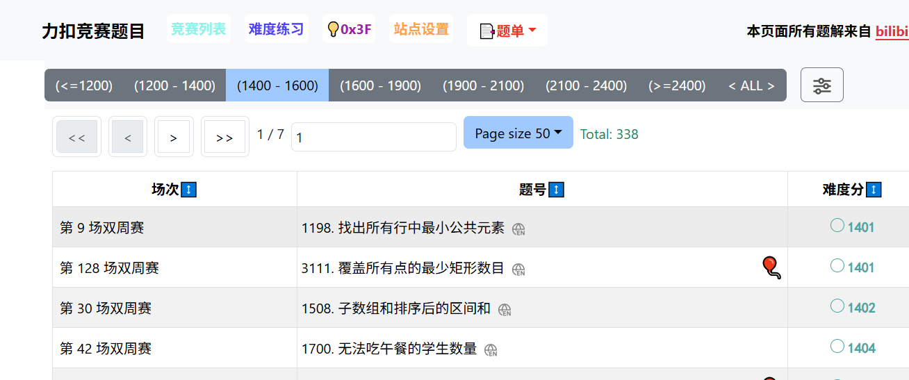

## 每日一题

注：周赛分数榜单：[LC-Rating & Training](https://huxulm.github.io/lc-rating/zen)

## 1.[781. 森林中的兔子](https://leetcode.cn/problems/rabbits-in-forest/)

> 森林中有未知数量的兔子。提问其中若干只兔子 **"还有多少只兔子与你（指被提问的兔子）颜色相同?"** ，将答案收集到一个整数数组 `answers` 中，其中 `answers[i]` 是第 `i` 只兔子的回答。
>
> 给你数组 `answers` ，返回森林中兔子的最少数量。

算是一道数学题，带有逻辑推理的性质。具体的题解可以看这篇：[781. 森林中的兔子 - 力扣（LeetCode）](https://leetcode.cn/problems/rabbits-in-forest/solutions/3636906/luo-ji-tui-li-ti-pythonjavaccgojsrust-by-kix7/?envType=daily-question&envId=2025-04-20)

代码如下：

```c++
class Solution {
public:
    int numRabbits(vector<int>& answers) {
        //哈希,每个数及其个数,假设key为10的数有15个,说明有15个兔子(value)说跟自己相同的有10个(key),数量应该是11*(15/11)的向上取整(我们可以相信11个兔子的答案,另外4个兔子得另辟一组了，一组至少是11（10个和自己相等，需要11只兔子）),累加到答案上,其他应该也是类似的
        unordered_map<int, int> umap;
        for(int ans: answers)
        {
            umap[ans]++;
        }
        int res = 0;
        for(auto& [k,v]: umap) //k表示有几只跟自己一样,v表示同一个k的有几只兔子
        {
            res += (v + k) / (k + 1) * (k + 1) ; //向上取整，其实是（v/（k+1））向上取整，乘（k+1），跟上面举例的结果是一致的。
        }
        return res;
    }
};
```


## 刷题内容



## 2.（难度分——1401）[3111. 覆盖所有点的最少矩形数目](https://leetcode.cn/problems/minimum-rectangles-to-cover-points/)

> 给你一个二维整数数组 `point` ，其中 `points[i] = [xi, yi]` 表示二维平面内的一个点。同时给你一个整数 `w` 。你需要用矩形 **覆盖所有** 点。
>
> 每个矩形的左下角在某个点 `(x1, 0)` 处，且右上角在某个点 `(x2, y2)` 处，其中 `x1 <= x2` 且 `y2 >= 0` ，同时对于每个矩形都 **必须** 满足 `x2 - x1 <= w` 。
>
> 如果一个点在矩形内或者在边上，我们说这个点被矩形覆盖了。
>
> 请你在确保每个点都 **至少** 被一个矩形覆盖的前提下，**最少** 需要多少个矩形。
>
> **注意：**一个点可以被多个矩形覆盖。

我的做法：正常贪心即可，毕竟矩形可以是无限高的。
```c++
class Solution {
public:
    static bool compare(vector<int>& p1, vector<int>& p2)
    {
        return p1[0] < p2[0];
    }
    int minRectanglesToCoverPoints(vector<vector<int>>& points, int w) {
        //按照x轴排序,范围内的一定可以覆盖到(毕竟矩形的高度没有做任何限制,所以y轴根本不需要担心),每次是当前值+w, 没值就继续,类似于分组循环的做法
        sort(points.begin(), points.end(), compare);
        int ans = 0;
        int i = 0;
        int n = points.size();
        while(i<n)
        {
            int target = points[i][0] + w;
            ans++;
            while(i<n && points[i][0]<=target)
            {
                i++;
            }
            //i==n或者points[i].x>target,进入下一组
        }
        return ans;
    }
};
```

写法2

```C++
class Solution {
public:
    int minRectanglesToCoverPoints(vector<vector<int>>& points, int w) {
        sort(points.begin(),points.end(),[](const vector<int>& p1,const vector<int>& p2)
        {
            return p1[0]<p2[0];
        });
        int cnt=1;
        int n = points.size();
        int right = points[0][0]+w; 
        for(int i=1;i<n;i++)
        {
            // points[i][0]+w
            if(points[i][0]>right)
            {
                right = points[i][0]+w;
                cnt++;
            }   
        }
        return cnt;
    }
};
```


## 3.[1508. 子数组和排序后的区间和](https://leetcode.cn/problems/range-sum-of-sorted-subarray-sums/)（==二分思路还没看，在二分题单里，后面再说，现在估计也记不住==）

> 给你一个数组 `nums` ，它包含 `n` 个正整数。你需要计算所有非空连续子数组的和，并将它们按升序排序，得到一个新的包含 `n * (n + 1) / 2` 个数字的数组。
>
> 请你返回在新数组中下标为 `left` 到 `right` **（下标从 1 开始）**的所有数字和（包括左右端点）。由于答案可能很大，请你将它对 10^9 + 7 取模后返回。

这道题想要做对可能并不难，`但如果想尝试二分来做的话，恐怕还是比较逆天的，后面再说吧。`先记录正常的做法如下：
```c++
class Solution {
public:
    int rangeSum(vector<int>& nums, int n, int left, int right) {
        //10^3,可以暴力算出来所有的值,然后sort,然后求前缀和即可
        int sz = n * (n+1) / 2;
        //计算前缀和
        vector<int> s(n+1, 0);
        for(int i=0;i<n;i++)
        {
            s[i+1] = s[i] + nums[i];
        }
        int index = 0;
        vector<int> vec(sz, 0);
        const int MOD = 1e9 + 7;
        for(int i=0;i<n;i++)
        {
            for(int j=i;j<n;j++)
            {
                vec[index++] = s[j+1] - s[i]; 
            }
        }
        sort(vec.begin(), vec.end());
        long long ans = 0;
        for(int i=left-1;i<=right-1;i++) //下标从1开始
        {
            ans = (ans + (long long)vec[i] % MOD) % MOD;
        }
        return ans % MOD;
    }
};
```

M

```C++
class Solution {
public:
    int rangeSum(vector<int>& nums, int n, int left, int right) {
        //前缀和
        // int k = n*(n+1)/2;
        vector<int> sum;
        const int MOD = 1e9+7;
        for(int i=0;i<n;i++)
        {
            int tmpSum=0;
            for(int j=i;j<n;j++)
            {
                tmpSum+=nums[j];
                sum.emplace_back(tmpSum);
            }
        }
        sort(sum.begin(),sum.end());
        int k = sum.size();
        vector<int> parSum(k+1,0);
        for(int i=0;i<k;i++)
        {
            parSum[i+1] = (parSum[i]+sum[i])%MOD;
        }
        return (parSum[right]-parSum[left-1])%MOD; 
    }
};
```


## 4.（1404难度）[1700. 无法吃午餐的学生数量](https://leetcode.cn/problems/number-of-students-unable-to-eat-lunch/)

> 学校的自助午餐提供圆形和方形的三明治，分别用数字 `0` 和 `1` 表示。所有学生站在一个队列里，每个学生要么喜欢圆形的要么喜欢方形的。
> 餐厅里三明治的数量与学生的数量相同。所有三明治都放在一个 **栈** 里，每一轮：
>
> - 如果队列最前面的学生 **喜欢** 栈顶的三明治，那么会 **拿走它** 并离开队列。
> - 否则，这名学生会 **放弃这个三明治** 并回到队列的尾部。
>
> 这个过程会一直持续到队列里所有学生都不喜欢栈顶的三明治为止。
>
> 给你两个整数数组 `students` 和 `sandwiches` ，其中 `sandwiches[i]` 是栈里面第 `i` 个三明治的类型（`i = 0` 是栈的顶部）， `students[j]` 是初始队列里第 `j` 名学生对三明治的喜好（`j = 0` 是队列的最开始位置）。请你返回无法吃午餐的学生数量。

可以当模拟题来做，但感觉**想要写的非常优雅还是有难度的。**注意到学生是无序的，某个三明治总可以轮到所有的学生，因此除非某个三明治没有学生喜欢吃，否则就一定有学生会吃。这样代码就可以简化为下面的：

```c++
class Solution {
public:
    int countStudents(vector<int>& students, vector<int>& sandwiches) {
        //模拟题?最快想到的方法应该是题要求什么就做什么
        int m = sandwiches.size();
        int n = students.size();
        //统计有几个学生吃0,吃个学生吃1
        int cnt0 = 0, cnt1 = 0;
        for(int i=0;i<n;i++)
        {
            if(students[i]==0) cnt0++;
            else cnt1++;
        }
        for(int j=0;j<m;j++) //每个三明治都看看还有没有人能吃
        {
            if(sandwiches[j]==1 && cnt1)
            {
                cnt1--;
            }
            else if(sandwiches[j]==0 && cnt0)
            {
                cnt0--;
            }
            else break; //吃不了了
        }
        return cnt0 + cnt1;
    }
};
```


## 5.[1237. 找出给定方程的正整数解](https://leetcode.cn/problems/find-positive-integer-solution-for-a-given-equation/)

> 给你一个函数 `f(x, y)` 和一个目标结果 `z`，函数公式未知，请你计算方程 `f(x,y) == z` 所有可能的正整数 **数对** `x` 和 `y`。满足条件的结果数对可以按任意顺序返回。
>
> 尽管函数的具体式子未知，但它是单调递增函数，也就是说：
>
> - `f(x, y) < f(x + 1, y)`
> - `f(x, y) < f(x, y + 1)`
>
> 函数接口定义如下：
>
> ```
> interface CustomFunction {
> public:
>   // Returns some positive integer f(x, y) for two positive integers x and y based on a formula.
>   int f(int x, int y);
> };
> ```
>
> 你的解决方案将按如下规则进行评判：
>
> - 判题程序有一个由 `CustomFunction` 的 `9` 种实现组成的列表，以及一种为特定的 `z` 生成所有有效数对的答案的方法。
> - 判题程序接受两个输入：`function_id`（决定使用哪种实现测试你的代码）以及目标结果 `z` 。
> - 判题程序将会调用你实现的 `findSolution` 并将你的结果与答案进行比较。
> - 如果你的结果与答案相符，那么解决方案将被视作正确答案，即 `Accepted` 。

绘制一下整体的变换趋势，这道题就呼之欲出了，跟之前的查找某个数的思路是一样的，每次排除某一行或者排除某一列。代码如下：

```c++
/*
 * // This is the custom function interface.
 * // You should not implement it, or speculate about its implementation
 * class CustomFunction {
 * public:
 *     // Returns f(x, y) for any given positive integers x and y.
 *     // Note that f(x, y) is increasing with respect to both x and y.
 *     // i.e. f(x, y) < f(x + 1, y), f(x, y) < f(x, y + 1)
 *     int f(int x, int y);
 * };
 */

class Solution {
public:
    vector<vector<int>> findSolution(CustomFunction& customfunction, int z) {
        //customfunction.f(x,y)是可以调用的函数
        vector<vector<int>> res;
        int x = 1000;
        int y = 1;
        while(x>=1 && y<=1000) //还在范围内
        {
            if(customfunction.f(x, y) > z)
            {
                x--;
            }
            else if(customfunction.f(x, y) < z)
            {
                y++;
            }
            else 
            {
                res.push_back({x, y});
                x--, y++;
            }
        }
        return res;
    }
};
```

例子

```c++
例子：
//[[1,4]
//,[2,30]
//,[3,20]
//,[4,100]]

从左下角出发(1000,1);
target<f   ，往上,x--
target>f   ，往右,y++
target==f  ，记录
```


## 6.[3101. 交替子数组计数](https://leetcode.cn/problems/count-alternating-subarrays/)

> 给你一个二进制数组`nums` 。
>
> 如果一个子数组中 **不存在** 两个 **相邻** 元素的值 **相同** 的情况，我们称这样的子数组为 **交替子数组** 。
>
> 返回数组 `nums` 中交替子数组的数量。


需要注意本题的简洁写法。cnt是以自己为结尾的交替子数组的个数(思想类似于dp)

```c++
class Solution {
public:
    long long countAlternatingSubarrays(vector<int>& nums) {
        int n = nums.size();
        //如果后一个和前一个交替,那么截止到i的交替子数组的个数是当前的cnt+1(包括自己);否则,重置cnt为1(表示自己),每次ans+=cnt
        long long ans = 0;
        int cnt = 0;
        for(int i=0;i<n;i++)
        {
            if(i>0 && nums[i]!=nums[i-1])
            {
                cnt++;
            }
            else cnt = 1;
            ans += (long long)cnt;
        }
        return ans;
    }
};
```


### （补充题目）[3206. 交替组 I](https://leetcode.cn/problems/alternating-groups-i/)

> 给你一个整数数组 `colors` ，它表示一个由红色和蓝色瓷砖组成的环，第 `i` 块瓷砖的颜色为 `colors[i]` ：
>
> - `colors[i] == 0` 表示第 `i` 块瓷砖的颜色是 **红色** 。
> - `colors[i] == 1` 表示第 `i` 块瓷砖的颜色是 **蓝色** 。
>
> 环中连续 3 块瓷砖的颜色如果是 **交替** 颜色（也就是说中间瓷砖的颜色与它 **左边** 和 **右边** 的颜色都不同），那么它被称为一个 **交替** 组。
>
> 请你返回 **交替** 组的数目。
>
> **注意** ，由于 `colors` 表示一个 **环** ，**第一块** 瓷砖和 **最后一块** 瓷砖是相邻的。

跟前面的题目是类似的，代码如下：
```c++
class Solution {
public:
    int numberOfAlternatingGroups(vector<int>& colors) {
        colors.emplace_back(colors[0]);
        colors.emplace_back(colors[1]); //解决循环数组的问题
        int ans = 0;
        for(int i=0;i<colors.size();i++)
        {
            if(i>1 && colors[i]==colors[i-2] && colors[i]!=colors[i-1])
            {
                ans++;
            }
        }
        return ans;
    }
};
```


### （补充题目2）[3208. 交替组 II](https://leetcode.cn/problems/alternating-groups-ii/)

> 给你一个整数数组 `colors` 和一个整数 `k` ，`colors`表示一个由红色和蓝色瓷砖组成的环，第 `i` 块瓷砖的颜色为 `colors[i]` ：
>
> - `colors[i] == 0` 表示第 `i` 块瓷砖的颜色是 **红色** 。
> - `colors[i] == 1` 表示第 `i` 块瓷砖的颜色是 **蓝色** 。
>
> 环中连续 `k` 块瓷砖的颜色如果是 **交替** 颜色（也就是说除了第一块和最后一块瓷砖以外，中间瓷砖的颜色与它 **左边** 和 **右边** 的颜色都不同），那么它被称为一个 **交替** 组。
>
> 请你返回 **交替** 组的数目。
>
> **注意** ，由于 `colors` 表示一个 **环** ，**第一块** 瓷砖和 **最后一块** 瓷砖是相邻的。

这种交替的子数组有一个规律：交替关系是**可往后传递的**，所以只要没有变得不交替，就可以一直cnt+1，维持最长的交替情况。代码如下：
```c++
class Solution {
public:
    int numberOfAlternatingGroups(vector<int>& colors, int k) {
        int ans = 0;
        //计算交替的长度
        int cnt = 0;
        int n = colors.size();
        for(int i=0;i<=n-2+k;i++) //往后面+k-1个字符,比如k=3,那么需要额外再添加两个数
        {
            if(i>0 && colors[i%n]==colors[(i-1)%n]) //跟前一个不交替了,重置cnt为0
            {
                cnt = 0;
            }
            cnt++; //否则,最长的继续边长
            ans += (cnt>=k);
        }
        return ans;
    }
};
```


# 2025.4.22

## 7.[2946. 循环移位后的矩阵相似检查](https://leetcode.cn/problems/matrix-similarity-after-cyclic-shifts/)

> 给你一个**下标从 0 开始**且大小为 `m x n` 的整数矩阵 `mat` 和一个整数 `k` 。请你将矩阵中的 **奇数** 行循环 **右** 移 `k` 次，**偶数** 行循环 **左** 移 `k` 次。
>
> 如果初始矩阵和最终矩阵完全相同，则返回 `true` ，否则返回 `false` 。

看起来就是类似签到题，一定要保证做题速度。本题考察的是取模运算可能会出现负数的情况。[2946. 循环移位后的矩阵相似检查 - 力扣（LeetCode）](https://leetcode.cn/problems/matrix-similarity-after-cyclic-shifts/solutions/2542296/xian-qu-mo-zai-mo-ni-by-endlesscheng-iabk/)这篇题解里提到了一个比较有意思的点，即如果左移k位是相等的，那么右移k位也是相等的（可以自己画一下121212这个数组，k=2的移动前后位置的关系，就会有所体会了），因此**其实判断一种左移/右移的情况即可。**

```c++
class Solution {
public:
    bool areSimilar(vector<vector<int>>& mat, int k) {
        int m = mat.size();
        int n = mat[0].size();
        if(k==0) return true;
        for(int i=0;i<m;i++)
        {
            for(int j=0;j<n;j++)
            {
                if(mat[i][j]!=mat[i][(j+k)%n]) return false;
            }
        }
        return true;
    }
};
```


## 每日一题：[2338. 统计理想数组的数目](https://leetcode.cn/problems/count-the-number-of-ideal-arrays/)（难题，非常难，后面需要再做）

> 给你两个整数 `n` 和 `maxValue` ，用于描述一个 **理想数组** 。
>
> 对于下标从 **0** 开始、长度为 `n` 的整数数组 `arr` ，如果满足以下条件，则认为该数组是一个 **理想数组** ：
>
> - 每个 `arr[i]` 都是从 `1` 到 `maxValue` 范围内的一个值，其中 `0 <= i < n` 。
> - 每个 `arr[i]` 都可以被 `arr[i - 1]` 整除，其中 `0 < i < n` 。
>
> 返回长度为 `n` 的 **不同** 理想数组的数目。由于答案可能很大，返回对 `109 + 7` 取余的结果。

一些遇到的问题：

1. 为什么组合数最多只要枚举到13？因为 2的13次方为 8192。如果次数再高，n会超过 1e4,所以最多只要枚举到 13 就可以了

其实主要是基于下面的这个式子：
$$
C(n,0)+C(n,1)+C(n,2)+...+C(n,n) = 2^n
$$
代码如下：（题解务必看一下这篇：[2338. 统计理想数组的数目 - 力扣（LeetCode）](https://leetcode.cn/problems/count-the-number-of-ideal-arrays/solutions/1659088/shu-lun-zu-he-shu-xue-zuo-fa-by-endlessc-iouh/?envType=daily-question&envId=2025-04-22)）
```c++
const int MOD = 1e9+7;
const int MAX_N = 10000;
const int MAX_E = 13;

vector<int> EXP[MAX_N+1];
int C[MAX_N + MAX_E][MAX_E + 1];

int init = []()
{
    //EXP[x]为x分解质因数之后,每个质因数的指数
    for(int x = 2; x<=MAX_N; x++)
    {
        //记住下面这种分解质因子的方法
        int t = x;
        for(int i=2;i*i<=t;i++)
        {
            int e = 0;
            for(; t%i==0; t/=i) //枚举每个2
            {
                e++;
            }
            if(e) EXP[x].push_back(e); //e表示某个因子的个数
        }
        if(t>1) EXP[x].push_back(1); //表示还有一个质因子为当前值
    }
    
    //预处理组合数
    for(int i=0;i<MAX_N + MAX_E;i++)
    {
        C[i][0] = 1;
        for(int j=1;j<=min(i, MAX_E);j++)
        {
            C[i][j] = (C[i-1][j] + C[i-1][j-1]) % MOD;
        }
    }
    return 0;
}();
class Solution {
public:
    int idealArrays(int n, int maxValue) {
        long long ans = 0;
        for(int x = 1;x<=maxValue;x++)
        {
            long long res = 1;
            for(int e: EXP[x]) //e记录了所有因子的个数,比如3个2,4个3,那么e中就是{3, 4}
            {
                res = res * C[n+e-1][e] % MOD;
            }
            ans += res;
        }        
        return ans % MOD;
    }
};
```


# 2025.4.25

## 1.[Q1. 使数组和能被 K 整除的最少操作次数](https://leetcode.cn/contest/biweekly-contest-154/problems/minimum-operations-to-make-array-sum-divisible-by-k/)

> 给你一个整数数组 `nums` 和一个整数 `k`。你可以执行以下操作任意次：
>
> - 选择一个下标 `i`，并将 `nums[i]` 替换为 `nums[i] - 1`。
>
> 返回使数组元素之和能被 `k` 整除所需的**最小**操作次数。

```c++
class Solution {
public:
    int minOperations(vector<int>& nums, int k) {
        int sum = accumulate(nums.begin(), nums.end(), 0);
        return sum % k; //只能通过减少某些值来符合要求
    }
};
```


## 2.[Q2. 不同 XOR 三元组的数目 I](https://leetcode.cn/contest/biweekly-contest-154/problems/number-of-unique-xor-triplets-i/)

[3513. 不同 XOR 三元组的数目 I](https://leetcode.cn/problems/number-of-unique-xor-triplets-i/)

> 给你一个长度为 `n` 的整数数组 `nums`，其中 `nums` 是范围 `[1, n]` 内所有数的 **排列** 。
>
> **XOR 三元组** 定义为三个元素的异或值 `nums[i] XOR nums[j] XOR nums[k]`，其中 `i <= j <= k`。
>
> 返回所有可能三元组 `(i, j, k)` 中 **不同** 的 XOR 值的数量。
>
> **排列** 是一个集合中所有元素的重新排列。

```c++
class Solution {
public:
    int uniqueXorTriplets(vector<int>& nums) {
        int n = nums.size(); //[1,n],即这个序列的上限
        if(n==1) return 1;
        else if(n==2) return 2; //包含1,2两个值,没有其他可能了
        else //n>=3 1^2^3 = 0, x^x^y = y, 所以0~n都没问题.实际上,假设n的二进制位数为k,那么0~2^k-1都是可以的,一共2^k个
        {
            // len 表示n的二进制有几位
            int len = log2(n) + 1;
            return pow(2, len);//或者1<<len
        }
        return -1;
    }
};
```


## 3.[Q3. 不同 XOR 三元组的数目 II](https://leetcode.cn/contest/biweekly-contest-154/problems/number-of-unique-xor-triplets-ii/)

[3514. 不同 XOR 三元组的数目 II](https://leetcode.cn/problems/number-of-unique-xor-triplets-ii/)

> 给你一个整数数组 `nums` 。
>
> **XOR 三元组** 定义为三个元素的异或值 `nums[i] XOR nums[j] XOR nums[k]`，其中 `i <= j <= k`。
>
> 返回所有可能三元组 `(i, j, k)` 中 **不同** 的 XOR 值的数量。

把三重循环降维为两次的O(n^2)双重循环,是一种优化的技巧.代码如下:
```c++
class Solution {
public:
    int uniqueXorTriplets(vector<int>& nums) {
        //看一下两个数异或都能凑出什么值,1500最多就是2^11次方,存长度为2049的数组肯定是够的
        //int u = 1 << bit_width((unsigned) ranges::max(nums));,也可以用u来简化
        vector<int> hasNum(2050, 0);
        //有的异或值会被置为1
        int n = nums.size();
        //O(n^2)
        for(int i=0;i<n;i++)
        {
            for(int j=0;j<n;j++)
            {
                hasNum[nums[i] ^ nums[j]] = 1;        
            }
        }
        //看哪些是有值的,再和nums数组做一次异或,O(n^2),注意这种减低复杂度的trick
        vector<int> res(2050, 0);
        for(int i=0;i<2050;i++)
        {
            if(hasNum[i]==1)
            {
                for(int j=0;j<n;j++)
                {
                    res[i ^ nums[j]] = 1;        
                }
            }
        }
        int ans = 0;
        for(int i=0;i<2049;i++)
        {
            if(res[i]==1) ans++;        
        }
        return ans;
        
    }
};
```


## 4.[Q4. 带权树中的最短路径](https://leetcode.cn/contest/biweekly-contest-154/problems/shortest-path-in-a-weighted-tree/)

> 给你一个整数 `n` 和一个以节点 1 为根的无向带权树，该树包含 `n` 个编号从 1 到 `n` 的节点。它由一个长度为 `n - 1` 的二维数组 `edges` 表示，其中 `edges[i] = [ui, vi, wi]` 表示一条从节点 `ui` 到 `vi` 的无向边，权重为 `wi`。
>
> 同时给你一个二维整数数组 `queries`，长度为 `q`，其中每个 `queries[i]` 为以下两种之一：
>
> - `[1, u, v, w']` – **更新** 节点 `u` 和 `v` 之间边的权重为 `w'`，其中 `(u, v)` 保证是 `edges` 中存在的边。
> - `[2, x]` – **计算** 从根节点 1 到节点 `x` 的 **最短** 路径距离。
>
> 返回一个整数数组 `answer`，其中 `answer[i]` 是对于第 `i` 个 `[2, x]` 查询，从节点 1 到 `x` 的**最短**路径距离。

```c++
template <typename T>
class FenwickTree //树状数组
{
    vector<T> tree;
    int lowbit(int n) const
    {
        return n & -n;
    }
public:
    FenwickTree(int n): tree(n+1){}
    //把a[i]增加val,1<=i<=n
    void update(int i, T val)
    {
        for(;i<tree.size();i+=lowbit(i))
        {
            tree[i] += val;        
        }
    }

    //求解前缀和,1<=i<=n
    T pre(int i) const
    {
        T res = 0;
        for(; i>0;i-=lowbit(i))
        {
            res += tree[i];        
        }
        return res;
    }
};
class Solution {
public:
    vector<int> treeQueries(int n, vector<vector<int>>& edges, vector<vector<int>>& queries) {
        vector<int> ans; //答案
        //方法:差分树状数组 + DFS时间戳
        vector<vector<int>> graph(n+1); //邻接表,权重记录在子结点上
        for(auto& edge: edges)
        {
            int from = edge[0];
            int to = edge[1];
            graph[from].emplace_back(to);
            graph[to].emplace_back(from);
        }
        
        vector<int> in(n+1, 0);
        vector<int> out(n+1, 0); //记录进入和离开的时间戳
        int clock = 0;
        //前序遍历+正好维护进来和出去的下标索引，对应到树状数组上
        auto dfs = [&](this auto&& dfs, int x, int fa) ->void 
        {
            in[x] = ++clock; //进来的时间，in[x]还可以直接充当差分树状数组的子节点索引，out[x]则是要维护的树状数组更新的右区间，比较巧妙
            for(int v: graph[x])
            {
                if(v!=fa)
                {
                    dfs(v, x);
                }
            }
            out[x] = clock;
        };
        dfs(1, 0); //结点从1开始,设置父节点为0,这样可以正常dfs

        vector<int> weight(n+1, 0);
        FenwickTree<int> diff(n);

        auto update = [&](int x, int y, int w) //把x到y的边的权重更新为w
        {
            //确保更新到的是子节点
            if(in[x]>in[y]) //in[x]更大，是子节点
            {
                swap(x, y);
            }
            int delta = w - weight[y];
            weight[y] = w;
            //差分树状数组更新
            diff.update(in[y], delta);
            diff.update(out[y]+1, -delta);
        };
        
        //更新树状数组
        for(auto& edge: edges)
        {
            update(edge[0], edge[1], edge[2]);        
        }

        //对query进行查询
        for(auto& q: queries)
        {
            int kind = q[0];
            if(kind==1)
            {
                update(q[1], q[2], q[3]);
            }
            else if(kind==2)
            {
                int res = diff.pre(in[q[1]]);
                ans.push_back(res);
            }
        }
        return ans;
    }
};
```
