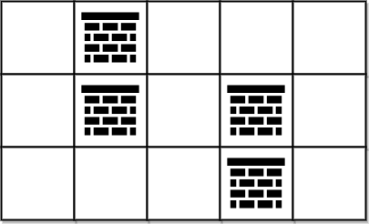

临时：


### [2131. 连接两字母单词得到的最长回文串](https://leetcode.cn/problems/longest-palindrome-by-concatenating-two-letter-words/)

给你一个字符串数组 `words` 。`words` 中每个元素都是一个包含 **两个** 小写英文字母的单词。

请你从 `words` 中选择一些元素并按 **任意顺序** 连接它们，并得到一个 **尽可能长的回文串** 。每个元素 **至多** 只能使用一次。

请你返回你能得到的最长回文串的 **长度** 。如果没办法得到任何一个回文串，请你返回 `0` 。

**回文串** 指的是从前往后和从后往前读一样的字符串。

**示例 1：**

```
输入：words = ["lc","cl","gg"]
输出：6
解释：一个最长的回文串为 "lc" + "gg" + "cl" = "lcggcl" ，长度为 6 。
"clgglc" 是另一个可以得到的最长回文串。
```


#### M1 枚举右维护左 慢

有点慢

```C++
class Solution {
public:
    int longestPalindrome(vector<string>& words) {
        unordered_map<string,int> umap;//是否存在 枚举右 维护左
        // gg cl lc
        int n = words.size();
        int res=0;
        for(int i=0;i<n;i++)
        {
            string rev = {words[i][1],words[i][0]}; 
            if(umap.contains(rev))
            {
                umap[rev]--;
                if(umap[rev]==0)umap.erase(rev);
                res+=4;
            }
            else
            {
                umap[words[i]]++;
            }
        }
        for(auto &[str,_]:umap)
        {
            if(str[0]==str[1])
            {
                res+=2;
                return res;
            }
        }
        return res;
    }
};
```


#### M2 推荐 贪心	

https://leetcode.cn/problems/longest-palindrome-by-concatenating-two-letter-words/solutions/1199641/gou-zao-tan-xin-fen-lei-tao-lun-by-endle-dqr8/?envType=daily-question&envId=2025-05-25

```C++
class Solution {
public:
    int longestPalindrome(vector<string>& words) {
        int cnt[26][26]{};
        for(auto &w:words)
        {
            cnt[w[0]-'a'][w[1]-'a']++;
        }
        int odd = 0;
        int res=0;
        for(int i=0;i<26;i++)
        {
            int c = cnt[i][i];
            res += (c - c%2);//偶数c,奇数c-1 
            odd |= cnt[i][i]%2;// 存在出现奇数次的 cnt[i][i]
            for(int j=i+1;j<26;j++)
            {
                res += min(cnt[i][j],cnt[j][i])*2;
            }
        }
        return (res+odd)*2;// 上面统计的是字符串个数，乘以 2 就是长度

    }
};
```


### （4）[1881. 插入后的最大值 ](https://leetcode.cn/problems/maximum-value-after-insertion/) :recycle:

> 给你一个非常大的整数 `n` 和一个整数数字 `x` ，大整数 `n` 用一个字符串表示。`n` 中每一位数字和数字 `x` 都处于闭区间 `[1, 9]` 中，且 `n` 可能表示一个 **负数** 。
>
> 你打算通过在 `n` 的十进制表示的任意位置插入 `x` 来 **最大化** `n` 的 **数值** 。但 **不能** 在负号的左边插入 `x` 。
>
> - 例如，如果 `n = 73` 且 `x = 6` ，那么最佳方案是将 `6` 插入 `7` 和 `3` 之间，使 `n = 763` 。
> - 如果 `n = -55` 且 `x = 2` ，那么最佳方案是将 `2` 插在第一个 `5` 之前，使 `n = -255` 。
>
> 返回插入操作后，用字符串表示的 `n` 的最大值。

```c++
class Solution {
public:
    string maxValue(string n, int x) {
        //n可能是负数,但不包含0
        //先考虑正数,while 当前数>=x,就往后走,直到找到位置insert即可
        //负数, -255 插入2,其实就是想让负号右边的数尽可能小,插入到第一个比当前数大的值的索引位置
        char sign = n[0];
        int sz = n.size();
        if(sign=='-')
        {
            int index = 1; //输入是有效整数,因此至少有两个char
            while(index<sz && n[index]-'0'<=x) index++; //找到第一个严格>x的
            n.insert(n.begin()+index,'0'+x);
        }
        else //正数
        {
            int index = 0;
            while(index<sz && n[index]-'0'>=x) index++; // 找到第一个严格<x的
            n.insert(n.begin()+index, '0'+x);
        }
        return n;
    }
};
```

>不要取等号！
>
>786747，增加一个7，让它变最大
>
>取等号，找到第一个>=7,     7866747,更小
>
>不取等号，找到第一个>7,   7867647，更大，正确


# 三、网格图 0-1 BFS

边权只有 0 和 1 的题目，也可以用 BFS 做。（当然应该也可以用dijkstra做）


### [1368. 使网格图至少有一条有效路径的最小代价](https://leetcode.cn/problems/minimum-cost-to-make-at-least-one-valid-path-in-a-grid/)

困难

给你一个 m x n 的网格图 `grid` 。 `grid` 中每个格子都有一个数字，对应着从该格子出发下一步走的方向。 `grid[i][j]` 中的数字可能为以下几种情况：

- **1** ，下一步往右走，也就是你会从 `grid[i][j]` 走到 `grid[i][j + 1]`
- **2** ，下一步往左走，也就是你会从 `grid[i][j]` 走到 `grid[i][j - 1]`
- **3** ，下一步往下走，也就是你会从 `grid[i][j]` 走到 `grid[i + 1][j]`
- **4** ，下一步往上走，也就是你会从 `grid[i][j]` 走到 `grid[i - 1][j]`

注意网格图中可能会有 **无效数字** ，因为它们可能指向 `grid` 以外的区域。

一开始，你会从最左上角的格子 `(0,0)` 出发。我们定义一条 **有效路径** 为从格子 `(0,0)` 出发，每一步都顺着数字对应方向走，最终在最右下角的格子 `(m - 1, n - 1)` 结束的路径。有效路径 **不需要是最短路径** 。

你可以花费 `cost = 1` 的代价修改一个格子中的数字，但每个格子中的数字 **只能修改一次** 。

请你返回让网格图至少有一条有效路径的最小代价。

**示例 1：**


```
输入：grid = [[1,1,1,1],[2,2,2,2],[1,1,1,1],[2,2,2,2]]
输出：3
解释：你将从点 (0, 0) 出发。
到达 (3, 3) 的路径为： (0, 0) --> (0, 1) --> (0, 2) --> (0, 3) 花费代价 cost = 1 使方向向下 --> (1, 3) --> (1, 2) --> (1, 1) --> (1, 0) 花费代价 cost = 1 使方向向下 --> (2, 0) --> (2, 1) --> (2, 2) --> (2, 3) 花费代价 cost = 1 使方向向下 --> (3, 3)
总花费为 cost = 3.
```


```C++
class Solution {
public:
    int minCost(vector<vector<int>>& grid) {
        //沿着这个方向走的全都是代价为这个
        //去往这个的其他方向代价+1
        
        deque<pair<int,int>> q;
        int m = grid.size();
        int n = grid[0].size();
        vector<vector<int>> dist(m,vector<int>(n,INT_MAX));
        dist[0][0] = 0;
        q.emplace_back(0,0);
        int dirs[4][2] = {{0,1},{0,-1},{1,0},{-1,0}};
        while(!q.empty())
        {
            auto [x,y] = q.front();
            int dis = dist[x][y];
            q.pop_front();
            // cout<<"X:"<<x<<"  ,Y:"<<y<< " ,dis:"<<dis<<endl;
            if(x==m-1&&y==n-1)return dis;
            //-------指向的方向-----------
            int d = grid[x][y]-1;//dir
            int nxtX = x+dirs[d][0], nxtY = y+dirs[d][1];//x+,y+ 别忘了
            if(nxtX>=0&&nxtY>=0&&nxtX<m&&nxtY<n)
            {
                if(dis<dist[nxtX][nxtY])
                {
                    //加到队首
                    q.emplace_front(nxtX,nxtY);
                    dist[nxtX][nxtY]=dis;
                    // cout<<nxtX<<" "<<nxtY<<endl;
                }
            }
            //--------没指向的方向----------
            for(int di=0;di<4;di++)
            {
                if(di!=d)
                {
                    int nxtX1 = x+dirs[di][0], nxtY1 = y+dirs[di][1];
                    if(nxtX1>=0&&nxtY1>=0&&nxtX1<m&&nxtY1<n)
                    {
                        if(dis+1<dist[nxtX1][nxtY1])
                        {
                            //加到队尾
                            q.emplace_back(nxtX1,nxtY1);
                            dist[nxtX1][nxtY1] = dis+1;
                            // cout<<nxtX1<<" "<<nxtY1<<endl;
                        }
                    }
                }
            }
        }
        return dist[m-1][n-1];
    }
};
```


### [2290. 到达角落需要移除障碍物的最小数目](https://leetcode.cn/problems/minimum-obstacle-removal-to-reach-corner/)

困难

给你一个下标从 **0** 开始的二维整数数组 `grid` ，数组大小为 `m x n` 。每个单元格都是两个值之一：

- `0` 表示一个 **空** 单元格，
- `1` 表示一个可以移除的 **障碍物** 。

你可以向上、下、左、右移动，从一个空单元格移动到另一个空单元格。

现在你需要从左上角 `(0, 0)` 移动到右下角 `(m - 1, n - 1)` ，返回需要移除的障碍物的 **最小** 数目。

 

**示例 1：**


```
输入：grid = [[0,1,1],[1,1,0],[1,1,0]]
输出：2
解释：可以移除位于 (0, 1) 和 (0, 2) 的障碍物来创建从 (0, 0) 到 (2, 2) 的路径。
可以证明我们至少需要移除两个障碍物，所以返回 2 。
注意，可能存在其他方式来移除 2 个障碍物，创建出可行的路径。
```

**示例 2：**



```
输入：grid = [[0,1,0,0,0],[0,1,0,1,0],[0,0,0,1,0]]
输出：0
解释：不移除任何障碍物就能从 (0, 0) 到 (2, 4) ，所以返回 0 。
```

 

```C++
class Solution {
public:
    int minimumObstacles(vector<vector<int>>& grid) {
        //跨越障碍物 放到队尾 dis+1
        //否则 dis 放队首
        int m = grid.size();
        int n = grid[0].size();
        vector<vector<int>> dist(m,vector<int>(n,INT_MAX));
        deque<pair<int,int>> q;
        dist[0][0] =0;
        q.emplace_back(0,0);
        int dirs[4][2] = {{0,1},{0,-1},{1,0},{-1,0}};
        while(!q.empty())
        {
            auto [x,y] = q.front();
            int d = dist[x][y];
            if(x==m-1&&y==n-1)return d;
            q.pop_front();
            // cout<<x<<" "<<y<<" "<<d<<endl;
            for(int i=0;i<4;i++)
            {
                int nxtX = x+dirs[i][0],nxtY = y+dirs[i][1];
                if(nxtX<0||nxtY<0||nxtX>=m||nxtY>=n)continue;
                if(grid[nxtX][nxtY]==1)
                {
                    if(d+1<dist[nxtX][nxtY])
                    {
                        dist[nxtX][nxtY] = d+1;
                        q.emplace_back(nxtX,nxtY);
                    }
                }
                else
                {
                    if(d<dist[nxtX][nxtY])
                    {
                        dist[nxtX][nxtY] = d;
                        q.emplace_front(nxtX,nxtY);
                    }
                }
            }
        }
        return dist[m-1][n-1];
    }
};
```


### [3552. 网格传送门旅游](https://leetcode.cn/problems/grid-teleportation-traversal/)

给你一个大小为 `m x n` 的二维字符网格 `matrix`，用字符串数组表示，其中 `matrix[i][j]` 表示第 `i` 行和第 `j` 列处的单元格。每个单元格可以是以下几种字符之一：

- `'.'` 表示一个空单元格。
- `'#'` 表示一个障碍物。
- 一个大写字母（`'A'` 到 `'Z'`）表示一个传送门。

你从左上角单元格 `(0, 0)` 出发，目标是到达右下角单元格 `(m - 1, n - 1)`。你可以从当前位置移动到相邻的单元格（上、下、左、右），移动后的单元格必须在网格边界内且不是障碍物**。**

如果你踏入一个包含传送门字母的单元格，并且你之前没有使用过该传送门字母，你可以立即传送到网格中另一个具有相同字母的单元格。这次传送不计入移动次数，但每个字母对应的传送门在旅程中 **最多** 只能使用一次。

返回到达右下角单元格所需的 **最少** 移动次数。如果无法到达目的地，则返回 `-1`。

 

**示例 1：**

**输入：** matrix = ["A..",".A.","..."]

**输出：** 2

**解释：**


- 在第一次移动之前，从 `(0, 0)` 传送到 `(1, 1)`。
- 第一次移动，从 `(1, 1)` 移动到 `(1, 2)`。
- 第二次移动，从 `(1, 2)` 移动到 `(2, 2)`。


```C++
class Solution {
public:
    int minMoves(vector<string>& matrix) {
        // 0-1 bfs
        //  0，加到队首
        //  1，加到队尾
        int dirs[4][2] = {{0,1},{0,-1},{1,0},{-1,0}};
        deque<pair<int,int>> pq;
        vector<vector<pair<int,int>>> portal(26);//放所有传送门位置的
        int m = matrix.size();
        int n = matrix[0].size();
        if (matrix[m - 1][n - 1] == '#')
        {
            return -1;
        }

        for(int i=0;i<m;i++)
        {
            for(int j=0;j<n;j++)
            {
                if(matrix[i][j] >='A'&&matrix[i][j]<='Z')
                {
                    portal[matrix[i][j]-'A'].emplace_back(i,j); 
                }
            }
        }
        vector<int> portalValid(26,1);
        pq.push_back(make_pair(0,0)); 
        
        vector<vector<int>> dist(m,vector<int>(n,INT_MAX));
        dist[0][0] = 0;

        while(!pq.empty())
        {
            auto [i,j] = pq.front();
            int d = dist[i][j];
            pq.pop_front();
            if(i==m-1&&j==n-1)return d;
            
            if(matrix[i][j]!='.')
            {
                int p = matrix[i][j]-'A';
                if(portalValid[p]==1)
                {
                    for(auto &[px,py]:portal[p])
                    {
                        if(d<dist[px][py])
                        {
                            pq.emplace_front(px,py);
                            dist[px][py] = d;
                        }
                       
                    }
                    portalValid[p]=0;
                }
            }
            //不管是不是传空单元格，都要遍历其上下左右，包括传送门
            for(int di=0;di<4;di++)
            {
                int nxtX = i+dirs[di][0];
                int nxtY = j+dirs[di][1];
                if(nxtX<0||nxtY<0||nxtX>=m||nxtY>=n||matrix[nxtX][nxtY]=='#')continue;
                if(dist[nxtX][nxtY]>d+1)
                {
                    dist[nxtX][nxtY] = d+1;
                    pq.emplace_back(nxtX,nxtY);
                }
            }
        }
        return -1;
    }
};
```


### [3286. 穿越网格图的安全路径](https://leetcode.cn/problems/find-a-safe-walk-through-a-grid/)

给你一个 `m x n` 的二进制矩形 `grid` 和一个整数 `health` 表示你的健康值。

你开始于矩形的左上角 `(0, 0)` ，你的目标是矩形的右下角 `(m - 1, n - 1)` 。

你可以在矩形中往上下左右相邻格子移动，但前提是你的健康值始终是 **正数** 。

对于格子 `(i, j)` ，如果 `grid[i][j] = 1` ，那么这个格子视为 **不安全** 的，会使你的健康值减少 1 。

如果你可以到达最终的格子，请你返回 `true` ，否则返回 `false` 。

**注意** ，当你在最终格子的时候，你的健康值也必须为 **正数** 。

**示例 1：**

**输入：**grid = [[0,1,0,0,0],[0,1,0,1,0],[0,0,0,1,0]], health = 1

**输出：**true

**解释：**

沿着下图中灰色格子走，可以安全到达最终的格子。


```C++
class Solution {
public:
    bool findSafeWalk(vector<vector<int>>& grid, int health) {
        //dist 被扣的血 尽量要小
        //如果>health 直接退出吧
        int m = grid.size(),n =grid[0].size();
        deque<pair<int,int>> q{{0,0}};
        vector<vector<int>> dist(m,vector<int>(n,INT_MAX));
        dist[0][0]=grid[0][0];
        int dirs[4][2] = {{0,1},{0,-1},{1,0},{-1,0}};
        while(!q.empty())
        {
            auto [x,y] = q.front();
            int d = dist[x][y];
            q.pop_front();
            // cout<<x<<" "<<y<<" "<<d<<endl;
            if(x==m-1&&y==n-1&&d<health)return true;
            for(int i=0;i<4;i++)
            {
                int nxtX = x+dirs[i][0],nxtY = y+dirs[i][1];
                if(nxtX<0||nxtY<0||nxtX>=m||nxtY>=n)continue;
                if(grid[nxtX][nxtY]==1)
                {
                    if(d+1<health&& d+1<dist[nxtX][nxtY])
                    {
                        q.emplace_back(nxtX,nxtY);
                        dist[nxtX][nxtY] = d+1;
                    }
                }
                else //=0
                {
                    if(d<health&&d<dist[nxtX][nxtY])
                    {
                        q.emplace_front(nxtX,nxtY);
                        dist[nxtX][nxtY] = d;
                    }
                }
                
            }
        }
        return dist[m-1][n-1]<health;


    }
};
```


### [LCP 56. 信物传送](https://leetcode.cn/problems/6UEx57/)

欢迎各位勇者来到力扣城，本次试炼主题为「信物传送」。

本次试炼场地设有若干传送带，`matrix[i][j]` 表示第 `i` 行 `j` 列的传送带运作方向，`"^","v","<",">"` 这四种符号分别表示 **上、下、左、右** 四个方向。信物会随传送带的方向移动。勇者**每一次**施法操作，可**临时**变更一处传送带的方向，在物品经过后传送带恢复原方向。.gif)

通关信物初始位于坐标 `start`处，勇者需要将其移动到坐标 `end` 处，请返回勇者施法操作的最少次数。

**注意：**

- `start` 和 `end` 的格式均为 `[i,j]`

**示例 1：**

> 输入：`matrix = [">>v","v^<","<><"], start = [0,1], end = [2,0]`
>
> 输出：`1`
>
> 解释： 如上图所示 当信物移动到 `[1,1]` 时，勇者施法一次将 `[1,1]` 的传送方向 `^` 从变更为 `<` 从而信物移动到 `[1,0]`，后续到达 `end` 位置 因此勇者最少需要施法操作 1 次


```C++
class Solution {
public:
    int conveyorBelt(vector<string>& matrix, vector<int>& start, vector<int>& end) {
        // cout<<"ddd "<<endl;
        unordered_map<char,int> umap;//
        // cout<<"ddd "<<endl;
        umap['^'] = 0;
        umap['v'] = 1;
        umap['<'] = 2;
        umap['>'] = 3;
        int dirs[4][2] ={{-1,0},{1,0},{0,-1},{0,1}};
        int s1 =start[0],s2=start[1];
        // cout<<s1<<endl;
        deque<pair<int,int>> q{{s1,s2}};
        int m = matrix.size();
        int n = matrix[0].size();
        vector<vector<int>> dist(m,vector<int>(n,INT_MAX));
        dist[s1][s2] = 0;
        int e1 = end[0],e2 = end[1];
        //cout<<e1<<endl;
        while(!q.empty())
        {
            auto [x,y] = q.front(); 
            q.pop_front();
            int d = dist[x][y];
            //cout<<x<<" "<<y<<" "<<d<<endl;
            if(x==e1&&y==e2)return d;

            int dir = umap[matrix[x][y]];
            int nx = x+dirs[dir][0],ny = y+dirs[dir][1];
            if(nx>=0&&ny>=0&&nx<m&&ny<n&& d<dist[nx][ny])
            {
                dist[nx][ny] = d;
                q.emplace_front(nx,ny);
            }
            for(int di=0;di<4;di++)
            {
                if(di!=dir)
                {
                    int nx = x+dirs[di][0],ny = y+dirs[di][1];
                    if(nx>=0&&ny>=0&&nx<m&&ny<n&& d+1<dist[nx][ny])
                    {
                        dist[nx][ny] = d+1;
                        q.emplace_back(nx,ny);
                    }
                }
            }
        }
        return dist[e1][e2];
    }
};
```


### [1824. 最少侧跳次数 ](https://leetcode.cn/problems/minimum-sideway-jumps/) 

给你一个长度为 `n` 的 **3 跑道道路** ，它总共包含 `n + 1` 个 **点** ，编号为 `0` 到 `n` 。一只青蛙从 `0` 号点第二条跑道 **出发** ，它想要跳到点 `n` 处。然而道路上可能有一些障碍。

给你一个长度为 `n + 1` 的数组 `obstacles` ，其中 `obstacles[i]` （**取值范围从 0 到 3**）表示在点 `i` 处的 `obstacles[i]` 跑道上有一个障碍。如果 `obstacles[i] == 0` ，那么点 `i` 处没有障碍。任何一个点的三条跑道中 **最多有一个** 障碍。

- 比方说，如果 `obstacles[2] == 1` ，那么说明在点 2 处跑道 1 有障碍。

这只青蛙从点 `i` 跳到点 `i + 1` 且跑道不变的前提是点 `i + 1` 的同一跑道上没有障碍。为了躲避障碍，这只青蛙也可以在 **同一个** 点处 **侧跳** 到 **另外一条** 跑道（这两条跑道可以不相邻），但前提是跳过去的跑道该点处没有障碍。

- 比方说，这只青蛙可以从点 3 处的跑道 3 跳到点 3 处的跑道 1 。

这只青蛙从点 0 处跑道 `2` 出发，并想到达点 `n` 处的 **任一跑道** ，请你返回 **最少侧跳次数** 。

**注意**：点 `0` 处和点 `n` 处的任一跑道都不会有障碍。

**示例 1：**


```C++
输入：obstacles = [0,1,2,3,0]
输出：2 
解释：最优方案如上图箭头所示。总共有 2 次侧跳（红色箭头）。
注意，这只青蛙只有当侧跳时才可以跳过障碍（如上图点 2 处所示）。
```


#### M1 : 0-1 BFS

```C++
class Solution {
public:
    int minSideJumps(vector<int>& obstacles) {
        int n = obstacles.size();
        vector<vector<int>> dist(3,vector<int>(n,INT_MAX));
        dist[1][0] = 0;
        deque<pair<int,int>> q{{1,0}};
        int dirs[4][2] = {{1,0},{-1,0},{2,0},{-2,0}};
        int m = 3;
        while(!q.empty())
        {
            auto [x,y] = q.front();
            int d = dist[x][y];
            // cout<<x<<" "<<y<<" "<<d<<endl;
            q.pop_front();
            if(y==n-1)return d;
            
            //跳到右边
            int nx = x,ny=y+1;
            if(nx>=0&&ny>=0&&nx<m&&ny<n&&d<dist[nx][ny]&&obstacles[ny]!=(nx+1))
            {
                q.emplace_front(nx,ny);
                dist[nx][ny] = d;
            }
            //跳到上下
            for(int i=0;i<4;i++)
            {
                int nx = x+dirs[i][0],ny=y+dirs[i][1];
                if(nx>=0&&ny>=0&&nx<m&&ny<n&&d+1<dist[nx][ny]&&(obstacles[ny]!=(nx+1)))
                {
                    q.emplace_back(nx,ny);
                    dist[nx][ny] = d+1;
                }
            }
        }
        return -1;
        // int res=INT_MAX;
        // for(int i=0;i<3;i++)
        // {
        //     res = min(res,dist[i][n-1]);
        // }
        // return res;
    }
};
```


#### M2 : DP

应该会更快些 这题在do题单里也有 网格图dp

```C++
class Solution {
public:
    int minSideJumps(vector<int>& obstacles) {
        int n = obstacles.size();//
        // dp[i][j] 到这个点的最少侧跳次数  i是行 j是列
        //if(!<zhangai) dp[i][j] = min dp[i-1][j]+1,dp[i+1][j]+1,dp[i][j-1] ,dp[i+2][j]+1 ,dp[i-2][j]+1
        vector<vector<int>> dp(5,vector<int>(n,0x3f3f3f));
        dp[1][0] = 1,dp[2][0] = 0,dp[3][0] =1;//青蛙从 0 号点第二条跑道 出发
        //先计算能正常直走的， 再算被跳过来的！！！！
        //dfs(i,j) = dfs(i-1,j)+1,dfs(i+1,j)+1,dfs(i+2,j)+1,dfs(i-2,j)+1,dfs(i,j-1)//直走
        for(int j=1;j<n;j++)
        {
            //从左边来
            for(int i=1;i<=3;i++)
            {
                if(obstacles[j]!=i)
                {
                    dp[i][j] = dp[i][j-1];
                } 
                // cout<<i<<"* "<<j<<" "<<  dp[i][j]<<endl;
            }
            //从上下来
            for(int i=1;i<=3;i++)
            {
                if(obstacles[j]!=i)
                {
                    //dp[i][j] = min dp[i-1][j]+1,dp[i+1][j]+1,dp[i+2][j]+1 ,dp[i-2][j]+1
                    dp[i][j] =  min({dp[i][j],dp[i-1][j]+1,dp[i+1][j]+1});
                    if(i+2<5)
                    {
                        dp[i][j] =  min(dp[i][j],dp[i+2][j]+1);
                    }
                    else if(i-2>=0)
                    {
                        dp[i][j] =  min(dp[i][j],dp[i-2][j]+1);
                    }
                } 
                // cout<<i<<" "<<j<<" "<<  dp[i][j]<<endl;
            }
            
        }
        return min({dp[1][n-1],dp[2][n-1],dp[3][n-1]});
    }
};
```

dp也有别的做法