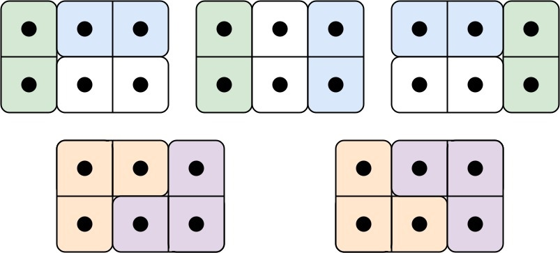

4/21

### [2145. 统计隐藏数组数目](https://leetcode.cn/problems/count-the-hidden-sequences/)


**示例 1：**

```
输入：differences = [1,-3,4], lower = 1, upper = 6
输出：2
解释：符合要求的隐藏数组为：
- [3, 4, 1, 5]
- [4, 5, 2, 6]
所以返回 2 。
```


```C++
class Solution {
public:
    int numberOfArrays(vector<int>& differences, int lower, int upper) {
        //  1 -3 4 相邻元素的插值
        // lower  upper
        // [1,6]
        long long mn=0,mx=0;
        int n = differences.size();
        long long tmp=0;
        for(int i=0;i<n;i++)
        {
            tmp+=differences[i]; 
            mn = min(mn,tmp);
            mx = max(mx,tmp);
        }
        long long len = mx-mn;
        if(len>upper-lower)return 0;
        return upper - (lower+len)+1;
    }
};
```


### [1457. 二叉树中的伪回文路径](https://leetcode.cn/problems/pseudo-palindromic-paths-in-a-binary-tree/)

给你一棵二叉树，每个节点的值为 1 到 9 。我们称二叉树中的一条路径是 「**伪回文**」的，当它满足：路径经过的所有节点值的排列中，存在一个回文序列。

请你返回从根到叶子节点的所有路径中 **伪回文** 路径的数目。

**示例 1：**


```
输入：root = [2,3,1,3,1,null,1]
输出：2 
解释：上图为给定的二叉树。总共有 3 条从根到叶子的路径：红色路径 [2,3,3] ，绿色路径 [2,1,1] 和路径 [2,3,1] 。
     在这些路径中，只有红色和绿色的路径是伪回文路径，因为红色路径 [2,3,3] 存在回文排列 [3,2,3] ，绿色路径 [2,1,1] 存在回文排列 [1,2,1] 。
```

------

相关标签

[位运算](https://leetcode.cn/tag/bit-manipulation/)[树](https://leetcode.cn/tag/tree/)[深度优先搜索](https://leetcode.cn/tag/depth-first-search/)[广度优先搜索](https://leetcode.cn/tag/breadth-first-search/)[二叉树](https://leetcode.cn/tag/binary-tree/)

优化1：位运算

```C++
class Solution {
public:
    int dfs(TreeNode* node,int path)
    {
        if(node==nullptr)return 0;
        int val = node->val;
        path = path ^ (1<<val);
        if(node->left==nullptr&&node->right==nullptr)
        {
            //叶子节点
            int cnt1 = __builtin_popcount(path);
            if(cnt1<=1)return 1;
            else return 0;
        }
        int left = dfs(node->left,path);
        int right = dfs(node->right,path);
        return left+right;
    }
    int pseudoPalindromicPaths (TreeNode* root) {
        //回文：aa，aab,aabb,aaccffd
        //每个字母出现次数都需要是偶数，只有一个可以是奇数
        // 数位 26位，当有这个值，异或 ，这样如果最后是0，或者只有1个1，就可以
        //从根节点传递到叶子节点，叶子节点来判断
        //2^9
        return dfs(root,0);
    }
};
```

优化2：

实际上我们因为只有1个1，所以只需要`return (path&(path-1))==0;`

```C++
class Solution {
public:
    int dfs(TreeNode* node,int path)
    {
        if(node==nullptr)return 0;
        int val = node->val;
        path = path ^ (1<<val);
        if(node->left==nullptr&&node->right==nullptr)
        {
            //叶子节点
            return (path&(path-1))==0;
        }
        return dfs(node->left,path)+dfs(node->right,path);
    }
    int pseudoPalindromicPaths (TreeNode* root) {
        return dfs(root,0);
    }
};
```


### [2734. 执行子串操作后的字典序最小字符串](https://leetcode.cn/problems/lexicographically-smallest-string-after-substring-operation/)

给你一个仅由小写英文字母组成的字符串 `s` 。在一步操作中，你可以完成以下行为：

- 选择 `s` 的任一非空子字符串，可能是整个字符串，接着将字符串中的每一个字符替换为英文字母表中的前一个字符。例如，'b' 用 'a' 替换，'a' 用 'z' 替换。

返回执行上述操作 **恰好一次** 后可以获得的 **字典序最小** 的字符串。

**子字符串** 是字符串中的一个连续字符序列。

现有长度相同的两个字符串 `x` 和 字符串 `y` ，在满足 `x[i] != y[i]` 的第一个位置 `i` 上，如果 `x[i]` 在字母表中先于 `y[i]` 出现，则认为字符串 `x` 比字符串 `y` **字典序更小** 。

**示例 1：**

```
输入：s = "cbabc"
输出："baabc"
解释：我们选择从下标 0 开始、到下标 1 结束的子字符串执行操作。 
可以证明最终得到的字符串是字典序最小的。
```


写法1:

```C++
class Solution {
public:
    string smallestString(string s) {
        //换前面的字符
        //a跳过
        //从非a到非a
        //如果全是a 就最后一个a换为z
        int n = s.size();
        for(int i=0;i<n;i++)
        {
            if(s[i]!='a')
            {
                for(;i<n&&s[i]!='a';i++)
                {
                    s[i] = s[i]-1;
                }
                return s;
            }
        }
        s[n-1] = 'z';
        return s;
    }
};
```

写法2:

```C++
class Solution {
public:
    string smallestString(string s) {
        //换前面的字符
        //a跳过
        //从非a到非a
        //如果全是a 就最后一个a换为z
        int n = s.size();
        bool start=false;
        bool hasChange=false;
        for(int i=0;i<n;i++)
        {
            if(!start)
            {
                if(s[i]!='a')
                {
                    start=true;
                    hasChange = true;
                    s[i] = s[i]-1;
                }
            }
            else if(start)
            {
                if(s[i]!='a')
                {
                    s[i] = s[i]-1;
                }
                else if(s[i]=='a')
                {
                    start = false;
                    break;
                }
            }
        }
        if(hasChange==false)
        {
            s[n-1] = 'z';
        }
        return s;
    }
};
```


### [1410. HTML 实体解析器](https://leetcode.cn/problems/html-entity-parser/)

「HTML 实体解析器」 是一种特殊的解析器，它将 HTML 代码作为输入，并用字符本身替换掉所有这些特殊的字符实体。

HTML 里这些特殊字符和它们对应的字符实体包括：

- **双引号：**字符实体为 `"` ，对应的字符是 `"` 。
- **单引号：**字符实体为 `'` ，对应的字符是 `'` 。
- **与符号：**字符实体为 `&` ，对应对的字符是 `&` 。
- **大于号：**字符实体为 `>` ，对应的字符是 `>` 。
- **小于号：**字符实体为 `<` ，对应的字符是 `<` 。
- **斜线号：**字符实体为 `⁄` ，对应的字符是 `/` 。

给你输入字符串 `text` ，请你实现一个 HTML 实体解析器，返回解析器解析后的结果。

**示例 1：**

```
输入：text = "&amp; is an HTML entity but &ambassador; is not."
输出："& is an HTML entity but &ambassador; is not."
解释：解析器把字符实体 &amp; 用 & 替换
```


```C++
class Solution {
public:
    string entityParser(string s) {
        int n=s.size();
        //找到& 往后从3位找到（最多找6位）看有没有“；”
        //找到了就比较一下是否等于其中哪个字符
        //如果== 就替换，否则不管
        //&frasl;
        //0123456
        //i
        string res; 
        unordered_map<string,char> umap;
        umap["quot"] = '\"';
        umap["apos"] = '\'';
        umap["amp"] = '&';
        umap["gt"] = '>';
        umap["lt"] = '<';
        umap["frasl"] = '/';
        for(int i=0;i<n;i++)
        {
            if(s[i]=='&')
            {
                for(int j=i+3;j<=i+6&&j<n;j++)
                {
                    if(s[j]==';')
                    {
                        string str = s.substr(i+1,j-i-1);
                        if(umap.contains(str))
                        {
                            res.push_back(umap[str]);
                            i=j+1;
                            continue;
                        }
                    }
                }
            }
            if(i<n)res.push_back(s[i]);
        }
        return res;
    }
};
```

别的语言都可以直接用replace函数，C++应该也有吧，有空看看


### [2437. 有效时间的数目](https://leetcode.cn/problems/number-of-valid-clock-times/)

给你一个长度为 `5` 的字符串 `time` ，表示一个电子时钟当前的时间，格式为 `"hh:mm"` 。**最早** 可能的时间是 `"00:00"` ，**最晚** 可能的时间是 `"23:59"` 。

在字符串 `time` 中，被字符 `?` 替换掉的数位是 **未知的** ，被替换的数字可能是 `0` 到 `9` 中的任何一个。

请你返回一个整数 `answer` ，将每一个 `?` 都用 `0` 到 `9` 中一个数字替换后，可以得到的有效时间的数目。

**示例 1：**

```
输入：time = "?5:00"
输出：2
解释：我们可以将 ? 替换成 0 或 1 ，得到 "05:00" 或者 "15:00" 。注意我们不能替换成 2 ，因为时间 "25:00" 是无效时间。所以我们有两个选择。
```


```C++
class Solution {
public:
    int countTime(string time) {
        //"?5:00"
        //1234位
        //12:??,24
        //1?:a?,if(a<2)b=0-9;
        //      else a==2,b=0-3 
        //?2:?b,b>=4 a=0-1
        //      else a=0-2
        
        //a? ,  b 0-9
        //?b ,  b 0-5

        int h=1;
        char a = time[0],b=time[1];
        if(a=='?'&&b=='?')h = 24;
        else if(b=='?')  
        {
            if(a-'0'<2) h=10;
            else h=4;
        }
        else if(a=='?')
        {
            if(b-'0'>=4)h=2;
            else h=3;
        }

        int m=1;
        a = time[3],b=time[4];
        if(a=='?'&&b=='?')m=60;
        else if(b=='?')m=10;
        else if(a=='?')m=6;

        return m*h;
    }
};
```


或者枚举每个时间，看是否合法(0X3F)：

```C++
class Solution {
    int count(string t, int period) {
        int ans = 0;
        for (int i = 0; i < period; i++)
            if ((t[0] == '?' || i / 10 == t[0] - '0') &&
                (t[1] == '?' || i % 10 == t[1] - '0'))
                ans++;
        return ans;
    }
public:
    int countTime(string time) {
        return count(time.substr(0, 2), 24) * count(time.substr(3), 60);
    }
};
作者：灵茶山艾府
链接：https://leetcode.cn/problems/number-of-valid-clock-times/solutions/1895227/cheng-fa-yuan-li-fen-bie-ji-suan-xiao-sh-66d9/
来源：力扣（LeetCode）
著作权归作者所有。商业转载请联系作者获得授权，非商业转载请注明出处。
```


### [2678. 老人的数目](https://leetcode.cn/problems/number-of-senior-citizens/)

给你一个下标从 **0** 开始的字符串 `details` 。`details` 中每个元素都是一位乘客的信息，信息用长度为 `15` 的字符串表示，表示方式如下：

- 前十个字符是乘客的手机号码。
- 接下来的一个字符是乘客的性别。
- 接下来两个字符是乘客的年龄。
- 最后两个字符是乘客的座位号。

请你返回乘客中年龄 **严格大于 60 岁** 的人数。

 

**示例 1：**

```
输入：details = ["7868190130M7522","5303914400F9211","9273338290F4010"]
输出：2
解释：下标为 0 ，1 和 2 的乘客年龄分别为 75 ，92 和 40 。所以有 2 人年龄大于 60 岁。
```


```C++
class Solution {
public:
    int countSeniors(vector<string>& details) {
        // d[i][11],d[i][12]
        int cnt=0;
        for(int i=0;i<(int)details.size();i++)
        {
            //记得 是字符串 需要-'0'
            if(details[i][11]-'0'>6 ||((details[i][11]-'0'==6)&&details[i][12]-'0'>0))
            {
                cnt++;
            }
        }
        return cnt;
    }
};
```


### [2679. 矩阵中的和](https://leetcode.cn/problems/sum-in-a-matrix/)

给你一个下标从 **0** 开始的二维整数数组 `nums` 。一开始你的分数为 `0` 。你需要执行以下操作直到矩阵变为空：

1. 矩阵中每一行选取最大的一个数，并删除它。如果一行中有多个最大的数，选择任意一个并删除。
2. 在步骤 1 删除的所有数字中找到最大的一个数字，将它添加到你的 **分数** 中。

请你返回最后的 **分数** 。

**示例 1：**

```
输入：nums = [[7,2,1],[6,4,2],[6,5,3],[3,2,1]]
输出：15
解释：第一步操作中，我们删除 7 ，6 ，6 和 3 ，将分数增加 7 。下一步操作中，删除 2 ，4 ，5 和 2 ，将分数增加 5 。最后删除 1 ，2 ，3 和 1 ，将分数增加 3 。所以总得分为 7 + 5 + 3 = 15 。
```


```C++
class Solution {
public:
    int matrixSum(vector<vector<int>>& nums) {
        // sort 
        int n = nums.size();
        for(int i=0;i<n;i++)
        {
             sort(nums[i].begin(),nums[i].end());   
        }
        // 1 2 7
        // 2 4 6
        // nums[i][m-1]
        int m = nums[0].size();
        int maxNum=INT_MIN;
        int res=0;
        for(int j=m-1;j>=0;j--)
        {
            maxNum=INT_MIN;
            for(int i=0;i<n;i++)
            {
                maxNum = max(maxNum,nums[i][j]);
            }
            res+=maxNum;
        }
        return res;
    }
};
```


### [2680. 最大或值](https://leetcode.cn/problems/maximum-or/)

给你一个下标从 **0** 开始长度为 `n` 的整数数组 `nums` 和一个整数 `k` 。每一次操作中，你可以选择一个数并将它乘 `2` 。

你最多可以进行 `k` 次操作，请你返回 `nums[0] | nums[1] | ... | nums[n - 1]` 的最大值。

`a | b` 表示两个整数 `a` 和 `b` 的 **按位或** 运算。

**示例 1：**

```
输入：nums = [12,9], k = 1
输出：30
解释：如果我们对下标为 1 的元素进行操作，新的数组为 [12,18] 。此时得到最优答案为 12 和 18 的按位或运算的结果，也就是 30 。
```


```C++
class Solution {
public:
    long long maximumOr(vector<int>& nums, int k) {
        // 乘最长的那些数字是最好的
        //枚举所有最长的数字。对其进行k次*2 / <<
        int n=nums.size();
        //前后缀异或
        // 8  1 2
        // 0  8 8^2
        //1^2 2 0

        // 0011
        // 0001
        vector<long long> suf(n,0);
        for(int i=n-2;i>=0;i--)
        {
            suf[i] = suf[i+1]|nums[i+1];
        }
        long long pre=0;
        long long res=0;
        for(int i=0;i<n;i++)
        {
            long long tmp = pre | ((long long)nums[i]<<k) |  suf[i];
            pre = pre |  nums[i];
            res = max(res,tmp);
        }
        return res;
    }
};
```


### [2681. 英雄的力量](https://leetcode.cn/problems/power-of-heroes/) 困难题

给你一个下标从 **0** 开始的整数数组 `nums` ，它表示英雄的能力值。如果我们选出一部分英雄，这组英雄的 **力量** 定义为：

- `i0` ，`i1` ，... `ik` 表示这组英雄在数组中的下标。那么这组英雄的力量为 `max(nums[i0],nums[i1] ... nums[ik])^2 * min(nums[i0],nums[i1] ... nums[ik])` 。

请你返回所有可能的 **非空** 英雄组的 **力量** 之和。由于答案可能非常大，请你将结果对 `109 + 7` **取余。**

**示例 1：**

```
输入：nums = [2,1,4]
输出：141
解释：
第 1 组：[2] 的力量为 22 * 2 = 8 。
第 2 组：[1] 的力量为 12 * 1 = 1 。
第 3 组：[4] 的力量为 42 * 4 = 64 。
第 4 组：[2,1] 的力量为 22 * 1 = 4 。
第 5 组：[2,4] 的力量为 42 * 2 = 32 。
第 6 组：[1,4] 的力量为 42 * 1 = 16 。
第 7 组：[2,1,4] 的力量为 42 * 1 = 16 。
所有英雄组的力量之和为 8 + 1 + 64 + 4 + 32 + 16 + 16 = 141 。
```


贡献法：

请看题解：

**https://leetcode.cn/problems/power-of-heroes/solutions/2268792/gong-xian-fa-pythonjavacgo-by-endlessche-d4jx/**

```C++
class Solution {
public:
    int sumOfPower(vector<int>& nums) {
        // 贡献法
        // 1 2 4 7 9
        // 9*9 *1 情况有 /2^3  选或者不选
        // 9*9 *2 情况有 /2^2  选或者不选
        // 9*9 *4  /2^1
        // 9*9 *7  /2^0=1
        // 9*9 *9  /1
        // res += (x*x*(x+s));
        // s = 2*s+nums[i]
        //每个数字作为最大值的贡献
        sort(nums.begin(),nums.end());
        int n = nums.size();
        const int MOD =1e9+7;
        long long res=0;
        long long s=0;
        for(long long x:nums)
        {
            res = (res + x*x%MOD*(x+s)) %MOD;
            s = (2*s + x) %MOD;
        }
        return res;
        
    }
};
```


### [232. 用栈实现队列](https://leetcode.cn/problems/implement-queue-using-stacks/)

请你仅使用两个栈实现先入先出队列。队列应当支持一般队列支持的所有操作（`push`、`pop`、`peek`、`empty`）：

实现 `MyQueue` 类：

- `void push(int x)` 将元素 x 推到队列的末尾
- `int pop()` 从队列的开头移除并返回元素
- `int peek()` 返回队列开头的元素
- `boolean empty()` 如果队列为空，返回 `true` ；否则，返回 `false`

**说明：**

- 你 **只能** 使用标准的栈操作 —— 也就是只有 `push to top`, `peek/pop from top`, `size`, 和 `is empty` 操作是合法的。
- 你所使用的语言也许不支持栈。你可以使用 list 或者 deque（双端队列）来模拟一个栈，只要是标准的栈操作即可。


```C++
class MyQueue {
public:
    //操作  加 1 2 3-- pop          --pop
    // stkIn  1 2 3--empty-- empty  -- 4 5 
    // stkOut empty--3 2 1-- 3 2    --3   

    stack<int> stkIn;
    stack<int> stkOut;
    MyQueue() {
        
    }
    
    void push(int x) {
        stkIn.emplace(x);
    }
    
    int pop() {
        if(!stkOut.empty())
        {
            int tmp = stkOut.top();
            stkOut.pop();
            return tmp;
        }
        while(!stkIn.empty())
        {
            int tmp = stkIn.top();
            stkIn.pop();
            stkOut.emplace(tmp);
        }
        if(!stkOut.empty())
        {
            int tmp = stkOut.top();
            stkOut.pop();
            return tmp;
        }
        return -1;
    }
    
    int peek() {
        if(!stkOut.empty())
        {
            int tmp = stkOut.top();
            return tmp;
        }
        while(!stkIn.empty())
        {
            int tmp = stkIn.top();
            stkIn.pop();
            stkOut.emplace(tmp);
        }
        if(!stkOut.empty())
        {
            int tmp = stkOut.top();
            return tmp;
        }
        return -1;
    }
    
    bool empty() {
        return stkIn.empty()&&stkOut.empty();
    }
};

/**
 * Your MyQueue object will be instantiated and called as such:
 * MyQueue* obj = new MyQueue();
 * obj->push(x);
 * int param_2 = obj->pop();
 * int param_3 = obj->peek();
 * bool param_4 = obj->empty();
 */
```

简洁点：

```C++
class MyQueue {
private:
    std::stack<int> A, B;

public:
    MyQueue() {}

    void push(int x) {
        A.push(x);
    }

    int pop() {
        int peek = this->peek();
        B.pop();
        return peek;
    }

    int peek() {
        if (!B.empty()) return B.top();
        if (A.empty()) return -1;
        while (!A.empty()){
            B.push(A.top()), A.pop();
        }
        int res = B.top();
        return res;
    }

    bool empty() {
        return A.empty() && B.empty();
    }
};

链接：https://leetcode.cn/problems/implement-queue-using-stacks/solutions/2363977/232-yong-zhan-shi-xian-dui-lie-qing-xi-t-pi4l/
```


### [225. 用队列实现栈](https://leetcode.cn/problems/implement-stack-using-queues/)

请你仅使用两个队列实现一个后入先出（LIFO）的栈，并支持普通栈的全部四种操作（`push`、`top`、`pop` 和 `empty`）。

实现 `MyStack` 类：

- `void push(int x)` 将元素 x 压入栈顶。
- `int pop()` 移除并返回栈顶元素。
- `int top()` 返回栈顶元素。
- `boolean empty()` 如果栈是空的，返回 `true` ；否则，返回 `false` 。

**注意：**

- 你只能使用队列的标准操作 —— 也就是 `push to back`、`peek/pop from front`、`size` 和 `is empty` 这些操作。
- 你所使用的语言也许不支持队列。 你可以使用 list （列表）或者 deque（双端队列）来模拟一个队列 , 只要是标准的队列操作即可。


记住，是push的时候做的操作。

#### M1: 两个队列


```C++
class MyStack {
public:
    queue<int> que1;
    queue<int> que2;
    MyStack() {
        
    }
    
    void push(int x) {
        que2.push(x);
        while(!que1.empty())
        {
            que2.push(que1.front());
            que1.pop();
        }
        swap(que1,que2);
    }
    
    int pop() {
        if(que1.empty())return -1;
        int tmp = que1.front();
        que1.pop();
        return tmp;
    }
    
    int top() {
        if(que1.empty())return -1;
        return que1.front();
    }
    
    bool empty() {
        return que1.empty();
    }
};
```


#### M2: 一个队列

```C++
class MyStack {
public:
    queue<int> que;
    MyStack() {
        
    }
    
    void push(int x) {
        int n = que.size();
        que.push(x);
        while(n>0)
        {
            que.push(que.front());
            que.pop();
            n--;
        }
    }
    
    int pop() {
        if(que.empty())return -1;
        int tmp = que.front();
        que.pop();
        return tmp;
    }
    
    int top() {
        if(que.empty())return -1;
        return que.front();
    }
    
    bool empty() {
        return que.empty();
    }
};
```


### 【4/23 每日一题】[1399. 统计最大组的数目](https://leetcode.cn/problems/count-largest-group/)

给你一个整数 `n` 。请你先求出从 `1` 到 `n` 的每个整数 10 进制表示下的数位和（每一位上的数字相加），然后把数位和相等的数字放到同一个组中。

请你统计每个组中的数字数目，并返回数字数目并列最多的组有多少个。

**示例 1：**

```
输入：n = 13
输出：4
解释：总共有 9 个组，将 1 到 13 按数位求和后这些组分别是：
[1,10]，[2,11]，[3,12]，[4,13]，[5]，[6]，[7]，[8]，[9]。总共有 4 个组拥有的数字并列最多。
```


#### M1：暴力枚举

```C++
class Solution {
public:
    int countLargestGroup(int n) {
        // 1-n
        // 1-1 2-2.....10-1 11-2
        // 10000
        // 9999
        //36
        vector<int> v(37,0);
        int maxNum=0;
        for(int i=1;i<=n;i++)
        {
            int a = i;
            int sum=0;
            while(a)
            {
                sum += a%10;
                a/=10;
            }
            v[sum]++;
            maxNum = max(maxNum,v[sum]);
        }
        int res=0;
        for(int i=0;i<37;i++)
        {
            if(v[i]==maxNum)
            {
                res++;
            }
        }
        return res;
    }
};
```


#### M2 ：数位DP

```C++
class Solution {
public:
    int countLargestGroup(int n) {
        // 1-n
        // 1-1 2-2.....10-1 11-2
        // 10000
        // 9999
        //36
        // dp digitSum 
        // n=4567
        // 1-36
        // 34** 与下面可以记忆化，能构成的某种digitSum的情况是一样的，能构成digitSum = 30的个数
        // 16**
        // 45** 与下面不能记忆化
        // 09**
        //digitSum = k
        //有多少个
        
        //i,sum
        
        string s = to_string(n);
        int m = s.size();
        vector<vector<int>> dp(m,vector<int>(m*9+1,-1));
        // n=4567
        auto dfs = [&](this auto &&dfs,int i,int sum,bool is_limit)->int
        {
            if(i==m)return (sum==0);
            if(!is_limit&&dp[i][sum]!=-1)return dp[i][sum]; 
            int up = is_limit?s[i]-'0':9;
            int res=0;
            //sum-d>=0,d<=sum ！！
            for(int d=0;d<=min(up,sum);d++) // ！！别忘了 min(up,sum)
            {
                res += dfs(i+1,sum-d,is_limit&&d==up);  
            }
            if(!is_limit)dp[i][sum] = res;
            return res;
        };
        vector<int> Num(37,0);
        int maxNum=0;
        for(int i=1;i<m*9+1;i++)
        {
            Num[i] = dfs(0,i,true);
            maxNum = max(Num[i],maxNum);
        }
        int res=0;

        for(int i=1;i<m*9+1;i++)
        {
            if(Num[i] == maxNum) res++;
        }
        return res;
    }
};
```


# 每日一题

### [1007. 行相等的最少多米诺旋转 ](https://leetcode.cn/problems/minimum-domino-rotations-for-equal-row/) 5/3

在一排多米诺骨牌中，`tops[i]` 和 `bottoms[i]` 分别代表第 `i` 个多米诺骨牌的上半部分和下半部分。（一个多米诺是两个从 1 到 6 的数字同列平铺形成的 —— 该平铺的每一半上都有一个数字。）

我们可以旋转第 `i` 张多米诺，使得 `tops[i]` 和 `bottoms[i]` 的值交换。

返回能使 `tops` 中所有值或者 `bottoms` 中所有值都相同的最小旋转次数。

如果无法做到，返回 `-1`.

**示例 1：**


```
输入：tops = [2,1,2,4,2,2], bottoms = [5,2,6,2,3,2]
输出：2
解释： 
图一表示：在我们旋转之前， tops 和 bottoms 给出的多米诺牌。 
如果我们旋转第二个和第四个多米诺骨牌，我们可以使上面一行中的每个值都等于 2，如图二所示。 
```


#### M1:


```C++
class Solution {
public:
    int minDominoRotations(vector<int>& tops, vector<int>& bottoms) {
        int n = tops.size();
        auto minRotate = [&](int target)->int
        {
            int topCnt=0,botCnt=0;
            for(int i=0;i<n;i++)
            {
                int x = tops[i],y = bottoms[i];
                if(x!=target&&y!=target) return INT_MAX;
                if(y!=target)topCnt++;
                else if(x!=target)botCnt++;
            }
            return min(topCnt,botCnt);
        };
        int res = min(minRotate(tops[0]),minRotate(bottoms[0]));
        return (res == INT_MAX)? -1:res;
    }
};
```


#### M me 59%

```C++
class Solution {
public:
    int minDominoRotations(vector<int>& tops, vector<int>& bottoms) {
        //能否：能构成的最多相同的值
        //所有里面数字数量>=sz的 存在，就可以 否则不行
        //寻找这样的数字（如果有两个 代表不用翻转，所以找一个就行，然后看位于上和下中，最多的那个，反转的就是sz-k）
        int n = tops.size();
        // if equal 算一个

        //unordered_map<int,int> umap(7,0);//number cnt,isTop
        vector<int> vec(7,0);//cnt,cnt
        vector<int> topCnt(7,0);//这个数字在上面的出现次数
        vector<int> bottomCnt(7,0);//这个数字在下面的出现次数
        // 1 
        // 2 
        // 3 
        // 4 
        for(int i=0;i<n;i++)
        {
            int to = tops[i],bot = bottoms[i];
            if(to != bot)
            {
                vec[bot]++;
                
            }
            vec[to]++; 
            topCnt[to]++;
            bottomCnt[bot]++;
        }
        for(int i=1;i<=6;i++)
        {
            if(vec[i]>=n)
            {
                if(topCnt[i]>bottomCnt[i]) return n-topCnt[i];
                else return n-bottomCnt[i];
            }
        }
        return -1;
    }
};
```


### [1128. 等价多米诺骨牌对的数量](https://leetcode.cn/problems/number-of-equivalent-domino-pairs/) 5/4

给你一组多米诺骨牌 `dominoes` 。

形式上，`dominoes[i] = [a, b]` 与 `dominoes[j] = [c, d]` **等价** 当且仅当 (`a == c` 且 `b == d`) 或者 (`a == d` 且 `b == c`) 。即一张骨牌可以通过旋转 `0` 度或 `180` 度得到另一张多米诺骨牌。

在 `0 <= i < j < dominoes.length` 的前提下，找出满足 `dominoes[i]` 和 `dominoes[j]` 等价的骨牌对 `(i, j)` 的数量。

**示例 1：**

```
输入：dominoes = [[1,2],[2,1],[3,4],[5,6]]
输出：1
```


#### M1:

```C++
class Solution {
public:
    int numEquivDominoPairs(vector<vector<int>>& dominoes) {
        int cnt[10][10]={0};
        int ans=0;
        for(auto &v:dominoes)
        {
            auto [x,y] = minmax(v[0],v[1]);
            ans += cnt[x][y];
            cnt[x][y]++;
        }
        return ans;
    }
};
```


#### m 

```C++
class Solution {
public:
    int numEquivDominoPairs(vector<vector<int>>& dominoes) {
        // x>y swap
        unordered_map<int,int> umap;//x<y,nums
        for(auto &v:dominoes)
        {
            int x = v[0];
            int y = v[1];
            if(x>y)swap(x,y);
            int has = x*100+y;
            umap[has]++;
        }
        int ans=0;
        //v个 5*4/2
        for(auto &[k,v]:umap)
        {
            ans += (v*(v-1)/2);
        }
        return ans;
    }
};
```


### [790. 多米诺和托米诺平铺](https://leetcode.cn/problems/domino-and-tromino-tiling/)

有两种形状的瓷砖：一种是 `2 x 1` 的多米诺形，另一种是形如 "L" 的托米诺形。两种形状都可以旋转。


给定整数 n ，返回可以平铺 `2 x n` 的面板的方法的数量。**返回对** `109 + 7` **取模** 的值。

平铺指的是每个正方形都必须有瓷砖覆盖。两个平铺不同，当且仅当面板上有四个方向上的相邻单元中的两个，使得恰好有一个平铺有一个瓷砖占据两个正方形。

 

**示例 1:**



```
输入: n = 3
输出: 5
解释: 五种不同的方法如上所示。
```

**示例 2:**

```
输入: n = 1
输出: 1
```


题解:

**https://leetcode.cn/problems/domino-and-tromino-tiling/solutions/1968516/by-endlesscheng-umpp**

```C++
class Solution {
    const int MOD = 1e9+7;
public:
    int numTilings(int n) {
        if(n==1)return 1;
        vector<long long> dp(n+1,0);
        dp[0]=1,dp[1]=1,dp[2]=2;
        for(int i=3;i<=n;i++)
        {
            dp[i] = (2*dp[i-1] + dp[i-3])%MOD;
        }
        return dp[n];
    }
};
```


# 0-50

1. 两数之和

55.0%

简单


2. **两数相加** :recycle:

45.4%

中等

值得再做


3. 无重复字符的最长子串

41.1%

中等


4. **寻找两个正序数组的中位数 ** :recycle:

43.4%

**困难**

难  值得再做


5. **最长回文子串 ** :recycle:

39.5%

中等


6. Z 字形变换

53.8%

中等


### [6. Z 字形变换](https://leetcode.cn/problems/zigzag-conversion/)

将一个给定字符串 `s` 根据给定的行数 `numRows` ，以从上往下、从左到右进行 Z 字形排列。

比如输入字符串为 `"PAYPALISHIRING"` 行数为 `3` 时，排列如下：

```
P   A   H   N
A P L S I I G
Y   I   R
```

之后，你的输出需要从左往右逐行读取，产生出一个新的字符串，比如：`"PAHNAPLSIIGYIR"`。

请你实现这个将字符串进行指定行数变换的函数：

```
string convert(string s, int numRows);
```

**示例 1：**

```
输入：s = "PAYPALISHIRING", numRows = 3
输出："PAHNAPLSIIGYIR"
```


#### M1


动图请看 https://leetcode.cn/problems/zigzag-conversion/solutions/21610/zzi-xing-bian-huan-by-jyd/

```C++
class Solution {
public:
    string convert(string s, int numRows) {
        if(numRows<2) return s;
        int n = s.size(); 
        int flag=-1;
        vector<string> rows(numRows);
        int r=0;
        for(char c:s)
        {
            if(r==0||r==numRows-1)flag = -flag;
            rows[r].push_back(c);
            r+=flag;
        }
        string res;
        for(auto &str :rows)
        {
            res += str;
        }
        return res;
    }
};
```


#### M2

m

空间复杂度O（1）

```C++
class Solution {
public:
    string convert(string s, int numRows) {
        int n = s.size();
        //3 (3+(3-2)=4)
        //4 (4+(4-2)=6)
        //k (k+(k-2)=2k-2)
        //0     6
        //1   5 7
        //2 4   8
        //3     9
        int m = 2*numRows-2; // 距离
        string res;
        if(n<=1 || numRows==1)return s;
        for(int i=0;i*m<n;i++) // 第一行
        {
            res+=s[0+i*m];
        }
        //a:1->numRows-1  
        for(int a=1;a<numRows-1;a++) //中间每一行，都额外带一个数字
        {
            int t=m-a;
            for(int i=0;a+i*m<n;i++) 
            {
                res+=s[a+i*m];
                if(t+i*m<n)res+=s[t+i*m]; // 额外带的数字
            }
        }
        for(int i=0;numRows-1+i*m<n;i++) // 最后一行
        {
            res+=s[numRows-1+i*m];
        }
        return res;
    }
};
```


7. 整数反转

35.6%

中等


8. 字符串转换整数 (atoi)

21.6%

中等


9. 回文数

56.4%

简单


10. 正则表达式匹配

30.9%

**困难**

！！！

### [10. 正则表达式匹配](https://leetcode.cn/problems/regular-expression-matching/):cat:

> 给你一个字符串 `s` 和一个字符规律 `p`，请你来实现一个支持 `'.'` 和 `'*'` 的正则表达式匹配。
>
> - `'.'` 匹配任意单个字符
> - `'*'` 匹配零个或多个前面的那一个元素
>
> 所谓匹配，是要涵盖 **整个** 字符串 `s` 的，而不是部分字符串。
>
> 
>
> **示例 1：**
>
> ```
> 输入：s = "aa", p = "a"
> 输出：false
> 解释："a" 无法匹配 "aa" 整个字符串。
> ```
>
> **示例 2:**
>
> ```
> 输入：s = "aa", p = "a*"
> 输出：true
> 解释：因为 '*' 代表可以匹配零个或多个前面的那一个元素, 在这里前面的元素就是 'a'。因此，字符串 "aa" 可被视为 'a' 重复了一次。
> ```
>
> **示例 3：**
>
> ```
> 输入：s = "ab", p = ".*"
> 输出：true
> 解释：".*" 表示可匹配零个或多个（'*'）任意字符（'.'）。
> ```
>
> 
>
> **提示：**
>
> - `1 <= s.length <= 20`
> - `1 <= p.length <= 20`
> - `s` 只包含从 `a-z` 的小写字母。
> - `p` 只包含从 `a-z` 的小写字母，以及字符 `.` 和 `*`。
> - 保证每次出现字符 `*` 时，前面都匹配到有效的字符

（困难题是这样的）

本题思路如下：（参考[10. 正则表达式匹配 - 力扣（LeetCode）](https://leetcode.cn/problems/regular-expression-matching/solutions/296114/shou-hui-tu-jie-wo-tai-nan-liao-by-hyj8/)）

- 容易想到用`dp[i][j]`来表示s的前i个字符和p的前j个字符的匹配情况，值为true或者false；

接下来就进入到上强度的地方了。因为星号的前面肯定有一个字符，星号也只影响这一个字符，它就像一个拷贝器。如下图：


- s、p 串是否匹配，取决于：最右端是否匹配、剩余的子串是否匹配。
- 只是最右端可能是特殊符号，需要分情况讨论而已。

具体的情况为：

> 用`dp[i][j]`表示`s[0...i-1]`和`p[0...j-1]`的匹配情况。具体地：
>
> （1）如果`s[i-1]`和`p[j-1]`是匹配的。此时有两种情况：
>
> - `s[i-1]==p[j-1]`,或者
> - `p[j-1]=='.'`
>
> 此时问题就转换为了`dp[i-1][i-1]`（也就是对应匹配`s[i-2]`和`p[i-2]`的情况）=> `dp[i][j] = dp[i-1][j-1]`
>
> 
>
> （2）如果`s[i-1]`和`p[j-1]`是不匹配的
>
> - 此时右端不匹配，不能保证肯定不行，因为有可能`p[j-1]=='*'`,如果是`*`的话要在前面再寻找；
> - 否则如果右端不匹配，同时`p[j-1]!='*'`，则匹配失败，没机会拯救了。
>
> 
>
> 接下来就是考虑`p[j-1]=='*'`要怎么处理呢？
>
> - 我们先来看第一种情况：`s[i-1],p[j-2]`两者匹配（意味着`s[i-1]==p[j-2] || p[j-2]=='.'`）,此时又有三种情况：
>
>   - （a）`p[j-1]`出现的`*`可以让`p[j-2]`消失（s不动），此时`dp[i][j] = dp[i][j-2]`(意味着比较的是s[0...i-1]和p[0...j-3])
>   - （b）`p[j-1]`出现的`*`可以让`p[j-2]`出现一次，此时`dp[i][j] = dp[i-1][j-2]`（意味着匹配一次，接下来比较的变为s[0....i-2]和p[0...j-3]）
>   - （c）`p[j-1]`出现的`*`可以让`p[j-2]`出现不止一次（大于等于2次），那么相当于保留住p[j-2]，将s往前找一位，即`dp[i][j] = dp[i-1][j]`(注意对于p字符串来说，s字符串往前找一位，但p字符串还是在匹配`*`)。
>     - 关于（c）情况的具体分析如下：
>       - 假设 s 的右端是一个 a，p 的右端是 a * ，* 让 a 重复 >= 2 次
>       - 星号不是真实字符，s、p是否匹配，要看 s 去掉末尾的 a，p 去掉末尾一个 a，剩下的是否匹配。
>       - 星号拷贝了 >=2 个 a，拿掉一个，剩下 >=1 个a，p 末端依旧是 a* 没变。
>       - s 末尾的 a 被抵消了，继续考察 s[0,i-2] 和 p[0,i-1] 是否匹配。
>
>   以上的三种情况对应的图示如下：
>
>   
>
>   - a1: s:a还在  p:a*没了
>
>   - a2: s:a没了  p:a*没了
>
>   - a3: s:a没了  p:a*还在
>
> - 接下来就是第二种情况，`s[i-1]`,`p[j-2]`两者不匹配，此时还是有希望的，但需要我们用`p[j-1]`的`*`干掉`p[j-2]`的字符，并且只能这样做了，此时有`dp[i][j] = dp[i][j-2]`。此时情况对应下图：
>
> 
>
> ### 边界情况处理
>
> 写完上面的状态转移方程，接下来就是本题的dp数组初始化问题了：
>
> - p 为空串，s 不为空串，肯定不匹配。
> - s 为空串，但 p 不为空串，要想匹配，只可能是右端是星号，它干掉一个字符后，把 p 变为空串。
> - s、p 都为空串，肯定匹配。
>
> 对应的情况如下图：
> 

有了以上的基础之后，就可以开始写这道「正则表达式匹配」的题目了。（米小游考这个？）:cry:

> 以下基本是Leetcode官方题解，但初学这道题目的时候可以慢慢来，写一份麻烦一些的代码，但是把上面所有的情况都考虑好。

```c++
class Solution {
public:
    bool isMatch(string s, string p) {
        int m = s.size();
        int n = p.size();

        //以下这个索引i和j是针对dp数组,match表示两个是否匹配
        auto matches = [&](int i, int j) 
        {
            if(i == 0) return false; //相当于s串没东西,不匹配
            if(p[j - 1]=='.') return true; //.完全可以匹配任何东西
            return s[i - 1] == p[j - 1];
        };
        vector<vector<int>> f(m+1, vector<int>(n+1));
        f[0][0] = 1; //s的前0个字符和p的前0个字符算是匹配的
        for(int i=0;i<=m;i++) //i从0开始，其实涵盖了边界情况
        {
            for(int j=1;j<=n;j++)
            {
                if(p[j - 1]=='*')
                {
                    f[i][j]  |= f[i][j-2]; //j不会越界,因为*不会出现在p的第一个字符中(否则非法)
                    if(matches(i, j-1))
                    {
                        f[i][j] |= (f[i-1][j]||f[i-1][j-2]);
                    }
                }
                else //这种比较好想,意味着不匹配即失败
                {
                    if(matches(i, j))
                    {
                        f[i][j] |= f[i-1][j-1]; //对i来说,不会越界,因为i==0的时候matches返回false
                    }
                }
            }
        }
        return f[m][n];
    }
};
```

Y

```C++
class Solution {
public:
    bool isMatch(string s, string p) {
        auto matchs = [&](int i,int j)->bool
        {
            if(i<=0)return false;//==
            if(p[j-1]=='.')return true;
            return s[i-1]==p[j-1];
        };
        int n =s.size();
        int m = p.size();
        vector<vector<int>> dp(n+1,vector<int>(m+1,0));//dp[i][j]表示的是s 0~i-1/p 0~j-1是不是匹配的
        dp[0][0]=1;//!!!
        for(int i=0;i<=n;i++)//不可以是1 反正matchs(i,_)中都会判断i是否>0
        {
           for(int j=1;j<=m;j++)
           {
                if(p[j-1]=='*') // a a* // a b*
                {
                    dp[i][j] = dp[i][j-2];//①
                    if(matchs(i,j-1))//// a a* 
                    {
                        dp[i][j] |= dp[i-1][j-2]|dp[i-1][j];//或等于|=，而不是等于.前面①如果是true也要过
                    }
                }
                else if(matchs(i,j))
                {
                    dp[i][j] = dp[i-1][j-1];
                }
           }
        }
        return dp[n][m];
    }
};
```


11. 盛最多水的容器

61.2%

中等

###  [11. 盛最多水的容器](https://leetcode.cn/problems/container-with-most-water/)

给定一个长度为 `n` 的整数数组 `height` 。有 `n` 条垂线，第 `i` 条线的两个端点是 `(i, 0)` 和 `(i, height[i])` 。

找出其中的两条线，使得它们与 `x` 轴共同构成的容器可以容纳最多的水。

返回容器可以储存的最大水量。

**说明：**你不能倾斜容器。

**示例 1：**


```
输入：[1,8,6,2,5,4,8,3,7]
输出：49 
解释：图中垂直线代表输入数组 [1,8,6,2,5,4,8,3,7]。在此情况下，容器能够容纳水（表示为蓝色部分）的最大值为 49。
```

**示例 2：**

```
输入：height = [1,1]
输出：1
```

https://leetcode.cn/problems/container-with-most-water/solutions/207215/sheng-zui-duo-shui-de-rong-qi-by-leetcode-solution/

一句话概括：我们left++和right--都是为了尝试取到更多的水，如果短的板不动的话，取到的水永远不会比上次多。

```C++
class Solution {
public:
    int maxArea(vector<int>& height) 
    {
        int l=0;
        int r=height.size()-1;
        int maxA = 0;

        while(l<=r)
        {
            int Area = (r-l)*min(height[r],height[l]);
            maxA = max(maxA,Area);
            if(height[l]<height[r])
            {
                l++;
            }
            else r--;
        }
        return maxA;
    }
};
```


12. 整数转罗马数字

68.7%

中等

### [12. 整数转罗马数字](https://leetcode.cn/problems/integer-to-roman/)

七个不同的符号代表罗马数字，其值如下：

| 符号 | 值   |
| ---- | ---- |
| I    | 1    |
| V    | 5    |
| X    | 10   |
| L    | 50   |
| C    | 100  |
| D    | 500  |
| M    | 1000 |

罗马数字是通过添加从最高到最低的小数位值的转换而形成的。将小数位值转换为罗马数字有以下规则：

- 如果该值不是以 4 或 9 开头，请选择可以从输入中减去的最大值的符号，将该符号附加到结果，减去其值，然后将其余部分转换为罗马数字。
- 如果该值以 4 或 9 开头，使用 **减法形式**，表示从以下符号中减去一个符号，例如 4 是 5 (`V`) 减 1 (`I`): `IV` ，9 是 10 (`X`) 减 1 (`I`)：`IX`。仅使用以下减法形式：4 (`IV`)，9 (`IX`)，40 (`XL`)，90 (`XC`)，400 (`CD`) 和 900 (`CM`)。
- 只有 10 的次方（`I`, `X`, `C`, `M`）最多可以连续附加 3 次以代表 10 的倍数。你不能多次附加 5 (`V`)，50 (`L`) 或 500 (`D`)。如果需要将符号附加4次，请使用 **减法形式**。

给定一个整数，将其转换为罗马数字。

**示例 1：**

**输入：**num = 3749

**输出：** "MMMDCCXLIX"

**解释：**

```
3000 = MMM 由于 1000 (M) + 1000 (M) + 1000 (M)
 700 = DCC 由于 500 (D) + 100 (C) + 100 (C)
  40 = XL 由于 50 (L) 减 10 (X)
   9 = IX 由于 10 (X) 减 1 (I)
注意：49 不是 50 (L) 减 1 (I) 因为转换是基于小数位
```


#### M1:

```C++
class Solution {
public:
    string intToRoman(int num) {
        //3749
        //2749 ,M
        //1749, MM
        //749  ,MMM
        //249,MMMD
        //149,MMMDC
        //49,MMMDCC
        //9,MMMDCC XL
        // MMMDCC XL IX

        string res;
        // unordered_map<int,char> map1=错误 哈希没按照顺序
        vector<pair<int,string>> map1 //,{900,'CM'},错误 写双引号
        {  
            {1000, "M"},
            {900,  "CM"},
            {500,  "D"},
            {400,  "CD"},
            {100,  "C"},
            {90,   "XC"},
            {50,   "L"},
            {40,   "XL"},
            {10,   "X"},
            {9,    "IX"},
            {5,    "V"},
            {4,    "IV"},
            {1,    "I"},
        };
        for(auto &[k,v]:map1)
        {
            //cout<<k<<endl;
            while(num-k>=0)
            {
                num-=k;
                res+=v;
            }
            if(num==0)break;
        }
        return res;
    }
};
```

#### M2:

``1 <= num <= 3999``

```C++
const string thousands[] = {"", "M", "MM", "MMM"};
const string hundreds[]  = {"", "C", "CC", "CCC", "CD", "D", "DC", "DCC", "DCCC", "CM"};
const string tens[]      = {"", "X", "XX", "XXX", "XL", "L", "LX", "LXX", "LXXX", "XC"};
const string ones[]      = {"", "I", "II", "III", "IV", "V", "VI", "VII", "VIII", "IX"};

class Solution {
public:
    string intToRoman(int num) 
    {
        // 3 7 4 9
        return thousands[num/1000] + hundreds[num%1000/100] + tens[num%100/10] + ones[num%10];
    }
};
```

#### M3 :m

```C++
class Solution {
public:
    string intToRoman(int num) {
        //3749
        //2749 ,M
        //1749, MM
        //749  ,MMM
        //249,MMMD
        //149,MMMDC
        //49,MMMDCC
        //9,MMMDCC XL
        // MMMDCC XL IX
        // ==4/9
        // <4,5-8

        string s = to_string(num);
        int n = s.size();
        string res;
        unordered_map<int,char> map1=
        {
            {1,'I'},{5,'V'},{10,'X'},{50,'L'},{100,'C'},{500,'D'},{1000,'M'}
        };
        for(int i=0;i<n;i++)
        {
            while(s[i]-'0'>0)
            {
                if(s[i]-'0'==4)
                {
                    int a1 = pow(10,(n-i-1));
                    int a5 = 5*a1;
                    res+= map1[a1];
                    res+=map1[a5];
                    s[i] = '0';
                }
                else if(s[i]-'0'==9)
                {
                    int a10 = pow(10,(n-i));
                    int a1 = pow(10,(n-i-1));
                    res+= map1[a1];
                    res+=map1[a10];
                    s[i] = '0';
                }
                else if(s[i]-'0'<4)
                {
                    int a1 = pow(10,(n-i-1));
                    int cnt = (s[i]-'0');
                    string tmp(cnt,map1[a1]);
                    res+=tmp;
                    s[i] = '0';
                }
                else //5-8
                {
                    int a1 = pow(10,(n-i-1));
                    int a5 = 5*a1;
                    res+=map1[a5];
                    s[i] = s[i]-5;
                }
            }
            
        }
        return res;
    }
};
```


### 13. 罗马数字转整数

64.1%

简单

罗马数字包含以下七种字符: `I`， `V`， `X`， `L`，`C`，`D` 和 `M`。

```
字符          数值
I             1
V             5
X             10
L             50
C             100
D             500
M             1000
```

例如， 罗马数字 `2` 写做 `II` ，即为两个并列的 1 。`12` 写做 `XII` ，即为 `X` + `II` 。 `27` 写做 `XXVII`, 即为 `XX` + `V` + `II` 。

通常情况下，罗马数字中小的数字在大的数字的右边。但也存在特例，例如 4 不写做 `IIII`，而是 `IV`。数字 1 在数字 5 的左边，所表示的数等于大数 5 减小数 1 得到的数值 4 。同样地，数字 9 表示为 `IX`。这个特殊的规则只适用于以下六种情况：

- `I` 可以放在 `V` (5) 和 `X` (10) 的左边，来表示 4 和 9。
- `X` 可以放在 `L` (50) 和 `C` (100) 的左边，来表示 40 和 90。 
- `C` 可以放在 `D` (500) 和 `M` (1000) 的左边，来表示 400 和 900。

给定一个罗马数字，将其转换成整数。

**示例 1:**

```
输入: s = "III"
输出: 3
```


```C++
class Solution {
public:
    int romanToInt(string s) {
        //整数在范围 [1, 3999] 内
        unordered_map<char,int> umap
        {
            {'I',1}, 
            {'V',5},  
            {'X',10},
            {'L',50},
            {'C',100},
            {'D',500},
            {'M',1000}
        };
        int n = s.size();
        int res=0;
        for(int i=0;i<n;i++)
        {
            if(i<n-1&&umap[s[i]]<umap[s[i+1]])
            {
                res-=umap[s[i]];
            }
            else
            {
                res+=umap[s[i]];
            }
        }
        return res;
    }
};
```


### 14. 最长公共前缀

44.8%

简单
编写一个函数来查找字符串数组中的最长公共前缀。

如果不存在公共前缀，返回空字符串 ""。


示例 1：

输入：strs = ["flower","flow","flight"]
输出："fl"


```C++
class Solution {
public:
    string longestCommonPrefix(vector<string>& strs) {
        int n = strs.size();
        string comStr = "";
        for(int i=0;;i++)
        {
            if(i>=strs[0].size())return comStr;
            for(int j=1;j<n;j++)
            {
                if(i>=strs[j].size())return comStr;
                if(strs[j][i]!=strs[0][i])
                {
                    return comStr;
                }
            }
            comStr += strs[0][i];
        }
        return comStr;
    }
};
```


15. 三数之和

39.4%

中等

后面这些暂时没看


16. 最接近的三数之和

44.8%

中等


17. 电话号码的字母组合

62.0%

中等


18. 四数之和

36.8%

中等


19. 删除链表的倒数第 N 个结点

51.0%

中等


20. 有效的括号

44.8%

简单


21. 合并两个有序链表

67.8%

简单


22. 括号生成

78.8%

中等


23. 合并 K 个升序链表

61.9%

困难


### 24. 两两交换链表中的节点

74.3%

中等

给你一个链表，两两交换其中相邻的节点，并返回交换后链表的头节点。你必须在不修改节点内部的值的情况下完成本题（即，只能进行节点交换）。

**示例 1：**


```
输入：head = [1,2,3,4]
输出：[2,1,4,3]
```

**示例 2：**

```
输入：head = []
输出：[]
```


```C++
// pl pa pb pr
//交换之后
// pl pb pa pr
//更新
// __ __ pl pa 
class Solution {
public:
    ListNode* swapPairs(ListNode* head) {
        ListNode dummy(0,head);
        if(head==nullptr||head->next==nullptr)return head;//1,2
        ListNode *pl = &dummy,*pa = head ;
        ListNode *pb = pa->next;
        ListNode *pr = pb->next;

        while(pa&&pb)
        {
            pr = pb->next;

            pb->next = pa;
            pl->next = pb;
            pa->next = pr;

            pl = pa;
            pa = pr;
            if(pa==nullptr)break;
            pb = pa->next;
        }
        return dummy.next;
    }
};
```


25. K 个一组翻转链表

69.4%

困难


26. 删除有序数组中的重复项

58.0%

简单


27. 移除元素

60.4%

简单


28. 找出字符串中第一个匹配项的下标

44.8%

简单


### 29. 两数相除

22.4%

中等


#### M1:

```C++
class Solution {
public: 
    // 精髓和难点就在于下面这几句
    int divi(long a,long b) //a/b
    {
        if(a<b)return 0;
        long count=1;
        long tb = b;// 在后面的代码中不更新b
        while((tb+tb)<=a) //看看1 2 4 8..个b，多少个能先满足
        {
            tb = tb+tb;// 当前测试的值翻倍
            count = count + count;// 最小解翻倍
        }
        return count+divi(a-tb,b);
    }
    int divide(int dividend, int divisor) {
        if(dividend==0)return 0;
        if(divisor==1)return dividend;
        if(divisor==-1)
        {
            // 只要不是最小的那个整数，都是直接返回相反数就好啦
            if(dividend>INT_MIN)return -dividend;
            return INT_MAX;//即if(dividend == INT_MIN&&divisor==-1)return INT_MAX;
        }
        long a = dividend;
        long b = divisor;
        bool isNeg = (a<0&&b>0) || (a>0&&b<0);
        a=a>0?a:-a;
        b=b>0?b:-b;

        long res = divi(a,b);
        return isNeg?-res:res;
    }
};
```


#### M2：不适用Long

负数范围比正数大，得往范围大的转，防溢出

```C++
class Solution {
public: 
    // 精髓和难点就在于下面这几句
    int divi(int a,int b) //a/b
    {
        if(a>b)return 0;//if(a<b)return 0;【change】
        int count=1;
        int tb = b;// 在后面的代码中不更新b
        while(tb>=(a-tb)) //看看1 2 4 8..个b，多少个能先满足【change】 tb+tb<=a,a-tb>=tb,由于是负数 反过来
        {
            tb = tb+tb;// 当前测试的值翻倍
            count = count + count;// 最小解翻倍
        }
        return count+divi(a-tb,b);
    }
    int divide(int dividend, int divisor) {
        if(dividend==0)return 0;
        if(divisor==1)return dividend;
        if(divisor==-1)
        {
            // 只要不是最小的那个整数，都是直接返回相反数就好啦
            if(dividend>INT_MIN)return -dividend;
            return INT_MAX;//即if(dividend == INT_MIN&&divisor==-1)return INT_MAX;
        }
        int a = dividend;
        int b = divisor;
        bool isNeg = (a<0&&b>0) || (a>0&&b<0);
        a=a>0?-a:a;//a=a>0?a:-a; 【change】
        b=b>0?-b:b;//b=b>0?b:-b; 【change】

        int res = divi(a,b);
        return isNeg?-res:res;
    }
};
```


30. 串联所有单词的子串

38.1%

困难


31. 下一个排列

40.8%

中等


32. 最长有效括号

39.6%

困难


33. 搜索旋转排序数组

45.1%

中等


34. 在排序数组中查找元素的第一个和最后一个位置

45.2%

中等


35. 搜索插入位置

48.1%

简单


36. 有效的数独

64.2%

中等


37. 解数独

67.8%

困难


38. 外观数列

61.4%

中等


39. 组合总和

73.8%

中等


40. 组合总和 II

60.0%

中等


41. 缺失的第一个正数

47.0%

困难


42. 接雨水

65.2%

困难


43. 字符串相乘

44.7%

中等


44. 通配符匹配

34.3%

困难


45. 跳跃游戏 II

44.9%

中等


46. 全排列

80.4%

中等


47. 全排列 II

66.7%

中等


48. 旋转图像

78.4%

中等


49. 字母异位词分组

69.9%

中等


50. Pow(x, n)
