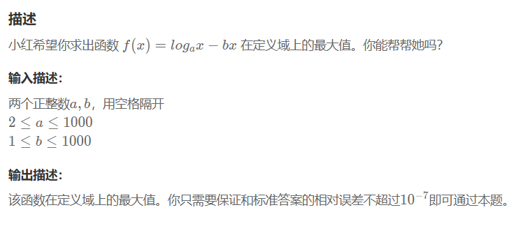

### **OR246** **小红的函数最大值**

https://www.nowcoder.com/share/jump/2890670641745158100936

>
>
>## 示例1
>
>输入：
>
>```
>2 1
>```
>
>复制
>
>输出：
>
>```
>-0.9139286679
>```


##### 思路：

https://blog.csdn.net/xueruixuan/article/details/78780105


##### 代码:

```C++
#include <iostream>
#include <cmath> //log
#include <iomanip>
using namespace std;
int main() {
    int a, b;
    cin>>a>>b;
    long double x = 1/(b*log(a)); // 其实这题 double 即可 ，不过可以顺便学习下面的printf("%.10Lf",y);Lf写法
    long double y = (log(x)/log(a))-b*x;
    //printf("%.10Lf",y); // 写法1 可以
    cout << fixed << setprecision(10) << y << endl;//#include <iomanip> // 写法2 可以
}
// 64 位输出请用 printf("%lld")
```


##### 拓展：float和double

1、数值范围

float和double的范围是由指数的位数来决定的。

float的指数位有8位，而double的指数位有11位，分布如下：

float：

| 1bit（符号位） | 8bits（指数位） | 23bits（尾数位） |
| :------------- | :-------------- | :--------------- |
|                | `-127~+128`     |                  |

double：

| 1bit（符号位） | 11bits（指数位） | 52bits（尾数位） |
| :------------- | :--------------- | :--------------- |
|                | `-1023~+1024`    |                  |

于是，float的指数范围为`-127~+128`，而double的指数范围为`-1023~+1024`，并且指数位是按补码的形式来划分的。

其中负指数决定了浮点数所能表达的绝对值最小的非零数；

而正指数决定了浮点数所能表达的绝对值最大的数，也即决定了浮点数的取值范围。

float的范围为-2^128 ~ +2^128，也即-3.40E+38 ~ +3.40E+38；

double的范围为-2^1024 ~ +2^1024，也即-1.79E+308 ~ +1.79E+308。 (E:2.718281828459045)

2、精度

float和double的精度是由尾数的位数来决定的。浮点数在内存中是按科学计数法来存储的，其整数部分始终是一个隐含着的“1”，由于它是不变的，故不能对精度造成影响。

float：2^23 = 8388608，一共七位，这意味着最多能有7位有效数字，但绝对能保证的为6位，也即float的精度为6~7位有效数字；

double：2^52 = 4503599627370496，一共16位，同理，double的精度为15~16位。


### OR245 1=N

https://www.nowcoder.com/share/jump/2890670641745158113417

>## 描述
>
>输入n，能构成n的比如`a*b*c*d = n`，求因子之和最小值（如`a+b+c+d`）
>
>## 示例1
>
>输入 \( N = 12 \)，输出 \( 7 \)。
>
>- 操作1：选择 \( K = 2 \)，支付 \( 2 \)，\( X = 1* 2 = 2 \)。
>- 操作2：选择 \( K = 2 \)，支付 \( 2 \)，\( X = 2 * 2 = 4 \)。
>- 操作3：选择 \( K = 3 \)，支付 \( 3 \)，\( X = 4 * 3 = 12 \)。
>- 总成本：\( 2 + 2 + 3 = 7 \)。
>
>输入：
>
>```
>12
>```
>
>输出：
>
>```
>7 
>```

```C++
#include <iostream>
#include <vector>
using namespace std;
int main() {
    int n;
    cin>>n;
    int b=2;
    int ans=0;
    while(n!=1)
    {
        if(n%b==0) // 2
        {
            ans+=b;
            n/=b;
        }
        else
        {
            b++;
        }
    }
    cout<<ans;
    return 0;
}
// 64 位输出请用 printf("%lld")
```

贪心） `a,b>=2,a+b <= a*b`


### **AB1** **【模板】栈**

题目：https://www.nowcoder.com/share/jump/2890670641745159180177

来自https://www.nowcoder.com/exam/oj?page=1&tab=%E7%AE%97%E6%B3%95%E7%AF%87&topicId=308

>## 描述
>
>请你实现一个栈。
>
>操作：
>
>push x：将 加x *x* 入栈，保证 x *x* 为 int 型整数。
>
>pop：输出栈顶，并让栈顶出栈
>
>top：输出栈顶，栈顶不出栈
>
>### 输入描述：
>
>第一行为一个正整数 n *n* ，代表操作次数。(1≤n≤100000)(1≤*n*≤100000)
>
>接下来的 n *n* ，每行为一个字符串，代表一个操作。保证操作是题目描述中三种中的一种。
>
>### 输出描述：
>
>如果操作为push，则不输出任何东西。
>
>如果为另外两种，若栈为空，则输出 "error“
>
>否则按对应操作输出。
>
>## 示例1
>
>输入：
>
>```
>6
>push 1
>pop
>top
>push 2
>push 3
>pop
>```
>
>输出：
>
>```
>1
>error
>3
>```


emm 数组模拟栈？这题没啥意思。可能想让你用index这种来做吧

``` C++
#include <iostream>
#include <vector>
// #include <stack>
using namespace std;
//2216
int main() {
    int n;
    cin>>n;
    string str;
    int a;
    vector<int> stk;
    for(int i=0;i<n;i++)
    {
        cin>>str;
        if(str=="push")
        {
            cin>>a;
            stk.push_back(a);
        }
        else if(str == "pop")
        {
            if(stk.empty())cout<<"error"<<endl;
            else 
            {
                cout<<stk.back()<<endl;
                stk.pop_back();
            }
        }
        else if(str == "top")
        {
            if(stk.empty())cout<<"error"<<endl;
            else 
                cout<<stk.back()<<endl;
        }
    }
}
// 64 位输出请用 printf("%lld")
```


直接用stack （不用看 这题应该是要让你模拟一个栈吧。。）

```C++
#include <iostream>
#include <vector>
#include <stack>
using namespace std;
//2216
int main() {
    int n;
    cin>>n;
    string str;
    int a;
    stack<int> stk;
    for(int i=0;i<n;i++)
    {
        cin>>str;
        if(str=="push")
        {
            cin>>a;
            stk.emplace(a);
        }
        else if(str == "pop")
        {
            if(stk.empty())cout<<"error"<<endl;
            else 
            {
                cout<<stk.top()<<endl;
                stk.pop();
            }
        }
        else if(str == "top")
        {
            if(stk.empty())cout<<"error"<<endl;
            else 
                cout<<stk.top()<<endl;
        }
    }
}
// 64 位输出请用 printf("%lld")
```


### **AB31** **活动安排**

https://www.nowcoder.com/share/jump/2890670641745160749501

>

```C++
#include <algorithm>
#include <iostream>
#include <vector>
using namespace std;
//2235
struct ActivityTime
{
    int startTime;
    int endTime;
};
int main() {
    int n;
    cin>>n;
    int a,b;
    //记录每个格子重叠情况，删除了某一段，将这段的格子都--
    //排序每个格子的重叠情况，最大的重叠格子也为1 即可以
    // 每段与别的格子重叠的情况记录
    vector<ActivityTime> v(n);
    for(int i=0;i<n;i++)
    {
        cin>>a>>b;
        v[i].startTime = a;
        v[i].endTime = b;
    }
    sort(v.begin(),v.end(),[](const ActivityTime &a,const ActivityTime &b)
    {
        return a.endTime<b.endTime;
    });
    int earlyEndTime=0;
    int cnt=0;
    for(const ActivityTime& at:v)
    {
        if(earlyEndTime<=at.startTime)
        {
            cnt++;
            earlyEndTime = at.endTime;
        }
    }
    cout<<cnt;
}
// 64 位输出请用 printf("%lld")
```

补充:

> ### 问题描述
> 我们有 N 个活动，每个活动有开始时间 \( s_i \) 和结束时间 \( f_i \)。同一时间只能安排一个活动，目标是选择尽可能多的不冲突的活动（即它们的区间不重叠）。
>
> ### 贪心策略
> **按结束时间排序**：将所有活动按照结束时间 \( f_i \) 从小到大排序，然后依次选择结束时间最早且不与已选活动冲突的活动。
>
> ### 为什么这种贪心策略是正确的？
> 我们需要证明：**按结束时间排序后，贪心选择能获得最大活动数**。
>
> #### 证明思路（数学归纳法 + 交换论证）
> 1. **最优解的第一个活动可以替换为贪心选择的活动**：
>    - 设最优解 $\text{OPT} = \{ a_1, a_2, \dots, a_k \}$，其中 \( a_1 \) 是选择出来的第一个活动。
>    - 贪心解 $\text{GREEDY}$ 的第一个活动 $g_1$ 是结束时间最早的活动。
>    - 由于 \( g_1 \) 是所有活动中结束最早的，所以 $f_{g_1} \leq f_{a_1}$。
>    - 用 \( g_1 \) 替换 \( a_1 \)，剩下的活动仍然可以安排（因为 \( g_1 \) 结束更早，不会影响后续选择）。
>    - 因此，存在一个最优解以贪心选择开始。
>
> 2. **归纳假设**：
>    - 假设前 \( i \) 个活动可以用贪心选择构造最优解。
>    - 对于第 \( i+1 \) 个活动，贪心策略会选择结束时间最早且不与前 \( i \) 个冲突的活动。
>    - 类似地，可以用贪心选择替换最优解的第 \( i+1 \) 个活动，而不减少总活动数。
>
> 3. **结论**：
>    - 贪心策略构造的解与某个最优解一致，因此贪心解就是最优解。
>
> #### 直观理解
> - **结束时间早的活动给后续活动留出更多时间**，因此优先选择它们能最大化剩余可安排的活动数。
> - 如果选择结束较晚的活动，可能会“挡住”更多潜在的可选活动。
>
> ---
>
> ### 力扣上的类似题目
> 力扣上有一道非常相似的题目：
>
> #### [435. 无重叠区间 (Non-overlapping Intervals)](https://leetcode-cn.com/problems/non-overlapping-intervals/)
> - **题目**：给定一组区间，计算最少需要移除多少个区间，才能使剩余区间互不重叠。
> - **解法**：等价于“选择最多不重叠区间”，即本题的贪心策略。按结束时间排序后统计不重叠区间数，再用总数减去它。
>
> #### [452. 用最少数量的箭引爆气球 (Minimum Number of Arrows to Burst Balloons)](https://leetcode-cn.com/problems/minimum-number-of-arrows-to-burst-balloons/)
> - **题目**：气球用区间表示，箭可以垂直向上射，求引爆所有气球所需的最少箭数。
> - **解法**：本质是“找最多不重叠区间组”，因为每组不重叠区间需要一支箭。同样按结束时间排序。
>
> ---
>
> ### 代码实现（C++）
> ```cpp
> #include <vector>
> #include <algorithm>
> using namespace std;
> 
> int maxActivities(vector<vector<int>>& intervals) {
>     if (intervals.empty()) return 0;
>     // 按结束时间排序
>     sort(intervals.begin(), intervals.end(), [](const vector<int>& a, const vector<int>& b) {
>         return a[1] < b[1];
>     });
>     int count = 1;
>     int last_end = intervals[0][1];
>     for (int i = 1; i < intervals.size(); i++) {
>         if (intervals[i][0] >= last_end) { // 不冲突
>             count++;
>             last_end = intervals[i][1];
>         }
>     }
>     return count;
> }
> ```
>
> ### 总结
> - **贪心策略**：按结束时间排序，每次选结束最早且不冲突的活动。
> - **正确性**：通过替换法证明贪心解即最优解。
> - **力扣题目**：435（无重叠区间）、452（引爆气球）是直接应用。
