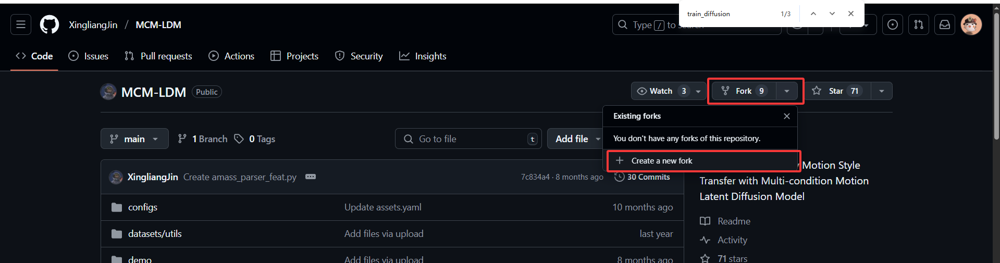

# Github 进阶操作

平时做项目的时候，主要用的比较多的就是git add，commit，pull，push这几个操作。但实际上我们很多业务需要在前人已有的工作基础上去做改动或者优化，这篇笔记也是用来记录一下怎么在前人基础上对项目进行优化。


# 一、Fork别人的仓库

## 1.Fork

这里以这个仓库为例：https://github.com/XingliangJin/MCM-LDM/tree/main。我们想基于这个仓库进行改动，以下进行介绍。

在Github上Fork目标仓库的过程：



保持原仓库名不变就行（这是比较推荐的做法），但是可以改一下Description：

> Fork for personal testing of new features. Original repo: https://github.com/XingliangJin/MCM-LDM/tree/main


## 2.clone到本地

以往我们都是HTTPS直接clone到本地，但现在我们可以看一下SSH的操作如何来做，这对于远程服务器操作来说会比较方便一些。

### （1）SSH配置

> 当然！深入理解 SSH 是在服务器上进行专业开发的关键一步，你问的这个问题非常重要。我们来彻底搞懂它。
>
> ### **核心概念：SSH 密钥对是什么？**
>
> 想象一下，SSH 密钥对就像一把**私钥**和一把**公钥**。
>
> *   **私钥 (Private Key)**：这是你的秘密钥匙，**必须、永远、只能**存放在你的电脑或服务器上，绝对不能泄露给任何人。它相当于你的密码，但比密码安全得多。文件名通常是 `id_rsa` 或 `id_ed25519`。
> *   **公钥 (Public Key)**：这是可以公开的“锁”。你可以把这把锁交给任何你想授权访问的系统，比如 GitHub。GitHub 会把这把锁放在你的账户门口。文件名通常是 `id_rsa.pub` 或 `id_ed25519.pub`。
>
> **工作流程是这样的：**
> 当你的服务器尝试连接 GitHub 时，它会说：“嘿，我是这台服务器，这是我的身份证明（私钥）。”
> GitHub 会拿出你之前给它的公钥（锁），尝试和你服务器的私钥（钥匙）进行匹配。如果匹配成功，GitHub 就确认了你的身份，允许你进行操作，全程无需你输入密码。
>
> ---
>
> ### **第一部分：在你的 Linux 服务器上配置 SSH 密钥**
>
> 这是一个**一次性**的配置。只要服务器不重装系统，配置一次就一直有效。
>
> #### **步骤 1：检查是否已存在 SSH 密钥**
>
> 首先，登录你的 Linux 服务器，在终端里输入以下命令，检查 `~/.ssh` 目录下是否已经有密钥文件了：
> ```bash
> ls -al ~/.ssh
> ```
> *   **如果看到 `id_rsa.pub` 或 `id_ed25519.pub` 这样的文件**：说明你可能之前已经生成过密钥了。你可以直接使用它，跳到 **步骤 3**。
> *   **如果提示 "No such file or directory" 或者该目录下没有这些文件**：说明你需要创建一个新的密钥。请继续 **步骤 2**。
>
> #### **步骤 2：生成新的 SSH 密钥对**
>
> 1.  在终端执行以下命令。我们使用 `ed25519` 算法，它比传统的 `rsa` 更现代、更安全。记得把命令中的邮箱换成你自己的。
>     ```bash
>     ssh-keygen -t ed25519 -C "your_email@example.com"
>     ```
> 2.  接下来，终端会问你几个问题：
>     *   `Enter file in which to save the key (/home/your_username/.ssh/id_ed25519):`
>         直接按 **回车 (Enter)** 即可，它会使用默认路径。
>     *   `Enter passphrase (empty for no passphrase):`
>         这里是让你为私钥设置一个额外的密码。
>         *   **直接回车**：不设置密码。以后 `git push/pull` 就完全自动化，最方便。
>         *   **输入密码**：每次使用这个密钥时（比如 `git push`），都需要输入这个密码。更安全，但稍显麻烦。
>         **对于个人服务器，直接回车不设密码是常见的做法。**
>     *   `Enter same passphrase again:`
>         如果上一步设置了密码，就再输一次确认。没设置就直接回车。
>
> 3.  完成后，你会看到类似这样的输出，代表密钥对已经成功生成：
>     ```
>     Your identification has been saved in /home/your_username/.ssh/id_ed25519
>     Your public key has been saved in /home/your_username/.ssh/id_ed25519.pub
>     The key fingerprint is:
>     SHA256:xxxxxxxxxxxxxxxxxxxxxxxxxxxxxxxxxxx your_email@example.com
>     The key's randomart image is:
>     +--[ED25519 256]--+
>     |        ..o.o    |
>     |         o o .   |
>     |        . . o    |
>     ...
>     ```
>
> #### **步骤 3：将公钥添加到你的 GitHub 账户**
>
> 1.  首先，我们需要查看并复制你的**公钥**内容。在服务器终端输入：
>     ```bash
>     cat ~/.ssh/id_ed25519.pub
>     ```
> 2.  终端会显示一长串以 `ssh-ed25519` 开头，以你的邮箱结尾的字符。**完整地复制这一整串文本**。
>
> 3.  现在，打开浏览器，登录你的 GitHub：
>     *   点击右上角的头像，选择 **Settings**。
>     *   在左侧菜单中，点击 **SSH and GPG keys**。
>     *   点击右上角的绿色按钮 **New SSH key**。
>     *   **Title**：给这个密钥起一个你能认出来的名字，比如 `My Linux Server` 或 `Tencent Cloud Ubuntu`。
>     *   **Key type**: 保持 `Authentication Key` 即可。
>     *   **Key**：把你刚才从服务器复制的那一整串公钥文本，**粘贴**到这个大输入框里。
>     *   点击 **Add SSH key**。GitHub 可能会要求你再输入一次登录密码来确认。
>
> **至此，配置完成！** 你的服务器现在有了“钥匙”，GitHub 也有了匹配的“锁”。
>
> ---
>
> ### **第二部分：使用 SSH 方式克隆仓库**
>
> 现在我们回到刚才的克隆步骤，但这次使用 SSH。
>
> 1.  **获取 SSH 克隆地址**：
>     *   回到你 Fork 的仓库页面 (`https://github.com/你的用户名/MCM-LDM`)。
>     *   点击绿色的 **`< > Code`** 按钮。
>     *   这次，请选择 **SSH** 选项卡。
>     *   复制那个以 `git@github.com:` 开头的地址。它看起来是这样的：
>         `git@github.com:你的用户名/MCM-LDM.git`
>
> 2.  **在 Linux 服务器上执行克隆**：
>     *   `cd` 到你希望存放项目的目录。
>     *   执行 `git clone` 命令：
>         ```bash
>         git clone git@github.com:你的用户名/MCM-LDM.git
>         ```
>
> 3.  **首次连接的确认**：
>     如果是你这台服务器**第一次**通过 SSH 连接 GitHub，终端会显示这样一段信息：
>     ```
>     The authenticity of host 'github.com (20.205.243.166)' can't be established.
>     ED25519 key fingerprint is SHA256:+DiY3wvvV6TuJJhbpZisF/zLDA0zPMSvHdkr4UvCOqU.
>     Are you sure you want to continue connecting (yes/no/[fingerprint])?
>     ```
>     这是正常的安全提示。输入 **`yes`** 并按回车。这会把 GitHub 的公钥指纹添加到你服务器的“信任列表”中（一个名为 `known_hosts` 的文件），以后就不会再问了。
>
> 克隆过程会顺利开始并完成。从此以后，你在这台服务器上对此仓库（以及你账户下其他任何仓库）进行 `push`、`pull` 等操作，都**不再需要输入用户名和密码**了。
>
> ---
>
> ### **第三部分：回答你的问题 —— “如果我换服务器了会有影响么？”**
>
> **绝对有影响！** 这是一个关键点。
>
> SSH 密钥对是**与你生成它的那台机器绑定的**。你的私钥（钥匙）存储在旧服务器的 `~/.ssh` 目录里。当你换到一台全新的服务器时，新服务器上自然没有这个密钥。
>
> 你有两种选择：
>
> 1.  **最佳实践（最安全、最推荐）**：
>     在新服务器上，**重复我们上面讲的配置步骤**：生成一套**新的**密钥对，然后把这个**新的**公钥添加到你的 GitHub 账户。你的 GitHub 账户可以关联多个公钥，分别对应你的笔记本、你的A服务器、你的B服务器等。这是最规范的做法。
>
> 2.  **备用方案（不推荐，但可行）**：
>     如果你想在多台服务器上使用同一个密钥，你需要手动、安全地把**私钥**文件（`id_ed25519`）和**公钥**文件（`id_ed25519.pub`）从旧服务器拷贝到新服务器的 `~/.ssh` 目录下。**这个过程必须通过安全的方式（如 `scp`）进行，因为私钥的泄露是严重的安全问题。**
>
> **总结：**
> SSH 提供了无密码的便捷和高安全性。它的核心是一次性配置，然后一劳永逸。当你换机器时，请记住“密钥跟着机器走”，所以最好的方法是为新机器生成新密钥。
>
> 现在，你的项目已经通过 SSH 的方式成功克隆到本地了。下一步，我们就可以讨论如何忽略不需要提交的文件了。准备好后请告诉我！


### （2）clone的指令：

```bash
git clone git@github.com:hhlovesyy/MCM-LDM.git
```

按照上面的步骤配置好公钥和私钥之后，以上的指令应该就可以正确运行了。


## 3.使用.gitignore文件

> 好的，我们来处理下一个非常实际的问题：**如何忽略文件**。
>
> 在任何一个项目中，总会有一些文件是我们不希望纳入版本控制的。比如：
>
> *   **编译产生的文件**：像 `.pyc` (Python 编译文件)、`.o`、`.exe` 等。
> *   **日志文件**：`.log` 文件，它们在每次运行时都可能变化。
> *   **临时的环境文件**：Python 的虚拟环境文件夹 (如 `venv/`, `env/`)。
> *   **敏感信息**：包含密码、API 密钥的配置文件 (如 `config.ini`, `.env`)。
> *   **大型数据集**：`.csv`, `.zip`, `.jpg` 等，Git 不擅长管理大的二进制文件。
> *   **IDE 或编辑器配置文件**：如 `.vscode/`, `.idea/`。
>
> 把这些文件加入 Git 会让仓库变得臃肿，也可能泄露敏感信息。解决方案就是使用 `.gitignore` 文件。
>
> ### **什么是 `.gitignore` 文件？**
>
> `.gitignore` 是一个纯文本文件，它的作用是告诉 Git：“请忽略掉这些文件或文件夹，不要跟踪（track）它们的任何变动。”
>
> Git 会检查仓库根目录以及各级子目录下的 `.gitignore` 文件，根据里面列出的规则来决定哪些文件不被 `git add` 命令所包含。
>
> ---
>
> ### **`.gitignore` 文件添加的最佳时机**
>
> 你问到了一个关键点：“添加的时机是什么时候？”
>
> ==**最佳时机是：在项目的最开始，甚至在 `git add .` 第一次提交之前。**==
>
> 为什么？
>
> 想象一下，如果你已经 `git add` 并 `commit` 了一个不该提交的文件（比如一个巨大的数据集 `data.zip`）。之后你再把它加入 `.gitignore`，**Git 不会主动帮你删除已经存在于版本历史中的那个文件**。`.gitignore` 只对**尚未被跟踪 (untracked)** 的文件有效。
>
> 如果你不小心提交了，后续需要用更复杂的命令（如 `git rm --cached <file>`）来从 Git 的暂存区中移除它，这会增加一次额外的提交，也可能让仓库历史变得不那么干净。
>
> **所以，标准流程是：**
> 1.  `git init` 或 `git clone` 一个项目。
> 2.  **立刻创建或完善 `.gitignore` 文件。**
> 3.  然后才开始 `git add .` 和 `git commit`。
>
> 不过别担心，即使是项目进行到中途，你随时都可以添加或修改 `.gitignore` 文件。这非常常见。
>
> ---
>
> ### **如何创建和配置 `.gitignore`**
>
> 我们现在就为你克隆的 `MCM-LDM` 项目创建一个 `.gitignore` 文件。
>
> #### **步骤 1：检查项目是否已有 `.gitignore`**
>
> 首先，进入项目目录，看看原作者是否已经提供了一个。
> ```bash
> cd ~/path/to/your/MCM-LDM  # 切换到你的项目目录
> ls -a
> ```
> 我查了一下原始仓库，它**没有**包含 `.gitignore` 文件。所以我们需要自己创建一个。
>
> #### **步骤 2：创建并编辑 `.gitignore` 文件**
>
> 在项目**根目录**下（也就是 `MCM-LDM/` 目录下），创建一个名为 `.gitignore` 的文件。你可以用 `vim`, `nano` 或者任何你熟悉的 Linux 文本编辑器。
>
> ```bash
> # 使用 nano 创建并编辑
> nano .gitignore
> 
> # 或者使用 vim
> # vim .gitignore
> ```
>
> #### **步骤 3：添加忽略规则**
>
> 现在，在打开的编辑器中，我们来添加一些常见的、针对 Python 项目的忽略规则。每一行代表一个规则。
>
> 这是一个很好的起点，你可以把下面的内容复制粘贴进去：
>
> ```gitignore
> # 字节码和编译文件
> __pycache__/
> *.py[cod]
> *$py.class
> 
> # Python 虚拟环境
> # 这条规则非常重要，可以防止你把整个虚拟环境提交上去
> venv/
> env/
> .venv/
> .env/
> */venv/
> */env/
> */.venv/
> */.env/
> 
> # IDE 和编辑器配置文件
> .vscode/
> .idea/
> *.swp
> *.swo
> 
> # 日志和数据文件
> *.log
> *.log.*
> *.csv
> *.zip
> *.pth  # 常见的模型权重文件，通常很大
> *.ckpt # 常见的模型检查点文件
> 
> # 存放本地实验结果或数据的文件夹 (自定义)
> # 比如你创建了一个 outputs/ 文件夹来存放生成的图片，你可能不想提交它
> outputs/
> datasets/
> 
> # 操作系统生成的文件
> .DS_Store
> Thumbs.db
> ```
>
> **规则解释：**
> *   `#` 开头的是注释。
> *   `/` 结尾表示忽略整个目录，例如 `venv/`。
> *   `*` 是通配符，匹配任意字符。例如 `*.log` 会忽略所有以 `.log` 结尾的文件。
>
> 编辑完成后，保存并退出编辑器。（在 `nano` 中是 `Ctrl + X`，然后按 `Y`，再按 `Enter`）
>
> #### **步骤 4：提交你的 `.gitignore` 文件**
>
> `.gitignore` 文件本身**是需要被提交到仓库里的**。这样，团队里的其他成员（或者未来的你）在克隆这个仓库时，也能享受到同样的忽略规则，保证了协作的一致性。
>
> 现在，我们可以进行一次提交，把这个重要的文件加入版本历史。
>
> 1.  **查看状态**，你会发现 Git 检测到了你新建的 `.gitignore` 文件。
>     ```bash
>     git status
>     ```
>     输出会类似这样：
>     ```
>     On branch main
>     Your branch is up to date with 'origin/main'.
>     
>     Untracked files:
>       (use "git add <file>..." to include in what will be committed)
>             .gitignore
>     
>     nothing added to commit but untracked files present (use "git add" to track)
>     ```
>
> 2.  **添加文件到暂存区**
>     ```bash
>     git add .gitignore
>     ```
>
> 3.  **提交改动**
>     ```bash
>     git commit -m "feat: Add .gitignore for Python project"
>     ```
>     *(小技巧：一个好的 commit message 很重要。`feat:` 表示这是一个新功能（feature），`fix:` 表示修复 bug，`docs:` 表示修改文档等，这是一种流行的提交规范，叫做 Conventional Commits。)*
>
> ---
>
> ### **我现在可以改动这个仓库么？**
>
> **当然可以！**
>
> 从你 `fork` 并且 `clone` 到本地的那一刻起，这个位于你服务器上的 `MCM-LDM` 文件夹就是一个完全属于你的沙盒。你可以：
> *   **修改任何代码**：比如修改 `train.py` 里的参数。
> *   **添加新文件**：比如创建一个新的脚本 `my_test.py`。
> *   **删除文件**。
>
> **有了 `.gitignore` 之后，你就可以放心大胆地改动了。** 比如，你可以创建一个 Python 虚拟环境，安装依赖，运行代码生成一些图片到 `outputs/` 文件夹。当你运行 `git status` 时，你会发现 Git 很“聪明”地忽略了 `venv/` 和 `outputs/` 这些目录，只提示你被修改过的代码文件。
>
> **总结一下：**
>
> 1.  `.gitignore` 是用于声明忽略规则的文件，防止不必要的文件进入版本库。
> 2.  最佳实践是在项目初期就创建好它。
> 3.  它本身也应该被提交到仓库中，以供团队共享。
> 4.  现在你已经完成了所有准备工作，可以自由地修改代码、进行实验了。
>
> 接下来，你可以尝试对项目做一些实际的改动。比如创建一个新的测试文件，或者修改一下 `README.md`。改动完成后，告诉我，我们就可以走完最后一步：**`push` 你的改动到你自己的 GitHub 仓库**。

==请注意：如果我们跑出来了新的不应该被push到远程仓库的文件，应该在add指令之前对.gitignore文件进行内容的添加，否则会比较麻烦一些。==牢记：任何修改都需要先看看.gitignore文件是否需要更新，然后再add->commit->push。


## 4.push到远程的仓库上

```shell
git push origin main
```

完整的这一步骤的说明可以看下面的部分：

> 太棒了！我们现在就来完成这最后关键的一步，把你本地的改动同步到你 GitHub 上的个人仓库。
>
> 这个操作的指令是 `git push`。
>
> ---
>
> ### **核心概念：`git push` 是做什么的？**
>
> `git push` 命令用于将你本地仓库中已经**提交 (commit)** 的改动，上传到你指定的远程仓库。
>
> 它有两个关键参数：
>
> 1.  **远程仓库的名称 (Remote Name)**：还记得我们之前用 `git remote -v` 看到的 `origin` 吗？它就是你 Fork 来的、位于你自己 GitHub 账号下仓库的别名。
> 2.  **分支的名称 (Branch Name)**：你目前工作的分支。当你克隆一个项目时，默认会处于一个名为 `main`（或 `master`）的主分支上。
>
> 所以，一个完整的 `push` 命令通常写成 `git push <remote_name> <branch_name>`，例如 `git push origin main`。
>
> ---
>
> ### **操作步骤**
>
> #### **第一步：确认本地的提交状态**
>
> 在 push 之前，养成一个好习惯：先用 `git status` 检查一下当前的工作区状态。
>
> ```bash
> git status
> ```
>
> 你应该会看到类似这样的信息：
> ```
> On branch main
> Your branch is ahead of 'origin/main' by 1 commit.
>   (use "git push" to publish your local commits)
> 
> nothing to commit, working tree clean
> ```
> *   `On branch main`：告诉你当前在 `main` 分支上。
> *   `Your branch is ahead of 'origin/main' by 1 commit.`：这句是关键！它明确地告诉你，你的本地仓库比远程仓库 `origin` 的 `main` 分支多了一个提交（就是我们刚才 commit 的 `.gitignore`）。
> *   `nothing to commit, working tree clean`：表示你没有其他未保存的改动了，工作区是干净的。
>
> 这个状态表明，我们已经准备好可以推送了。
>
> #### **第二步：执行 `git push` 命令**
>
> 现在，在你的终端里，输入以下命令：
>
> ```bash
> git push origin main
> ```
>
> *   `git push`：是命令本身。
> *   `origin`：告诉 Git，我们要推送到名为 `origin` 的远程仓库（也就是你 GitHub 上的那个 Fork）。
> *   `main`：告诉 Git，我们要推送的是本地 `main` 分支上的改动，并且希望更新到远程仓库的 `main` 分支。
>
> **便捷写法 (首次推送后)**
>
> 对于大多数现代 Git 版本，当你首次成功执行 `git push origin main` 后，Git 可能会提示你设置上游分支（upstream branch）。如果你按照提示操作（通常是 `git push --set-upstream origin main`），或者你的 Git 配置已经默认这样做了，那么从第二次推送开始，你就可以简化命令，直接输入：
> ```bash
> git push
> ```
> Git 会自动知道你要推送到 `origin` 的 `main` 分支。不过，为了清晰和避免错误，显式地写出 `git push origin main` 永远是不会错的。
>
> #### **第三步：验证推送结果**
>
> 命令执行后，如果一切顺利，你会看到类似下面的输出：
> ```
> Enumerating objects: 4, done.
> Counting objects: 100% (4/4), done.
> Delta compression using up to 8 threads
> Compressing objects: 100% (2/2), done.
> Writing objects: 100% (3/3), 450 bytes | 450.00 KiB/s, done.
> Total 3 (delta 0), reused 0 (delta 0), pack-reused 0
> To github.com:你的用户名/MCM-LDM.git
>    abcdef..1234567  main -> main
> ```
> 最后一行 `main -> main` 明确表示，你本地的 `main` 分支的更新已经成功推送到了远程的 `main` 分支。
>
> **最后，去 GitHub 网站上确认一下：**
>
> 刷新你 Fork 的那个仓库页面 (`https://github.com/你的用户名/MCM-LDM`)。
>
> 你会惊喜地发现：
> 1.  文件列表中出现了你刚刚添加的 `.gitignore` 文件。
> 2.  在文件列表的右侧，最新一次提交的记录会显示你的 commit message，比如 "feat: Add .gitignore for Python project"。
>
> ---
>
> ### **总结我们走过的完整流程**
>
> 恭喜你！我们已经一起走完了一个非常完整且专业的 Git 工作流：
>
> 1.  **Fork**：在 GitHub 上，将别人的项目 (`XingliangJin/MCM-LDM`) 复制一份到你自己的账号下，创建了一个属于你的云端副本。
> 2.  **配置 SSH**：在你的 Linux 服务器上配置了 SSH 密钥，实现了与 GitHub 之间安全、免密地通信。
> 3.  **Clone**：使用 `git clone` 和 SSH 地址，将你自己的云端仓库拉取到本地服务器，创建了一个本地工作区。
> 4.  **修改 (Ignore)**：在本地创建了 `.gitignore` 文件，告诉 Git 忽略不需要版本控制的文件和目录。
> 5.  **Add & Commit**：使用 `git add` 和 `git commit` 将 `.gitignore` 这个改动保存到你的本地版本历史中。
> 6.  **Push**：使用 `git push` 将本地的提交推送回你自己的 GitHub 远程仓库，实现了本地与云端的同步。
>
> 现在，你已经掌握了如何基于一个现有项目进行独立开发和版本管理的核心技能。未来你对这个项目的任何修改，都将重复 **修改 -> Add -> Commit -> Push** 这个循环。
>
> 接下来我们还可以探讨更多高级话题，比如：
> *   如何同步原作者仓库的更新？(非常重要！)
> *   如何创建和管理分支 (branch) 来开发新功能？
> *   如何发起一个 Pull Request，向原作者贡献代码？
>
> 你对哪个话题最感兴趣，或者有其他任何问题，随时都可以提出来！

接下来的话题：

- 如何同步原作者仓库的更新？(非常重要！)
- 如何创建和管理分支 (branch) 来开发新功能？
- 如何发起一个 Pull Request，向原作者贡献代码？


# 二、创建和管理分支来开发新功能？

这里以我们之前在MCM-LDM这篇工作的基础上，做的DCE模块为例。

> 太棒了！这正是 Git 最强大、最核心的功能之一。学会使用分支，就等于从“单人存档”模式升级到了“专业团队协作”模式。
>
> 我们来深入探讨一下分支（Branch）的标准化工作流程。
>
> ### **一、为什么需要分支？（核心理念）**
>
> 想象一下，你的 `main` 分支是你的产品的**正式发布版本**，它必须永远是稳定、可靠、可随时部署的。
>
> 现在，你要开发一个新功能（比如添加一个新模块）。这个过程可能需要好几天，中间可能会有 Bug，代码可能是半成品。如果你直接在 `main` 分支上修改，会发生什么？
>
> 1.  整个项目在开发期间处于不稳定状态。
> 2.  如果这时线上版本出了一个紧急 Bug 需要修复，你的 `main` 分支一团糟，根本没法立刻拉出一个干净的版本来修复。
> 3.  如果这个新功能最后被证明是失败的，你想撤销所有改动会非常困难，像是在一盘炒饭里把葱花挑出来一样。
>
> **分支就是为了解决这个问题而生的。**
>
> 创建一个新分支，就像是为你的项目开辟了一个**平行的时空**或**独立的沙盒**。你可以在这个平行时空里随意实验、修改、提交，甚至搞得一团糟，都**完全不会影响到 `main` 分支这个主时空**。
>
> ---
>
> ### **二、标准的“功能分支”工作流 (Feature Branch Workflow)**
>
> 这是业界最流行、最规范的工作流程，完全符合你的需求。
>
> 1.  **从最新的 `main` 分支开始**：确保你的起点是项目最新的、最稳定的状态。
> 2.  **创建新分支**：为你要开发的新功能创建一个专门的分支，并给它起一个有意义的名字。
> 3.  **在新分支上开发**：切换到新分支，然后进行你的所有编码工作（增、删、改文件），并像平常一样进行 `add` 和 `commit`。你可以有任意多次提交。
> 4.  **推送新分支**：将你的本地新分支推送到远程仓库（GitHub），这样你的工作就有了云端备份，也为后续的团队协作（代码审查）做好了准备。
> 5.  **(后续步骤)** **创建拉取请求 (Pull Request)**：当功能开发完毕，你在 GitHub 上发起一个 Pull Request，请求团队成员审查你的代码，并将其合并回 `main` 分支。
> 6.  **(后续步骤)** **合并与清理**：代码审查通过后，将你的功能分支合并到 `main` 分支。`main` 分支现在就包含了你的新功能。最后，可以删除已经完成使命的功能分支。
>
> ---
>
> ### **三、实战操作：为你添加的新模块创建一个分支**
>
> 我们现在就按照这个标准流程，一步步来操作。
>
> #### **步骤 1：准备工作 - 回到并更新 `main` 分支**
>
> 在开始任何新工作前，永远要确保你的 `main` 分支是最新状态。
>
> 1.  **切换回 `main` 分支**
>     ```bash
>     git checkout main
>     ```
>     你会看到提示 `Switched to branch 'main'`。
>
> 2.  **拉取远程 `main` 分支的最新更新**
>     这步非常重要！可以确保你即将创建的分支是基于项目的最新代码，避免未来的合并冲突。
>     ```bash
>     git pull origin main
>     ```
>     由于你之前没有其他人协作，这步可能会提示 `Already up to date.`，这是正常的。
>
> #### **步骤 2：创建并切换到新分支**
>
> 现在，我们来为你“添加新模块”这个功能创建一个名为 `feat/add-test-module` 的分支。
>
> **分支命名规范小贴士：**
> *   **名字要有描述性**：`my-branch` 是不好的名字。
> *   **使用连字符 `-`**：`add-new-module`
> *   **使用分类前缀 (推荐)**：
>     *   `feat/`：开发新功能 (feature)
>     *   `fix/`：修复 Bug
>     *   `docs/`：修改文档
>     *   `refactor/`：代码重构
>
> **执行命令：**
> 有一个快捷命令可以同时完成“创建”和“切换”两个动作：
> ```bash
> git checkout -b feat/add-test-module
> ```
> *   `git checkout`: 切换分支的命令
> *   `-b`: 这是一个选项，告诉 Git 如果这个分支不存在，就**创建 (build)** 一个新的。
>
> 执行后，你会看到输出：
> `Switched to a new branch 'feat/add-test-module'`
>
> **如何确认你当前在哪个分支？**
> *   你的命令行提示符可能已经变了（很多配置好的终端会显示当前分支名）。
> *   运行 `git branch` 命令，当前分支前会有一个 `*` 号标记。
>     ```
>       main
>     * feat/add-test-module
>     ```
>
> #### **步骤 3：在新分支上尽情地工作**
>
> 现在你已经处于 `feat/add-test-module` 这个安全的沙盒里了。你可以开始添加你的新模块了。
>
> 1.  **创建你的新模块文件**
>     ```bash
>     # 比如你在项目根目录创建一个新的 python 文件
>     touch my_new_module.py
>     # 然后用 vim 或 nano 编辑它，加入一些代码
>     nano my_new_module.py
>     ```
>
> 2.  **提交你的改动**
>     这个过程和你之前在 `main` 分支上操作完全一样。你可以多次提交。
>     ```bash
>     # 查看状态，会发现新文件
>     git status
>     
>     # 添加到暂存区
>     git add my_new_module.py
>     
>     # 提交，写一个清晰的 commit message
>     git commit -m "feat: Add initial file for the new test module"
>     ```
>     你可以继续修改、添加、提交，直到你觉得这个功能的某个阶段完成了。
>
> #### **步骤 4：将新分支推送到远程仓库**
>
> 你本地的 `feat/add-test-module` 分支目前只存在于你的服务器上。GitHub 对此一无所知。我们需要把它推送上去。
>
> 因为这是一个全新的分支，第一次推送时，命令需要稍微详细一点：
>
> ```bash
> git push --set-upstream origin feat/add-test-module
> ```
> 或者使用简写：
> ```bash
> git push -u origin feat/add-test-module
> ```
>
> *   `origin`: 你的远程仓库。
> *   `feat/add-test-module`: 你要推送的分支名。
> *   `--set-upstream` 或 `-u`: 这是关键！它会在你的本地分支和远程分支之间建立一个“追踪”关系。这样做的好处是，从下一次开始，当你在这个分支上时，你只需要简单地输入 `git push` 就可以了，Git 会自动知道你要推送到哪里。
>
> **执行后，去你的 GitHub 仓库页面看看。**
> 刷新页面，你会发现多了一个提示，告诉你有一个新分支被推送上来了，并且很可能会有一个绿色的 "Compare & pull request" 按钮。这正是我们为下一步“代码审查和合并”做的准备。
>
> **恭喜！** 你已经完整地体验了专业开发中的分支工作流。你的 `main` 分支安然无恙，所有的新功能开发都在一个独立、安全的环境中进行和备份。
>
> 接下来，你可以随时使用 `git checkout main` 和 `git checkout feat/add-test-module` 在主分支和你的功能分支之间来回切换，体验一下在不同时空穿梭的感觉！