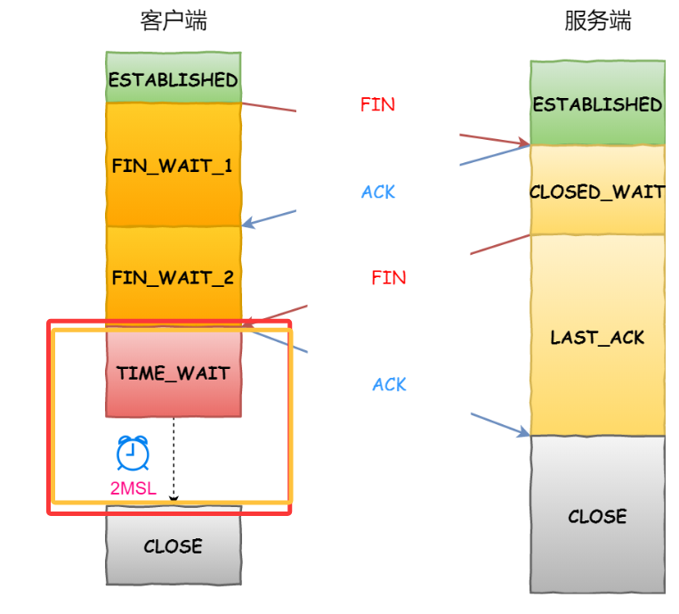
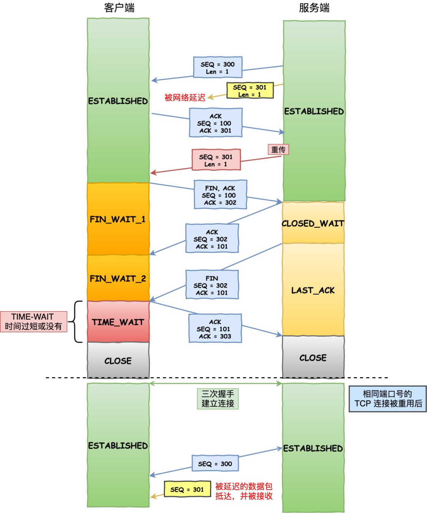

# 2023年快手秋招游戏开发岗笔试


## 编程题

### 1.战力匹配

手游设计了一个新玩法，希望将报名参加玩法的所有玩家分为两组，并使得两组的实力相等，每组的实力即为本组内玩家战力的总和。给定所有玩家的战力值，请你找出是否存在一种划分方案能达到策划目的。

时间限制：C/C++ 1秒，其他语言2秒

空间限制：C/C++ 32M，其他语言64M

输入描述：

```
输入一个正整数n（玩家数量），后续跟随n个整数（每个玩家的战力）
```

输出描述：

```
存在划分方案输出1，不存在输出0
```

也就是 分割等和子集

看了半个小时没找到哪里错了，结果发现是leetcode用多了习惯return，其实acm模式错误的话要**输出cout<<0**再return 结果我找了半个小时的错

```C++
#include <iostream>
#include<vector>
using namespace std;

int main() {
    int n;
    cin >> n;
    vector<int> nums(n, 0);
    int sum = 0;
    for (int i = 0; i < n; i++)
    {
        cin >> nums[i];
        sum += nums[i];
    }
    //if (sum % 2 == 1)return 0;//问题出在这里！！！【❌！！！神经啊这题是acm模式 你tm在main里面return啥呢】
    if (sum % 2 == 1)
    {
        cout << 0 << endl; //问题出在这里！！！【acm模式答案通过输出！！！】
        return 0;
    }
    sum = sum / 2;
    vector<int> dp(sum + 1, 0);
    // dp[i][j]  找到最多使用到i 能否到达j的情况
    //dp[i][j] = dp[i-1][j] | dp[i-1][j-nums[i]];
    //dp[0][0]
    dp[0] = 1;
    for (int i = 0; i < n; i++)
    {
        for (int j = sum; j >= nums[i]; j--)
        {
            dp[j] = dp[j] | dp[j - nums[i]];
        }
    }
    cout << dp[sum];
    return  0;
}
// 64 位输出请用 printf("%lld")
```


### 2.数组最大不相邻之和

给定一个整数数组nums，你需要选取其中的一些数字进行加法运算，使得得到的和最大，但相邻的数字不能同时被选取。请编写一个函数，返回可以获得的最大和，并输出选取的数字的索引。要求：请设计一种时间复杂度为O(n)的算法来解决此问题。

Y：

```C++
#include <iostream>
#include<vector>
#include<sstream>
#include<algorithm>
using namespace std;
//打家劫舍
int main() {

    int num=0;
    vector<int> nums;
    string str;
    getline(cin,str);
    stringstream ss(str);//#include<sstream>
    while(ss>>num)
    {
        nums.push_back(num);
        // cout<<num;
    }
    int n = nums.size();
    vector<int> dp(n+2,0);
    //dp[i] = max(dp[i-1],dp[i-2]+nums[i]);//以这个为结尾 最多抢多少钱
    //dp[i+2] = max(dp[i+1],dp[i]+nums[i]);
    for(int i=0;i<n;i++)
    {
        dp[i+2] = max(dp[i+1],dp[i]+nums[i]);
    }
    // cout<<dp[n+1];
    vector<int> backIdxs;
    //回退输出路径
    for(int i=n-1;i>=0;)//不能放这里 不然会额外减少
    {
        if(dp[i+2]!=dp[i+1])//说明我这一个i抢了
        {
            backIdxs.push_back(i);
            i-=2;
        }
        else
        {
            i--;
        }
    }
    reverse(backIdxs.begin(),backIdxs.end());

    for(int i=0;i<backIdxs.size();i++)
    {
        cout<<backIdxs[i]<<" ";
    }
    cout<<endl;
    cout<<dp[n+1];
}
// 64 位输出请用 printf("%lld")
```

注意这里的输入输出：

> ```C++
> int num=0;
>     vector<int> nums;
>     string str;
>     getline(cin,str);
>     stringstream ss(str);//#include<sstream>
>     while(ss>>num)
>     {
>         nums.push_back(num);
>         // cout<<num;
>     }
> ```

**通过**

>### 代码解释：
>
>1. **输入处理**：使用 `getline` 读取整行输入，然后使用 `stringstream` 解析出每个数字并存入 `nums` 向量。
>2. **动态规划计算**：使用 `dp` 数组计算最大不相邻之和。
>3. **索引追踪**：通过反向遍历 `dp` 数组来追踪被选中的元素的索引。
>4. **输出结果**：输出选中的索引和最大和，索引之间用空格隔开，最后以空格结束。
>
>### 时间复杂度
>
>该算法的时间复杂度为 O(n)*O*(*n*)，空间复杂度为 O(n)*O*(*n*)，其中 n*n* 是输入数组的大小

```C++

#include <iostream>
#include <vector>
#include <sstream>
#include <algorithm>
using namespace std;

pair<vector<int>, int> maxNonAdjacentSum(const vector<int>& nums) {
    int n = nums.size();
    if (n == 0) return {{}, 0};
    if (n == 1) return {{0}, nums[0]};

    vector<int> dp(n);
    dp[0] = nums[0];
    dp[1] = max(nums[0], nums[1]);

    for (int i = 2; i < n; i++) {
        dp[i] = max(dp[i - 1], nums[i] + dp[i - 2]);
    }

    // 反向追踪选中的索引
    vector<int> indices;
    for (int i = n - 1; i >= 0; ) {
        if (i == 0 || dp[i] != dp[i - 1]) {
            indices.push_back(i);
            i -= 2; // 跳过相邻元素
        } else {
            i--;
        }
    }

    // 反转索引以保持从小到大的顺序
    reverse(indices.begin(), indices.end());
    return {indices, dp[n - 1]};
}

int main() {
    string input;
    getline(cin, input); // 读取整行输入
    stringstream ss(input);
    vector<int> nums;
    int num;

    // 解析输入
    while (ss >> num) {
        nums.push_back(num);
    }

    auto result = maxNonAdjacentSum(nums);
    vector<int> indices = result.first;
    int maxSum = result.second;

    // 输出选中的索引
    for (int index : indices) {
        cout << index << " ";
    }
    cout<<endl;
    cout << maxSum << " "; // 输出最大和，最后以空格结束
    return 0;
}

```


**通过**

>要解决这个问题，我们需要找到一个数组中不相邻元素的最大和，并输出这些元素的索引。这个问题可以通过动态规划来解决，同时需要回溯路径以确定选中的索引。
>
>### 方法思路
>
>1. **动态规划计算最大值**：使用两个数组 `inc` 和 `exc`，其中 `inc[i]` 表示包含第 `i` 个元素时的最大和，`exc[i]` 表示不包含第 `i` 个元素时的最大和。通过遍历数组，逐步填充这两个数组。
>2. **回溯路径确定索引**：从最后一个元素开始，根据 `inc` 和 `exc` 的值确定是否选中当前元素。如果选中当前元素，则跳过前一个元素继续检查；否则检查前一个元素。
>3. **反转结果顺序**：由于回溯是从后往前进行的，得到的索引顺序是逆序的，需要反转以获得正确的顺序。

```C++
#include <iostream>
#include <vector>
#include <algorithm>

using namespace std;

int main() {
    vector<int> nums;
    int num;
    while (cin >> num) { //这种输入方式是有风险的 比如visualStudio 就会一直卡住，等待你输入新的
        nums.push_back(num);
    }
    int n = nums.size();
    if (n == 0) {
        cout << 0;
        return 0;
    }
    
    vector<int> inc(n), exc(n);
    inc[0] = nums[0];
    exc[0] = 0;
    for (int i = 1; i < n; ++i) {
        inc[i] = exc[i-1] + nums[i];
        exc[i] = max(inc[i-1], exc[i-1]);
    }
    
    vector<int> res;
    int i = n - 1;
    while (i >= 0) {
        if (inc[i] > exc[i]) {
            res.push_back(i);
            i -= 2;
        } else {
            i -= 1;
        }
    }
    reverse(res.begin(), res.end());
    
    int max_sum = max(inc.back(), exc.back());
    for (int idx : res) {
        cout << idx << " ";
    }
    cout<<endl;
    cout << max_sum;
    
    return 0;
}
```


### 3.计算资源包包含数量【？？】

发布游戏时，通常会进行资源打包。请你完成打包逻辑：

1. 每个资源(Asset)都必须有对用的包(Package)，如果Asset不进入包中那Package记为0。
2. 资源（Asset）存在引用的情况，Asset必须进入对应的Package中，且只能进入一个Package中。
3. 每个资源存在引用情况和无任何引用情况，若存在Asset记录的Package为0但被引用也必须进包。 对于Asset的引用资源都需要进入若有Asset可能会被分配到多个Package中则规定按输入顺序进入。如果Asset已经被标记成一个Package中则不能包含到其他的Package中。

给定Package数量为3，Asset重量的数量为4。记作PNum=3，ANum=4

时间限制：C/C++ 1秒，其他语言2秒

空间限制：C/C++ 32M，其他语言64M

输入描述：

```
输入ANum项数据，每一项包含多个数据AID，PID，RNum，{A1~AK}。
AID：记作资源ID（AssetID）, 1<=AID<=ANum。
PID：记作 包ID（PackageID）0 <= PID <= PNum。
RNum：记作引用个数 0 <= RNum <= ANum。
{A1~AK}：记作引用资源的ID（AssetID），需要考虑去重。
```

输出描述：

```
N个数字，表示每个Package内Asset的数量。
```

示例1

输入例子：

```
1,0,0 2,1,0 3,2,2,2,1 4,3,1,1
```

输出例子：

```
111
```

示例2

输入例子：

```
1,1,0 2,0,0 3,2,1,4 4,3,1,1
```

输出例子：

```
111
```

## 选择题


### 4.vector::iterator 重载了下面哪些运算符？

A

++

B

\>>

C

*(前置)

D

==

正确答案：ACD

官方解析：vector::iterator作为STL容器vector的迭代器类型,重载了多个运算符以支持迭代器的基本操作。

让我们分析正确选项ACD:

A. ++运算符：迭代器必须支持自增运算,用于向后移动迭代器位置。包括前置++和后置++。

C. *(前置)：解引用运算符,用于获取迭代器当前指向的元素值。这是迭代器最基本的功能之一。

D. ==：相等比较运算符,用于判断两个迭代器是否指向同一位置,在循环遍历时经常用到。

分析错误选项:

B. >>：输入流运算符不是vector迭代器需要支持的功能。迭代器主要用于容器元素的访问和遍历,而不需要处理输入输出操作。

补充说明:
vector::iterator还重载了其他运算符如--、!=、->等,这些都是为了支持迭代器的完整功能。迭代器的设计遵循STL迭代器的规范,确保了容器操作的一致性和灵活性。


### 5.以下关于tcp的说法正确的是

A

在四次挥手过程中，Server发送FIN指令后，进入TIME_WAIT状态

B

当TCP连接的一端发送一个关闭连接请求后，对方会发送一个确认应答（ACK），然后等待MSL时间并退出

C

如果设置了SO_LINGER选项，则可以在socket close清理之前会等待一段时间。

D

滑动窗口的大小跟对方的接收能力有关，滑动窗口的大小不是固定的。

正确答案：CD

官方解析：让我们逐个分析TCP相关的选项:

C

如果设置了SO_LINGER选项，则可以在socket close清理之前会等待一段时间。

选项正确:SO_LINGER是一个socket选项,它可以控制socket关闭时的行为。当设置了这个选项后,close调用会阻塞直到所有数据都发送完毕或者等待超时。这样可以确保数据完整传输。

D选项正确:TCP的滑动窗口大小是动态可变的,主要取决于:

1. 接收方的接收缓冲区大小
2. 网络拥塞状况
3. 接收方处理能力

这种动态调整机制能够实现流量控制,防止接收方缓冲区溢出。

A选项错误:在四次挥手过程中,是发起关闭的一方(通常是客户端)在发送最后一个ACK后才进入TIME_WAIT状态,而不是服务器发送FIN后。服务器发送FIN后会进入LAST_ACK状态。

B选项错误:这个描述混淆了几个概念:

1. TCP连接关闭需要四次挥手,而不是简单的一个请求和确认
2. MSL(Maximum Segment Lifetime)是报文最大生存时间,TIME_WAIT状态要等待2MSL时间
3. 等待2MSL的是发起关闭的一方,而不是收到关闭请求的一方


TImeWait：

https://xiaolincoding.com/network/3_tcp/tcp_interview.html#%E4%B8%BA%E4%BB%80%E4%B9%88%E9%9C%80%E8%A6%81-time-wait-%E7%8A%B6%E6%80%81


**https://xiaolincoding.com/network/3_tcp/tcp_interview.html#tcp-%E5%9B%9B%E6%AC%A1%E6%8C%A5%E6%89%8B%E8%BF%87%E7%A8%8B%E6%98%AF%E6%80%8E%E6%A0%B7%E7%9A%84**




所以CD是正确答案,因为它们准确描述了TCP的socket选项特性和滑动窗口机制。

https://xiaolincoding.com/network/3_tcp/tcp_interview.html#tcp-%E4%B8%89%E6%AC%A1%E6%8F%A1%E6%89%8B%E8%BF%87%E7%A8%8B%E6%98%AF%E6%80%8E%E6%A0%B7%E7%9A%84





### SO_LINGER 选项与 TIME_WAIT 的关系

 **优化timewait**

如果 `l_onoff` 为非 0，且 `l_linger` 值为 0，那么调用 `close` 后，会立刻发送一个 `RST` 标志给对端，该 TCP 连接将跳过四次挥手，也就跳过了 `TIME_WAIT` 状态，直接关闭。

但这为跨越 `TIME_WAIT` 状态提供了一个可能，不过是一个非常危险的行为，不值得提倡。

前面介绍的方法都是试图越过 `TIME_WAIT` 状态的，这样其实不太好。虽然 `TIME_WAIT` 状态持续的时间是有一点长，显得很不友好，但是它被设计来就是用来避免发生乱七八糟的事情。


#### 危险用法 (跳过 TIME_WAIT)
- 当设置 `l_onoff` 为非 0，且 `l_linger` 为 0 时：
  - 调用 `close()` 会立即发送 `RST` 复位报文
  - **跳过四次挥手**过程，直接关闭连接
  - 规避了 `TIME_WAIT` 状态
  - ⚠️ 危险后果：可能造成数据丢失，且违反 TCP 协议规范

#### 正确用法 (保证数据传输)
- 当设置 `l_linger` 为**正数**时：
  - `close()` 会阻塞等待：
    1. 所有数据发送完毕且收到 ACK
    2. 或达到指定的超时时间
  - ✅ 优点：确保数据完整性
  - 仍会正常进入 `TIME_WAIT` 状态

#### 为什么看似矛盾？
SO_LINGER 选项实际上有**两种工作模式**，通过参数组合实现不同效果：

| 参数组合                | 行为模式     | 结果                         |
| ----------------------- | ------------ | ---------------------------- |
| `l_onoff=1, l_linger=0` | 强制立即关闭 | 跳过 TIME_WAIT (危险)        |
| `l_onoff=1, l_linger=N` | 优雅关闭     | 保证数据完整，正常 TIME_WAIT |

#### TIME_WAIT 的设计意义
虽然持续较久（2MSL，通常 1-4 分钟），但核心作用是：
1. 确保最后的 ACK 能到达
2. 让旧连接的重复报文在网络中消失
3. 防止出现「幽灵连接」


```C++
struct st_task
{
    uint16_t id;
    uint32_t value;
    uint64_t timestamp;
};
2   4   8字节
0 0 0 1
2 2 2 2 
同时定义foo函数如下：
void foo()
{
    st_task task = {};
    uint64_t a = 0x00010001;
    memcpy(&task, &a, sizeof(uint64_t));
    printf("%11u,%11u,%11u", task.id, task.value, task.timestamp);
}
```


### 红黑树查找

>在C++中，`std::map`的底层确实使用红黑树（Red-Black Tree）实现。通过下标操作符（`operator[]`）访问元素时，其行为与底层红黑树的特性密切相关。以下是详细解释：
>
>---
>
>### 1. **`operator[]` 的核心机制**
>`std::map`的 `operator[]` 接受一个键（Key）作为参数，并返回与该键关联的值（Value）的**引用**。其行为分为两种情况：
>- **键存在**：直接返回对应值的引用。
>- **键不存在**：自动插入一个新的键值对，键为传入的参数，值为值类型的默认构造实例，并返回这个新值的引用。
>
>```cpp
>std::map<int, std::string> m;
>m[1] = "Hello";  // 键1不存在，插入新元素并赋值
>m[1] = "World";  // 键1已存在，直接修改值
>```
>
>---
>
>### 2. **底层红黑树的操作**
>红黑树的有序性和平衡性使得以下操作高效（时间复杂度为 **O(log n)**）：
>#### a. **查找键**
>- 从根节点开始，根据二叉搜索树的规则比较键的大小：
>  - 若当前节点的键等于目标键，找到对应节点。
>  - 若目标键小于当前节点的键，搜索左子树；否则搜索右子树。
>- 若未找到目标键，则触发插入操作。
>
>#### b. **插入新键值对**
>- 按照二叉搜索树的规则找到插入位置。
>- 插入新节点后，通过旋转和颜色调整维持红黑树的平衡性（自动完成，用户无需关心）。
>
>---
>
>### 3. **关键注意事项**
>- **自动插入副作用**：`operator[]` 在键不存在时会插入新元素。若需避免此行为，可使用：
>  - `find()` 方法：返回迭代器，键不存在时指向 `end()`。
>  - `at()` 方法：键不存在时抛出 `std::out_of_range` 异常。
>  
>  ```cpp
>  if (m.find(2) != m.end()) {
>      std::cout << m[2];  // 安全访问
>  }
>  ```
>
>- **值类型的默认构造**：插入新元素时，值会被默认初始化（例如，`int` 初始化为0，类类型调用默认构造函数）。若值类型不支持默认构造，使用 `operator[]` 会导致编译错误。
>
>---
>
>### 4. **性能与适用场景**
>- **优势**：红黑树保证了有序性和稳定的 **O(log n)** 操作，适合需要频繁查找和有序遍历的场景。
>- **劣势**：相比哈希表（如 `std::unordered_map`），红黑树的常数因子较大，若仅需快速查找无需顺序，哈希表可能更高效。
>
>---
>
>### 5. **示例代码**
>```cpp
>#include <iostream>
>#include <map>
>
>int main() {
>    std::map<int, std::string> m;
>    m[3] = "A";  // 插入键3，值"A"
>    m[1] = "B";  // 插入键1，值"B"
>    m[4] = "C";  // 插入键4，值"C"
>
>    // 输出内容（按键升序排列）
>    for (const auto& pair : m) {
>        std::cout << pair.first << ": " << pair.second << std::endl;
>    }
>
>    // 访问不存在的键（自动插入）
>    std::cout << m[5] << std::endl;  // 输出空字符串（std::string的默认值）
>
>    return 0;
>}
>```
>
>---
>
>### 总结
>`std::map::operator[]` 的底层通过红黑树的查找和插入机制实现高效访问。使用时需特别注意其自动插入新元素的特性，避免因误用导致意外行为。在需要避免插入的场景中，优先选择 `find()` 或 `at()` 方法。


### 7.以下排序算法中，同时满足平均时间复杂度<O(n*log2n)，空间复杂度为O(1)的有哪些：

A

快速排序

B

希尔排序 

C

归并排序

D

堆排序


正确答案：BD

你的答案：ABCD

官方解析：这道题目考察了各种排序算法的时间复杂度和空间复杂度特征。B(希尔排序)和D(堆排序)是正确答案，因为它们同时满足平均时间复杂度
详细分析每个选项：

B(希尔排序)： https://blog.csdn.net/m0_70103775/article/details/127894920
\- 平均时间复杂度为O(n^1.3)，优于O(n*log2n)
\- 空间复杂度为O(1)，只需要常数级额外空间
\- 满足题目要求

D(堆排序)：
\- 平均时间复杂度为O(n*log2n)
\- 空间复杂度为O(1)，在原数组上进行操作
\- 满足题目要求

A(快速排序)错误原因：
\- 虽然平均时间复杂度为O(n*log2n)
\- 但最坏情况下时间复杂度为O(n^2)
\- **递归实现时空间复杂度为O(log2n)**，不满足O(1)要求

C(归并排序)错误原因：
\- 虽然时间复杂度稳定在O(n*log2n)
\- 但空间复杂度为O(n)，需要额外的数组空间
\- 不满足空间复杂度O(1)的要求

因此，只有希尔排序和堆排序同时满足题目的两个条件。


### 8.以下哪些情况可能会引起段错误

A

访问不存在的内存地址

B

访问系统保护的内存地址

C

申请内存量大于实际内存数

D

写入只读的内存地址


正确答案：ABD

你的答案：ABCD

官方解析：段错误(Segmentation Fault)是程序运行时出现的一种内存访问错误,ABD选项都是可能导致段错误的典型情况。

针对正确选项分析:
A. 访问不存在的内存地址会触发段错误。例如,使用空指针或已释放的内存地址时就会发生这种情况。

B. 访问系统保护的内存地址会触发段错误。操作系统对某些内存区域进行了保护,程序试图访问这些区域时会引发段错误。

D. 写入只读内存区域会触发段错误。比如试图修改常量区或代码段的内容时会发生这种情况。

针对错误选项分析:
C. 申请内存量大于实际内存数通常不会直接导致段错误。在这种情况下,操作系统会返回NULL或抛出内存不足的异常,但不会产生段错误。只有在之后使用这个无效的内存地址时才可能引发段错误。

总结:段错误本质上是一种内存访问违规,主要发生在访问无效内存地址、受保护内存区域或违反内存访问权限时。理解这些情况有助于在编程时避免类似错误。


申请内存量大于实际内存数不会导致段错误，而是会导致内存分配失败，通常是由于内存耗尽或者内存碎片化等原因。段错误主要是由于访问非法内存地址或者写入只读内存地址等操作引起的。  


>### 段错误（Segmentation Fault）通俗解释
>
>段错误（Segmentation Fault，简称 **Segfault**）是程序运行时的一种严重错误，可以理解为 **操作系统强制终止了你的程序**，因为它试图做一些“不被允许的事情”——比如访问或修改不该碰的内存区域。
>
>---
>
>### 举个生活化的例子 🌰
>假设你的程序是一个在图书馆里找书的小孩：
>- **正确行为**：小孩按照规则去书架上找书（访问合法内存）。
>- **段错误行为**：小孩试图：
>  - 拿一本根本不存在的书（访问不存在的内存地址）；
>  - 闯入禁止进入的藏书室（访问受保护的内存）；
>  - 撕掉一本图书馆规定不能修改的书（写入只读内存）。
>
>此时，图书管理员（操作系统）会直接拦住小孩（终止程序），并说：“你违规了！”
>
>---
>
>### 为什么选项 **A、B、D** 会引发段错误？
>#### **A. 访问不存在的内存地址**
>- **例子**：使用空指针（`int *p = nullptr; *p = 10;`）。
>- **原因**：操作系统发现你访问了一个“虚无”的地址，直接终止程序。
>
>#### **B. 访问系统保护的内存地址**
>- **例子**：访问操作系统内核专用的内存区域（如地址`0x0`或高地址空间）。
>- **原因**：这些内存是操作系统的“私人领地”，普通程序无权触碰。
>
>#### **D. 写入只读的内存地址**
>- **例子**：修改字符串常量（`char *s = "hello"; s[0] = 'H';`）。
>- **原因**：字符串常量存储在只读内存区域（如代码段），试图修改会触发保护机制。
>
>---
>
>### 为什么选项 **C（申请内存量大于实际内存数）不是直接原因**？
>- **例子**：`int *p = new int[1000000000000];`（申请超大内存）。
>- **结果**：内存分配失败，`new`会抛出异常（如`std::bad_alloc`）或返回`nullptr`。
>- **关键点**：此时程序尚未访问无效内存，操作系统不会直接终止它。
>  - **只有当你试图使用这个无效指针时**（如`*p = 10;`），才会触发段错误！
>
>---
>
>### 新手常见误区 🚨
>1. **“申请内存失败就会崩溃？”**  
>     不会！除非你强行使用未成功申请的内存。
>
>2. **“段错误一定是指针引起的？”**  
>     不一定。例如：
>   - 数组越界（`int arr[3]; arr[5] = 10;`）可能触发段错误；
>   - 栈溢出（无限递归）也可能导致段错误。
>
>---
>
>### 如何避免段错误？
>1. **初始化指针**：未初始化的指针是“野指针”，极易引发问题。
>   ```cpp
>   int *p = nullptr; // 初始化为空
>   if (p != nullptr) *p = 10; // 安全访问
>   ```
>
>2. **检查内存分配结果**：
>   ```cpp
>   int *p = new int[100];
>   if (p == nullptr) {
>       // 处理内存不足的情况
>   }
>   ```
>
>3. **避免修改常量**：
>   ```cpp
>   const char *s = "hello"; // 字符串常量不可修改
>   // 错误：s[0] = 'H'; 
>   ```
>
>4. **使用容器替代裸指针**：
>   ```cpp
>   std::vector<int> vec(100); // 自动管理内存
>   vec.at(5) = 10; // 越界时会抛出异常（比裸数组安全）
>   ```
>
>---
>
>### 总结
>段错误是程序试图“违规操作内存”时被操作系统强制终止的结果。核心原因包括：
>- ✅ 访问不存在的内存（A）；
>- ✅ 触碰受保护的内存（B）；
>- ✅ 修改只读内存（D）。
>
>选项 **C（申请内存过大）** 只是内存分配失败，不会直接导致段错误，但后续使用无效内存时会触发它。


### 9.以下哪种设计模式可以实现对象之间的松耦合？

A

工厂模式

B

观察者模式

C

中介者模式

D

原型模式


正确答案：BC

官方解析：**观察者模式**和**中介者模式**都是实现对象松耦合的典型设计模式。

观察者模式(B)通过定义对象间一对多的依赖关系,当主题对象状态发生改变时,所有依赖于它的观察者对象都会得到通知并自动更新。这种方式下,主题和观察者之间是松散耦合的,主题不需要知道具体有哪些观察者,观察者也可以自由订阅或取消订阅。

中介者模式(C)通过一个中介者对象来封装一系列对象之间的交互,使各对象不需要显式地相互引用,从而使其耦合松散。**对象之间的通信都通过中介者进行**,降低了对象间的直接依赖关系。

分析其他选项:
A(工厂模式)错误:工厂模式主要用于对象的创建,虽然也能在一定程度上降低耦合,但其主要目的不是实现对象间的松耦合。

D(原型模式)错误:原型模式的重点是**通过克隆来创建对象**,而不是处理对象之间的交互关系,因此不是专门用于实现对象松耦合的模式。（类似prefab吧？）

这两种模式(BC)都是通过不同的方式来实现对象之间的解耦:观察者模式通过发布-订阅的机制,中介者模式通过集中管理对象间交互,都能有效降低系统中对象间的耦合度。


### 10.以下关于编译链接的说法正确的是

A

静态链接可执行文件在不同系统上具有独立性，不依赖于特定的运行环境

B

静态链接和动态链接过程中都需要地址重定向

C

在Linux下，目标文件格式和可执行文件格式是完全相同的

D

在动态链接中，地址重定向时根据指令，使用相对地址或绝对地址

正确答案：AC

你的答案：BD

官方解析：本题考察编译链接的基本概念和相关特性。

A选项错误：静态链接生成的可执行文件依赖于特定的运行环境。因为静态链接时会将程序需要的所有库文件代码都复制到可执行文件中，这些代码是针对特定系统环境编译的，所以在不同系统上并不具有独立性。

B选项错误：静态链接过程中需要进行地址重定向，但动态链接过程中在加载时才进行地址重定向，而不是在链接时。

C选项正确：在Linux系统中，目标文件(.o文件)和可执行文件都采用ELF(Executable and Linkable Format)格式，它们的文件格式是完全相同的。区别仅在于文件类型标识以及是否可以直接执行。

D选项错误：在动态链接中，地址重定向是在程序加载时进行的，主要使用相对地址，因为这样可以实现位置无关代码(PIC)。而不是根据指令来选择使用相对地址还是绝对地址。

总的来说，这道题主要考察了链接过程中的关键概念，包括静态链接、动态链接的特点，以及Linux系统下文件格式的知识。掌握这些概念对理解程序的编译链接过程很重要。


### 11.下列排序算法中哪些是稳定的？

A

堆排序

B

选择排序

C

插入排序

D

冒泡排序


正确答案：CD

官方解析：在排序算法中,稳定性是指相同关键字的记录在排序后仍然保持它们原有的相对位置。CD是正确的,具体分析如下:

C. 插入排序是稳定的:当遇到相同关键字时,新插入的元素会被放置在相同关键字元素的后面,不会改变相同元素的相对顺序。

D. 冒泡排序是稳定的:在相邻元素比较过程中,只有当后一个元素小于前一个元素时才会交换,相等时不交换,因此不会改变相同元素的相对顺序。

分析错误选项:

A. 堆排序不稳定:在建堆和调整堆的过程中,相同关键字的元素可能会被交换到不同的位置,破坏了它们原有的相对顺序。例如在大顶堆中,相同值的元素可能因为在不同层而被调整到不同位置。

B. 选择排序不稳定:在选择最小元素的过程中,如果有相同的关键字,后面的元素可能会被选中并交换到前面,从而改变了相同元素间原有的相对顺序。

总的来说,要判断一个排序算法是否稳定,关键是看算法在处理相同关键字的元素时是否会改变它们的相对位置。


### 12.

单选题

 以下代码的输出是：

```C
int main()
{
  vector<int> vInt;
  for (int i=0; i<5; ++i)
  {
    vInt.push_back(i);
    cout << vInt.capacity() << " ";
  }
  vector<int> vTmp(vInt);
  cout << vTmp.capacity() << "\n";
  return 0;
}
```


A

1 2 3 4 5 5

B

1 2 3 4 5 8

C

1 2 4 4 8 5

D

1 2 4 4 8 8

正确答案：C

官方解析：vector容器的capacity(容量)与size(元素个数)是不同的概念。容量是指在不重新分配内存的情况下可以容纳的最大元素个数。当size达到capacity时，容器会自动扩容，一般采用翻倍扩容策略。

让我们逐步分析代码执行过程：

1. 开始时vInt为空，插入第一个元素(0)，capacity为1
2. 插入第二个元素(1)，capacity变为2
3. 插入第三个元素(2)，容量不够需要扩容，capacity变为4
4. 插入第四个元素(3)，capacity仍为4
5. 插入第五个元素(4)，容量不够需要扩容，capacity变为8


所以前半部分输出为：1 2 4 4 8

对于vector vTmp(vInt)这行代码，是用**vInt初始化vTmp，此时vTmp的capacity会被设置为实际需要的大小**，即vInt的size()=5，而不是继承vInt的capacity值8。

因此最后一个输出是5，完整输出为：1 2 4 4 8 5

分析其他选项：
A错误：最后的capacity不应该是5，因为之前已经扩容到8了
B错误：拷贝构造出的vTmp的capacity应该是5而不是8
D错误：虽然前面的扩容序列正确，但拷贝构造后的capacity计算错误

所以C选项(1 2 4 4 8 5)是正确答案。


### 13.

请阅读以下代码，比较fun1、fun2、fun3三个函数的Cache命中率。假设Cache总大小为2KB，每行32B，使用直接映射，函数开始执行时Cache为空。需考虑内存对齐且编译器不进行优化。

```C++
struct EnemyA{

  short typeId; //2B

  short skinId; //2B

  float hp; //4B

};

struct EnemyB{

  short typeId; //2B

  float hp; //4B

  short skinId; //2B

};

void fun1(){

  struct EnemyA e[8][256];

  for(int i = 0;i<8;i++){

​    for(int j = 0;j<256;j++)

​    {

​      e[i][j].hp += 100.0f;

​    }

  }

}

void fun2(){

  struct EnemyA e[8][256];

  for(int j = 0;j<256;j++)

  {

​    for(int i = 0;i<8;i++)

​    {

​      e[i][j].hp += 100.0f;

​    }

  }

}

void fun3(){

  struct EnemyB e[8][256];

  for(int i = 0;i<8;i++)

  {

​    for(int j = 0;j<256;j++)

​    {

​      e[i][j].hp += 100.0f;

​    }

  }

}
```


A

fun1 > fun3 > fun2

B

fun1 = fun3 > fun2

C

fun2 > fun1 > fun3

D

fun1 = fun2 > fun3

正确答案：A

你的答案：C

官方解析：要分析Cache命中率,需要考虑内存布局和访问模式。

首先计算结构体大小:
\- EnemyA: 由于内存对齐,大小为8B(2B+2B+4B)
\- EnemyB: 由于内存对齐,大小为12B(2B+2B填充+4B+2B+2B填充)

Cache参数:
\- 总大小2KB=2048B
\- 每行32B
\- 直接映射,意味着有64个Cache行(2048/32)

分析三个函数的访存模式:

fun1遍历方式是按行优先,对于`EnemyA[8][256]数组:`
\- 连续访问同一行的元素,具有很好的空间局部性
\- Cache一次可以加载32B,包含4个EnemyA结构体
\- 访问模式与数组存储顺序一致,命中率最高

fun3与fun1类似,但是:
\- EnemyB结构体更大(12B),每个Cache行只能存放2.67个结构体
\- 会造成更多的Cache不对齐访问,命中率略低于fun1

fun2按列优先访问:
\- 每次访问都跳跃256个元素的距离
\- 破坏了空间局部性
\- 频繁发生Cache缺失,命中率最低

所以Cache命中率排序为:fun1 > fun3 > fun2

因此A选项是正确的。其他选项错误原因:
B错误:fun1和fun3命中率不相等
C错误:fun2命中率最低
D错误:fun1和fun2命中率不相等

题友讨论(0) 


### 14.带权随机

带权随机是很多游戏奖励机制的一部分，现有N个带权的选项，要有放回地随机出M个结果。问要实现最快的算法，算法复杂度是

A

O(N+M)

B

O(MN)

C

O(log(MN))

D

O(M log(N))

正确答案：A

官方解析：针对带权随机抽取的问题,时间复杂度为O(N+M)是最优解,因为该问题可以通过以下步骤实现:

1. 首先对N个选项的权重进行预处理,构建一个前缀和数组,这一步需要O(N)的时间复杂度。

2. 每次随机抽取时,只需要:

\- 生成一个[0,总权重和]范围内的随机数
\- 在前缀和数组中用二分查找定位对应的选项
这一步每次操作是O(logN)的,需要执行M次

3. 由于是有放回的随机,所以每次抽取都是独立的,不需要调整权重。


因此总的时间复杂度是O(N) + M*O(1) = O(N+M)。

分析其他选项:
B选项O(MN)的复杂度明显过高,这意味着每次抽取都要遍历所有选项,这是不必要的。

C选项O(log(MN))的复杂度过低,因为至少要遍历一遍所有选项来处理权重,不可能低于O(N)。

D选项O(M log(N))看似合理,但实际上预处理权重的O(N)操作是无法避免的,因此这个复杂度不完整。

通过预处理和合理的数据结构设计,O(N+M)是这个问题能达到的最优复杂度。这体现了空间换时间的算法设计思想。


其实和叠纸那个随机取点那个类似 权重是面积

>### 带权随机算法复杂度详解（结合例子）
>
>---
>
>#### 一、问题背景
>**带权随机**：从N个带权选项中**有放回**地抽取M次，要求**最快算法**的时间复杂度。  
>正确答案是 **A. O(N+M)**，但需理解其背后的高效算法。
>
>---
>
>#### 二、两种核心算法对比
>以下用例子说明两种主流方法，解释为何正确答案是 **O(N+M)**。
>
>---
>
>### **方法1：前缀和 + 二分查找**
>- **步骤**：  
> 1. **预处理**：计算权重的前缀和数组（时间复杂度 **O(N)**）。  
>    *例如，权重为 [2, 3, 5]，前缀和为 [2, 5, 10]。*  
> 2. **每次抽取**：  
>    - 生成随机数 `R ∈ [0, 总权重)`（如总权重为10，R=7）。  
>    - 用**二分查找**在前缀和数组中定位 `R` 的区间（时间复杂度 **O(logN)**）。  
>    *例如，R=7 落在区间 [5, 10)，对应第3个选项。*  
>
>- **总时间复杂度**：  
> **O(N) + M×O(logN) = O(N + M logN)** → 对应选项 **D**。  
>
>---
>
>### **方法2：别名方法（Alias Method）**
>- **核心思想**：将权重分布拆分为均匀的“别名表”，使每次抽取只需 **O(1)** 时间。  
>- **步骤**：  
> 1. **预处理**：构建别名表（时间复杂度 **O(N)**）。  
>    *例如，权重 [2, 3, 5] 拆分为别名表（具体拆分方式略）。*  
> 2. **每次抽取**：  
>    - 生成两个随机数，确定一个“桶”和一个别名（时间复杂度 **O(1)**）。  
>    *例如，直接通过计算定位到第3个选项。*  
>
>- **总时间复杂度**：  
> **O(N) + M×O(1) = O(N + M)** → 对应选项 **A**。  
>
>---
>
>### **三、为什么正确答案是A（O(N+M)）？**
>题目要求**最快算法**，别名方法的 **O(N+M)** 严格优于前缀和法的 **O(N + M logN)**。  
>但需注意：  
>
>1. **别名方法更高效**：牺牲预处理复杂度（仍为O(N)），换取每次抽取的O(1)时间。  
>2. **官方解析存在误导**：解析中提到的“二分查找”实为前缀和法，但题目答案指向更优的别名方法。  
>
>---
>
>#### 四、实例演示（别名方法简化版）
>假设有3个选项，权重为 **[2, 3, 5]**，总权重为10。  
>1. **预处理**：  
>  - 将权重拆分为两部分：  
>    - **概率表**：每个选项的基础概率（如 `[0.2, 0.3, 0.5]`）。  
>    - **别名表**：用于修正概率的辅助项（如 `[A, B, -]`）。  
>2. **每次抽取**：  
>  - 随机选一个桶 `i ∈ [1,3]` 和一个浮点数 `r ∈ [0,1)`。  
>  - 若 `r < 概率表[i]`，选择第i个选项；否则选择别名表[i]。  
>
>*例如，随机到桶3，r=0.6：  
>- 概率表[3]=0.5，r=0.6 > 0.5 → 选择别名表中对应的选项。*  
>
>---
>
>#### 五、总结
>- **选项A正确**：别名方法的时间复杂度为 **O(N+M)**，是理论最优解。  
>- **选项D的误区**：前缀和+二分法的时间复杂度为 **O(N + M logN)**，非最快。  
>- **关键点**：  
> - 别名方法以空间换时间，适合高频抽样场景（如游戏抽奖）。  
> - 官方解析描述不严谨，但答案正确。

### 15.

在一个64位的操作系统中定义如下结构体：

```C++
struct st_task

{

  uint16_t id;

  uint32_t value;

  uint64_t timestamp;

};

同时定义foo函数如下：

void foo()

{

  st_task task = {};

  uint64_t a = 0x00010001;

  memcpy(&task, &a, sizeof(uint64_t));

  printf("%11u,%11u,%11u", task.id, task.value, task.timestamp);

}
```


上述程序的执行结果为（）

A

1，0，0

B

1，1，0

C

0，1，1

D

0，0，1

正确答案：A

你的答案：C

官方解析：让我们来分析这道涉及结构体内存布局和数据拷贝的题目。

在64位操作系统中，由于内存对齐的要求，st_task结构体的内存布局如下：
\- id (uint16_t): 占用2字节
\- value (uint32_t): 占用4字节
\- timestamp (uint64_t): 占用8字节

程序中，uint64_t类型的变量a被赋值为0x00010001，这是一个64位的值。使用memcpy将这个值复制到task结构体的起始位置。

由于是小端序，0x00010001在内存中的排列为：
01 00 01 00 00 00 00 00

对应到结构体成员：
\- task.id获得前2字节：0x0001 = 1
\- task.value获得接下来4字节：0x00000100 = 0
\- task.timestamp获得剩余字节：0x0000000000000000 = 0

因此输出结果为: 1,0,0，对应选项A。

分析其他选项：
B (1,1,0) 错误：误以为value也会取到值1
C (0,1,1) 错误：完全理解错误了内存布局
D (0,0,1) 错误：timestamp不可能是1，因为高位字节都是0

这道题目考察了：

1. 结构体的内存布局
2. 小端序的数据存储方式
3. memcpy的工作原理
4. 整数类型的字节分布


>在这道题目中，确实没有明确说明使用的是小端序（little-endian），但在大多数现代计算机架构（包括x86和x86-64架构）中，默认的字节序就是小端序。因此，在没有特别说明的情况下，我们可以假设使用的是小端序。
>
>在64位操作系统中，结构体`st_task`的内存布局受对齐规则影响：
>
>1. **成员对齐**：
>   - `id`（2字节）位于偏移0。
>   - 填充2字节（偏移2-3）以确保`value`（4字节）从偏移4开始。
>   - `timestamp`（8字节）从偏移8开始，对齐到8字节。
>
>2. **内存拷贝分析**：
>   - `uint64_t a = 0x00010001`在小端模式下存储为字节序列：`01 00 01 00 00 00 00 00`。
>   - `memcpy`将这8字节数据复制到`task`结构体的起始位置，覆盖前8字节：
>     - `id`（偏移0-1）接收`0x0001`，值为1。
>     - 填充区域（偏移2-3）被覆盖为`01 00`，但结构体未使用这部分。
>     - `value`（偏移4-7）接收后续4字节`00 00 00 00`，值为0。
>   - `timestamp`（偏移8-15）未被覆盖，保持0。
>
>3. **输出结果**：
>   - `task.id`为1，`task.value`为0，`task.timestamp`为0，对应选项A。
>
>**关键点**：
>
>- 结构体对齐导致`value`从偏移4开始。
>- 小端模式下数据的内存布局。
>- `memcpy`操作覆盖范围及对齐影响。
>
>正确答案：**A**（1，0，0）


### 16.最大可寻址的内存空间

地址总线的位数决定了 CPU 可直接寻址的内存空间大小，例如地址总线为 16 位，其最大的可寻址空间为 64KB。如果地址总线是 32 位，则理论上最大可寻址的内存空间为：

16.

地址总线的位数决定了 CPU 可直接寻址的内存空间大小，例如地址总线为 16 位，其最大的可寻址空间为 64KB。如果地址总线是 32 位，则理论上最大可寻址的内存空间为：

A

128KB

B

1MB

C

1GB

D

4GB

正确答案：D

官方解析：这道题目考察了地址总线位数与最大可寻址空间的关系。计算方法是:2^(地址总线位数) = 最大寻址空间(单位是字节)。

对于32位地址总线:
2^32 = 4,294,967,296字节 = 4GB

因此D选项4GB是正确答案。

分析其他选项:
A. 128KB = 2^17字节,对应17位地址总线,明显小于32位
B. 1MB = 2^20字节,对应20位地址总线,明显小于32位
C. 1GB = 2^30字节,对应30位地址总线,小于32位

补充说明:

1. 地址总线每增加1位,可寻址空间翻倍
2. 题目中提到16位地址总线对应64KB是正确的,因为:

2^16 = 65536字节 = 64KB

3. 实际系统中的可用内存可能受到其他因素限制,但本题只考虑理论上的最大寻址空间

（2^16 * 2^16 = 2^32）


### 17.

某抽卡游戏，抽到SSR的概率设计为

第一抽 5%， 每次没抽中加 5%概率，即第二抽10%，第三抽15% ……

没有其他机制。

问下面哪个选项最接近抽到SSR的综合概率？

A

10%

B

15%

C

20%

D

25%

正确答案：C

你的答案：A

官方解析：这道题目考察概率计算。我们需要计算在这种累进概率机制下的综合概率。

让我们分析抽卡的过程：
第1次：5%概率
第2次：如果第1次没中(95%的情况下),有10%概率
第3次：如果前两次都没中(95%*90%的情况下),有15%概率
以此类推...

综合概率的计算方法是：
`P = 5% + 95%*10% + 95%*90%*15% + 95%*90%*85%*20% + ...`

通过数学计算或模拟,这个综合概率约等于20%,因此C选项最接近。

分析其他选项：
A(10%)：明显偏低,因为即使只考虑前两次抽卡,概率就已经超过10%
B(15%)：仍然偏低,没有充分考虑到后续抽卡的贡献
D(25%)：偏高,虽然单次概率会上升到很高,但由于前面多次失败的概率累积,整体概率不会达到25%

这种设计的特点是,虽然每次失败都会提升下一次的成功概率,但是要走到后面的高概率抽卡,需要经过多次失败,这些失败的概率相乘会让后期高概率的贡献相对较小。


### 18.

以下代码片段执行的时间复杂度是？

```C++
int func(int n)

{

  int i=0, sum=0;

  while(sum < n) 

​    sum += ++i;

  return i;

}
```


A

O(logn)

B

O(n1/2)   [说的是O(n^(1/2))吧。。。。]

C

O(n)

D

O(nlogn)

正确答案：B

你的答案：A

官方解析：这段代码的时间复杂度是O(n^(1/2))，我们来详细分析原因：

代码中while循环的终止条件是sum < n，每次循环sum增加i，而i每次增加1。这形成了一个数列：
1 + 2 + 3 + ... + k = n (k就是最终返回的i值)

根据等差数列求和公式：
(1 + k) * k / 2 = n
k^2 + k - 2n = 0

通过求解这个二次方程，可以得到k约等于√(2n)，即O(n^(1/2))。

分析其他选项：
A. O(logn)错误：这不是一个对数级增长的算法，因为i的增长不是倍数式的。

C. O(n)错误：这个算法的复杂度比O(n)要好，因为i的值只需要增长到√n级别就能使sum达到n。

D. O(nlogn)错误：这个复杂度明显过高，算法的循环次数远少于nlogn。

实际运行示例：
\- 当n=100时，i最终约等于14
\- 当n=1000时，i最终约等于45
\- 当n=10000时，i最终约等于141

这种增长趋势明显符合平方根的特征，验证了时间复杂度确实是O(n^(1/2))。


1  2 3 4 5 6 7 8

(1+n）n/2 = 


17.

某抽卡游戏，抽到SSR的概率设计为

第一抽 5%， 每次没抽中加 5%概率，即第二抽10%，第三抽15% ……

没有其他机制。

问下面哪个选项最接近抽到SSR的综合概率？


5

10

15

20

25

30

35

40

45

50

10 50%

20 100%

100


100  

DAYU 5

