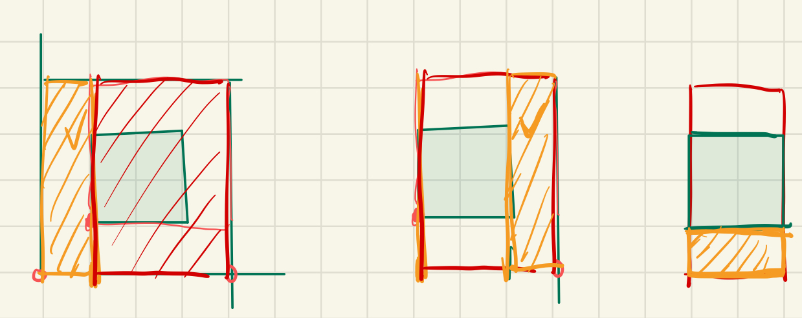

# 牛客公开题库-2023年叠纸游戏春招游戏研发岗笔试

## 问答题

### 1、问答题  多个（有重叠）矩形随机取点

1.输入一组矩形Rectangles，其中每一个元素都是在二维坐标系中与XY轴对齐的矩形，使用BottomLeft表示其左下角的坐标点而TopRight表示其右上角的坐标点，坐标均为浮点数。

这一组矩形重合覆盖的面积区域集合称之为S

需要实现一个计算类，随机等概率的选中位于S内的点。请补全下方的Solution类以实现此功能，

要求

1 pick 函数返回S内每一个坐标点被选中的概率应当相等。（考虑矩形之间可能重叠部分处理，注意要求概率分布相同）

2 构造函数Solution(vector<Rectangle> Rectangles) 用于接收一组矩形的输入

3 选择函数 Point Pick() 会被多次调用以等概率随机选点。此外可在Solution类中加入需要的成员变量及函数以辅助计算。

```C++
struct Point

{

    float X;

    float Y;

};

struct Rectangle

{

Point BottomLeft;

Point TopRight;

};

struct Solution

{

    Solution(vector<Rectangle> Rectangles)

    {

    }

    Point Pick()

    {

    }

    //可在此添加所需成员变量及函数

};
```


##### 官方解析：

难点为矩形区域可重叠，且需要等概率选点。根据作答情况分为如下几档给分（假设10分满分）：

1. 先随机选择一个矩形，再在矩形内部随机挑选XY坐标作为结果。未考虑等概率这一条件，1分
2. 以各矩形面积作为权重，加权随机选择一个矩形，再在矩形内部随机选点。试图考虑等概率的条件但忽略了矩形可重叠，4分
3. 将输入的矩形数组通过相互之间的布尔运算，**切割成更小的互不重叠的矩形**，在此基础上使用切割后的小矩形面积加权随机挑选，再在其内部随机选点。正确答案，10分。布尔切割的函数如下：


##### 布尔运算分割矩形

```C++
// 使用Lhs矩形将Rhs矩形切割为多个不重叠的小矩形（轴对齐切割）
vector<Rectangle> BoolCut(const Rectangle& Lhs, const Rectangle& Rhs)
{
    vector<Rectangle> Result;
    Rectangle RhsCopy = Rhs;
	
┌───┬────────┐
│   │        │
│   │        │
│   │        │
│   │        │
└───┴────────┘

    //具体请看下图
    // X轴左侧切割（当Lhs左边界在Rhs内部时）
    if(RhsCopy.BottomLeft.X<Lhs.BottomLeft.X&&Lhs.BottomLeft.X<RhsCopy.TopRight.X)
    {
        Rectangle Part = RhsCopy;
        Part.TopRight.X = Lhs.BottomLeft.X;
        RhsCopy.BottomLeft.X = Lhs.BottomLeft.X;
        Result.push_back(Part);
    }

    // X轴右侧切割（当Lhs右边界在Rhs内部时）
    if(RhsCopy.TopRight.X>Lhs.TopRight.X&&Lhs.TopRight.X>RhsCopy.BottomLeft.X)
    {
        Rectangle Part = RhsCopy;
        Part.BottomLeft.X = Lhs.TopRight.X;
        RhsCopy.TopRight.X = Lhs.TopRight.X;
        Result.push_back(Part);
    }

    // Y轴下侧切割（当Lhs下边界在Rhs内部时）
    if(RhsCopy.BottomLeft.Y<Lhs.BottomLeft.Y&&Lhs.BottomLeft.Y<RhsCopy.TopRight.Y)
    {
        Rectangle Part = RhsCopy;
        Part.TopRight.Y = Lhs.BottomLeft.Y;
        RhsCopy.BottomLeft.Y = Lhs.BottomLeft.Y;
        Result.push_back(Part);
    }

    // Y轴上侧切割（当Lhs上边界在Rhs内部时）
    if(RhsCopy.TopRight.Y>Lhs.TopRight.Y&&Lhs.TopRight.Y>RhsCopy.BottomLeft.Y)
    {
        Rectangle Part = RhsCopy;
        Part.BottomLeft.Y = Lhs.TopRight.Y;
        RhsCopy.TopRight.Y = Lhs.TopRight.Y;
        Result.push_back(Part);
    }

    // 处理未发生切割的情况
    if(Result.size()==0)
    {
        // 完全包含：不返回任何矩形 | 不相交：返回原矩形
        if(Rhs.BottomLeft.X>=Lhs.BottomLeft.X
            &&Rhs.BottomLeft.Y>=Lhs.BottomLeft.Y
            &&Rhs.TopRight.X<=Lhs.TopRight.X
            &&Rhs.TopRight.Y<=Lhs.TopRight.Y){
            // Rhs完全在Lhs内部，不添加到结果
        }
        else
        {
            Result.push_back(Rhs); // 无交集时返回原始矩形
        }
    }
    return Result;
}

```

```
矩形A（原矩形）：
┌──────────────┐
│              │
│              │
│      A       │
│              │
│              │
└──────────────┘
左下(0,0) → 右上(4,4)

矩形B（切割矩形）：
    ┌─────┐
    │  B  │
    └─────┘
左下(1,1) → 右上(3,3)
类似：
┌─────────────┐
│      A      │
│   ┌─────┐   │
│   │  B  │   │
│   └─────┘   │
│             │
└─────┬───────┘
```

橙色代表每次的part：



#### 随机pick

第一个步骤之后，就变成题目[497. 非重叠矩形中的随机点](https://leetcode.cn/problems/random-point-in-non-overlapping-rectangles/)


1. **矩形切割**：（上面的步骤）将输入的每个矩形与已处理的所有矩形进行轴对齐切割，确保最终所有矩形互不重叠。例如，用现有矩形切割新矩形，分割出非重叠部分。
2. **面积加权随机**：计算所有不重叠小矩形的总面积，根据每个小矩形的面积构建前缀和数组。生成随机数后，通过二分查找确定选中的小矩形。
3. **内部随机选点**：在选中的小矩形内均匀随机生成坐标。

想象成将这些不重叠的矩形拉开成为一条：.PNG)

代码：

```C++

class Solution
{
    vector<Rectangle> rects;
    vector<float> prefixSums;
    float totalArea;

public:
    Solution(vector<Rectangle> Rectangles) 
    {
        vector<Rectangle> existing;
        // 逐步分解每个输入的矩形
        for (auto& rect : Rectangles) 
        {
            vector<Rectangle> temp = { rect };
            // 用所有现有矩形切割当前处理的部分
            for (auto& existRect : existing) 
            {
                vector<Rectangle> newTemp;
                for (auto& part : temp) 
                {
                    auto cutParts = BoolCut(existRect, part);
                    newTemp.insert(newTemp.end(), cutParts.begin(), cutParts.end());
                }
                temp = newTemp;
                if (temp.empty()) break;
            }
            existing.insert(existing.end(), temp.begin(), temp.end());
        }

        // 计算面积前缀和
        rects = existing;
        prefixSums.reserve(rects.size());
        totalArea = 0;
        for (auto& r : rects) 
        {
            float area = (r.TopRight.X - r.BottomLeft.X) *
                (r.TopRight.Y - r.BottomLeft.Y);
            totalArea += area;
            prefixSums.push_back(totalArea);
        }
    }

    Point Pick() 
    {
        // 生成随机面积值
        float random = static_cast<float>(rand()) / RAND_MAX * totalArea;

        // 二分查找定位对应矩形
        auto it = lower_bound(prefixSums.begin(), prefixSums.end(), random);
        int index = it - prefixSums.begin();

        // 在目标矩形内生成随机点
        auto& rect = rects[index];
        float x = rect.BottomLeft.X + static_cast<float>(rand()) / RAND_MAX *
            (rect.TopRight.X - rect.BottomLeft.X);
        float y = rect.BottomLeft.Y + static_cast<float>(rand()) / RAND_MAX *
            (rect.TopRight.Y - rect.BottomLeft.Y);
        return { x, y };
    }
};

```


完整代码：

```C++
#include <vector>
#include <algorithm>
#include <cstdlib>
#include <iostream>
using namespace std;

struct Point {
    float X;
    float Y;
};

struct Rectangle {
    Point BottomLeft;
    Point TopRight;
};

// 使用Lhs将Rhs切割为多个不重叠的小矩形（轴对齐切割）
vector<Rectangle> BoolCut(const Rectangle& Lhs, const Rectangle& Rhs) {
    vector<Rectangle> Result;
    Rectangle RhsCopy = Rhs;

    // X轴左侧切割（当Lhs左边界在Rhs内部时）
    if (RhsCopy.BottomLeft.X < Lhs.BottomLeft.X && Lhs.BottomLeft.X < RhsCopy.TopRight.X) {
        Rectangle Part = RhsCopy;
        Part.TopRight.X = Lhs.BottomLeft.X;
        RhsCopy.BottomLeft.X = Lhs.BottomLeft.X;
        Result.push_back(Part);
    }

    // X轴右侧切割（当Lhs右边界在Rhs内部时）
    if (RhsCopy.TopRight.X > Lhs.TopRight.X && Lhs.TopRight.X > RhsCopy.BottomLeft.X) {
        Rectangle Part = RhsCopy;
        Part.BottomLeft.X = Lhs.TopRight.X;
        RhsCopy.TopRight.X = Lhs.TopRight.X;
        Result.push_back(Part);
    }

    // Y轴下侧切割（当Lhs下边界在Rhs内部时）
    if (RhsCopy.BottomLeft.Y < Lhs.BottomLeft.Y && Lhs.BottomLeft.Y < RhsCopy.TopRight.Y) {
        Rectangle Part = RhsCopy;
        Part.TopRight.Y = Lhs.BottomLeft.Y;
        RhsCopy.BottomLeft.Y = Lhs.BottomLeft.Y;
        Result.push_back(Part);
    }

    // Y轴上侧切割（当Lhs上边界在Rhs内部时）
    if (RhsCopy.TopRight.Y > Lhs.TopRight.Y && Lhs.TopRight.Y > RhsCopy.BottomLeft.Y) {
        Rectangle Part = RhsCopy;
        Part.BottomLeft.Y = Lhs.TopRight.Y;
        RhsCopy.TopRight.Y = Lhs.TopRight.Y;
        Result.push_back(Part);
    }

    // 处理未发生切割的情况
    if (Result.empty()) {
        // 完全包含：不返回任何矩形 | 不相交：返回原矩形
        if (Rhs.BottomLeft.X >= Lhs.BottomLeft.X
            && Rhs.BottomLeft.Y >= Lhs.BottomLeft.Y
            && Rhs.TopRight.X <= Lhs.TopRight.X
            && Rhs.TopRight.Y <= Lhs.TopRight.Y) {
            // Rhs完全在Lhs内部，不添加到结果
        }
        else {
            Result.push_back(Rhs); // 无交集时返回原始矩形
        }
    }
    return Result;
}

class Solution
{
    vector<Rectangle> rects;
    vector<float> prefixSums;
    float totalArea;

public:
    Solution(vector<Rectangle> Rectangles)
    {
        vector<Rectangle> existing;
        // 逐步分解每个输入的矩形
        for (auto& rect : Rectangles)
        {
            vector<Rectangle> temp = { rect };
            // 用所有现有矩形切割当前处理的部分
            for (auto& existRect : existing)
            {
                vector<Rectangle> newTemp;
                for (auto& part : temp)
                {
                    auto cutParts = BoolCut(existRect, part);
                    newTemp.insert(newTemp.end(), cutParts.begin(), cutParts.end());
                }
                temp = newTemp;
                if (temp.empty()) break;
            }
            existing.insert(existing.end(), temp.begin(), temp.end());
        }

        // 计算面积前缀和
        rects = existing;
        prefixSums.reserve(rects.size());
        totalArea = 0;
        for (auto& r : rects)
        {
            float area = (r.TopRight.X - r.BottomLeft.X) *
                (r.TopRight.Y - r.BottomLeft.Y);
            totalArea += area;
            prefixSums.push_back(totalArea);
        }
    }

    Point Pick()
    {
        // 生成随机面积值
        float random = static_cast<float>(rand()) / RAND_MAX * totalArea;

        // 二分查找定位对应矩形
        auto it = lower_bound(prefixSums.begin(), prefixSums.end(), random);
        int index = it - prefixSums.begin();

        // 在目标矩形内生成随机点
        auto& rect = rects[index];
        float x = rect.BottomLeft.X + static_cast<float>(rand()) / RAND_MAX *
            (rect.TopRight.X - rect.BottomLeft.X);
        float y = rect.BottomLeft.Y + static_cast<float>(rand()) / RAND_MAX *
            (rect.TopRight.Y - rect.BottomLeft.Y);
        return { x, y };
    }
};
int main()
{
    // 测试用例1：单矩形
    vector<Rectangle> case1 = { { {0,0}, {2,2} } };
    Solution s1(case1);
    Point p1 = s1.Pick(); // 始终在(0,0)-(2,2)范围内
    std::cout << p1.X << " " << p1.Y;
    cout << endl;

    // 测试用例2：完全重叠
    vector<Rectangle> case2 = { { {0,0}, {2,2} }, { {0,0}, {2,2} } };
    Solution s2(case2);
    Point p2 = s2.Pick(); // 等效单矩形情况
    std::cout << p2.X << " " << p2.Y;
    cout << endl;

    // 测试用例3：部分重叠
    vector<Rectangle> case3 = {
        { {0,0}, {2,2} },
        { {1,1}, {3,3} }
    };
    Solution s3(case3); // 分解为3个不重叠矩形
    Point p3 = s3.Pick(); // 等效单矩形情况
    std::cout << p3.X << " " << p3.Y;
    cout << endl;

    // 测试用例4：完全分离
    vector<Rectangle> case4 = {
        { {0,0}, {1,1} },
        { {2,2}, {3,3} }
    };
    Solution s4(case4); // 保留原始两个矩形
    Point p4 = s4.Pick(); // 等效单矩形情况
    std::cout << p4.X << " " << p4.Y;
    cout << endl;
}
```


## 选择题


### 8.堆栈溢出一般是由什么原因导致的（）

A 函数代码长度过长

B 循环的递归调用

C 大数据结构的局部变量

D 代码运行时错误


正确答案：BC

你的答案：BD

官方解析：堆栈溢出(Stack Overflow)主要由两种情况导致:过度的递归调用(B选项)和大量的局部变量定义(C选项)。

具体分析如下:

B选项正确:循环的递归调用会导致堆栈溢出。因为每次递归调用都会在栈中分配新的栈帧,包含函数的参数、返回地址和局部变量。如果递归层次太深或没有正确的终止条件,就会耗尽栈空间,导致栈溢出。

C选项正确**:在函数中定义大数据结构的局部变量(如大数组)会占用大量栈空间**。因为**局部变量是存储在栈上**的,如果局部变量过大或过多,超出了栈的容量限制,就会发生栈溢出。

A选项错误:函数代码长度与堆栈溢出没有直接关系。**代码长度主要影响代码段的大小,而不是运行时栈的使用情况**。

D选项错误:代码运行时错误是一个笼统的说法,可能包含多种错误类型,不能简单地等同于堆栈溢出。堆栈溢出是一种特定类型的运行时错误,有其具体的发生原因。

预防堆栈溢出的方法包括:限制递归深度、使用迭代替代递归、合理设置栈大小、避免在栈上分配过大的局部变量等。


### 5.同屏有大量的玩家  优化手段

游戏中同屏有大量的玩家，这些玩家的位置和状态需要及时的刷新。但因为数量众多，开发者得采用一些手段来降低计算的开销，以下描述中哪一个是正确的优化手段？

**A 采取对玩家按规则进行分组，每帧更新一部分玩家数据**

B 每隔3秒更新一次，这样在不更新的时候完全开销为零，大幅的提升效率

**C 按照其他玩家的距离远近来决定更新的频率，约远频率越低**

**D 按照玩家视野情况剔除，来降低视野外玩家的更新频率**

正确答案：ACD

官方解析：在游戏开发中优化同屏大量玩家的位置和状态更新是一个重要的性能优化问题。ACD三个选项都提供了有效的优化策略：

A选项正确：将玩家分组更新是一种常用的优化方案。通过将玩家按照一定规则(如区域、ID等)分组，每帧只更新其中一部分玩家的数据，可以有效分散计算压力，保持整体的更新流畅性。

C选项正确：基于距离的更新频率优化是一种空间策略。距离较远的玩家可以降低更新频率，因为远处的细微变化对当前玩家的游戏体验影响较小，这样可以节省计算资源。

D选项正确：视野剔除是最基本且有效的优化手段。对于完全在视野外的玩家，可以显著降低其更新频率，因为这些玩家的状态变化对当前玩家来说是不可见的。

B选项错误：固定间隔3秒更新的方案存在严重问题。这种方式会导致玩家行为出现明显的延迟和不连贯性，严重影响游戏体验。在多人在线游戏中，玩家状态的即时性和连续性是非常重要的，不能采用这种粗暴的方式。

上述三个正确的优化方案(ACD)可以结合使用，形成多层次的优化策略，既保证了游戏体验，又实现了性能优化。


### 11.函数参数中的数组sizeof大小

下列32位程序的output输出是（ ）

```C++
void Foo(char strOutSide[128])
{

    void* p = malloc(256);

    char strInside[128];

    int output = sizeof(p) + sizeof(strOutSide) + sizeof(strInside);

    print(output);

}
```

A

128

B

134

C

136

D

138

正确答案：C

官方解析：在这道题目中需要分别计算三个部分的大小并相加:指针p、数组strOutSide和数组strInside。

在32位程序中:

1. void* p是指针类型,占用4字节
2. strOutSide作为函数参数实际上是指针,因此占用4字节
3. strInside是局部数组,占用128字节


所以最终结果是:4 + 4 + 128 = 136字节

因此C选项136是正确答案。

分析其他选项:
A选项128错误:只考虑了一个数组的大小,忽略了指针的大小
B选项134错误:计算有误,不是任何合理组合的结果
D选项138错误:结果偏大,可能错误地认为某些变量占用更多空间

需要注意的要点:

1. 在32位程序中指针统一占4字节
2. **函数参数中的数组实际上是指针**
3. 局部数组占用实际声明的空间大小
4. sizeof运算符在编译时计算,返回字节数


这道题目主要考察了程序员对内存分配的理解,特别是指针和数组在内存中的表现形式。


### 12. 任务分配问题中的算法选择

项目经理夕玖目前有9个任务，其中3个是1天完成，2个是2天完成，2个是3天完成，1个4天完成，2个5天完成。需要分配给3位工程师，不考虑其他因素，只考虑每个人总时间相差最小 请问以下哪个最适合解决这个问题 ( )

A

倒序贪婪

B

弗洛伊德算法

C

迪杰斯特拉算法

D

穷举法

正确答案：A

官方解析：这道题考察任务分配问题中的算法选择。倒序贪婪算法是最适合的解决方案,原因如下:

1. 倒序贪婪算法的工作原理:

\- 先将任务按照耗时从大到小排序(5,5,4,3,3,2,2,1,1)
\- **每次选择当前最大的任务,分配给当前总工作时间最少的工程师**
\- 这种方式能较好地平衡各个工程师的工作量

2. 为什么倒序贪婪最适合:

\- 问题的目标是使每个人总时间相差最小
\- 大任务优先分配可以避免最后剩下大任务导致分配不均
\- 算法简单高效,易于实现
\- 虽然不一定能得到最优解,但通常可以得到较好的近似解

分析其他选项:
B错误:弗洛伊德算法用于解决多源最短路径问题,与任务分配无关
C错误:迪杰斯特拉算法用于解决单源最短路径问题,不适用于此类任务分配
D错误:虽然穷举法可以得到最优解,但时间复杂度太高,效率低下,不适合实际应用

因此在保证效率的前提下,倒序贪婪算法是解决该问题最合适的选择。


### 15.

假定a 是一个二维数组，则 `a[i][j] `的指针访问方式为（）

```
A

*(a + i + j)

B

*(*(a + i) + j)

C

*(a + i)+ j 

D

*a + i + j
```


正确答案：B

`官方解析：在二维数组中访问元素a[i][j]的正确指针表示方式是*(*(a + i) + j)。让我们详细分析原因：`

二维数组在内存中实际是"数组的数组"，a是指向第一个子数组的指针。因此：

```
1. (a + i)：先移动i个子数组单位，得到第i行的起始地址
2. *(a + i)：解引用得到第i行的首元素地址
3. (*(a + i) + j)：在第i行基础上偏移j个元素
4. *(*(a + i) + j)：最后解引用得到具体元素值
```


分析其他选项的错误：

```
A. *(a + i + j) 错误：这种写法把行偏移和列偏移直接相加，没有考虑二维数组的层次结构，会导致错误的地址计算。

C. *(a + i) + j 错误：这种写法只解引用了行地址，然后加上j，得到的是一个地址值而不是元素值。

D. *a + i + j 错误：这种写法只解引用了数组首地址，然后进行整数加法，完全偏离了二维数组的访问方式。

通过正确使用指针运算和解引用操作的顺序，B选项准确地表达了二维数组元素访问的过程。
```


## 编程题


### 2. 链表输出

输入一个单向链表，链表数据都为正数，输出该链表中倒数k个结点的和

比如链表

{ 3->5->7->9->10->20->30}  如果k = 3 要求输出 10+20+30 = 60 的结果

{ 3->5->7->9->10->20->30}  如果k = 10 大于链表长度 输出 -1 结果

me:

```C++
/**
 * struct ListNode {
 *	int val;
 *	struct ListNode *next;
 *	ListNode(int x) : val(x), next(nullptr) {}
 * };
 */
class Solution {
public:
    /**
     * 代码中的类名、方法名、参数名已经指定，请勿修改，直接返回方法规定的值即可
     *
     * 
     * @param head ListNode类 表头
     * @param k int整型 返回最后k个数据之和
     * @return int整型
     */
     //11-21
     //{1,2,3,7,9},2  ans 16
    int FindKthSumToTail(ListNode* head, int k) {
        // write code here
        ListNode* dummy  =new ListNode(0);
        dummy->next = head;
        ListNode* l = dummy;
        ListNode* r = dummy;
        for(int i=0;i<k&&r!=nullptr;i++)
        {
            r=r->next;
        }
        if(r==nullptr)return -1;
        //dummy 1 2 3 
        int sum=0;
        
        while(r)
        {
            l=l->next;
            r=r->next;
        }
        while(l)
        {
            sum+=l->val;
            l=l->next;
        }
        return sum;
    }
};
```


### 3.字符替换

请实现一个函数，将一个字符串中的所有括号之间的字符替换成 *。
例如，当字符串为

Nikki (happy) new (year) 则经过替换之后的字符串为` Nikki (*) new (*)`

> (Nikki (happy) new (year) 

me：

```C++
#include <string_view>
class Solution {
    //20-30
public:
    /**
     * 代码中的类名、方法名、参数名已经指定，请勿修改，直接返回方法规定的值即可
     *
     * 
     * @param originalStr string字符串 原始字符串
     * @return string字符串
     */
     //a(test(b)test ->a(test(*)test
     //会出现(() 这种么？会出现A(TEST(TEST2(B)))B么？？
     //希望输出a(*)b

    //a(test(b)ccc ->a(test(*)ccc
     //还是得用栈 维护str
     //str=a  遇到左括号+(，a(入栈 str=""
     // str =  test 遇到左括号 入栈test(
    //str = b  遇到右括号， str = ""  栈顶test( + "*)" = test(*) 入栈
    //str = ccc
    //结束之后  一个个取出来，接在前面（所以也可以用vector模拟栈） str+ ccc

    //a(test(test2))b = a(*)b
    string ConvertString(string originalStr) {
        // write code here
        // stack<int> stk; // 遇到左括号 +1 右括号-1  最后当=0的情况下结束
            // stack<string> stk;
            vector<string> vstk;
            string str = "";
            int n = originalStr.size();
            //stack : nikki(*) | new(*)  
            for(int i=0;i<n;i++)
            {
                if(originalStr[i]=='(')
                {
                    vstk.push_back(str);//nikki(   **a(   test(
                    str = "";
                }
                else if(originalStr[i]==')')
                {
                    // cout<<vstk.back()<<endl;
                    if(!vstk.empty())
                    {
                        //vstk.pop_back();
                        string top = vstk.back(); //nikki
                        vstk.pop_back();
                        str = top + "(*)"; //nikki(*)
                        //vstk.push_back(str);
                        //str = "";
                    }
                    else //**test
                    {
                        str+=')';
                    }
                }
                else //happy / new /year
                {
                    str+=originalStr[i];
                }
            }
            vstk.push_back(str);
            string res="";
            int vn=vstk.size();
            for(int i=0;i<vn;i++)
            {
                res+=vstk[i];
                if(i<vn-1)res+='(';
            }
            //string s = vstk.back();
            // return str;
            return res;
    }
    //"a(test(*)test"
    //A(TEST(TEST2(B)))B
};
```


优化：实际上应该不用判空 因为提前push了那个空的字符串 

和题目__（5）[1190. 反转每对括号间的子串](https://leetcode.cn/problems/reverse-substrings-between-each-pair-of-parentheses/)  类似（在D:\PGPostgraduate\githubNotePrepareForWork\PrepareForWorkNotes\Algos\Leetcode\Leetcode——常用数据结构专题.md中有整理）


这个题目其实没说明白他要什么 且有很多不合法的用例也需要通过


4399题目记录

实际上用next数组更好，

```C++
#include <iostream>
#include <list>
using namespace std;

int main() {
    int n;
    cin>>n;
    list<int> l;
    for(int i=1;i<=n;i++)
    {
        l.push_back(i);
    }
    int idx=0;
    int call=1;
    auto it = l.begin();
    while(l.size()>1)
    {
        if(it!=l.end())
        {
            if(call==3)
            {
                it = l.erase(it);
                call=1;
            }
            else
            {
                it++;
                call++;
            }
            
        }
        else
        {
            it = l.begin();
        }
    }
    cout<<l.front();
}
// 64 位输出请用 printf("%lld")
```


