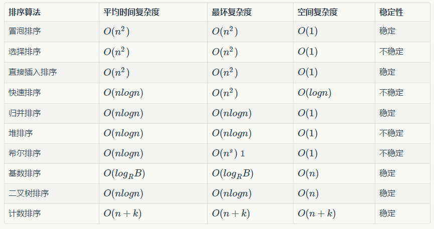

# 2023年西山居秋招游戏开发岗笔试

## 问答题


### 1.MMORPG聊天服务器/客户端 模型

在MMORPG中，聊天服务器是社交中必不可少的，请你设计一个聊天服务器/客户端的模型，满足以下需求：

1. 有多个聊天服务器，包括世界频道、团队频道、好友频道、1对1密聊频道
2. 实现离线消息：如果密聊对象不在线，该玩家下次上线可以收到消息
3. 对开发、维护人员提供数据，用于后期排查问题、统计分析以及优化
4. 聊天属于时延敏感模块，当玩家数量很大时也要能提供及时的消息显示并且不可乱序，比如同频道有很多消息同时发送，如何
5. 利于扩展，后续增加新的聊天频道可以轻松添加
6. 稳定性高、容错性好、部分聊天频道的问题不会影响整体服务器的稳定运行


官方解析：这道题目要求设计一个MMORPG游戏中的聊天系统架构,我们可以从以下几个方面进行设计:

1. 系统整体架构:
- 采用**分布式**架构,多个聊天服务器组成集群
- 使用**消息队列**(如RabbitMQ/Kafka)作为消息中转
- 使用Redis缓存在线用户信息和临时消息
- 使用**数据库**存储离线消息和历史记录


2. 聊天频道设计:
- 采用**工厂模式**和策略模式设计不同频道
- 每个频道独立部署,互不影响
- 频道基类定义通用接口,子类实现具体逻辑
- 新增频道只需**继承**基类并实现相应接口


3. 消息投递机制:
- 世界频道:广播给所有在线用户
- 团队频道:组内广播
- 好友频道:点对点投递
- 密聊频道:点对点加密投递
- 离线消息:存储到**数据库**,上线时推送


4. 高并发和顺序性保证:
- 每个频道使用**独立消息队列**
- 消息带**时间戳和序列号**
- 客户端做消息**排序和去重**
- 采用分布式锁保证顺序


5. 监控和运维:
- 记录详细日志
- 采集性能指标
- 设置监控告警
- 提供运维接口


6. 容错设计:
- 服务注册发现
- 故障自动转移
- 消息持久化
- 定期备份

这样的设计满足了题目要求的高可用、可扩展、高性能等特点。


## 单选题

### 4. 进程与线程

下面关于进程和线程说法错误的是

A 进程和线程在内核中采用统一的结构体进行管理

B 线程是调度的基本单位，而进程则是资源拥有的基本单位

C 同进程内的线程切换和多进程间的切换消耗的资源相同

D 创建子进程需要完全复制内核结构体，而子线程不用


正确答案：C

官方解析：C选项错误,因为线程切换和进程切换消耗的资源是不同的。同进程内的线程切换只需保存和恢复少量寄存器内容,切换开销较小;而进程切换除了需要保存和恢复寄存器外,还涉及地址空间的切换(页表、TLB刷新等),开销更大。

分析其他选项:

A正确:在Linux内核中,**进程和线程都使用task_struct结构体来管理**,这是一种统一的管理方式。Linux不区分进程和线程,**都视为任务**(task)。

B正确:线程作为最小的调度单位,CPU调度时以线程为基本单位进行。而进程则作为资源分配的基本单位,拥有独立的地址空间、文件描述符等系统资源。

D正确: D 创建子进程需要完全复制内核结构体，而子线程不用

**创建子进程(fork)**时需要**复制父进程的整个PCB**(Process Control Block)等内核数据结构。

而**创建线程**时,由于**共享**进程的地址空间和大部分资源,只需要创建必要的线程私有数据结构即可。


### 5 . TCP [][]【？？】

下面关于TCP协议描述正确的是

A 三次握手中accept()函数会从半连接队列获取连接并放至全连接队列

B 四次挥手不可以仅用三次通信来完成

C TCP的拥塞控制算法均通过丢包作为拥塞触发的判断条件

D Nagle，DACK对糊涂窗口综合征均有一定的效果


官方解析：从技术角度分析TCP协议的相关特性，D选项正确。Nagle算法和延迟确认(DACK)确实都能在一定程度上缓解糊涂窗口综合征(Silly Window Syndrome)的问题。Nagle算法通过延迟发送小数据包并将它们合并成较大的数据包来提高网络效率，而DACK则通过延迟发送确认包来减少网络中的小包数量，这两种机制都有助于缓解糊涂窗口综合征。

分析其他选项的错误之处：

A选项错误：在TCP三次握手过程中，accept()函数实际是从全连接队列(已完成三次握手的连接)中获取连接，而不是从半连接队列。**半连接队列存放的是还未完成三次握手的连接。**

B选项错误：TCP的四次挥手在某些情况下是可以通过三次通信完成的。比如当被动关闭方收到主动关闭方的FIN后，可以直接发送ACK和FIN合并在一个包中，这样就变成了三次通信。

C选项错误：TCP的拥塞控制算法不仅仅依赖于丢包作为拥塞判断条件。比如TCP BBR就主要基于时延梯度来判断网络拥塞，而TCP Vegas则通过RTT的变化来判断网络状况，这些都不是基于丢包的判断机制。


### 6.页和页表

下面对于页和页表描述不正确的是

A

页表的出现和虚拟内存息息相关

B

多级页表是为了解决单级页表可能带来的页表过大的问题

C

按页分配有时候过于浪费，因此操作系统还提供了小块内存的分配方式

D

虚拟内存的映射页都是匿名页

正确答案：D

官方解析：虚拟内存系统中的页可以分为多种类型,不仅仅只有匿名页。匿名页(Anonymous Page)是其中一种,用于存储进程的动态数据,比如堆和栈。还存在其他类型的页,如文件映射页(File-backed Page),用于将文件内容映射到内存中。因此D选项说所有虚拟内存的映射页都是匿名页的说法是不正确的。

分析其他选项:
A正确:页表是实现虚拟内存的关键数据结构,用于建立虚拟地址到物理地址的映射关系。

B正确:多级页表确实是为了解决单级页表可能出现的问题。当地址空间很大时,单级页表会占用大量连续内存空间,而多级页表可以让页表按需分配,节省内存。

C正确:分页管理可能会导致内部碎片,因为一个页可能无法被进程完全利用。为了更有效地使用内存,操作系统通常会提供更细粒度的内存分配方式,如slab分配器等。


### 7. 内存对齐

在32位系统中，下面结构体中，sizeof(A) = 1， sizeof(B) = 2，sizeof(C) = 3(单位字节，只用填数字）

```C++
struct A
{
    int a;
    char b;
    short c;
};
 
struct B
{
    char b;
    int a;
    short c;
};
 
#pragma pack(2)
struct C {
    char b;
    int a;
    short c;
};
#pragma pack( )
```

你的答案： 回答正确

1 8

2 12

3 8

官方解析：这道题考察了结构体内存对齐的知识，让我们逐个分析：

结构体A的大小为8字节：
\- int a占4字节，从偏移量0开始存储
\- char b占1字节，由于需要对齐，从偏移量4开始存储
\- short c占2字节，需2字节对齐，从偏移量6开始存储
\- 最终结构体大小需要是最大基本类型(int=4)的整数倍，因此是8字节

结构体B的大小为12字节：
\- char b占1字节，从偏移量0开始
\- int a占4字节，需4字节对齐，从偏移量4开始
\- short c占2字节，需2字节对齐，从偏移量8开始
\- 最终需要是4的整数倍，补齐到12字节

结构体C的大小为8字节：
\- **使用了#pragma pack(2)，表示最大按2字节对齐**
\- char b占1字节，从偏移量0开始
\- int a占4字节，在pack(2)下只需2字节对齐，从偏移量2开始
\- short c占2字节，从偏移量6开始
\- 最终大小为8字节

这里的关键点是理解内存对齐规则：

1. 结构体变量的起始地址需要按照其最大成员的对齐方式对齐
2. 每个成员相对于起始位置的偏移量必须是当前成员大小与pack值中较小值的整数倍
3. 结构体的总大小必须是编译器默认对齐数与pack值中较小值的整数倍


### 8.函数调用的开销

下面关于函数调用的开销说法正确的是

A

函数调用中传参数量不影响性能

B

宏相对于简短且频繁调用的函数有着更佳的性能

C

尾递归和普通递归开销没有区别

D

函数调用中原栈帧保存在寄存器中

正确答案：B

官方解析：宏是在预处理阶段进行文本替换,没有函数调用的开销。对于简短且频繁调用的函数,使用宏可以**避免函数调用时压栈、跳转**等开销,从而获得更好的性能表现。因此B选项正确。

分析其他选项:

A错误:函数调用时需要将参数压入栈中,参数数量越多,压栈和出栈的开销就越大,因此参数数量会影响函数调用的性能。

C错误:**尾递归**是一种特殊的递归形式,编译器可以将其**优化为循环**,避免了普通递归调用时的栈空间消耗。而普通递归每次调用都会在栈上分配新的栈帧,两者开销是有区别的。

D错误:函数调用时,**原栈帧是保存在栈内存中,而不是寄存器中**。**寄存器主要用于存放函数参数、返回值和临时计算结果**等。

总的来说,这道题主要考察了函数调用机制、宏替换、递归优化等程序设计的基础知识。在实际开发中,需要根据具体场景选择合适的实现方式,以平衡代码可维护性和运行效率。


>尾递归和普通递归：
>
>尾递归和普通递归的区别主要在于递归调用的位置及其对内存的影响。以下是对两者的详细对比：
>
>---
>
>### **1. 普通递归**
>- **定义**：函数在调用自身后，还需要进行额外的操作（如运算、返回处理）才能得到最终结果。
>- **示例**（阶乘计算）：
>  ```python
>  def factorial(n):
>      if n == 0:
>          return 1
>      else:
>          return n * factorial(n-1)  # 递归调用后需要做乘法
>  ```
>- **执行过程**：
>  - 每次递归调用会保留当前函数的上下文（如变量 `n` 的值）。
>  - 调用栈会逐层累积，直到递归终止条件满足后，再逐层返回计算结果。
>- **缺点**：
>  - **栈溢出风险**：递归深度较大时，调用栈可能超出内存限制（如 `factorial(10000)` 会导致栈溢出）。
>  - **效率较低**：频繁的栈帧创建和销毁影响性能。
>
>---
>
>### **2. 尾递归**
>- **定义**：递归调用是函数的**最后一步操作**，且**没有后续计算**。所有中间状态通过参数传递。
>- **示例**（尾递归优化后的阶乘）：
>  ```python
>  def tail_factorial(n, accumulator=1):
>      if n == 0:
>          return accumulator
>      else:
>          return tail_factorial(n-1, n * accumulator)  # 递归调用是最后一步，无后续操作
>  ```
>- **执行过程**：
>  - 每次递归调用直接传递更新后的参数（如 `n-1` 和 `accumulator`）。
>  - **支持尾调用优化（TCO）的语言**（如 Scheme、Haskell）会复用当前栈帧，避免调用栈增长。
>- **优点**：
>  - **内存安全**：优化后等效于循环，不会导致栈溢出。
>  - **性能提升**：减少栈帧创建开销。
>- **限制**：
>  - **依赖语言支持**：并非所有语言支持 TCO（如 Python、Java 默认不支持）。
>  - **代码复杂度**：需要重新设计递归逻辑（如引入累积参数）。
>
>---
>
>### **3. 核心区别**
>| **特性**     | **普通递归**                | **尾递归**                     |
>| ------------ | --------------------------- | ------------------------------ |
>| **调用位置** | 递归调用后还有其他操作      | 递归调用是最后一步操作         |
>| **内存占用** | 栈深度随递归次数线性增长    | 优化后栈深度为常数（等效循环） |
>| **适用场景** | 逻辑简单，但需注意递归深度  | 处理大规模数据，需语言支持 TCO |
>| **代码示例** | `return n * factorial(n-1)` | `return tail_fact(n-1, acc)`   |
>
>---
>
>### **4. 通俗类比**
>- **普通递归**：像叠罗汉，每层人必须站在前一个人的肩膀上，层数多了就会不稳（栈溢出）。
>- **尾递归**：像接力赛跑，每次传递接力棒（参数）后，前一个人就可以离开跑道（释放栈帧），始终只有一个人在跑。
>
>---
>
>### **5. 补充说明**
>- **尾调用优化（TCO）**：编译器将尾递归转换为循环的技术，但需语言支持（如 JavaScript 严格模式下支持）。
>- **何时使用尾递归**：当递归深度可能非常大，且语言支持 TCO 时，优先使用尾递归。
>
>通过合理选择递归形式，可以在保证逻辑清晰的同时优化内存和性能。


### 9.动态库和静态库

下面关于动态库和静态库的说法正确的是

A

动态库和静态库的链接都是在编译时执行

B

静态库和动态库链接的程序在执行时和函数库再无瓜葛，移植方便

C

静态库相对于动态库来说更容易带来更新、部署和发布上的一些困扰

D

动态库比静态库更浪费空间和资源

正确答案：C

官方解析：静态库和动态库是程序设计中常见的代码复用方式,C选项正确,因为静态库确实存在更新维护方面的不便。静态库在程序编译时会被完整地复制到可执行文件中,当库文件更新时,所有使用该库的程序都需要重新编译,这给程序的更新、部署和发布带来了困扰。

分析其他选项错误原因:

A错误:动态库的链接是在程序运行时进行的,而不是编译时。只有静态库是在编译时链接的。

B错误:动态库链接的程序在运行时需要调用相应的库文件,程序和库是有关联的。只有静态库链接的程序才是独立的可执行文件。

D错误:动态库恰恰是节省空间和资源的。多个程序可以共享同一个动态库文件,而静态库则需要被复制到每个程序中,占用更多空间。

补充知识:
动态库的优点是:节省内存和磁盘空间、易于更新维护、多程序共享。
静态库的优点是:程序独立性好、移植方便。
选择使用哪种库要根据具体应用场景权衡利弊。

### 10. 排序算法的稳定性与 是否原地排序

下面关于排序算法说法错误的是

A

冒泡排序、插入排序、选择排序都是原地排序

B

快速排序和归并排序的平均时间复杂度为O(nlogn)

C

选择排序、桶排序和基数排序都属于稳定排序

D

快速排序最坏情况时间复杂度可以通过优化选择的分区点进行改善




官方解析：选项C错误,因为选择排序是不稳定的排序算法。在选择排序过程中,当找到最小元素并交换位置时,可能会改变相同元素的相对位置。而桶排序和基数排序确实都是稳定的排序算法。

分析其他选项:
A正确:冒泡排序、插入排序和选择排序都是就地排序算法,它们只需要常数级的额外空间。

B正确:快速排序和归并排序都采用了分治的思想,它们的平均时间复杂度确实都是O(nlogn)。

D正确:快速排序最坏情况下的时间复杂度是O(n²),这种情况通常出现在输入数组已经有序或逆序时。通过优化分区点的选择策略(如随机选择、三数取中等),可以有效避免最坏情况的发生,使算法表现更接近平均情况O(nlogn)。

补充说明:
稳定排序是指排序后相同元素的相对位置保持不变。

常见的**稳定**排序算法包括 :冒泡排序、插入排序、归并排序、计数排序、桶排序和基数排序。

**不稳定**的排序算法：选择排序、堆排序、快速排序，[希尔排序](https://link.zhihu.com/?target=http%3A//baike.baidu.com/view/178698.htm)

https://juejin.cn/post/6844904023821123592


1）选择排序：

https://www.runoob.com/w3cnote/selection-sort.html

1. **查找最小值**：在未排序部分中查找最小的元素。
2. **交换位置**：将找到的最小元素与未排序部分的第一个元素交换位置。


不稳定 为什么

2）基数排序

https://www.runoob.com/w3cnote/radix-sort.html


12.

大端模式，是指数据的高字节保存在内存的低地址中，而数据的低字节保存在内存的高地址中，而小端模式刚好相反。在网络通信中，网络字节序通常为大端模式，而主机字节序通常为小端模式。因此我们在客户端发出一个数字1024（十进制）而未经过转化，则通过抓包看到的应该是0x1（十六进制），如果转化为网络字节序，看到的应该是0x2（十六进制）。

你的答案： 回答错误

1  0

2  4

正确答案：

1   0004

2   0400

官方解析：本题考察字节序的概念和数据在不同字节序下的表示方式。

数字1024用十六进制表示为0x0400。在小端模式(主机字节序)下,低字节0x00保存在低地址,高字节0x04保存在高地址,因此在内存中的排列为00 04,通过抓包看到的就是0x0004。

当转换为网络字节序(大端模式)时,高字节0x04保存在低地址,低字节0x00保存在高地址,内存中的排列变为04 00,通过抓包看到的就是0x0400。

所以答案是0004          0400:
\- 第一空是0004:表示未经字节序转换时,以小端模式在内存中的排列
\- 第二空是0400:表示转换为网络字节序后,以大端模式在内存中的排列

这体现了在网络通信中字节序转换的重要性。如果不进行字节序转换,接收方获取到的数据可能会产生错误的解释。比如发送方发送1024(0x0400),接收方如果按照相反的字节序解释,得到的就是0x0004(十进制4),这显然不是我们期望的结果。

因此在进行网络通信时,一定要注意字节序的转换,确保数据能被正确解释。


0000 0100 0000 0000

->0400

