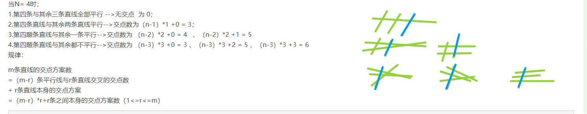
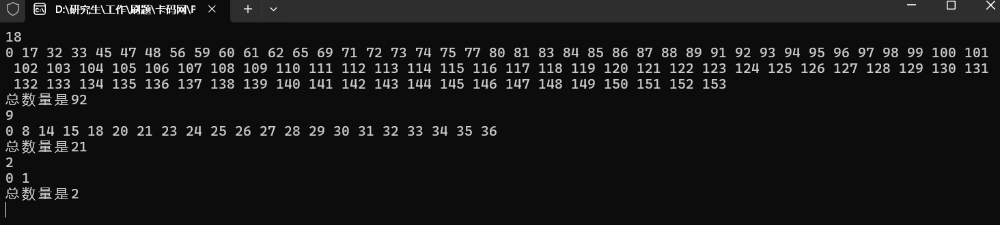

# 面经中笔试题目 算法题目 力扣题目 未整理分类

以下这些代码有的没校准 不确定对不对哦


1.给定一个数组，数组中除了一个数字只出现一次其余全部出现两次，请找出这个出现了一次的数字。
2.给定一个数组，找出其中第三大的数字。如果找不出第三大的数字(即只有第一第二大的数字) 返回最大的那个数字
3.一个玩家，给定时间T，他有N个技能，每个技能有冷却时间C和伤害D，请问在T时间内，他能打出的最大伤害是？
4.给定一个M×N的数组，`a[i][j]`的意思是，第i行j列的伤害，如果大于玩家的承受范围S，则玩家不可以存活，现在问玩家能存活的区域有多少个？
5.N条直线，排出三条或以上直线共点，求这N条直线可以有多少种相交出不同点数的方案？


1、给定一个数组，数组中除了一个数字只出现一次其余全部出现两次，请找出这个出现了一次的数字。

异或

2、

### 2. 找出第三大的数字

3个数字轮询 应该更快 但是可能不好写（O（n））

其他写法：

**思路**：可以使用一个集合来存储唯一的数字，然后对集合进行排序，最后返回第三大的数字。如果集合的大小小于3，则返回最大的数字。

```cpp
#include <iostream>
#include <vector>
#include <set>

int thirdMax(std::vector<int>& nums) 
{
    std::set<int> unique_nums(nums.begin(), nums.end());
    if (unique_nums.size() < 3) 
    {
        return *unique_nums.rbegin(); // 返回最大值
    }
    auto it = unique_nums.end();
    std::advance(it, -3); // 移动到第三大的位置
    return *it;
}

int main() {
    std::vector<int> nums = {3, 2, 1};
    std::cout << "The third maximum number is: " << thirdMax(nums) << std::endl;
    return 0;
}
```

### 3. 最大伤害计算

【未校准】

3、最大伤害计算

3.一个玩家，给定时间T，他有N个技能，每个技能有冷却时间C和伤害D，请问在T时间内，他能打出的最大伤害是？

**思路**：可以使用动态规划来解决这个问题。定义一个数组`dp`，`dp[i]`表示在时间`i`内可以造成的最大伤害。遍历每个技能，更新`dp`数组。

爬楼梯？但是一般好像是这么写

```C++
#include <iostream>
#include <vector>

int maxDamage(int T, const std::vector<int>& cooldown, const std::vector<int>& damage) 
{
    std::vector<int> dp(T + 1, 0);
    
    for (int i = 0; i < cooldown.size(); ++i) 
    {
        for (int t = cooldown[i]; t <= T; ++t) 
        {
            dp[t] = std::max(dp[t], dp[t - cooldown[i]] + damage[i]);
        }
    }
    
    return dp[T];
}

int main() {
    int T = 10;
    std::vector<int> cooldown = {2, 3, 5};
    std::vector<int> damage = {50, 100, 200};
    std::cout << "Maximum damage possible: " << maxDamage(T, cooldown, damage) << std::endl;
    return 0;
}
```

400

### 4. 玩家能存活的区域

【未校准】

**思路**：可以使用深度优先搜索（DFS）或广度优先搜索（BFS）来遍历数组，找到所有存活的区域。每当找到一个存活的区域，就增加计数。

```cpp
#include <iostream>
#include <vector>

void dfs(int i, int j, const std::vector<std::vector<int>>& grid, int S, std::vector<std::vector<bool>>& visited) {
    if (i < 0 || i >= grid.size() || j < 0 || j >= grid[0].size() || visited[i][j] || grid[i][j] > S) {
        return;
    }
    visited[i][j] = true;
    dfs(i + 1, j, grid, S, visited);
    dfs(i - 1, j, grid, S, visited);
    dfs(i, j + 1, grid, S, visited);
    dfs(i, j - 1, grid, S, visited);
}

int countSurvivableRegions(const std::vector<std::vector<int>>& grid, int S) {
    int count = 0;
    std::vector<std::vector<bool>> visited(grid.size(), std::vector<bool>(grid[0].size(), false));
    
    for (int i = 0; i < grid.size(); ++i) 
    {
        for (int j = 0; j < grid[0].size(); ++j) 
        {
            if (!visited[i][j] && grid[i][j] <= S) 
            {
                dfs(i, j, grid, S, visited);
                count++;
            }
        }
    }
    
    return count;
}

int main() {
    std::vector<std::vector<int>> grid = {
        {1, 2, 3},
        {4, 5, 6},
        {7, 8, 9}
    };
    int S = 5;
    std::cout << "Number of survivable regions: " << countSurvivableRegions(grid, S) << std::endl;
    return 0;
}
```

1

### 4. 存活区域数量统计M2

**思路**：BFS遍历矩阵，统计满足条件且连通的区域数[17](https://www.miiteec.org.cn/ueditor/php/upload/file/20190710/VisionMaster算法平台用户手册V3.0.2.pdf)。

```cpp
int countSurvivalRegions(vector<vector<int>>& grid, int S) {
    int m = grid.size(), n = grid.size(), count =0;
    vector<vector<bool>> visited(m, vector<bool>(n, false));
    vector<pair<int, int>> dirs = {{-1,0}, {1,0}, {0,-1}, {0,1}};
    for (int i=0; i<m; ++i) 
    {
        for (int j=0; j<n; ++j) 
        {
            if (!visited[i][j] && grid[i][j] <= S) 
            {
                count++;
                queue<pair<int, int>> q;
                q.push({i,j});
                visited[i][j] = true;
                while (!q.empty())
                {
                    auto [x,y] = q.front(); q.pop();
                    for (auto& [dx, dy] : dirs) 
                    {
                        int nx = x+dx, ny = y+dy;
                        if (nx>=0 && nx<m && ny>=0 && ny<n && !visited[nx][ny] && grid[nx][ny] <=S) 
                        {
                            visited[nx][ny] = true;
                            q.push({nx, ny});
                        }
                    }
                }
            }
        }
    }
    return count;
}
```

### 5. N条直线交点数的不同方案

https://www.luogu.com.cn/problem/P2789


N条直线，排出三条或以上直线共点，求这N条直线可以有多少种相交出不同点数的方案？

（平面上有n条直线，且无三线共点，问这些直线能有多少种不同交点数。）

**问题分析**

将n条直线排成一个序列，直线2和直线1最多只有一个交点，直线3和直线1，2最多有两个交点,……，直线n 和其他n-1条直线最多有n-1个交点。由此得出n条直线互不平行且无三线共点的最多交点数：

Max = 1 +2 +……+（n-1）=n(n-1)/2;

这些直线有多少种不同的交点数


当N= 4时；

1.第四条与其余三条直线全部平行 -->无交点 为 0；

2.第四条直线与其余两条直线平行-->交点数为`（n-1）*1 +0 = 3；`

3.第四题条直线与其余一条平行-->交点数为 `（n-2）*2 +0 = 4  、（n-2）*2 +1 = 5`

4.第四题条直线与其余都不平行-->交点数为 `（n-3）*3 +0 = 3 、（n-3）*3 +2 = 5 、（n-3）*3 +3 = 6`




也就是 增加了一条线，那么会增加的方案是 `（m-r）*r`   

规律：

#### 关键公式

对于m条直线，若其中存在r条非平行线（剩余m-r条为平行线），则交点数为：

```C++
总交点数 = 平行线组的交点数 + 非平行线组的交点数 = (m-r)*r + 非平行线组内部的交点数
```

其中，非平行线组内部的交点数需要递归或动态规划计算。


m条直线的交点方案数
`=（m-r）`条平行线与r条直线交叉的交点数
\+ r条直线本身的交点方案
`=（m-r）*r+r `条之间本身的交点方案数（1<=r<=m）

https://www.cnblogs.com/ttzz/p/10451357.html

https://blog.csdn.net/summerxiachen/article/details/64125517

https://blog.csdn.net/Cey_Tao/article/details/112684015

代码1：输出总数量情况

```C++
#include <iostream>
#include <vector>
#include <unordered_set>
using namespace std;

int main() {
    int n;
    cout << "请输入直线数量N：";
    cin >> n;
    
    vector<unordered_set<int>> dp(n + 1);
    dp[1].insert(0); // 初始化：1条直线时，交点数为0
    
    for (int m = 2; m <= n; ++m) {
        dp[m].insert(0); // 所有直线平行的情况
        
        // 遍历所有可能的r值（将m条线分为m-r条平行线和r条非平行线）
        for (int r = 1; r < m; ++r)
        {
            int base = (m - r) * r; // 平行组与非平行组的交点数
            for (int s : dp[r]) // 递归计算r条非平行线内部的交点数
            {   
                dp[m].insert(base + s);
            }
        }
    }
    
    cout << "不同的交点数方案数目为：" << dp[n].size() << endl;
    
    return 0;
}

```


代码2：输出相交情况

#### 关键公式

对于n条直线，若其中存在b条非平行线（剩余n-b条为平行线），则交点数为：

```C++
总交点数 = 平行线组的交点数 + 非平行线组的交点数 = (n-b)*b + 非平行线组内部的交点数
```

其中，非平行线组内部的交点数需要递归或动态规划计算。


```C++
/*
平面上有n条直线，且无三线共点，问这些直线能有多少种不同交点数。
比如,如果n=2,则可能的交点数量为0(平行)或者1(不平行)。
*/
#include<iostream>
using namespace std;
//行数代表几条线，列数代表交点数，当dp[i][j]==1时,代表存在

int dp[21][200] = {};//N条线最多 n*(n-)/ 2个交点          

int main()
{
    int N,b;
    while(cin>>N)
    {
        dp[0][0] = dp[1][0] =  1;//n =0和n = 1的情况
        for(int n = 2;n<=N;n++) //代表n条线
        {
            dp[n][0] = 1;   //n条直线都平行时交点为0

            for(int i=0;i<n;i++)//i表示n条直线有i条平行
            {
                
                for(int j=0;j<=n*(n-1)/2;j++)//j表示交点数
                {
                    b = n - i -1; //b为n条直线减去平行线
                    if(dp[b][j] == 1) // b条直线本身 可构成 交点数为j  
                        dp[n][(n-b)*b+j] = 1;//m条直线的交点方案数 = （n-b）*b+b条之间本身的交点方案数（1<=r<=m）

                }
            }
        }
        
        for(int j=0;j<N*(N-1)/2;j++)
        {
            if(dp[N][j] == 1)
                cout<<j<<" ";
        }
        cout<<N*(N-1)/2<<endl;
        
    }
    return 0;
}
```




### 来源链接  https://www.nowcoder.com/discuss/658001924028956672


### 减一

># 第一题 
>
>### 题目：减一
>
>给出一组数，求出最长的子串。使得这个子串中的数最大值和最小值的差值最大为1。 如1 5 4 1 2 4 2 5 5。最长子串为5 4 4 5 5,长度为5。
>
>### 输入描述
>
>第一行为一整数n(1<=n<=100),表示整数的个数。 
>
>下一行为n个整数，以空格分割，每个整数的值小于10^9。
>
>### 输出描述
>
>输出一个整数，为最长子串长度。
>
>### 样例输入
>
>> 6
>>
>> 4 6 5 3 3 1
>
>### 样例输出
>
>> 3
>
>### 参考题解
>
>作者：林小白zii
>链接：https://www.nowcoder.com/discuss/658001924028956672
>来源：牛客网


随便取出数字构成子串.

```C++
//题目：减一
//给出一组数，求出最长的子串。使得这个子串中的数最大值和最小值的差值最大为1。 如1 5 4 1 2 4 2 5 5。最长子串为5 4 4 5 5, 长度为5。
//
//输入描述
//第一行为一整数n(1 <= n <= 100), 表示整数的个数。
//
//下一行为n个整数，以空格分割，每个整数的值小于10 ^ 9。
//https ://www.nowcoder.com/discuss/658001924028956672

//2204
/*
6

4 6 5 3 3 1

//每个数字的数量，
相邻两个数字数量相加最多即可
*/
#include<iostream>
#include<vector>
#include<algorithm>
#include<unordered_map>
using namespace std;
//https ://www.nowcoder.com/discuss/658001924028956672 的做法
int max_length_subarray(vector<int>& arr)
{
	if (arr.empty()) {
		return 0;
	}

	sort(arr.begin(), arr.end());
	int start = 0;
	int max_length = 1;

	for (int end = 1; end < arr.size(); ++end) {
		if (arr[end] - arr[start] > 1) {
			++start;
		}
		max_length = max(max_length, end - start + 1);
	}

	return max_length;
}
//me
int test2(vector<int> &nums)
{
	int n = nums.size();
	sort(nums.begin(), nums.end());
	//1 3 3 4 5 6 6 6 6
	/*for (int i = 0; i < n; i++)
	{
		cout<< nums[i] <<" ";
	}*/
	//
	int l = 0;
	int res = 1;//=1!!!而不是0
	for (int r = 0; r < n; r++)
	{
		while (nums[r] - nums[l] > 1)
		{
			l++;
		}
		if (nums[r] == nums[l] + 1)
			res = max(res, r - l + 1);
	}
	return res;
}

int main()
{

	//int n;
	//cin >> n;
	//vector<int> nums(n,0);
	//for (int i = 0; i < n; i++)
	//{
	//	cin >> nums[i];
	//}
	//vector<int> nums{ 1,2,3,4,6,3,4,4,3,4,5,6,11,222 };
	vector<int> nums{ 1 };
	cout << max_length_subarray(nums) << endl;
	cout << test2(nums) << endl;
	return 0;

}
```


### T1-进制转换

https://blog.csdn.net/m0_65527280/article/details/137784628

【题意】 
有一个数，可能是2～16进制的其中之一，算出所有可能的结果，并转成十进制后对1e9+7取模，答案从小到大排列，若存在相同的结果，只保留一个。

【输入描述】
一个数，表示得到的数字。保证不会出现 '0'~'9'， 'A'~'F' 以外的字符，输入数字长度不超过100000，且保证无前导零。

【输出描述】
每行输出可能的结果

【样例输入】

11
【样例输出】

```C++
3 
4 
5 
6 
7 
8 
9 
10 
11 
12
13
14
15
16
17
```


