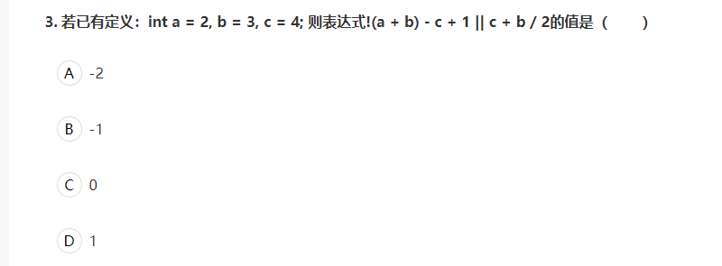
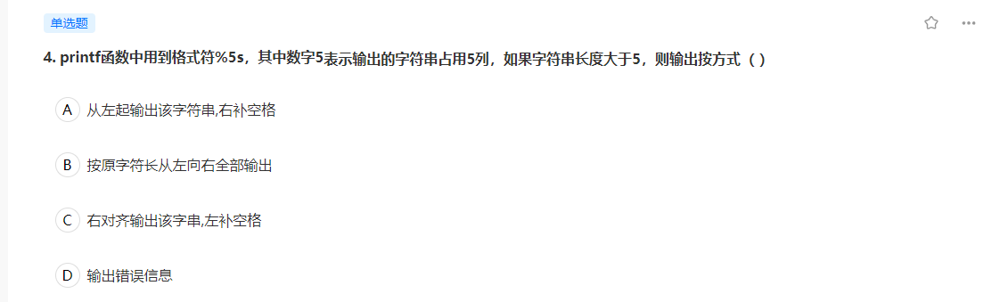
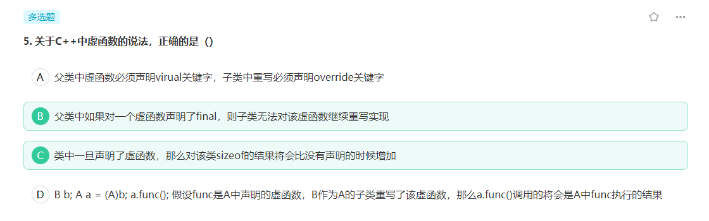
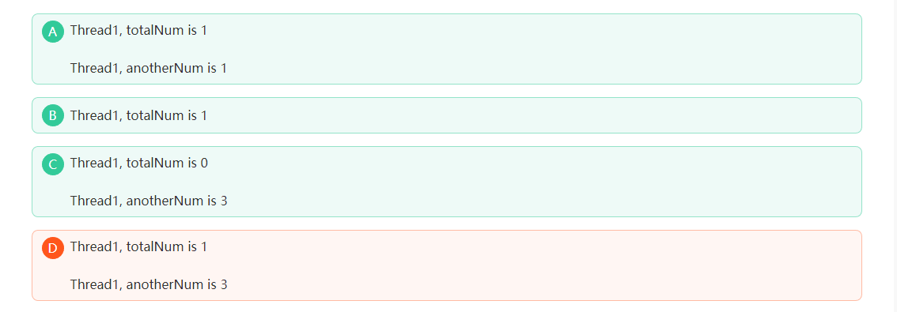
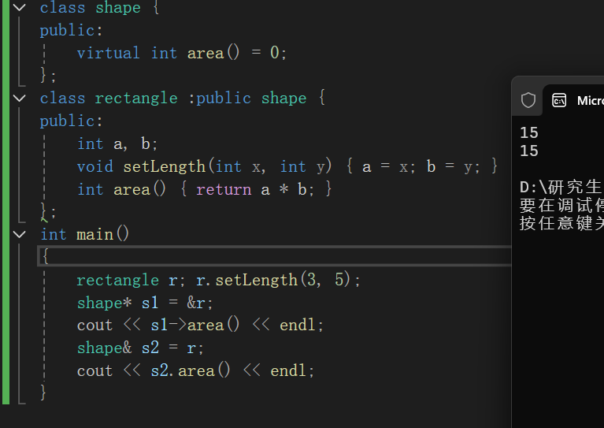

# 牛客——C++ 选择

2025.04.21 5题

# C++ 基础

## 1.运算符优先级



> 这道题目考察了运算符优先级和逻辑运算的计算过程。让我们按照运算符优先级逐步计算:
>
> 1. 首先计算括号内和除法运算:
>
> \- b / 2 = 3 / 2 = 1(整数除法)
> \- (a + b) = (2 + 3) = 5
>
> 2. 然后计算非运算:
>
> \- !(a + b) = !5 = 0 (非0为假即0,0为真即1)
>
> 3. 接着按照从左到右顺序计算减法和加法:
>
> \- 0 - 4 + 1 = -3
>
> 4. 最后计算逻辑或运算:
>
> \- -3 || (4 + 1) 即 -3 || 5
> \- 在逻辑运算中,任何非0值都当作真(1)
> \- 所以这等价于 1 || 1 = 1
>
> 因此最终结果为1,所以D选项正确。
>
> 分析其他选项:
> A(-2)错误:没有完整考虑逻辑或运算的结果
> B(-1)错误:忽略了逻辑运算将非零值视为1的规则
> C(0)错误:逻辑或运算只要有一个操作数为真,结果就为真(1)

答案：D


## 2.库函数的使用

### （1）printf



printf函数中的格式符%5s是用于控制字符串输出格式的说明符。当设置宽度为5时，如果字符串实际长度小于5，则会按照右对齐方式输出，左侧补空格。但是，如果字符串长度大于5，则会按照原字符串的完整长度输出，不会被截断。

答案：B


### (2)gets与strcat

```c++
#include  “stdio.h"  
#include  “string.h"  
int main()  
{  
    char ss[10]="1,2,3,4,5";
    gets (ss); 
    strcat (ss,"6789"); 
    printf ("%s\n",ss); 
    return 0;
}
```

如果输入的是ABC，则输出结果是什么？

> 在提供的代码中，`gets` 和 `strcat` 函数的作用及行为如下：
>
> ### 1. **`gets` 函数的作用与问题**
> - **作用**：`gets(ss)` 从标准输入（如键盘）读取一行数据，直到遇到换行符（`\n`）或文件结束符（EOF）。它会将读取的字符（不包括换行符）存储到 `ss` 数组中，并在末尾自动添加终止符 `\0`。
> - **缓冲区溢出风险**：`gets` **不会检查目标数组 `ss` 的长度**。如果用户输入的字符数超过 `ss` 的容量（代码中 `ss` 的大小为 10，最多存储 9 个字符 + `\0`），会导致缓冲区溢出，引发未定义行为（如程序崩溃或安全漏洞）。因此，`gets` 已被弃用，建议改用 `fgets`。
> - **输入缓冲区的处理**：`gets` 会读取并移除输入缓冲区中的整行数据（包括换行符），但仅将有效字符（换行符前的数据）存储到目标数组。**输入缓冲区中不会残留当前行的数据**，因此 `gets` 不会“清空整个缓冲区”，但会清空当前行的输入。
>
> ### 2. **`strcat` 函数的作用与问题**
> - **作用**：`strcat(ss, "6789")` 将字符串 `"6789"` 追加到 `ss` 的末尾。它会覆盖 `ss` 原有的终止符 `\0`，并在新字符串的末尾添加一个新的 `\0`。
> - **缓冲区溢出风险**：`strcat` **不检查目标数组的剩余空间**。如果 `ss` 在追加后的总长度超过其容量（代码中 `ss` 的大小为 10），会导致缓冲区溢出。
>
> ### 3. **代码示例分析**
> - **初始状态**：`char ss[10] = "1,2,3,4,5";`  
>   初始字符串 `"1,2,3,4,5"` 占用 9 个字符 + `\0`，正好填满 `ss`。
> - **执行 `gets(ss)`**：  
>   用户输入会覆盖 `ss` 的初始内容。例如：
>   - 输入 `"abc"` → `ss` 变为 `"abc\0"`（剩余空间足够）。
>   - 输入 `"1234567890"` → `ss` 溢出（需要 11 字节，但 `ss` 只有 10）。
> - **执行 `strcat(ss, "6789")`**：  
>   假设 `gets` 后 `ss` 有效长度为 `n`，追加 `"6789"` 需要 `n+4+1`（`+1` 为 `\0`）字节。例如：
>   - 若 `ss` 变为 `"abc\0"`，追加后为 `"abc6789\0"`（总长度 7 + `\0`，安全）。
>   - 若 `ss` 已满（如用户输入了 9 字符），追加会导致溢出。
>
> ### 4. **总结**
> - **`gets` 的风险**：始终存在缓冲区溢出风险，应改用 `fgets(ss, sizeof(ss), stdin)`。
> - **`strcat` 的风险**：需确保目标数组有足够空间（可通过 `strncat` 或手动检查长度避免）。
> - **输入缓冲区行为**：`gets` 会读取并清空当前行的输入（换行符前的内容），但不会影响其他行的数据。
>
> ### 代码改进建议
> ```c
> #include <stdio.h>
> #include <string.h>
> 
> int main() {
>     char ss[10] = "1,2,3,4,5";
>     // 使用 fgets 替代 gets，避免溢出
>     if (fgets(ss, sizeof(ss), stdin) == NULL) {
>         // 处理输入错误
>     }
>     // 移除可能的换行符（fgets 会保留换行符）
>     ss[strcspn(ss, "\n")] = '\0';  //https://www.runoob.com/cprogramming/c-function-strcspn.html， 该函数返回 str1 开头连续都不含字符串 str2 中字符的字符数。例如len = strcspn(str1, str2);printf("第一个匹配的字符是在 %d\n", len + 1);
>     
>     // 检查剩余空间再追加
>     if (strlen(ss) + strlen("6789") < sizeof(ss)) {
>         strcat(ss, "6789");
>     } else {
>         // 处理空间不足
>     }
>     printf("%s\n", ss);
>     return 0;
> }
> ```

==strcat会在遇到第一个\0时开始拼接==。


## 3.虚函数



> 让我们逐个分析各个选项:
>
> B选项正确:
> 当父类中的虚函数被声明为final时,这意味着该函数不允许被子类重写。这是C++11引入的特性,用于防止继承类修改基类的某些行为。
>
> C选项正确:
> 当类中声明了虚函数时,编译器会为该类自动添加一个虚函数表指针(vptr),该指针指向虚函数表。因此,包含虚函数的类的sizeof值会比不包含虚函数时大4个字节(32位系统)或8个字节(64位系统)。
>
> ==D选项正确:
> 这涉及到C++中的对象切片(Object Slicing)现象。当通过值传递方式将派生类对象赋值给基类对象时,派生类对象会被"切掉",只保留基类部分。因此在这种情况下,即使func是虚函数,a.func()调用的也是基类A中的实现。==
>
> A选项错误:
> 在C++中,父类声明虚函数时确实需要使用virtual关键字,但子类重写虚函数时override关键字是可选的。override关键字是C++11引入的,用于显式声明重写意图,可以帮助编译器进行检查,但不是必需的。
>
> 这道题主要考察了C++中虚函数的特性,包括final关键字的作用、虚函数对对象大小的影响以及对象切片现象对虚函数调用的影响。

答案：BCD


## 4.多线程

### （1）多线程的多种输出结果

程序中thread01和thread02分别是两个线程的入口函数，如下那些选项的输出是可能的？

```c++
#include <iostream>
#include <thread>
#include <Windows.h>
#include <mutex>
 
using namespace std;
 
mutex mu; 
mutex me;
 
int totalNum = 1;
int anotherNum = 0;
void thread01()
{
    while (totalNum > 0)
    {
        mu.lock(); 
        cout << "Thread1, totalNum is "<<totalNum << endl;
        totalNum--;
        me.lock();
        anotherNum++;
        cout <<"Thread1, anotherNum is "<<anotherNum<<endl;
        me.unlock();
        Sleep(100);
        mu.unlock();  
    }
}
void thread02()
{
    while (totalNum > 0)
    {
        me.lock();
        anotherNum += 2;
        mu.lock();
        totalNum--;
        mu.unlock();
        Sleep(100);
        me.unlock();
    }
}
```



> 这道题目考察了多线程编程中的互斥锁和线程同步的概念。
>
> 让我们分析代码的执行流程：
>
> 1. 程序中有两个全局变量：totalNum初始值为1，anotherNum初始值为0
> 2. 使用了两个互斥锁mu和me来控制对这些变量的访问
> 3. thread01和thread02是两个并发执行的线程
>
> 
> 选项ABC都是可能的输出，原因如下：
>
> A. "Thread1, totalNum is 1, Thread1, anotherNum is 1"
> 当thread01先获得执行权时，可能出现这种输出。因为此时totalNum还是1，thread01执行后anotherNum增加1。
>
> B. "Thread1, totalNum is 1"
> 当thread01执行到输出totalNum后，还未来得及输出anotherNum时，这个输出是可能的。这种情况下程序可能因为死锁而终止。
>
> C. "Thread1, totalNum is 0, Thread1, anotherNum is 3"
> 如果thread02先执行，将anotherNum增加2，然后thread01执行时totalNum已经为0，且anotherNum再加1，最终anotherNum为3，这种输出也是可能的。
>
> D选项错误，因为不可能出现"totalNum is 1"且同时"anotherNum is 3"的情况。要使anotherNum达到3，必须是thread02执行一次（+2）和thread01执行一次（+1），而这个过程中totalNum必然会减少到0。
>
> 关键点：
>
> 1. 由于多线程的并发性，执行顺序是不确定的
> 2. 互斥锁的使用会影响线程间的同步
> 3. 程序中存在死锁的可能性（当两个线程互相等待对方释放锁时）


## 其他

###  1、

链接：https://www.nowcoder.com/questionTerminal/31d3728ac08c45039fad2e689653f5b8?

有以下类定义

```C++
#include <iostream>
using namespace std;
class shape {
public:
    virtual int area()=0;
};
class rectangle:public shape {
public:
    int a, b;
    void setLength (int x, int y) {a=x;b=y;}
    int area() {return a*b;}
};
```

 若有语句定义rectangle r; r.setLength(3,5); 则编译时无语法错误的语句是（   ）                                        

- ```
  shape *s1=&r;
  ```

- ```
  shape &s2=r;
  ```

- ```
  shape s3=r;
  ```

- ```
  shape s4[3];
  ```


这个题目关于B对不对是有争议的

题目是有错误的，抽象类不能实例化对象，但抽象类的指针或引用可以指向派生类，A,B选项本质上是一样的，只是不能调用派生类独有的成员函数，可以调用被派生类重写的函数

题目是用对象r调用的setLenth，没有用指针或引用去调用，所以AB都无语法错误


我试了下



>答案：AB（有争议，但是VS2022 AB可以运行）

### 2、

链接：https://www.nowcoder.com/questionTerminal/ebee58fdaef04798a136757efc77e78b?

有如下语句序列：
 char str[10];
 cin>>str;
 当从键盘输入 "I love this game" 时，str 中的字符串是
                                        

- ```
  "I love this game"
  ```

- ```
  "I love thi"
  ```

- ```
  "I love"
  ```

- ```
  "I"
  ```


cin遇到空格 结束输入，所以只读取I

**cin输入时遇到空格会结束，所以一般用getline作为字符串的输入（含空格）。**

输入结束条件 ：遇到Enter、**Space**、Tab键。

1. char str[10]声明了一个长度为10的字符数组，实际可用长度为9（需要预留一个位置存放字符串结束符''）

>正确答案：D


### 3、

链接：https://www.nowcoder.com/questionTerminal/6f76e1fbcff442bb8dbb45938af1f54d?

观察下面一段代码: 

```C++
class ClassA
{
public:
    virtual ~ ClassA() {};
    virtual void FunctionA() {};
};
class ClassB
{
public:
    virtual void FunctionB() {};
};
class ClassC : public ClassA,public ClassB
{
public:
};
ClassC aObject;
ClassA* pA=&aObject;
ClassB* pB=&aObject;
ClassC* pC=&aObject;
```

 关于pA,pB,pC的取值,下面的描述中正确的是:

- ```
  pA,pB,pC的取值相同
  ```

- ```
  pC=pA+pB
  ```

- ```
  pA和pB不相同
  ```

- ```
  pC不等于pA也不等于pB
  ```

- ```
  pC和pA相同
  ```


​                       

链接：https://www.nowcoder.com/questionTerminal/6f76e1fbcff442bb8dbb45938af1f54d?

这种情况下，派生类的指针和第一个基类的指针应该是一样的，和第二个基类是不一样的。

pB和pA的差值是虚表指针的大小，32位机器是4字节，64位机器就是8字节了。
 虚表的含义：
 在C++中，**每个有虚函数的类或者虚继承的子类，编译器都会为它生成一个虚表，表中的每一个元素都指向一个虚函数的地址**。
 此外，编译器会为包含虚函数的类加上一个成员变量，是一个指向该虚函数表的指针（常被称为vptr），每一个由此类别派生出来的类，都有这么一个vptr。也就是说，**如果一个类含有虚表，则该类的所有对象都会含有一个虚表指针，并且该虚表指针指向同一个虚表**。
 **虚表的内容是依据类中的虚函数声明次序一一填入函数指针**。派生类别会继承基础类别的虚表（以及所有其他可以继承的成员），当我们在派生类中改写虚函数时，虚表就受了影响；表中的元素所指的函数地址将不再是基类的函数地址，而是派生类的函数地址。

换换言之，这里的pA/pB/pC是虚表地址vptr

>正确答案：C E


### 4、

关于C++中的友元函数说法正确的是（    ）

- ```
  友元函数需要通过对象或指针调用
  ```

- ```
  友元函数是不能被继承的
  ```

- ```
  友元函数没有this指针
  ```

- ```
  友元函数破环了继承性机制
  ```


链接：https://www.nowcoder.com/questionTerminal/76e01ff951d74b569e53d95b5e83bfff?
来源：牛客网

友元函数是C++中一个特殊的概念,选项BC正确的原因如下:

B正确:友元函数确实不能被继承。友元关系不具有传递性,也不能被继承。如果基类声明了一个友元函数,这种友元关系不会自动延伸到派生类中。每个类必须显式声明自己的友元。

C正确:友元函数没有this指针。因为友元函数不是类的成员函数,而是定义在类外部的普通函数,只是被赋予了访问类的私有成员的权限,所以不包含指向类对象的this指针。

分析错误选项:

A错误:友元函数是独立的函数,不需要通过对象或指针来调用。它可以直接以普通函数的方式调用,只是在函数内部可以访问类的私有成员。

D错误:友元函数并不破坏继承机制。它只是提供了一种受控的方式来访问类的私有成员,是C++提供的一种有用的特性。虽然**破坏了类的封装性**,但并不影响继承机制的正常工作。

总的来说,友元函数是C++中的一个重要概念,它提供了一种特殊的访问权限机制,但需要谨慎使用以保持良好的封装性。


链接：https://www.nowcoder.com/questionTerminal/76e01ff951d74b569e53d95b5e83bfff?
来源：牛客网

有些情况下，**允许特定的非成员函数访问一个类的私有成员，同时仍阻止一般的访问**，这是很方便做到的。例如被重载的操作符，如输入或输出操作符，经常需要访问类的私有数据成员。友元(frend)机制允许一个类将对其非公有成员的访问权授予指定的函数或者类，友元的声明以friend开始，它只能出现在类定义的内部，友元声明可以出现在类中的任何地方：友元不是授予友元关系的那个类的成员，所以它们不受其声明出现部分的访问控制影响。通常，将友元声明成组地放在类定义的开始或结尾是个好主意。 

  **1）友元函数** 

  **友元函数是指某些虽然不是类成员函数却能够访问类的所有成员的函数**。类授予它的友元特别的访问权，这样该友元函数就能访问到类中的所有成员。 

  **2）友元类** 

  **友元类的所有成员函数都是另一个类的友元函数，都可以访问另一个类中的隐藏信息（包括私有成员和保护成员）****，即通过类的对象访问类的所有成员**。当希望一个类可以存取另一个类的私有成员时，可以将该类声明为另一类的友元类。 

  **关于友元类的注意事项：** 

  **(1)友元关系不能被继承。****
** **(2)友元关系是单向的，不具有交换性**。若类B是类A的友元，类A不一定是类B的友元，要看在类中是否有相应的声明。
 **(3)友元关系不具有传递性**。若类B是类A的友元，类C是B的友元，类C不一定是类A的友元，同样要看类中是否有相应的申明。 

  **3）友元成员函数** 

  **使类B中的成员函数成为类A的友元函数，这样类B的该成员函数就可以访问类A的所有成员了**。当用到友元成员函数时，**需注意友元声明和友元定义之间的相互依赖**，更一般的讲，必须先定义包含成员函数的类，才能将成员函数设为友元。另一方面，不必预先声明类和非成员函数来将它们设为友元。 

  **4）友元的小结** 

  **在需要允许某些特定的非成员函数访问一个类的私有成员（及受保护成员），而同时仍阻止一般的访问的情况下，友元是可用的**。 

  **优点：** 

   可以灵活地实现需要访问若干类的私有或受保护的成员才能完成的任务； 

   便于与其他不支持类概念的语言(如[C语言](https://gw-c.nowcoder.com/api/sparta/jump/link?link=http://lib.csdn.net/base/c)、汇编等)进行混合编程； 

   通过使用友元函数重载可以更自然地使用C++语言的IO流库。 

  **缺点：** 

​    一个类将对其非公有成员的访问权限授予其他函数或者类，会破坏该类的封装性，降低该类的可靠性和可维护性。


例子：

```C++
#include <iostream>
using namespace std;

class Base {
private:
    int private_data;
protected:
    int protected_data;
public:
    Base(int pd, int prd) : private_data(pd), protected_data(prd) {}
    
    // 声明友元函数
    friend void friendFunction(Base& obj);
    
    // 普通成员函数
    void memberFunction() {
        cout << "Member function accessing private data: " << private_data << endl;
    }
};

// 友元函数定义
void friendFunction(Base& obj) {
    // 可以访问私有和保护成员
    cout << "Friend function accessing private data: " << obj.private_data << endl;
    cout << "Friend function accessing protected data: " << obj.protected_data << endl;
    
    // 友元函数没有this指针，必须通过参数访问对象成员
    // cout << private_data; // 错误，没有this指针
}

class Derived : public Base {
public:
    Derived(int pd, int prd) : Base(pd, prd) {}
    
    // 友元函数不能被继承
    // 这里不能直接访问基类的私有成员
    void tryAccess() {
        // cout << private_data; // 错误，不能访问基类私有成员
        cout << "Derived accessing protected data: " << protected_data << endl;
    }
};

int main() {
    Base b(10, 20);
    
    // 调用友元函数 - 不需要通过对象调用
    friendFunction(b);
    
    // 调用成员函数 - 需要通过对象调用
    b.memberFunction();
    
    Derived d(30, 40);
    d.tryAccess();
    
    return 0;
}
```


### 5、

面四个选项中，均是合法整型常量的选项是（）

- ```
  160  -0xffff   011
  ```

- ```
  -0xcdf  01a  0xe
  ```

- ```
  -01  986,012  0668
  ```

- ```
  -0x48a  2e5  0x
  ```


链接：https://www.nowcoder.com/questionTerminal/4963e963854c412aa81c57b33779b5c5?
来源：牛客网

这道题目主要考察对整型常量的表示方法。A 选项正确的原因是其三个数值均为合法的整型常量表示：
\- 160：十进制表示
\- -0xffff：带负号的十六进制表示
\- 011：以0开头的八进制表示

分析其他错误选项：
B选项中：
\- -0xcdf 和 0xe 是合法的
\- 01a 不合法，八进制不能包含a

C选项中：
\- -01 是合法的
\- 986,012 不合法，整数中不能包含逗号
\- 0668 不合法，八进制数字中不能包含8

D选项中：
\- -0x48a 是合法的
\- 0x 不合法，十六进制数必须包含至少一个数字

总结：整型常量的合法表示包括：

1. 十进制：直接数字表示
2. 八进制：以0开头，且只能包含0-7
3. 十六进制：以0x或0X开头，可以包含0-9和a-f
4. 以上形式都可以带正负号


### 6、

链接：https://www.nowcoder.com/questionTerminal/f53fe1f742534bc582dc5dbc9aa30408?
来源：牛客网

在32位小端的机器上，如下代码输出是什么： 

```C++
char array[12] = {0x01 , 0x02 , 0x03 , 0x04 , 0x05 , 0x06 , 0x07 , 0x08};     
 short *pshort = (short *)array;     
 int *pint = (int *)array;     
 int64 *pint64 = (int64 *)array;     
 printf("0x%x , 0x%x , 0x%llx , 0x%llx", *pshort , *(pshort+2) , *pint64 , *(pint+2));
```

- ```
  0x201 ， 0x403 ， 0x807060504030201 ， 0x0
  ```

- ```
  0x201 ， 0x605 ， 0x807060504030201 ， 0x0
  ```

- ```
  0x201 ， 0x605 ， 0x4030201 ， 0x8070605
  ```

- ```
  0x102 ， 0x506 ， 0x102030405060708 ， 0x0
  ```


>首先，我们需要明确几个关键点：
>
>1. **32位小端机器**：这意味着数据的存储方式是“小端序”（Little Endian），即最低有效字节存储在最低的内存地址。同时，`int` 是32位（4字节），`short` 是16位（2字节），`int64` 是64位（8字节）。
>   
>2. **数组初始化**：
>   ```c++
>   char array[12] = {0x01, 0x02, 0x03, 0x04, 0x05, 0x06, 0x07, 0x08};
>   ```
>   数组的前8个字节被明确初始化，后4个字节（索引8到11）未被初始化，可能是0（取决于编译器）。
>
>3. **指针类型转换**：
>   - `short *pshort = (short *)array;`：将`array`视为`short`数组，每个元素2字节。
>   - `int *pint = (int *)array;`：将`array`视为`int`数组，每个元素4字节。
>   - `int64 *pint64 = (int64 *)array;`：将`array`视为`int64`数组，每个元素8字节。
>
>4. **打印内容**：
>   - `*pshort`：第一个`short`（2字节）。
>   - `*(pshort+2)`：第三个`short`（跳过2个`short`，即4字节）。
>   - `*pint64`：第一个`int64`（8字节）。
>   - `*(pint+2)`：第三个`int`（跳过2个`int`，即8字节）。
>
>### 内存布局
>
>首先，我们来看`array`的内存布局（小端序）：
>
>```C++
>地址低 -> 高
>array[0]: 0x01
>array[1]: 0x02
>array[2]: 0x03
>array[3]: 0x04
>array[4]: 0x05
>array[5]: 0x06
>array[6]: 0x07
>array[7]: 0x08
>array[8..11]: 0x00 (假设未初始化的部分为0)
>```
>
>### 解析各个指针的访问
>
>1. **`*pshort`（第一个`short`）**：
>   - 访问`array[0]`和`array[1]`。
>   - 小端序：低地址是低位字节。
>   - 组合：`0x0201`（`array[1]`是高字节，`array[0]`是低字节）。
>   - 所以`*pshort = 0x0201`。
>
>   但是第一个选项是`0x201`，看起来像是`0x0201`去掉前导零。在`printf`中，`%x`会忽略前导零，所以`0x0201`和`0x201`是相同的表示。
>
>2. **`*(pshort + 2)`（第三个`short`）**：
>   - `pshort + 2` 跳过2个`short`，即4字节。
>   - 访问`array[4]`和`array[5]`。
>   - 组合：`0x0605`。
>   - 所以`*(pshort + 2) = 0x0605`。
>
>   同样，`%x`会显示为`0x605`。
>
>3. **`*pint64`（第一个`int64`）**：
>   - 访问`array[0]`到`array[7]`，共8字节。
>   - 小端序：最低字节在最低地址。
>   - 组合：`0x0807060504030201`。
>   - 所以`*pint64 = 0x0807060504030201`。
>
>   `%llx`会显示为`0x807060504030201`（前导零可以忽略）。
>
>4. **`*(pint + 2)`（第三个`int`）**：
>   - `pint + 2` 跳过2个`int`，即8字节。
>   - 访问`array[8]`到`array[11]`。
>   - 假设`array[8..11]`为0，则组合为`0x00000000`。
>   - 所以`*(pint + 2) = 0x00000000`。
>
>   `%llx`会显示为`0x0`。
>
>### 验证选项
>
>根据以上分析，输出应为：
>
>```
>0x201, 0x605, 0x807060504030201, 0x0
>```
>
>对比选项：
>
>1. `0x201 ， 0x403 ， 0x807060504030201 ， 0x0` → `0x403` 错误。
>2. `0x201 ， 0x605 ， 0x807060504030201 ， 0x0` → 完全匹配。
>3. `0x201 ， 0x605 ， 0x4030201 ， 0x8070605` → `int64` 和 `int` 部分错误。
>4. `0x102 ， 0x506 ， 0x102030405060708 ， 0x0` → 所有值错误（大端序）。
>
>### 可能的误区
>
>1. **字节序理解错误**：
>   - 如果误认为是大端序，`*pshort`会是`0x0102`，`*pint64`会是`0x0102030405060708`，这与选项4一致，但题目明确是小端。
>   
>2. **指针算术错误**：
>   - `pshort + 2` 是跳过2个`short`，即4字节，不是`array[2]`。
>   - 同理，`pint + 2` 是跳过8字节。
>
>3. **未初始化内存**：
>   - 假设`array[8..11]`为0是合理的，但实际可能是随机值。不过选项中`*(pint+2)`都是`0x0`或`0x8070605`，后者不符合。
>
>### 结论
>
>正确的选项是第二个：
>
>```
>0x201 ， 0x605 ， 0x807060504030201 ， 0x0
>```
>
>### 详细步骤总结
>
>1. **数组内存表示（小端）**：
>   - `array[0..7]`: `01 02 03 04 05 06 07 08`
>   - `array[8..11]`: `00 00 00 00`
>
>2. **`*pshort`**：
>   - `array[0..1]`: `02 01` → `0x0201` (`0x201`)
>
>3. **`*(pshort + 2)`**：
>   - 跳过 `2 * sizeof(short) = 4` 字节，访问 `array[4..5]`: `06 05` → `0x0605` (`0x605`)
>
>4. **`*pint64`**：
>   - `array[0..7]`: `08 07 06 05 04 03 02 01` → `0x0807060504030201` (`0x807060504030201`)
>
>5. **`*(pint + 2)`**：
>   - 跳过 `2 * sizeof(int) = 8` 字节，访问 `array[8..11]`: `00 00 00 00` → `0x00000000` (`0x0`)
>
>因此，输出为：
>
>```
>0x201, 0x605, 0x807060504030201, 0x0
>```
>
>### 最终答案
>
>**第二个选项是正确的：**
>
>```
>0x201 ， 0x605 ， 0x807060504030201 ， 0x0
>```


链接：https://www.nowcoder.com/questionTerminal/f53fe1f742534bc582dc5dbc9aa30408?
来源：牛客网

小端机器的数据高位字节放在高地址，低位字节放在低地址。 

  char array[12] =  {0x01, 0x02, 0x03, 0x04, 0x05, 0x06, 0x07, 0x08}; 

  1，char一字节，直观呈现的结果为：0x08-07-06-05-04-03-02-01**（从后到前下标为0-7）**； 

  2，short两字节，直观呈现  的结果  为：  0x0807-0605-0403-0201      **（从后到前**    **下标**  **为0-3）**  ：

  *pshort从0开始，所以0x201； 

  *(pshort+2)从2开始，所以0x605； 

  3，int64八字节，直观呈现  的结果  为  0x0807060504030201      **（从后到前**    **下标**      **为0）**    ：

  *pint64从0开始，所以0x807060504030201； 

  4，int四字节，直观呈现为0x08070605-04030201**（从后到前**  **下标**  **为0-1）**  ：

  *(pint+2))从2开始，但是最多只到下标1，后面位置默认为0。


链接：https://www.nowcoder.com/questionTerminal/f53fe1f742534bc582dc5dbc9aa30408?
来源：牛客网


小端机器的数据高位字节放在高地址，低位字节放在低地址。x86结构为小端模式。 

  pshort占用2个字节，在内存中的16进制为0x01 0x02，对应的16进制数为0x0201。 

  pshort + 2指向array数组的下标为4的元素，占用2个字节，在内存中的16进制为0x05 0x06，对应的16进制数为0x0605。  

  pint64的int64类型不确定，但根据名字可以看出占用8个字节，对应的16进制形式为0x807060504030201。


  pint  +  2占用4个字节，指向的array数组的下标为8的元素，8-11个元素没有指定数组的初始化值，默认为0，因此*(pint  + 2)对应的16进制为0。


链接：https://www.nowcoder.com/questionTerminal/f53fe1f742534bc582dc5dbc9aa30408?
来源：牛客网

小端模式：低位编址（低位字节放在低地址，高位字节放在高地址） 

  大端模式：高位编址（高位字节放在低地址，低位字节放在高地址） 

  我个人理解是这样的：不管是大段模式还是小端模式都只是针对于一个基本的数据类型，比如一个short型，int型等，而不针对与数组这样的数据类型。 

  对于此题来说：该数组是存放在堆栈里，堆栈是向下生长，而数组不管在什么数据结构中，都是向上生长的。即这个数组的整体元素地址是向上的（array[0]---->array[11] 是从低地址---->高地址）。 

  对于单个元素来看：array[0]是为一个字节，所以不用考虑它的编址方式（编址是针对于多个字节的数据来说）。 

  所以这个数据表现为0x01,0x02,0x03,0x04,0x05,0x06,0x07,0x08（低地址---->高地址）。 

  pshort占用2个字节，且pshort = (short*)array; 在内存中的16进制为0x01（低地址） 0x02（高地址），因为是小端编址， 对应的16进制数为0x0201。 

  以下以此类推。


>正确答案：B